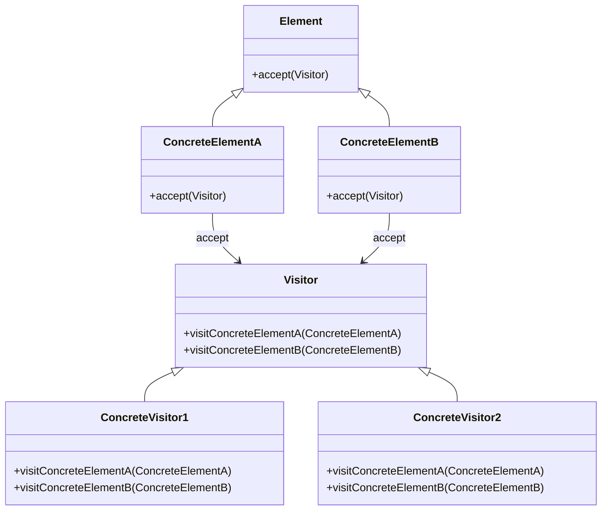

## 2.3.11 Visitor

### Introduction

The Visitor design pattern is a behavioral pattern from the classic Gang of Four (GoF) design patterns. It allows you to define new operations on objects without changing the classes of the elements on which it operates. This pattern is particularly useful when you need to perform various operations across a complex object structure.

### Understand the Intent

The primary intent of the Visitor pattern is to represent an operation to be performed on elements of an object structure without modifying the classes on which it operates. This separation of operations from the object structure allows for flexibility and scalability in adding new operations.

### Key Components

- **Visitor Interface:** Declares visit methods for each concrete element type.
- **Concrete Visitors:** Implement operations to be performed on elements.
- **Element Interface:** Defines an accept method that takes a visitor.
- **Concrete Elements:** Implement the accept method to call the appropriate visitor method.

### Implementation Steps

1. **Define the Visitor Interface:** Create an interface with visit methods for each element type.
2. **Implement Concrete Visitors:** Develop classes that implement the visitor interface and define specific operations.
3. **Update Element Classes:** Modify element classes to include an accept method that takes a visitor and calls the appropriate visit method.

### Visual Representation



### Code Examples

Let's explore a practical example using TypeScript to demonstrate the Visitor pattern. We'll implement a simple file system where visitors perform operations like counting files or calculating sizes.

```typescript
// Visitor Interface
interface Visitor {
    visitFile(file: File): void;
    visitDirectory(directory: Directory): void;
}

// Concrete Visitor for counting files
class FileCounterVisitor implements Visitor {
    private fileCount = 0;

    visitFile(file: File): void {
        this.fileCount++;
    }

    visitDirectory(directory: Directory): void {
        // Visit each element in the directory
        directory.getElements().forEach(element => element.accept(this));
    }

    getFileCount(): number {
        return this.fileCount;
    }
}

// Element Interface
interface Element {
    accept(visitor: Visitor): void;
}

// Concrete Element: File
class File implements Element {
    constructor(private name: string) {}

    accept(visitor: Visitor): void {
        visitor.visitFile(this);
    }
}

// Concrete Element: Directory
class Directory implements Element {
    private elements: Element[] = [];

    constructor(private name: string) {}

    addElement(element: Element): void {
        this.elements.push(element);
    }

    getElements(): Element[] {
        return this.elements;
    }

    accept(visitor: Visitor): void {
        visitor.visitDirectory(this);
    }
}

// Usage
const root = new Directory('root');
const file1 = new File('file1.txt');
const file2 = new File('file2.txt');
const subDir = new Directory('subDir');
const file3 = new File('file3.txt');

root.addElement(file1);
root.addElement(subDir);
subDir.addElement(file2);
subDir.addElement(file3);

const fileCounter = new FileCounterVisitor();
root.accept(fileCounter);

console.log(`Total files: ${fileCounter.getFileCount()}`);
```

### Use Cases

- **Complex Object Structures:** When you need to perform operations across a complex object structure, such as a file system or a composite pattern.
- **Adding New Operations:** To add new operations without modifying the existing object classes, making the system more flexible and scalable.

### Practice

Try implementing a file system scan where visitors perform operations like counting files or calculating sizes. This exercise will help solidify your understanding of the Visitor pattern.

### Considerations

- **Modifying Visitor Interface:** Adding new element classes requires modifying the visitor interface and all concrete visitors, which can be cumbersome.
- **Double Dispatch:** The Visitor pattern relies on double dispatch, which may require language-specific features to implement effectively.

### Advantages and Disadvantages

**Advantages:**

- **Separation of Concerns:** Separates operations from object structures, making it easier to manage and extend.
- **Open/Closed Principle:** Allows adding new operations without modifying existing classes.

**Disadvantages:**

- **Visitor Interface Changes:** Adding new element types requires changes to the visitor interface and all concrete visitors.
- **Complexity:** Can introduce complexity, especially in systems with a large number of element types.

### Best Practices

- **Use When Necessary:** Implement the Visitor pattern when you have a stable set of element classes and expect to add new operations frequently.
- **Maintain Simplicity:** Avoid over-complicating the visitor interface; keep it as simple as possible.

### Comparisons

The Visitor pattern is often compared with other behavioral patterns like the Strategy pattern. While both allow for varying behavior, the Visitor pattern is more suited for operations on complex object structures, whereas the Strategy pattern is ideal for interchangeable algorithms.

### Conclusion

The Visitor design pattern is a powerful tool for managing operations across complex object structures in JavaScript and TypeScript. By separating operations from the object structure, it provides flexibility and scalability, making it an essential pattern for developers to master.

## Quiz Time!



### What is the primary intent of the Visitor pattern?

- [x] To represent an operation to be performed on elements of an object structure without changing the classes on which it operates.
- [ ] To encapsulate a request as an object.
- [ ] To define a family of algorithms.
- [ ] To provide a way to access the elements of an aggregate object sequentially.

> **Explanation:** The Visitor pattern allows operations to be performed on elements of an object structure without modifying the classes of the elements.

### Which component of the Visitor pattern declares visit methods for each concrete element type?

- [x] Visitor Interface
- [ ] Concrete Visitor
- [ ] Element Interface
- [ ] Concrete Element

> **Explanation:** The Visitor Interface declares visit methods for each concrete element type.

### What is a key advantage of the Visitor pattern?

- [x] It allows adding new operations without modifying existing classes.
- [ ] It simplifies the code by reducing the number of classes.
- [ ] It enhances the performance of the application.
- [ ] It reduces memory usage.

> **Explanation:** The Visitor pattern adheres to the Open/Closed Principle, allowing new operations to be added without modifying existing classes.

### What is a potential disadvantage of the Visitor pattern?

- [x] Adding new element types requires changes to the visitor interface and all concrete visitors.
- [ ] It makes the code less readable.
- [ ] It increases the number of classes in the system.
- [ ] It reduces the flexibility of the code.

> **Explanation:** Adding new element types requires modifications to the visitor interface and all concrete visitors, which can be cumbersome.

### In the Visitor pattern, what is the role of the Element Interface?

- [x] It defines an accept method that takes a visitor.
- [ ] It implements operations to be performed on elements.
- [ ] It declares visit methods for each concrete element type.
- [ ] It provides a way to access the elements of an aggregate object sequentially.

> **Explanation:** The Element Interface defines an accept method that takes a visitor and calls the appropriate visit method.

### Which of the following is an example use case for the Visitor pattern?

- [x] Performing operations across a complex object structure like a file system.
- [ ] Implementing a singleton instance.
- [ ] Managing a pool of reusable objects.
- [ ] Providing a way to create families of related objects.

> **Explanation:** The Visitor pattern is useful for performing operations across complex object structures, such as a file system.

### What is double dispatch in the context of the Visitor pattern?

- [x] A technique to ensure that a function call is resolved at runtime based on the types of two objects.
- [ ] A method to reduce the number of method calls in a system.
- [ ] A way to optimize memory usage in an application.
- [ ] A strategy to improve the readability of the code.

> **Explanation:** Double dispatch is a technique used in the Visitor pattern to resolve function calls at runtime based on the types of two objects: the visitor and the element.

### How does the Visitor pattern adhere to the Open/Closed Principle?

- [x] By allowing new operations to be added without modifying existing classes.
- [ ] By reducing the number of classes in the system.
- [ ] By simplifying the code structure.
- [ ] By enhancing the performance of the application.

> **Explanation:** The Visitor pattern allows new operations to be added without modifying existing classes, adhering to the Open/Closed Principle.

### Which of the following best describes a Concrete Visitor?

- [x] It implements operations to be performed on elements.
- [ ] It declares visit methods for each concrete element type.
- [ ] It defines an accept method that takes a visitor.
- [ ] It provides a way to access the elements of an aggregate object sequentially.

> **Explanation:** A Concrete Visitor implements operations to be performed on elements.

### True or False: The Visitor pattern is ideal for systems with a large number of element types and frequent changes to the element classes.

- [ ] True
- [x] False

> **Explanation:** The Visitor pattern is not ideal for systems with a large number of element types and frequent changes to the element classes, as it requires changes to the visitor interface and all concrete visitors.


