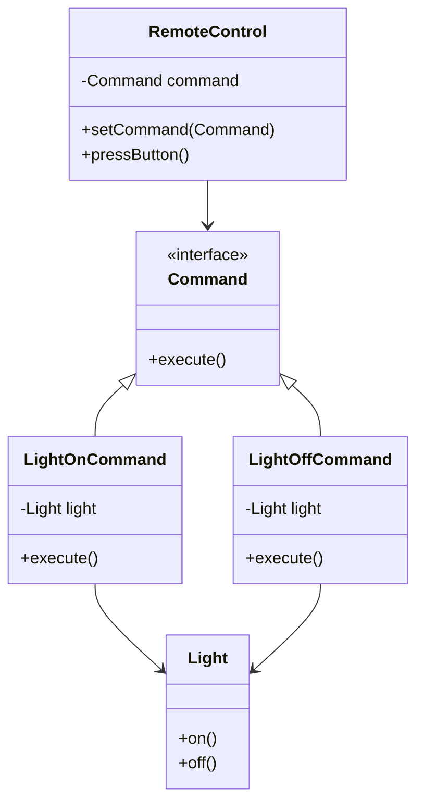

## 2.3.2 Command

The Command design pattern is a behavioral pattern from the classic Gang of Four (GoF) design patterns. It is used to encapsulate a request as an object, thereby allowing for parameterization, queuing, logging, and undoable operations. This pattern is particularly useful in scenarios where you need to decouple the sender of a request from its receiver, providing a higher level of flexibility in executing commands.

### Understand the Intent

The primary intent of the Command pattern is to encapsulate a request as an object. This encapsulation allows for:

- **Parameterization of Objects:** You can pass commands as parameters to other objects.
- **Queuing of Requests:** Commands can be queued for later execution.
- **Logging of Changes:** Commands can be logged for auditing purposes.
- **Undoable Operations:** Commands can be stored to allow undo operations.

### Key Components

The Command pattern consists of several key components:

- **Command Interface:** Declares an execution method that all concrete commands must implement.
- **Concrete Commands:** Implement the command interface and define specific actions to be executed.
- **Invoker:** Holds commands and is responsible for invoking their execution.
- **Receiver:** The object that performs the actual action when the command is executed.

### Implementation Steps

To implement the Command pattern, follow these steps:

1. **Define the Command Interface:** Create an interface with an `execute` method.
2. **Implement Concrete Command Classes:** Each class implements the command interface and calls methods on the receiver.
3. **Set Up the Invoker:** The invoker stores and executes commands as needed.
4. **Create the Receiver:** The receiver contains the actual logic to perform the actions.

### Code Examples

Let's explore a practical example of the Command pattern using JavaScript/TypeScript. We'll simulate a simple remote control where each button press is a command.

#### Command Interface

```typescript
interface Command {
    execute(): void;
}
```

#### Receiver

```typescript
class Light {
    on(): void {
        console.log("The light is on");
    }

    off(): void {
        console.log("The light is off");
    }
}
```

#### Concrete Commands

```typescript
class LightOnCommand implements Command {
    private light: Light;

    constructor(light: Light) {
        this.light = light;
    }

    execute(): void {
        this.light.on();
    }
}

class LightOffCommand implements Command {
    private light: Light;

    constructor(light: Light) {
        this.light = light;
    }

    execute(): void {
        this.light.off();
    }
}
```

#### Invoker

```typescript
class RemoteControl {
    private command: Command;

    setCommand(command: Command): void {
        this.command = command;
    }

    pressButton(): void {
        this.command.execute();
    }
}
```

#### Usage

```typescript
const light = new Light();
const lightOn = new LightOnCommand(light);
const lightOff = new LightOffCommand(light);

const remote = new RemoteControl();

remote.setCommand(lightOn);
remote.pressButton(); // Output: The light is on

remote.setCommand(lightOff);
remote.pressButton(); // Output: The light is off
```

### Use Cases

The Command pattern is applicable in various scenarios, including:

- **Parameterizing Objects with Actions:** When you need to pass actions as parameters to other objects.
- **Implementing Undoable Operations:** Useful in applications like text editors where undo/redo functionality is required.
- **Macro Recording:** Commands can be stored and replayed, as seen in macro recording applications.

### Practice

To practice the Command pattern, try creating a more complex remote control simulator with multiple devices and commands. Implement additional features like undo and redo to deepen your understanding.

### Considerations

While the Command pattern offers flexibility, it can also lead to an increase in the number of classes, as each command requires its own class. However, this trade-off is often justified by the added flexibility in queuing, logging, and undoing commands.

### Visual Aids

Below is a conceptual diagram illustrating the Command pattern structure:



### Advantages and Disadvantages

**Advantages:**

- **Decoupling:** Separates the object that invokes the operation from the one that knows how to perform it.
- **Flexibility:** Commands can be parameterized, queued, and logged.
- **Undo/Redo Functionality:** Facilitates the implementation of undoable operations.

**Disadvantages:**

- **Increased Complexity:** Can lead to a proliferation of command classes.
- **Overhead:** May introduce additional overhead in simple scenarios.

### Best Practices

- **Use Command Pattern Judiciously:** Employ this pattern when the benefits of decoupling and flexibility outweigh the complexity of additional classes.
- **Combine with Other Patterns:** Consider combining with patterns like Memento for enhanced undo functionality.

### Comparisons

The Command pattern is often compared with other behavioral patterns like Strategy and Observer. Unlike Strategy, which focuses on interchangeable algorithms, Command focuses on encapsulating requests. Observer, on the other hand, deals with notifying multiple objects about state changes, which is a different concern altogether.

### Conclusion

The Command pattern is a powerful tool for encapsulating requests as objects, providing flexibility in executing, queuing, and undoing operations. By understanding its components and implementation, you can leverage this pattern to build more modular and maintainable applications.

## Quiz Time!



### What is the primary intent of the Command pattern?

- [x] To encapsulate a request as an object
- [ ] To create a family of algorithms
- [ ] To define a one-to-many dependency
- [ ] To provide a surrogate or placeholder for another object

> **Explanation:** The Command pattern encapsulates a request as an object, allowing for parameterization, queuing, and undoable operations.

### Which component of the Command pattern is responsible for executing the command?

- [ ] Command Interface
- [ ] Concrete Command
- [x] Invoker
- [ ] Receiver

> **Explanation:** The Invoker is responsible for executing the command by calling its `execute` method.

### What is a common use case for the Command pattern?

- [x] Implementing undoable operations
- [ ] Creating complex algorithms
- [ ] Managing object lifecycles
- [ ] Defining object interfaces

> **Explanation:** The Command pattern is commonly used to implement undoable operations, such as in text editors.

### In the Command pattern, what role does the Receiver play?

- [ ] It declares the execution method.
- [ ] It holds and executes commands.
- [x] It performs the actual action when the command is executed.
- [ ] It logs the command execution.

> **Explanation:** The Receiver is the object that performs the actual action when the command is executed.

### What is a potential disadvantage of using the Command pattern?

- [ ] Increased flexibility
- [x] Increased number of classes
- [ ] Simplified code structure
- [ ] Reduced decoupling

> **Explanation:** The Command pattern can lead to an increased number of classes, as each command requires its own class.

### Which of the following is NOT a component of the Command pattern?

- [ ] Command Interface
- [ ] Concrete Command
- [ ] Invoker
- [x] Observer

> **Explanation:** Observer is not a component of the Command pattern; it is a separate design pattern.

### How does the Command pattern facilitate undoable operations?

- [x] By encapsulating requests as objects that can be stored and reversed
- [ ] By providing a direct link between sender and receiver
- [ ] By defining a one-to-many dependency
- [ ] By using a proxy to control access to the receiver

> **Explanation:** The Command pattern encapsulates requests as objects, allowing them to be stored and reversed for undoable operations.

### What is the role of the Concrete Command in the Command pattern?

- [ ] It holds and executes commands.
- [ ] It performs the actual action.
- [x] It implements the command interface and defines specific actions.
- [ ] It logs the command execution.

> **Explanation:** The Concrete Command implements the command interface and defines specific actions to be executed.

### True or False: The Command pattern can be used to log changes for auditing purposes.

- [x] True
- [ ] False

> **Explanation:** True. The Command pattern allows for logging of changes, which can be useful for auditing purposes.

### Which design pattern is often compared with the Command pattern due to its focus on encapsulating requests?

- [ ] Singleton
- [ ] Factory
- [x] Strategy
- [ ] Observer

> **Explanation:** The Strategy pattern is often compared with the Command pattern, but it focuses on encapsulating algorithms rather than requests.


