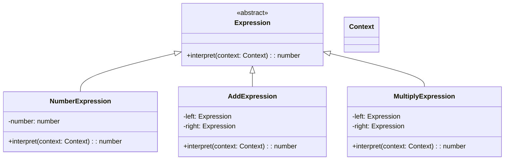

---

linkTitle: "2.3.3 Interpreter"
title: "Interpreter Design Pattern in JavaScript and TypeScript: A Comprehensive Guide"
description: "Explore the Interpreter design pattern in JavaScript and TypeScript, its implementation, use cases, and best practices for parsing and interpreting languages."
categories:
- Design Patterns
- JavaScript
- TypeScript
tags:
- Interpreter Pattern
- Behavioral Patterns
- JavaScript
- TypeScript
- Design Patterns
date: 2024-10-25
type: docs
nav_weight: 2330

canonical: "https://softwarepatternslexicon.com/patterns-js/2/3/3"
license: "© 2024 Tokenizer Inc. CC BY-NC-SA 4.0"
---

## 2.3.3 Interpreter

### Introduction

The Interpreter design pattern is a powerful tool used to define a representation for a grammar and provide an interpreter to process sentences in that grammar. This pattern is particularly useful when you need to interpret or parse statements defined in a language, such as mathematical expressions, scripting languages, or configuration files. In this article, we will delve into the components, implementation, and practical applications of the Interpreter pattern using JavaScript and TypeScript.

### Understand the Intent

The primary intent of the Interpreter pattern is to:

- Define a representation for a grammar.
- Provide an interpreter to process sentences in that grammar.

This pattern is ideal for scenarios where you need to evaluate expressions or parse statements in a language.

### Key Components

The Interpreter pattern consists of several key components:

- **Abstract Expression:** Declares an abstract interpretation method.
- **Terminal Expressions:** Implement interpretation for terminals in the grammar.
- **Nonterminal Expressions:** Represent rules and implement interpretation for non-terminals.
- **Context:** Contains information that's global to the interpreter.

### Implementation Steps

To implement the Interpreter pattern, follow these steps:

1. **Define a Class for Each Grammar Rule:** Create a class for each rule in the language's grammar.
2. **Implement an Interpret Method:** Each class should implement an interpret method.
3. **Build an Abstract Syntax Tree (AST):** Construct an AST representing the sentence to interpret.

### Code Examples

Let's explore a simple expression evaluator that can handle basic arithmetic operations.

#### JavaScript Example

```javascript
// Abstract Expression
class Expression {
    interpret(context) {
        throw new Error("This method should be overridden!");
    }
}

// Terminal Expression for Numbers
class NumberExpression extends Expression {
    constructor(number) {
        super();
        this.number = number;
    }

    interpret(context) {
        return this.number;
    }
}

// Nonterminal Expression for Addition
class AddExpression extends Expression {
    constructor(left, right) {
        super();
        this.left = left;
        this.right = right;
    }

    interpret(context) {
        return this.left.interpret(context) + this.right.interpret(context);
    }
}

// Nonterminal Expression for Multiplication
class MultiplyExpression extends Expression {
    constructor(left, right) {
        super();
        this.left = left;
        this.right = right;
    }

    interpret(context) {
        return this.left.interpret(context) * this.right.interpret(context);
    }
}

// Context
class Context {}

// Usage
const context = new Context();
const expression = new AddExpression(
    new NumberExpression(3),
    new MultiplyExpression(
        new NumberExpression(5),
        new NumberExpression(2)
    )
);

console.log(expression.interpret(context)); // Output: 13
```

#### TypeScript Example

```typescript
// Abstract Expression
abstract class Expression {
    abstract interpret(context: Context): number;
}

// Terminal Expression for Numbers
class NumberExpression extends Expression {
    constructor(private number: number) {
        super();
    }

    interpret(context: Context): number {
        return this.number;
    }
}

// Nonterminal Expression for Addition
class AddExpression extends Expression {
    constructor(private left: Expression, private right: Expression) {
        super();
    }

    interpret(context: Context): number {
        return this.left.interpret(context) + this.right.interpret(context);
    }
}

// Nonterminal Expression for Multiplication
class MultiplyExpression extends Expression {
    constructor(private left: Expression, private right: Expression) {
        super();
    }

    interpret(context: Context): number {
        return this.left.interpret(context) * this.right.interpret(context);
    }
}

// Context
class Context {}

// Usage
const context = new Context();
const expression = new AddExpression(
    new NumberExpression(3),
    new MultiplyExpression(
        new NumberExpression(5),
        new NumberExpression(2)
    )
);

console.log(expression.interpret(context)); // Output: 13
```

### Use Cases

The Interpreter pattern is applicable in scenarios such as:

- **Mathematical Expression Evaluators:** Parsing and evaluating mathematical expressions.
- **Scripting Languages:** Implementing interpreters for simple scripting languages.
- **Configuration Files:** Parsing and interpreting configuration files.

### Practice

To practice the Interpreter pattern, try implementing a calculator that can evaluate expressions like "3 + 5 * (10 - 2)". This will help reinforce your understanding of abstract syntax trees and expression evaluation.

### Considerations

While the Interpreter pattern is suitable for small grammars, it may not be the best choice for complex languages. For more intricate languages, consider using parser generators or other parsing techniques.

### Visual Representation

Below is a conceptual diagram illustrating the structure of the Interpreter pattern:



### Advantages and Disadvantages

**Advantages:**

- Simplifies the implementation of language interpreters.
- Provides a clear structure for grammar representation.

**Disadvantages:**

- Can become complex and difficult to manage for large grammars.
- May lead to performance issues if not optimized.

### Best Practices

- Use the Interpreter pattern for small and simple grammars.
- Consider alternative parsing techniques for more complex languages.
- Ensure that the interpret method is efficient to avoid performance bottlenecks.

### Comparisons

The Interpreter pattern is often compared with other parsing techniques such as parser combinators and parser generators. While the Interpreter pattern is suitable for small grammars, parser generators are more efficient for complex languages.

### Conclusion

The Interpreter design pattern is a valuable tool for defining and interpreting grammars in JavaScript and TypeScript. By understanding its components, implementation, and use cases, you can effectively apply this pattern to parse and evaluate expressions in various domains.

## Quiz Time!



### What is the primary intent of the Interpreter pattern?

- [x] Define a representation for a grammar and provide an interpreter to process sentences in that grammar.
- [ ] Provide a way to create objects without specifying their concrete classes.
- [ ] Separate the construction of a complex object from its representation.
- [ ] Define a family of algorithms, encapsulate each one, and make them interchangeable.

> **Explanation:** The Interpreter pattern is designed to define a representation for a grammar and provide an interpreter to process sentences in that grammar.

### Which component of the Interpreter pattern declares an abstract interpretation method?

- [x] Abstract Expression
- [ ] Terminal Expressions
- [ ] Nonterminal Expressions
- [ ] Context

> **Explanation:** The Abstract Expression component declares an abstract interpretation method that is implemented by terminal and nonterminal expressions.

### What is the role of Terminal Expressions in the Interpreter pattern?

- [x] Implement interpretation for terminals in the grammar.
- [ ] Represent rules and implement interpretation for non-terminals.
- [ ] Contain information that's global to the interpreter.
- [ ] Declare an abstract interpretation method.

> **Explanation:** Terminal Expressions implement interpretation for terminals in the grammar, handling the basic elements of the language.

### In the Interpreter pattern, what is the purpose of the Context component?

- [x] Contains information that's global to the interpreter.
- [ ] Declares an abstract interpretation method.
- [ ] Implements interpretation for terminals in the grammar.
- [ ] Represents rules and implements interpretation for non-terminals.

> **Explanation:** The Context component contains information that is global to the interpreter, providing necessary data for interpretation.

### Which of the following is a suitable use case for the Interpreter pattern?

- [x] Mathematical expression evaluators
- [ ] Complex language parsers
- [ ] Network protocol implementations
- [ ] User interface design

> **Explanation:** The Interpreter pattern is suitable for mathematical expression evaluators, scripting languages, and configuration files.

### What is a potential disadvantage of the Interpreter pattern?

- [x] Can become complex and difficult to manage for large grammars.
- [ ] Provides a clear structure for grammar representation.
- [ ] Simplifies the implementation of language interpreters.
- [ ] Offers high performance for complex languages.

> **Explanation:** The Interpreter pattern can become complex and difficult to manage for large grammars, making it less suitable for complex languages.

### How does the Interpreter pattern handle grammar rules?

- [x] By defining a class for each grammar rule in the language.
- [ ] By using a single class to interpret all grammar rules.
- [ ] By relying on external libraries for grammar interpretation.
- [ ] By using a procedural approach to handle grammar rules.

> **Explanation:** The Interpreter pattern handles grammar rules by defining a class for each rule in the language, allowing for modular interpretation.

### What is the role of Nonterminal Expressions in the Interpreter pattern?

- [x] Represent rules and implement interpretation for non-terminals.
- [ ] Implement interpretation for terminals in the grammar.
- [ ] Declare an abstract interpretation method.
- [ ] Contain information that's global to the interpreter.

> **Explanation:** Nonterminal Expressions represent rules and implement interpretation for non-terminals, handling the structure of the language.

### True or False: The Interpreter pattern is best suited for complex languages with large grammars.

- [ ] True
- [x] False

> **Explanation:** False. The Interpreter pattern is best suited for small grammars. For complex languages, other parsing techniques are more appropriate.

### Which of the following is a best practice when using the Interpreter pattern?

- [x] Use it for small and simple grammars.
- [ ] Use it for complex languages with large grammars.
- [ ] Avoid using abstract syntax trees.
- [ ] Implement all grammar rules in a single class.

> **Explanation:** A best practice when using the Interpreter pattern is to use it for small and simple grammars, as it can become complex for larger grammars.




