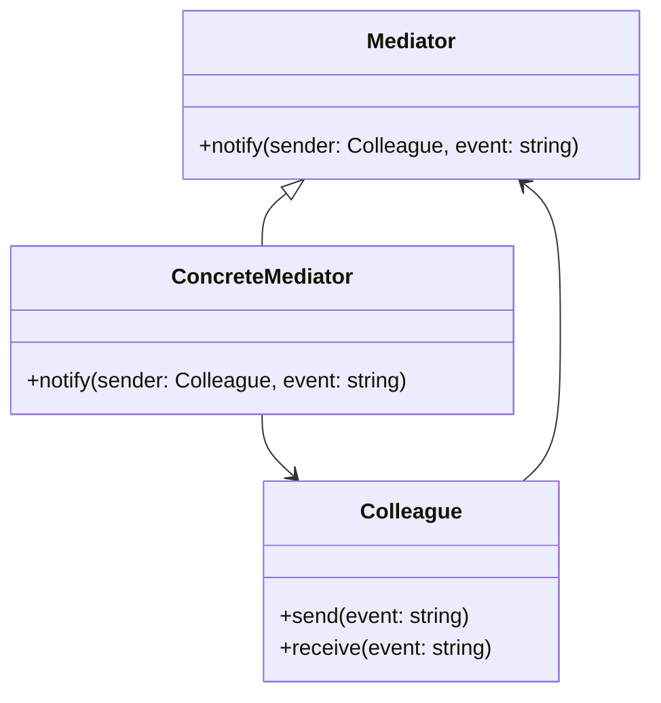

## 2.3.5 Mediator

### Introduction

The Mediator Design Pattern is a behavioral pattern that defines an object to encapsulate how a set of objects interact. This pattern promotes loose coupling by preventing direct communication between objects, thereby reducing dependencies and enhancing maintainability.

### Detailed Explanation

#### Understand the Intent

- **Encapsulation of Interaction:** The Mediator pattern encapsulates the interaction logic between objects, allowing them to communicate indirectly through a mediator.
- **Loose Coupling:** By decoupling objects from each other, the pattern facilitates easier maintenance and scalability.

#### Key Components

- **Mediator Interface:** Declares methods used by colleague classes to communicate.
- **Concrete Mediator:** Implements the mediator interface and coordinates communication between colleague classes.
- **Colleague Classes:** Objects that communicate through the mediator rather than directly with each other.

#### Implementation Steps

1. **Define the Mediator Interface:** Create an interface that declares methods for communication.
2. **Implement the Concrete Mediator:** Develop a class that implements the mediator interface and manages communication between colleague classes.
3. **Modify Colleague Classes:** Adjust colleague classes to interact with the mediator instead of directly with each other.

### Visual Aids

#### Mediator Pattern Diagram



### Code Examples

#### Chat Room Implementation

Consider a chat room where participants send messages via a central mediator:

```typescript
interface ChatRoomMediator {
    showMessage(user: User, message: string): void;
}

class ChatRoom implements ChatRoomMediator {
    showMessage(user: User, message: string): void {
        const time = new Date().toLocaleTimeString();
        console.log(`${time} [${user.getName()}]: ${message}`);
    }
}

class User {
    private name: string;
    private chatMediator: ChatRoomMediator;

    constructor(name: string, chatMediator: ChatRoomMediator) {
        this.name = name;
        this.chatMediator = chatMediator;
    }

    getName(): string {
        return this.name;
    }

    send(message: string): void {
        this.chatMediator.showMessage(this, message);
    }
}

// Usage
const mediator = new ChatRoom();
const user1 = new User("Alice", mediator);
const user2 = new User("Bob", mediator);

user1.send("Hello, Bob!");
user2.send("Hi, Alice!");
```

#### Form Components Notification

Explore form components that notify a mediator on events:

```typescript
interface FormMediator {
    notify(sender: Component, event: string): void;
}

class ConcreteFormMediator implements FormMediator {
    private button: Button;
    private textBox: TextBox;

    setButton(button: Button): void {
        this.button = button;
    }

    setTextBox(textBox: TextBox): void {
        this.textBox = textBox;
    }

    notify(sender: Component, event: string): void {
        if (event === "textChanged") {
            this.button.setEnabled(this.textBox.getText().length > 0);
        }
    }
}

abstract class Component {
    protected mediator: FormMediator;

    constructor(mediator: FormMediator) {
        this.mediator = mediator;
    }
}

class Button extends Component {
    private enabled: boolean = false;

    setEnabled(enabled: boolean): void {
        this.enabled = enabled;
        console.log(`Button is now ${enabled ? "enabled" : "disabled"}`);
    }
}

class TextBox extends Component {
    private text: string = "";

    setText(text: string): void {
        this.text = text;
        this.mediator.notify(this, "textChanged");
    }

    getText(): string {
        return this.text;
    }
}

// Usage
const formMediator = new ConcreteFormMediator();
const button = new Button(formMediator);
const textBox = new TextBox(formMediator);

formMediator.setButton(button);
formMediator.setTextBox(textBox);

textBox.setText("Hello");
```

### Use Cases

- **Complex Communication Patterns:** When multiple objects need to communicate in complex ways, the mediator pattern simplifies interactions.
- **Centralized Control Logic:** Useful in scenarios like chat applications, form handling, and flight control systems.

### Practice

Implement a flight control system where airplanes communicate via a control tower mediator. This exercise will help solidify your understanding of the mediator pattern.

### Considerations

- **Simplification of Protocols:** The mediator pattern simplifies object protocols by centralizing communication.
- **Potential Complexity:** Be cautious of the mediator becoming a bottleneck or overly complex, as it centralizes control logic.

### Advantages and Disadvantages

#### Advantages

- **Reduced Coupling:** Objects are less dependent on each other, enhancing modularity.
- **Centralized Communication:** Simplifies debugging and maintenance by centralizing communication logic.

#### Disadvantages

- **Complexity in Mediator:** The mediator can become complex and difficult to manage if not designed carefully.
- **Single Point of Failure:** Centralizing communication can lead to a single point of failure.

### Best Practices

- **Keep Mediator Simple:** Avoid overloading the mediator with too much logic.
- **Use for Complex Interactions:** Apply the mediator pattern when interactions between objects are complex and need simplification.

### Comparisons

The mediator pattern can be compared to the Observer pattern, where the mediator centralizes communication, while the observer pattern decentralizes it through event subscription.

### Conclusion

The Mediator Design Pattern is a powerful tool for managing complex object interactions in JavaScript and TypeScript applications. By promoting loose coupling and centralizing communication, it enhances maintainability and scalability. However, careful design is necessary to prevent the mediator from becoming a bottleneck.

## Quiz Time!



### What is the primary intent of the Mediator Design Pattern?

- [x] To encapsulate how a set of objects interact and promote loose coupling.
- [ ] To provide a way to create objects without specifying their concrete classes.
- [ ] To define a family of algorithms and make them interchangeable.
- [ ] To ensure a class has only one instance and provide a global point of access.

> **Explanation:** The Mediator Design Pattern encapsulates how a set of objects interact and promotes loose coupling by preventing direct communication between objects.

### Which component in the Mediator pattern coordinates communication between colleague classes?

- [ ] Mediator Interface
- [x] Concrete Mediator
- [ ] Colleague Classes
- [ ] Observer

> **Explanation:** The Concrete Mediator implements the mediator interface and coordinates communication between colleague classes.

### In the chat room example, what role does the `ChatRoom` class play?

- [x] Concrete Mediator
- [ ] Colleague Class
- [ ] Mediator Interface
- [ ] Observer

> **Explanation:** The `ChatRoom` class acts as the Concrete Mediator, managing communication between `User` objects.

### What is a potential disadvantage of using the Mediator pattern?

- [ ] It increases coupling between objects.
- [ ] It decentralizes communication logic.
- [x] The mediator can become overly complex.
- [ ] It reduces the number of classes.

> **Explanation:** A potential disadvantage of the Mediator pattern is that the mediator can become overly complex if not designed carefully.

### Which of the following is a use case for the Mediator pattern?

- [x] Complex communication patterns between multiple objects.
- [ ] Creating a single instance of a class.
- [ ] Providing a way to create families of related objects.
- [ ] Defining a family of algorithms.

> **Explanation:** The Mediator pattern is useful for managing complex communication patterns between multiple objects.

### How does the Mediator pattern affect object protocols?

- [x] It simplifies object protocols by centralizing communication.
- [ ] It complicates object protocols by adding more classes.
- [ ] It decentralizes object protocols.
- [ ] It has no effect on object protocols.

> **Explanation:** The Mediator pattern simplifies object protocols by centralizing communication through a mediator.

### What is the role of the `User` class in the chat room example?

- [ ] Concrete Mediator
- [x] Colleague Class
- [ ] Mediator Interface
- [ ] Observer

> **Explanation:** The `User` class acts as a Colleague Class, communicating through the `ChatRoom` mediator.

### In the form components example, what event does the `TextBox` notify the mediator about?

- [ ] Button Clicked
- [x] Text Changed
- [ ] Form Submitted
- [ ] Form Reset

> **Explanation:** The `TextBox` notifies the mediator about the "textChanged" event.

### What is a best practice when implementing the Mediator pattern?

- [x] Keep the mediator simple and avoid overloading it with too much logic.
- [ ] Use the mediator for all object interactions.
- [ ] Avoid using the mediator in complex systems.
- [ ] Decentralize communication logic as much as possible.

> **Explanation:** A best practice is to keep the mediator simple and avoid overloading it with too much logic.

### True or False: The Mediator pattern is similar to the Observer pattern in that both centralize communication.

- [ ] True
- [x] False

> **Explanation:** False. The Mediator pattern centralizes communication, while the Observer pattern decentralizes it through event subscription.


