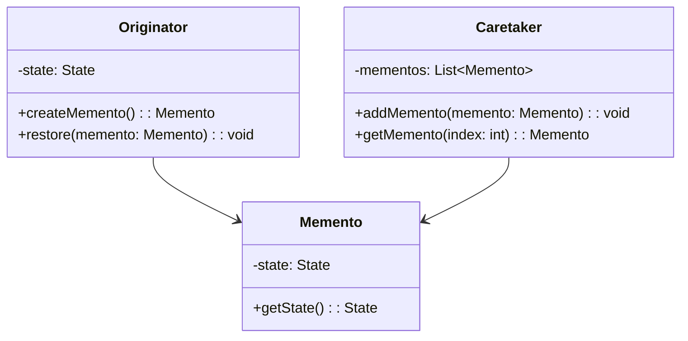

---

linkTitle: "2.3.6 Memento"
title: "Memento Design Pattern in JavaScript and TypeScript: Capture and Restore Object State"
description: "Explore the Memento design pattern in JavaScript and TypeScript, focusing on capturing and restoring object states without violating encapsulation."
categories:
- Design Patterns
- JavaScript
- TypeScript
tags:
- Memento Pattern
- Behavioral Patterns
- State Management
- JavaScript Design Patterns
- TypeScript Design Patterns
date: 2024-10-25
type: docs
nav_weight: 236000
canonical: "https://softwarepatternslexicon.com/patterns-js/2/3/6"
license: "© 2024 Tokenizer Inc. CC BY-NC-SA 4.0"
---

## 2.3.6 Memento

### Introduction

The Memento design pattern is a behavioral pattern from the classic Gang of Four (GoF) design patterns. Its primary purpose is to capture and externalize an object's internal state without violating encapsulation, allowing the object to be restored to this state later. This pattern is particularly useful in scenarios where undo/redo functionality is required, such as in text editors or complex applications where state snapshots are necessary.

### Detailed Explanation

#### Understand the Intent

The Memento pattern is designed to:

- **Capture and Externalize State:** Safely capture an object's internal state so that it can be stored externally.
- **Restore State:** Allow the object to be restored to a previously captured state without exposing its internal structure.

#### Key Components

The Memento pattern involves three key components:

1. **Memento:**
   - Stores the internal state of the originator.
   - Provides a way to retrieve the stored state without exposing the originator's details.

2. **Originator:**
   - Creates a memento containing a snapshot of its current state.
   - Uses the memento to restore its state when needed.

3. **Caretaker:**
   - Manages mementos and requests restorations.
   - Keeps track of multiple mementos to facilitate undo/redo operations.

#### Implementation Steps

1. **Implement the Originator:**
   - Define methods to create and restore mementos.
   - Ensure that the originator can save its state to a memento and restore from it.

2. **Create Memento Objects:**
   - Design memento objects to store the necessary state information.
   - Ensure that mementos are immutable to maintain integrity.

3. **Use a Caretaker:**
   - Implement a caretaker to manage the lifecycle of mementos.
   - Handle the storage and retrieval of mementos for state restoration.

### Visual Aids

#### Memento Pattern Structure



### Code Examples

Let's explore a practical implementation of the Memento pattern using TypeScript to build a simple text editor with undo and redo capabilities.

```typescript
// Memento class
class Memento {
    constructor(private readonly state: string) {}

    getState(): string {
        return this.state;
    }
}

// Originator class
class TextEditor {
    private content: string = '';

    type(words: string): void {
        this.content += words;
    }

    save(): Memento {
        return new Memento(this.content);
    }

    restore(memento: Memento): void {
        this.content = memento.getState();
    }

    getContent(): string {
        return this.content;
    }
}

// Caretaker class
class EditorHistory {
    private mementos: Memento[] = [];

    addMemento(memento: Memento): void {
        this.mementos.push(memento);
    }

    getMemento(index: number): Memento {
        return this.mementos[index];
    }
}

// Usage
const editor = new TextEditor();
const history = new EditorHistory();

editor.type('Hello, ');
history.addMemento(editor.save());

editor.type('World!');
history.addMemento(editor.save());

console.log(editor.getContent()); // Output: Hello, World!

editor.restore(history.getMemento(0));
console.log(editor.getContent()); // Output: Hello, 
```

### Use Cases

The Memento pattern is applicable in scenarios where:

- You need to save and restore an object's state, such as in text editors with undo/redo functionality.
- State snapshots are necessary for complex applications, like games or simulations, where reverting to a previous state is required.

### Practice

To practice implementing the Memento pattern, consider building a text editor with undo and redo capabilities. Focus on managing the state history efficiently and ensuring that the mementos are immutable to prevent unintended modifications.

### Considerations

- **Memory Usage:** Be cautious with memory usage, as mementos can consume significant resources, especially when storing large or complex states.
- **Encapsulation:** Protect memento contents to maintain encapsulation. Ensure that the memento's state is not accessible directly by external entities.

### Advantages and Disadvantages

#### Advantages

- **Encapsulation:** Maintains encapsulation by not exposing the internal state of the originator.
- **State Restoration:** Provides a straightforward mechanism for state restoration, facilitating undo/redo operations.

#### Disadvantages

- **Memory Overhead:** Can lead to increased memory usage if not managed properly, especially with large states.
- **Complexity:** Adds complexity to the system by introducing additional classes and management logic.

### Best Practices

- **Immutable Mementos:** Ensure that mementos are immutable to prevent accidental modifications.
- **Efficient State Management:** Optimize the storage and retrieval of mementos to minimize memory usage and improve performance.
- **Encapsulation:** Keep the memento's state private and only accessible through controlled methods.

### Comparisons

The Memento pattern can be compared to other state management patterns, such as Command and State patterns. While the Command pattern focuses on encapsulating actions, the Memento pattern specifically deals with capturing and restoring state. The State pattern, on the other hand, manages state transitions within an object.

### Conclusion

The Memento design pattern is a powerful tool for managing state in applications where undo/redo functionality is required. By capturing and restoring an object's state without violating encapsulation, it provides a robust solution for state management. However, careful consideration of memory usage and encapsulation is essential to ensure optimal performance and maintainability.

## Quiz Time!



### What is the primary purpose of the Memento design pattern?

- [x] To capture and externalize an object's internal state without violating encapsulation.
- [ ] To manage state transitions within an object.
- [ ] To encapsulate actions as objects.
- [ ] To facilitate communication between objects.

> **Explanation:** The Memento pattern is designed to capture and externalize an object's internal state without violating encapsulation, allowing the object to be restored to this state later.

### Which component of the Memento pattern is responsible for storing the internal state of the originator?

- [ ] Originator
- [x] Memento
- [ ] Caretaker
- [ ] Observer

> **Explanation:** The Memento component is responsible for storing the internal state of the originator.

### What role does the Caretaker play in the Memento pattern?

- [ ] It creates mementos containing snapshots of the current state.
- [ ] It restores the originator's state from a memento.
- [x] It manages mementos and requests restorations.
- [ ] It modifies the state of the originator.

> **Explanation:** The Caretaker manages mementos and requests restorations, keeping track of multiple mementos to facilitate undo/redo operations.

### In the provided TypeScript example, what method is used to save the current state of the TextEditor?

- [ ] type()
- [x] save()
- [ ] restore()
- [ ] getContent()

> **Explanation:** The `save()` method is used to save the current state of the TextEditor by creating a Memento.

### What is a potential disadvantage of using the Memento pattern?

- [ ] It violates encapsulation.
- [x] It can lead to increased memory usage.
- [ ] It simplifies the system.
- [ ] It reduces the number of classes.

> **Explanation:** A potential disadvantage of the Memento pattern is that it can lead to increased memory usage if not managed properly, especially with large states.

### How can you ensure that mementos are not accidentally modified?

- [ ] By making them mutable.
- [x] By making them immutable.
- [ ] By exposing their state directly.
- [ ] By storing them in a database.

> **Explanation:** Ensuring that mementos are immutable prevents accidental modifications, maintaining the integrity of the stored state.

### Which pattern is focused on encapsulating actions as objects?

- [ ] Memento
- [ ] State
- [x] Command
- [ ] Observer

> **Explanation:** The Command pattern is focused on encapsulating actions as objects, allowing for parameterization and queuing of requests.

### What is the main advantage of the Memento pattern regarding encapsulation?

- [x] It maintains encapsulation by not exposing the internal state of the originator.
- [ ] It allows direct access to the originator's state.
- [ ] It simplifies the originator's interface.
- [ ] It reduces the number of classes in the system.

> **Explanation:** The main advantage of the Memento pattern regarding encapsulation is that it maintains encapsulation by not exposing the internal state of the originator.

### In the Memento pattern, what is the role of the Originator?

- [x] To create a memento containing a snapshot of its current state.
- [ ] To manage the lifecycle of mementos.
- [ ] To store the internal state of the originator.
- [ ] To request restorations.

> **Explanation:** The Originator creates a memento containing a snapshot of its current state and uses it to restore its state when needed.

### True or False: The Memento pattern is suitable for scenarios where state snapshots are necessary.

- [x] True
- [ ] False

> **Explanation:** True. The Memento pattern is suitable for scenarios where state snapshots are necessary, such as in applications requiring undo/redo functionality.


