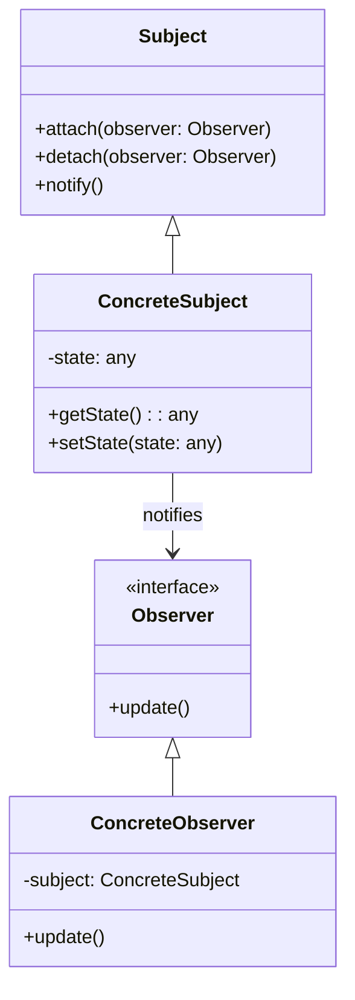

---

linkTitle: "2.3.7 Observer"
title: "Observer Design Pattern in JavaScript and TypeScript: A Comprehensive Guide"
description: "Explore the Observer Design Pattern in JavaScript and TypeScript, its implementation, use cases, and best practices for efficient event-driven programming."
categories:
- Design Patterns
- JavaScript
- TypeScript
tags:
- Observer Pattern
- Behavioral Patterns
- Event-Driven Programming
- JavaScript
- TypeScript
date: 2024-10-25
type: docs
nav_weight: 237000
canonical: "https://softwarepatternslexicon.com/patterns-js/2/3/7"
license: "© 2024 Tokenizer Inc. CC BY-NC-SA 4.0"
---

## 2.3.7 Observer

### Introduction

The Observer Design Pattern is a fundamental behavioral pattern that establishes a one-to-many relationship between objects. When one object (the subject) changes its state, all dependent objects (observers) are automatically notified and updated. This pattern is essential for creating scalable and maintainable event-driven systems, especially in JavaScript and TypeScript applications.

### Understand the Intent

The primary intent of the Observer Pattern is to define a dependency between objects such that when one object changes state, all its dependents are notified. This pattern is particularly useful in scenarios where changes to one object require updates to others, and you want to avoid tight coupling between them.

### Key Components

- **Subject:** The core component that maintains a list of observers and notifies them of any state changes.
- **Observer Interface:** Defines an update method that observers implement to receive notifications.
- **Concrete Observers:** Implement the observer interface to respond to updates from the subject.

### Implementation Steps

1. **Implement the Subject:**
   - Create methods to attach, detach, and notify observers.

2. **Implement Concrete Observers:**
   - Define observers that update their state based on notifications from the subject.

### Visual Representation



### Code Examples

#### JavaScript Example

Here's a simple implementation of the Observer Pattern in JavaScript:

```javascript
class Subject {
    constructor() {
        this.observers = [];
    }

    attach(observer) {
        this.observers.push(observer);
    }

    detach(observer) {
        this.observers = this.observers.filter(obs => obs !== observer);
    }

    notify() {
        this.observers.forEach(observer => observer.update());
    }
}

class ConcreteObserver {
    constructor(name) {
        this.name = name;
    }

    update() {
        console.log(`${this.name} has been notified.`);
    }
}

// Usage
const subject = new Subject();
const observer1 = new ConcreteObserver('Observer 1');
const observer2 = new ConcreteObserver('Observer 2');

subject.attach(observer1);
subject.attach(observer2);

subject.notify(); // Observer 1 has been notified. Observer 2 has been notified.
```

#### TypeScript Example

TypeScript provides type safety, making the implementation more robust:

```typescript
interface Observer {
    update(): void;
}

class Subject {
    private observers: Observer[] = [];

    public attach(observer: Observer): void {
        this.observers.push(observer);
    }

    public detach(observer: Observer): void {
        this.observers = this.observers.filter(obs => obs !== observer);
    }

    public notify(): void {
        this.observers.forEach(observer => observer.update());
    }
}

class ConcreteObserver implements Observer {
    constructor(private name: string) {}

    public update(): void {
        console.log(`${this.name} has been notified.`);
    }
}

// Usage
const subject = new Subject();
const observer1 = new ConcreteObserver('Observer 1');
const observer2 = new ConcreteObserver('Observer 2');

subject.attach(observer1);
subject.attach(observer2);

subject.notify(); // Observer 1 has been notified. Observer 2 has been notified.
```

### Use Cases

- **Event Listeners in DOM Manipulation:** The Observer Pattern is akin to event listeners in JavaScript, where DOM elements notify listeners of events.
- **Reactive Programming Libraries:** Libraries like RxJS utilize the Observer Pattern to handle asynchronous data streams.
- **Stock Ticker Applications:** Observers can be notified of price changes in real-time.

### Practice

Create a stock ticker application where observers are notified of price changes. This exercise will help you understand how to implement the Observer Pattern in a real-world scenario.

### Considerations

- **Avoid Memory Leaks:** Ensure that observers can unsubscribe to prevent memory leaks.
- **Order of Notifications:** Be cautious with the order of notifications, as it can impact application behavior.
- **Performance Impacts:** Consider the performance implications of notifying a large number of observers.

### Best Practices

- **SOLID Principles:** Adhere to the Single Responsibility and Open/Closed principles to enhance maintainability.
- **Decoupling:** Use the Observer Pattern to decouple components, making your codebase more modular and easier to manage.
- **Error Handling:** Implement robust error handling to manage exceptions during observer notifications.

### Conclusion

The Observer Design Pattern is a powerful tool for creating responsive and scalable applications. By understanding its components and implementation, you can effectively manage dependencies and state changes in your JavaScript and TypeScript projects.

## Quiz Time!



### What is the primary intent of the Observer Pattern?

- [x] Define a one-to-many dependency between objects so that when one object changes state, all dependents are notified.
- [ ] Define a one-to-one dependency between objects.
- [ ] Define a many-to-one dependency between objects.
- [ ] Define a many-to-many dependency between objects.

> **Explanation:** The Observer Pattern establishes a one-to-many relationship where a subject notifies multiple observers of state changes.

### Which component of the Observer Pattern maintains a list of observers?

- [x] Subject
- [ ] Observer Interface
- [ ] Concrete Observer
- [ ] State Manager

> **Explanation:** The Subject is responsible for maintaining a list of observers and notifying them of changes.

### In the Observer Pattern, what is the role of the Observer Interface?

- [x] Defines an update method for receiving notifications.
- [ ] Implements the subject's state management.
- [ ] Manages the lifecycle of observers.
- [ ] Handles error logging for observers.

> **Explanation:** The Observer Interface defines the update method that observers implement to receive notifications.

### What is a common use case for the Observer Pattern in web development?

- [x] Event listeners in DOM manipulation.
- [ ] Database schema design.
- [ ] Network protocol implementation.
- [ ] File system management.

> **Explanation:** The Observer Pattern is similar to event listeners in web development, where DOM elements notify listeners of events.

### How can you prevent memory leaks when using the Observer Pattern?

- [x] Ensure observers can unsubscribe.
- [ ] Use synchronous notifications only.
- [ ] Limit the number of observers to ten.
- [ ] Avoid using interfaces.

> **Explanation:** Allowing observers to unsubscribe helps prevent memory leaks by ensuring they are not retained unnecessarily.

### What is a potential performance concern when using the Observer Pattern?

- [x] Notifying a large number of observers can impact performance.
- [ ] Observers may not receive notifications.
- [ ] Subjects can become tightly coupled with observers.
- [ ] Observers can modify the subject's state directly.

> **Explanation:** Notifying a large number of observers can lead to performance issues, especially if updates are frequent.

### Which SOLID principle is most closely related to the Observer Pattern?

- [x] Single Responsibility Principle
- [ ] Liskov Substitution Principle
- [ ] Interface Segregation Principle
- [ ] Dependency Inversion Principle

> **Explanation:** The Single Responsibility Principle relates to the Observer Pattern by ensuring that subjects and observers have distinct responsibilities.

### In TypeScript, what advantage does using interfaces provide when implementing the Observer Pattern?

- [x] Type safety and clear contract definition.
- [ ] Faster execution time.
- [ ] Reduced memory usage.
- [ ] Simplified syntax.

> **Explanation:** Interfaces in TypeScript provide type safety and a clear contract for implementing the Observer Pattern.

### What is a key consideration when determining the order of notifications in the Observer Pattern?

- [x] The order can impact application behavior.
- [ ] Notifications should always be sent in reverse order.
- [ ] Observers should be notified randomly.
- [ ] The order is irrelevant to application behavior.

> **Explanation:** The order of notifications can affect how observers react, potentially impacting application behavior.

### True or False: The Observer Pattern is only applicable to frontend development.

- [ ] True
- [x] False

> **Explanation:** The Observer Pattern is applicable to both frontend and backend development, as it is a fundamental design pattern for managing dependencies and state changes.




