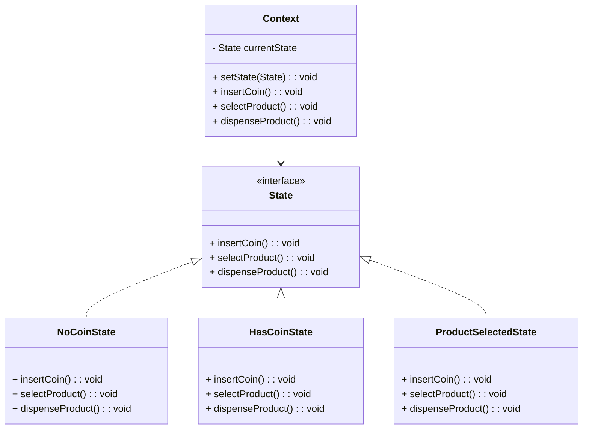

## 2.3.8 State

### Introduction

The State design pattern is a behavioral pattern that allows an object to alter its behavior when its internal state changes. This pattern is particularly useful in scenarios where an object must change its behavior at runtime depending on its state. By encapsulating state-specific behavior into separate classes, the State pattern promotes cleaner, more maintainable code.

### Understanding the Intent

The primary intent of the State pattern is to enable an object to change its behavior when its internal state changes. This is achieved by delegating state-specific behavior to separate state classes, allowing the context object to switch between these states seamlessly.

### Key Components

- **Context:** The class whose behavior changes with state. It maintains a reference to an instance of a state subclass that defines the current state.
- **State Interface:** Defines methods corresponding to state-specific behaviors. This interface is implemented by all concrete state classes.
- **Concrete States:** Implement behaviors associated with a state of the context. Each concrete state class encapsulates behavior specific to a particular state.

### Implementation Steps

1. **Define a State Interface:** Create an interface that declares methods for state-specific behaviors.
2. **Implement Concrete State Classes:** Develop concrete classes that implement the state interface, each representing a specific state.
3. **Modify the Context Class:** Update the context class to maintain a reference to a state object and delegate behavior to this object.

### Code Examples

Let's explore a practical implementation of the State pattern using a vending machine as an example. The vending machine will change its behavior based on its current state.

#### Vending Machine Example

```typescript
// State Interface
interface VendingMachineState {
    insertCoin(): void;
    selectProduct(): void;
    dispenseProduct(): void;
}

// Concrete State: NoCoinState
class NoCoinState implements VendingMachineState {
    private vendingMachine: VendingMachine;

    constructor(vendingMachine: VendingMachine) {
        this.vendingMachine = vendingMachine;
    }

    insertCoin(): void {
        console.log("Coin inserted.");
        this.vendingMachine.setState(this.vendingMachine.getHasCoinState());
    }

    selectProduct(): void {
        console.log("Insert coin first.");
    }

    dispenseProduct(): void {
        console.log("Insert coin first.");
    }
}

// Concrete State: HasCoinState
class HasCoinState implements VendingMachineState {
    private vendingMachine: VendingMachine;

    constructor(vendingMachine: VendingMachine) {
        this.vendingMachine = vendingMachine;
    }

    insertCoin(): void {
        console.log("Coin already inserted.");
    }

    selectProduct(): void {
        console.log("Product selected.");
        this.vendingMachine.setState(this.vendingMachine.getProductSelectedState());
    }

    dispenseProduct(): void {
        console.log("Select product first.");
    }
}

// Concrete State: ProductSelectedState
class ProductSelectedState implements VendingMachineState {
    private vendingMachine: VendingMachine;

    constructor(vendingMachine: VendingMachine) {
        this.vendingMachine = vendingMachine;
    }

    insertCoin(): void {
        console.log("Coin already inserted.");
    }

    selectProduct(): void {
        console.log("Product already selected.");
    }

    dispenseProduct(): void {
        console.log("Product dispensed.");
        this.vendingMachine.setState(this.vendingMachine.getNoCoinState());
    }
}

// Context: VendingMachine
class VendingMachine {
    private noCoinState: VendingMachineState;
    private hasCoinState: VendingMachineState;
    private productSelectedState: VendingMachineState;
    private currentState: VendingMachineState;

    constructor() {
        this.noCoinState = new NoCoinState(this);
        this.hasCoinState = new HasCoinState(this);
        this.productSelectedState = new ProductSelectedState(this);
        this.currentState = this.noCoinState;
    }

    setState(state: VendingMachineState): void {
        this.currentState = state;
    }

    getNoCoinState(): VendingMachineState {
        return this.noCoinState;
    }

    getHasCoinState(): VendingMachineState {
        return this.hasCoinState;
    }

    getProductSelectedState(): VendingMachineState {
        return this.productSelectedState;
    }

    insertCoin(): void {
        this.currentState.insertCoin();
    }

    selectProduct(): void {
        this.currentState.selectProduct();
    }

    dispenseProduct(): void {
        this.currentState.dispenseProduct();
    }
}

// Usage
const vendingMachine = new VendingMachine();
vendingMachine.insertCoin();
vendingMachine.selectProduct();
vendingMachine.dispenseProduct();
```

### Use Cases

The State pattern is applicable in scenarios where:

- An object's behavior depends on its state, and it must change behavior at runtime.
- State-specific behavior needs to be encapsulated and separated from the context class.
- There is a need to avoid large conditional statements that manage state transitions.

### Practice

To practice implementing the State pattern, consider creating a state machine for a TCP connection with different states such as Closed, Listen, and Established. Each state should define behaviors specific to that state.

### Considerations

- **Single Responsibility Principle:** The State pattern promotes single responsibility by separating state-specific behavior into distinct classes.
- **Class Proliferation:** Be mindful of the potential proliferation of state classes, which can increase complexity. Manage this by grouping related states or using state hierarchies if necessary.

### Visual Aids

Below is a conceptual diagram illustrating the State pattern:



### Advantages and Disadvantages

**Advantages:**

- **Encapsulation:** State-specific behavior is encapsulated in separate classes.
- **Flexibility:** New states and behaviors can be added without modifying existing code.
- **Maintainability:** Reduces the complexity of the context class by delegating behavior to state classes.

**Disadvantages:**

- **Complexity:** Can lead to a large number of state classes, increasing complexity.
- **Overhead:** May introduce additional overhead if the number of states is large.

### Best Practices

- **Use State Pattern Judiciously:** Consider the complexity and number of states before implementing the pattern.
- **Group Related States:** If possible, group related states to manage complexity and reduce the number of classes.
- **Leverage TypeScript Features:** Utilize TypeScript interfaces and classes to enforce state-specific behavior and ensure type safety.

### Comparisons

The State pattern is often compared to the Strategy pattern. While both patterns involve encapsulating behavior, the State pattern focuses on changing behavior based on an object's state, whereas the Strategy pattern involves selecting a behavior from a set of strategies.

### Conclusion

The State design pattern is a powerful tool for managing object behavior based on internal state changes. By encapsulating state-specific behavior into separate classes, it promotes cleaner, more maintainable code. However, careful consideration should be given to managing complexity and class proliferation.

## Quiz Time!



### What is the primary intent of the State design pattern?

- [x] To allow an object to alter its behavior when its internal state changes.
- [ ] To encapsulate a family of algorithms.
- [ ] To define an interface for creating an object.
- [ ] To provide a way to access the elements of an aggregate object sequentially.

> **Explanation:** The State pattern allows an object to change its behavior when its internal state changes, making it appear as if the object has changed its class.

### Which component of the State pattern defines methods corresponding to state-specific behaviors?

- [ ] Context
- [x] State Interface
- [ ] Concrete States
- [ ] State Manager

> **Explanation:** The State Interface defines methods for state-specific behaviors, which are implemented by concrete state classes.

### What is the role of the Context class in the State pattern?

- [x] It maintains a reference to a state object and delegates behavior to it.
- [ ] It implements state-specific behaviors.
- [ ] It defines methods for creating state objects.
- [ ] It manages the lifecycle of state objects.

> **Explanation:** The Context class maintains a reference to an instance of a state subclass and delegates behavior to this state object.

### How does the State pattern promote the Single Responsibility Principle?

- [x] By separating state-specific behavior into distinct classes.
- [ ] By using a single class to manage all states.
- [ ] By encapsulating all behavior in the context class.
- [ ] By reducing the number of classes needed.

> **Explanation:** The State pattern promotes the Single Responsibility Principle by encapsulating state-specific behavior in separate classes, reducing the complexity of the context class.

### What is a potential disadvantage of the State pattern?

- [x] It can lead to a proliferation of state classes.
- [ ] It makes it difficult to add new states.
- [ ] It tightly couples state classes with the context class.
- [ ] It reduces flexibility in changing behavior.

> **Explanation:** The State pattern can lead to a large number of state classes, which can increase complexity and make the system harder to manage.

### In the vending machine example, what happens when a coin is inserted in the NoCoinState?

- [x] The state changes to HasCoinState.
- [ ] The product is dispensed.
- [ ] The machine returns the coin.
- [ ] The state changes to ProductSelectedState.

> **Explanation:** When a coin is inserted in the NoCoinState, the state changes to HasCoinState, allowing the user to select a product.

### Which pattern is often compared to the State pattern due to its encapsulation of behavior?

- [ ] Singleton
- [ ] Factory
- [x] Strategy
- [ ] Observer

> **Explanation:** The Strategy pattern is often compared to the State pattern because both involve encapsulating behavior, though they serve different purposes.

### What is a common use case for the State pattern?

- [x] When an object's behavior depends on its state and it must change behavior at runtime.
- [ ] When an object needs to be created in a specific way.
- [ ] When an object needs to notify other objects of changes.
- [ ] When an object needs to provide a simplified interface to a complex system.

> **Explanation:** The State pattern is used when an object's behavior depends on its state and it needs to change behavior dynamically at runtime.

### How can complexity be managed when using the State pattern?

- [x] By grouping related states or using state hierarchies.
- [ ] By reducing the number of state classes.
- [ ] By combining all states into a single class.
- [ ] By avoiding the use of interfaces.

> **Explanation:** Complexity can be managed by grouping related states or using state hierarchies to reduce the number of classes and improve organization.

### True or False: The State pattern reduces the complexity of the context class by delegating behavior to state classes.

- [x] True
- [ ] False

> **Explanation:** True. The State pattern reduces the complexity of the context class by encapsulating state-specific behavior in separate classes, allowing the context to delegate behavior to these classes.


