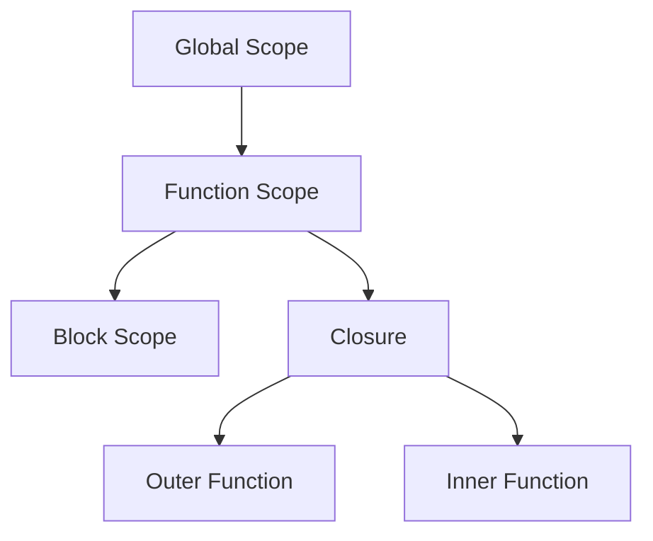

## 2.3 Hoisting, Scope, and Closures

Understanding hoisting, scope, and closures is crucial for mastering JavaScript and effectively implementing design patterns. These concepts form the backbone of JavaScript's execution model and influence how variables and functions behave in your code. Let's dive into each of these topics to unravel their complexities.

### Hoisting in JavaScript

**Hoisting** is a JavaScript mechanism where variable and function declarations are moved to the top of their containing scope during the compile phase. This means that you can use variables and functions before they are declared in the code.

#### Variable Hoisting

In JavaScript, variable declarations using `var` are hoisted to the top of their function or global scope. However, only the declaration is hoisted, not the initialization.

```javascript
console.log(myVar); // Outputs: undefined
var myVar = 5;
console.log(myVar); // Outputs: 5
```

In the above example, the declaration `var myVar;` is hoisted, but the assignment `myVar = 5;` is not. Therefore, the first `console.log` outputs `undefined`.

#### Function Hoisting

Function declarations are also hoisted, allowing you to call a function before it is defined in the code.

```javascript
sayHello(); // Outputs: "Hello, World!"

function sayHello() {
  console.log("Hello, World!");
}
```

In contrast, function expressions are not hoisted. If you try to call a function expression before it is defined, you will encounter an error.

```javascript
// TypeError: sayGoodbye is not a function
sayGoodbye();

var sayGoodbye = function() {
  console.log("Goodbye!");
};
```

#### Let and Const Hoisting

Variables declared with `let` and `const` are hoisted, but they are not initialized. This leads to a "temporal dead zone" where accessing the variable before its declaration results in a `ReferenceError`.

```javascript
console.log(myLetVar); // ReferenceError: Cannot access 'myLetVar' before initialization
let myLetVar = 10;
```

### Scope in JavaScript

**Scope** determines the accessibility of variables and functions in different parts of your code. JavaScript has two types of scope: global scope and local scope.

#### Global Scope

Variables declared outside any function have global scope. They can be accessed from anywhere in the code.

```javascript
var globalVar = "I am global";

function checkScope() {
  console.log(globalVar); // Outputs: "I am global"
}

checkScope();
```

#### Local Scope

Variables declared within a function are local to that function and cannot be accessed from outside.

```javascript
function localScopeExample() {
  var localVar = "I am local";
  console.log(localVar); // Outputs: "I am local"
}

localScopeExample();
console.log(localVar); // ReferenceError: localVar is not defined
```

#### Block Scope

With the introduction of `let` and `const` in ES6, JavaScript now supports block scope. Variables declared with `let` or `const` inside a block `{}` are only accessible within that block.

```javascript
if (true) {
  let blockScopedVar = "I am block scoped";
  console.log(blockScopedVar); // Outputs: "I am block scoped"
}

console.log(blockScopedVar); // ReferenceError: blockScopedVar is not defined
```

### Closures in JavaScript

**Closures** are a fundamental concept in JavaScript that allow a function to access variables from its outer lexical environment, even after that function has finished executing. Closures are created whenever a function is defined inside another function.

#### Creating Closures

```javascript
function outerFunction(outerVariable) {
  return function innerFunction(innerVariable) {
    console.log("Outer Variable: " + outerVariable);
    console.log("Inner Variable: " + innerVariable);
  };
}

const newFunction = outerFunction("outside");
newFunction("inside");
// Outputs:
// Outer Variable: outside
// Inner Variable: inside
```

In this example, `innerFunction` forms a closure that captures `outerVariable` from its outer lexical environment.

#### Practical Use of Closures

Closures are often used to create private variables or functions.

```javascript
function counter() {
  let count = 0;
  return function() {
    count += 1;
    return count;
  };
}

const increment = counter();
console.log(increment()); // Outputs: 1
console.log(increment()); // Outputs: 2
```

Here, `count` is a private variable that can only be accessed and modified by the returned function.

### Common Pitfalls and Best Practices

#### Avoiding Global Variables

Global variables can lead to conflicts and bugs, especially in large codebases. Use local variables and closures to encapsulate functionality.

#### Understanding the Temporal Dead Zone

Be aware of the temporal dead zone when using `let` and `const`. Always declare variables at the top of their scope to avoid `ReferenceError`.

#### Proper Use of Closures

Closures can lead to memory leaks if not used carefully. Ensure that closures do not unintentionally capture large objects or DOM elements.

### Visualizing Scope and Closures



**Diagram Description**: This diagram illustrates the relationship between global scope, function scope, block scope, and closures. It shows how closures capture variables from their outer function.

### Try It Yourself

Experiment with the following code examples:

1. Modify the `counter` function to allow decrementing the count.
2. Create a closure that keeps track of the number of times a button is clicked on a webpage.

### Further Reading

- [MDN Web Docs: Hoisting](https://developer.mozilla.org/en-US/docs/Glossary/Hoisting)
- [MDN Web Docs: Closures](https://developer.mozilla.org/en-US/docs/Web/JavaScript/Closures)
- [W3Schools: JavaScript Scope](https://www.w3schools.com/js/js_scope.asp)

### Knowledge Check

- What is hoisting, and how does it affect variable declarations?
- How do `let` and `const` differ from `var` in terms of scope?
- What is a closure, and how can it be used to create private variables?

### Summary

In this section, we've explored the core concepts of hoisting, scope, and closures in JavaScript. Understanding these concepts is essential for writing efficient and bug-free code. Remember to use block scope with `let` and `const` to avoid common pitfalls and leverage closures for encapsulating functionality.

### Embrace the Journey

Remember, this is just the beginning. As you progress, you'll build more complex and interactive web applications. Keep experimenting, stay curious, and enjoy the journey!

## Quiz: Mastering JavaScript Hoisting, Scope, and Closures



### What is hoisting in JavaScript?

- [x] The process of moving variable and function declarations to the top of their containing scope during compilation.
- [ ] The process of executing code line by line.
- [ ] The process of optimizing code for performance.
- [ ] The process of converting JavaScript to machine code.

> **Explanation:** Hoisting is a JavaScript mechanism where variable and function declarations are moved to the top of their containing scope during the compile phase.

### Which of the following is true about `let` and `const`?

- [x] They are block-scoped.
- [ ] They are function-scoped.
- [ ] They are hoisted and initialized.
- [ ] They can be redeclared in the same scope.

> **Explanation:** `let` and `const` are block-scoped, meaning they are only accessible within the block they are declared in.

### What is a closure in JavaScript?

- [x] A function that captures variables from its outer lexical environment.
- [ ] A function that is executed immediately after it is defined.
- [ ] A function that does not return any value.
- [ ] A function that is defined inside another function.

> **Explanation:** A closure is a function that captures variables from its outer lexical environment, allowing it to access those variables even after the outer function has finished executing.

### What is the temporal dead zone?

- [x] The period between entering a block and the point where a variable declared with `let` or `const` is initialized.
- [ ] The period when a function is executing.
- [ ] The period when a variable is declared but not used.
- [ ] The period when a variable is initialized but not declared.

> **Explanation:** The temporal dead zone is the period between entering a block and the point where a variable declared with `let` or `const` is initialized, during which accessing the variable results in a `ReferenceError`.

### How can closures be used in JavaScript?

- [x] To create private variables.
- [ ] To execute code asynchronously.
- [x] To encapsulate functionality.
- [ ] To declare global variables.

> **Explanation:** Closures can be used to create private variables and encapsulate functionality, allowing for data hiding and modular code design.

### What is the main difference between function declarations and function expressions?

- [x] Function declarations are hoisted, while function expressions are not.
- [ ] Function expressions are hoisted, while function declarations are not.
- [ ] Both are hoisted.
- [ ] Neither are hoisted.

> **Explanation:** Function declarations are hoisted, meaning they can be called before they are defined in the code, while function expressions are not hoisted.

### What happens if you try to access a variable declared with `let` before its declaration?

- [x] A `ReferenceError` is thrown.
- [ ] `undefined` is returned.
- [ ] The code executes without error.
- [ ] A `TypeError` is thrown.

> **Explanation:** Accessing a variable declared with `let` before its declaration results in a `ReferenceError` due to the temporal dead zone.

### Which of the following is a best practice when using closures?

- [x] Avoid capturing large objects or DOM elements.
- [ ] Use closures to declare global variables.
- [ ] Always use closures for asynchronous code.
- [ ] Avoid using closures altogether.

> **Explanation:** When using closures, it's important to avoid capturing large objects or DOM elements to prevent memory leaks.

### What is the scope of a variable declared with `var` inside a function?

- [x] Function scope.
- [ ] Block scope.
- [ ] Global scope.
- [ ] Module scope.

> **Explanation:** A variable declared with `var` inside a function has function scope, meaning it is accessible throughout the entire function.

### True or False: Closures can only be created inside functions.

- [x] True
- [ ] False

> **Explanation:** Closures are created when a function is defined inside another function, capturing variables from the outer function's scope.


