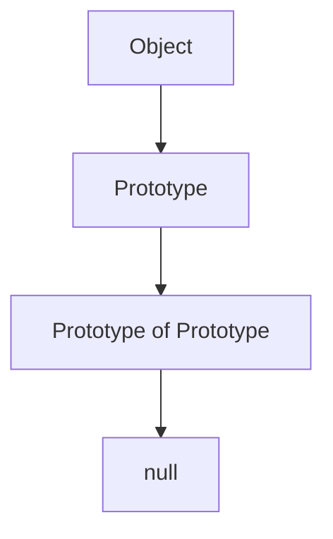
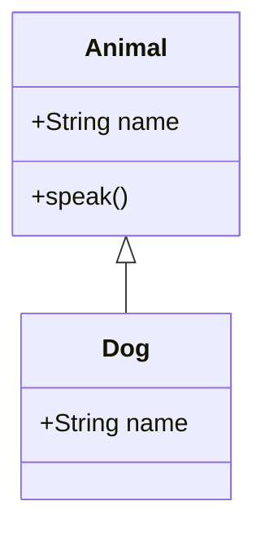

## 2.4 The Prototype Chain and Inheritance

In JavaScript, understanding the prototype chain and inheritance is crucial for mastering object-oriented programming and design patterns. This section delves into the intricacies of JavaScript's prototypal inheritance model, explaining how objects inherit properties and methods through the prototype chain. We will explore the differences between prototypal and classical inheritance, provide examples using prototypes and `Object.create()`, and discuss prototype methods like `Object.getPrototypeOf()` and the `__proto__` property. Additionally, we will see how prototypal inheritance relates to design patterns, such as the Prototype Pattern.

### Understanding Prototypes

In JavaScript, every object has a prototype, which is another object from which it inherits properties and methods. This prototype is a fundamental part of JavaScript's inheritance model, allowing objects to share behavior and state.

#### What is a Prototype?

A prototype is an object from which other objects inherit properties. When you create a new object, it automatically links to a prototype object. This linkage forms the basis of the prototype chain, which is a series of linked objects that JavaScript uses to look up properties and methods.

#### The Prototype Chain

The prototype chain is a mechanism by which JavaScript objects inherit features from one another. When you access a property or method on an object, JavaScript first checks if the property exists on the object itself. If not, it looks up the prototype chain until it finds the property or reaches the end of the chain, which is `null`.



*Figure 1: The Prototype Chain in JavaScript*

### Prototypal vs. Classical Inheritance

JavaScript's prototypal inheritance differs significantly from classical inheritance found in languages like Java or C++. Understanding these differences is key to effectively using JavaScript's inheritance model.

#### Classical Inheritance

In classical inheritance, classes define the blueprint for objects. Objects are instances of classes, and inheritance is achieved by extending classes to create subclasses. This model is static and hierarchical.

#### Prototypal Inheritance

Prototypal inheritance, on the other hand, is more flexible and dynamic. Objects can inherit directly from other objects, and inheritance is achieved through the prototype chain. This model allows for more flexible and dynamic object composition.

### Examples of Inheritance Using Prototypes

Let's explore how inheritance works in JavaScript using prototypes and the `Object.create()` method.

#### Using Prototypes

You can define methods on an object's prototype to enable inheritance.

```javascript
function Animal(name) {
    this.name = name;
}

Animal.prototype.speak = function() {
    console.log(`${this.name} makes a noise.`);
};

const dog = new Animal('Dog');
dog.speak(); // Output: Dog makes a noise.
```

In this example, the `speak` method is defined on `Animal.prototype`, allowing all instances of `Animal` to inherit this method.

#### Using `Object.create()`

The `Object.create()` method creates a new object with the specified prototype.

```javascript
const animal = {
    speak: function() {
        console.log(`${this.name} makes a noise.`);
    }
};

const dog = Object.create(animal);
dog.name = 'Dog';
dog.speak(); // Output: Dog makes a noise.
```

Here, `dog` inherits the `speak` method from `animal` using `Object.create()`.

### Prototype Methods and Properties

JavaScript provides several methods and properties to work with prototypes, such as `Object.getPrototypeOf()` and the `__proto__` property.

#### `Object.getPrototypeOf()`

The `Object.getPrototypeOf()` method returns the prototype of a specified object.

```javascript
const proto = Object.getPrototypeOf(dog);
console.log(proto === animal); // Output: true
```

#### The `__proto__` Property

The `__proto__` property is a reference to the prototype of an object. While it's not recommended for use in production code, it's useful for understanding and experimenting with prototypes.

```javascript
console.log(dog.__proto__ === animal); // Output: true
```

### Prototypal Inheritance and Design Patterns

Prototypal inheritance plays a significant role in JavaScript design patterns, particularly the Prototype Pattern.

#### The Prototype Pattern

The Prototype Pattern is a creational design pattern that involves creating new objects by copying an existing object, known as the prototype. This pattern is useful for creating objects with shared properties and methods without the overhead of class-based inheritance.

```javascript
const carPrototype = {
    drive: function() {
        console.log(`Driving a ${this.make} ${this.model}.`);
    }
};

const car1 = Object.create(carPrototype);
car1.make = 'Toyota';
car1.model = 'Corolla';
car1.drive(); // Output: Driving a Toyota Corolla.

const car2 = Object.create(carPrototype);
car2.make = 'Honda';
car2.model = 'Civic';
car2.drive(); // Output: Driving a Honda Civic.
```

In this example, `car1` and `car2` are created from the `carPrototype`, inheriting the `drive` method.

### Try It Yourself

Experiment with the code examples provided. Try modifying the properties and methods to see how inheritance works in practice. For example, add a new method to the `animal` object and observe how it affects the `dog` object.

### Visualizing Prototypal Inheritance

To better understand prototypal inheritance, let's visualize the relationship between objects and their prototypes using a class diagram.



*Figure 2: Class Diagram of Prototypal Inheritance*

### Key Takeaways

- **Prototypes**: Every JavaScript object has a prototype, which is another object from which it inherits properties and methods.
- **Prototype Chain**: The prototype chain is a series of linked objects that JavaScript uses to look up properties and methods.
- **Prototypal vs. Classical Inheritance**: Prototypal inheritance is more flexible and dynamic compared to classical inheritance.
- **Prototype Methods**: Use methods like `Object.getPrototypeOf()` and properties like `__proto__` to work with prototypes.
- **Prototype Pattern**: The Prototype Pattern is a creational design pattern that involves creating new objects by copying an existing object.

### Knowledge Check

- What is a prototype in JavaScript?
- How does the prototype chain work?
- What are the differences between prototypal and classical inheritance?
- How can you create an object with a specific prototype using `Object.create()`?
- What is the Prototype Pattern, and how is it used in JavaScript?

### Quiz: Mastering JavaScript Prototype Chain and Inheritance



### What is a prototype in JavaScript?

- [x] An object from which other objects inherit properties and methods.
- [ ] A function that creates new objects.
- [ ] A class that defines the blueprint for objects.
- [ ] A method that initializes an object.

> **Explanation:** A prototype is an object from which other objects inherit properties and methods in JavaScript.

### How does the prototype chain work?

- [x] JavaScript looks up properties and methods along a series of linked objects.
- [ ] JavaScript creates a new object for each property lookup.
- [ ] JavaScript uses classes to define inheritance hierarchies.
- [ ] JavaScript does not support inheritance.

> **Explanation:** The prototype chain is a series of linked objects that JavaScript uses to look up properties and methods.

### What is the difference between prototypal and classical inheritance?

- [x] Prototypal inheritance is more flexible and dynamic.
- [ ] Classical inheritance is more flexible and dynamic.
- [ ] Prototypal inheritance uses classes to define objects.
- [ ] Classical inheritance uses prototypes to define objects.

> **Explanation:** Prototypal inheritance is more flexible and dynamic compared to classical inheritance, which uses classes.

### How can you create an object with a specific prototype using `Object.create()`?

- [x] By passing the prototype object as an argument to `Object.create()`.
- [ ] By using the `new` keyword with a constructor function.
- [ ] By defining a class and extending it.
- [ ] By using the `__proto__` property.

> **Explanation:** `Object.create()` creates a new object with the specified prototype.

### What is the Prototype Pattern in JavaScript?

- [x] A creational design pattern that involves creating new objects by copying an existing object.
- [ ] A pattern that involves creating classes and subclasses.
- [ ] A pattern that defines methods on an object's prototype.
- [ ] A pattern that uses the `new` keyword to create objects.

> **Explanation:** The Prototype Pattern is a creational design pattern that involves creating new objects by copying an existing object.

### Which method returns the prototype of a specified object?

- [x] `Object.getPrototypeOf()`
- [ ] `Object.create()`
- [ ] `Object.prototype`
- [ ] `Object.defineProperty()`

> **Explanation:** `Object.getPrototypeOf()` returns the prototype of a specified object.

### What is the `__proto__` property used for?

- [x] It is a reference to the prototype of an object.
- [ ] It is a method to create new objects.
- [ ] It is a property that defines an object's methods.
- [ ] It is a function that initializes an object.

> **Explanation:** The `__proto__` property is a reference to the prototype of an object.

### How does JavaScript handle property lookups in objects?

- [x] It checks the object itself and then the prototype chain.
- [ ] It only checks the object itself.
- [ ] It creates a new object for each lookup.
- [ ] It uses classes to define lookup hierarchies.

> **Explanation:** JavaScript checks the object itself and then the prototype chain for property lookups.

### What is the purpose of the prototype chain in JavaScript?

- [x] To enable inheritance of properties and methods.
- [ ] To define classes and subclasses.
- [ ] To create new objects.
- [ ] To initialize objects.

> **Explanation:** The prototype chain enables inheritance of properties and methods in JavaScript.

### True or False: In JavaScript, every object has a prototype.

- [x] True
- [ ] False

> **Explanation:** In JavaScript, every object has a prototype, which is another object from which it inherits properties and methods.



Remember, this is just the beginning. As you progress, you'll build more complex and interactive web pages. Keep experimenting, stay curious, and enjoy the journey!
