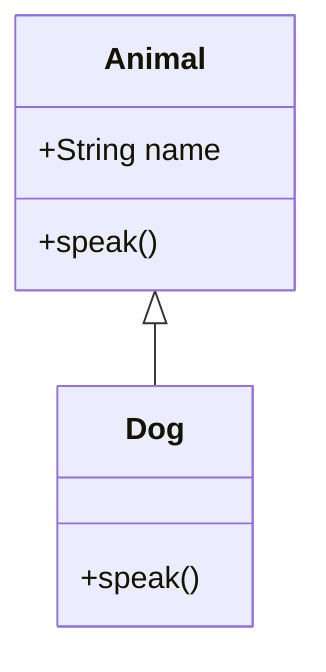

## 2.5 Object-Oriented Programming in JavaScript

Object-Oriented Programming (OOP) is a paradigm that uses "objects" to design applications and computer programs. It utilizes several core principles, including encapsulation, inheritance, and polymorphism, to create modular, reusable, and maintainable code. In this section, we will explore how JavaScript implements OOP, focusing on its unique features and comparing it to traditional OOP languages like Java and C++.

### Introduction to OOP Concepts

Before diving into JavaScript's approach to OOP, let's briefly review the fundamental concepts of object-oriented programming:

- **Encapsulation**: This principle involves bundling the data (attributes) and the methods (functions) that operate on the data into a single unit, or object. It restricts direct access to some of an object's components, which can prevent the accidental modification of data.

- **Inheritance**: This allows a new class to inherit the properties and methods of an existing class. It promotes code reusability and establishes a natural hierarchy between classes.

- **Polymorphism**: This enables objects to be treated as instances of their parent class. It allows for the implementation of methods in different ways, providing flexibility in code.

### JavaScript's Approach to OOP

JavaScript is a prototype-based language, which means it doesn't have classes in the traditional sense, as seen in languages like Java or C++. Instead, it uses prototypes to achieve inheritance and object creation. However, with the introduction of ECMAScript 6 (ES6), JavaScript introduced a more class-like syntax, making it easier for developers familiar with classical OOP languages to work with JavaScript.

#### Prototypes and Constructor Functions

In JavaScript, every object has a prototype, which is another object that it inherits properties from. This is the basis of JavaScript's inheritance model. Let's explore how prototypes work with an example:

```javascript
// Constructor function
function Animal(name) {
  this.name = name;
}

// Adding a method to the prototype
Animal.prototype.speak = function() {
  console.log(`${this.name} makes a noise.`);
};

// Creating an instance
const dog = new Animal('Dog');
dog.speak(); // Output: Dog makes a noise.
```

In this example, `Animal` is a constructor function, and `speak` is a method added to `Animal`'s prototype. Any instance of `Animal` will have access to the `speak` method.

#### ES6 Classes

ES6 introduced a new syntax for creating objects and handling inheritance, which resembles classes in other OOP languages. This syntax is syntactic sugar over JavaScript's existing prototype-based inheritance, making it more intuitive and easier to use.

```javascript
class Animal {
  constructor(name) {
    this.name = name;
  }

  speak() {
    console.log(`${this.name} makes a noise.`);
  }
}

const dog = new Animal('Dog');
dog.speak(); // Output: Dog makes a noise.
```

The `class` keyword in ES6 provides a clearer and more concise way to create objects and handle inheritance. It includes a constructor method for initializing objects and allows methods to be defined directly within the class body.

#### Inheritance with ES6 Classes

JavaScript classes can extend other classes, allowing for inheritance of properties and methods. Here's how you can implement inheritance using ES6 classes:

```javascript
class Animal {
  constructor(name) {
    this.name = name;
  }

  speak() {
    console.log(`${this.name} makes a noise.`);
  }
}

class Dog extends Animal {
  speak() {
    console.log(`${this.name} barks.`);
  }
}

const dog = new Dog('Rex');
dog.speak(); // Output: Rex barks.
```

In this example, `Dog` is a subclass of `Animal` and overrides the `speak` method to provide a specific implementation for dogs.

### Comparing JavaScript OOP with Java and C++

JavaScript's approach to OOP differs significantly from classical OOP languages like Java and C++. Here are some key differences:

- **Prototypes vs. Classes**: JavaScript uses prototypes for inheritance, while Java and C++ use classes. ES6 classes in JavaScript are syntactic sugar over prototypes, providing a more familiar syntax for developers from classical OOP backgrounds.

- **Dynamic vs. Static Typing**: JavaScript is dynamically typed, meaning types are determined at runtime. In contrast, Java and C++ are statically typed, requiring type declarations at compile time.

- **Flexibility**: JavaScript's dynamic nature allows for more flexibility, such as adding properties and methods to objects at runtime. This is less straightforward in statically typed languages like Java and C++.

- **Encapsulation**: JavaScript lacks built-in access modifiers (like `private`, `protected`, `public` in Java and C++), but encapsulation can be achieved using closures or ES6's `Symbol` and `WeakMap`.

### Creating Objects in JavaScript

Let's explore how to create objects using both constructor functions and ES6 classes.

#### Using Constructor Functions

Constructor functions are a traditional way to create objects in JavaScript. They are regular functions that are invoked with the `new` keyword.

```javascript
function Car(make, model) {
  this.make = make;
  this.model = model;
}

Car.prototype.getDetails = function() {
  return `${this.make} ${this.model}`;
};

const car = new Car('Toyota', 'Corolla');
console.log(car.getDetails()); // Output: Toyota Corolla
```

#### Using ES6 Classes

ES6 classes provide a more modern and concise way to create objects and handle inheritance.

```javascript
class Car {
  constructor(make, model) {
    this.make = make;
    this.model = model;
  }

  getDetails() {
    return `${this.make} ${this.model}`;
  }
}

const car = new Car('Toyota', 'Corolla');
console.log(car.getDetails()); // Output: Toyota Corolla
```

### JavaScript's Unique Features in OOP

JavaScript offers unique features that set it apart from other OOP languages:

- **Dynamic Objects**: JavaScript objects can be modified at runtime, allowing for dynamic addition of properties and methods.

- **First-Class Functions**: Functions in JavaScript are first-class citizens, meaning they can be assigned to variables, passed as arguments, and returned from other functions. This allows for powerful patterns like function composition and higher-order functions.

- **Closures**: JavaScript closures enable encapsulation and data hiding, providing a way to create private variables and methods.

### Visualizing JavaScript's Prototype Chain

To better understand how JavaScript's prototype-based inheritance works, let's visualize the prototype chain using a Mermaid.js diagram:



This diagram shows that `Dog` inherits from `Animal`, and both classes have a `speak` method. The `Dog` class overrides the `speak` method to provide a specific implementation.

### Try It Yourself

Experiment with the code examples provided above. Try modifying the `speak` method in the `Animal` class to see how it affects the `Dog` class. You can also create additional subclasses and methods to explore JavaScript's OOP capabilities further.

### Knowledge Check

- What are the core principles of OOP?
- How does JavaScript implement inheritance?
- What is the difference between constructor functions and ES6 classes?
- How can encapsulation be achieved in JavaScript?
- Compare JavaScript's OOP with that of Java or C++.

### Summary

In this section, we've explored how JavaScript implements object-oriented programming using prototypes and constructor functions. We've also seen how ES6 classes simplify the syntax and make JavaScript's OOP more accessible to developers familiar with classical OOP languages. Remember, mastering OOP in JavaScript involves understanding its unique features and leveraging them to create efficient, maintainable code.

### Quiz: Test Your Knowledge on JavaScript OOP



### What is encapsulation in OOP?

- [x] Bundling data and methods that operate on the data into a single unit
- [ ] Allowing a class to inherit properties from another class
- [ ] Enabling objects to be treated as instances of their parent class
- [ ] None of the above

> **Explanation:** Encapsulation involves bundling the data and methods that operate on the data into a single unit, or object.

### How does JavaScript achieve inheritance?

- [x] Through prototypes
- [ ] Using classes only
- [ ] With interfaces
- [ ] By using modules

> **Explanation:** JavaScript achieves inheritance through prototypes, allowing objects to inherit properties and methods from other objects.

### What is the purpose of the `new` keyword in JavaScript?

- [x] To create an instance of an object
- [ ] To declare a new variable
- [ ] To define a new function
- [ ] To create a new array

> **Explanation:** The `new` keyword is used to create an instance of an object in JavaScript.

### Which of the following is a feature of ES6 classes?

- [x] They provide a more concise syntax for creating objects
- [ ] They replace prototypes entirely
- [ ] They are statically typed
- [ ] They do not support inheritance

> **Explanation:** ES6 classes provide a more concise syntax for creating objects but do not replace prototypes entirely.

### What is a constructor function in JavaScript?

- [x] A function used to create objects
- [ ] A function that returns a string
- [ ] A function that manipulates arrays
- [ ] A function that performs mathematical operations

> **Explanation:** A constructor function is used to create objects in JavaScript.

### How can encapsulation be achieved in JavaScript?

- [x] Using closures
- [ ] Using public variables
- [ ] Using global variables
- [ ] Using arrays

> **Explanation:** Encapsulation can be achieved in JavaScript using closures to create private variables and methods.

### What is polymorphism in OOP?

- [x] Enabling objects to be treated as instances of their parent class
- [ ] Allowing a class to inherit properties from another class
- [ ] Bundling data and methods that operate on the data into a single unit
- [ ] None of the above

> **Explanation:** Polymorphism enables objects to be treated as instances of their parent class, allowing for method overriding.

### What is a prototype in JavaScript?

- [x] An object from which other objects inherit properties
- [ ] A function that returns an object
- [ ] A method that manipulates strings
- [ ] A variable that holds data

> **Explanation:** A prototype is an object from which other objects inherit properties in JavaScript.

### How do ES6 classes differ from traditional classes in Java?

- [x] ES6 classes are syntactic sugar over prototypes
- [ ] ES6 classes are statically typed
- [ ] ES6 classes do not support inheritance
- [ ] ES6 classes are compiled at runtime

> **Explanation:** ES6 classes are syntactic sugar over prototypes, providing a more familiar syntax for developers from classical OOP backgrounds.

### True or False: JavaScript is a statically typed language.

- [ ] True
- [x] False

> **Explanation:** JavaScript is a dynamically typed language, meaning types are determined at runtime.



Remember, this is just the beginning. As you progress, you'll build more complex and interactive web pages. Keep experimenting, stay curious, and enjoy the journey!
