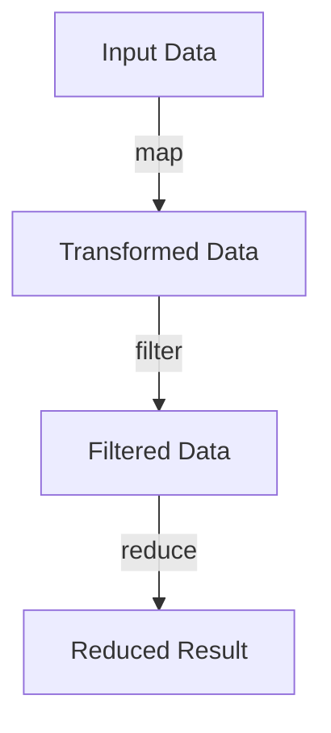

## 2.6 Functional Programming Concepts

Functional programming (FP) is a programming paradigm that treats computation as the evaluation of mathematical functions and avoids changing state or mutable data. In JavaScript, functional programming is not only possible but also highly effective, thanks to its first-class functions and flexible syntax. Let's delve into the core principles of functional programming and see how they can be applied in JavaScript to create more predictable and testable code.

### Core Principles of Functional Programming

#### Pure Functions

A pure function is a function where the output value is determined only by its input values, without observable side effects. This means that calling a pure function with the same arguments will always return the same result.

**Example of a Pure Function:**

```javascript
// Pure function: no side effects, returns the same result for the same input
function add(a, b) {
  return a + b;
}

console.log(add(2, 3)); // 5
console.log(add(2, 3)); // 5
```

**Key Characteristics:**
- **Deterministic**: Always produces the same output for the same input.
- **No Side Effects**: Does not modify any external state or data.

#### Immutability

Immutability is a core concept in functional programming where data cannot be changed once created. Instead of modifying existing data, new data structures are created.

**Example of Immutability:**

```javascript
// Using Object.freeze to create an immutable object
const person = Object.freeze({ name: 'Alice', age: 30 });

// Attempting to modify the object will not work
person.age = 31; // This will not change the age property

console.log(person.age); // 30
```

**Benefits of Immutability:**
- **Predictability**: Easier to understand and predict the behavior of the code.
- **Concurrency**: Safe to use in concurrent environments as data is not modified.

#### Higher-Order Functions

Higher-order functions are functions that take other functions as arguments or return them as results. This allows for greater abstraction and code reuse.

**Example of a Higher-Order Function:**

```javascript
// Higher-order function: takes a function as an argument
function applyOperation(a, b, operation) {
  return operation(a, b);
}

function multiply(x, y) {
  return x * y;
}

console.log(applyOperation(5, 3, multiply)); // 15
```

**Advantages:**
- **Abstraction**: Simplifies complex operations by abstracting them into reusable functions.
- **Flexibility**: Allows functions to be composed and reused in different contexts.

### JavaScript's Support for Functional Programming

JavaScript supports functional programming paradigms through its first-class functions, meaning functions can be assigned to variables, passed as arguments, and returned from other functions. This flexibility allows developers to implement functional programming concepts effectively.

#### Array Methods: `map`, `filter`, and `reduce`

JavaScript provides several built-in methods that facilitate functional programming, particularly when working with arrays.

**`map` Method:**

The `map` method creates a new array populated with the results of calling a provided function on every element in the calling array.

```javascript
const numbers = [1, 2, 3, 4];
const doubled = numbers.map(num => num * 2);

console.log(doubled); // [2, 4, 6, 8]
```

**`filter` Method:**

The `filter` method creates a new array with all elements that pass the test implemented by the provided function.

```javascript
const numbers = [1, 2, 3, 4];
const evenNumbers = numbers.filter(num => num % 2 === 0);

console.log(evenNumbers); // [2, 4]
```

**`reduce` Method:**

The `reduce` method executes a reducer function on each element of the array, resulting in a single output value.

```javascript
const numbers = [1, 2, 3, 4];
const sum = numbers.reduce((accumulator, currentValue) => accumulator + currentValue, 0);

console.log(sum); // 10
```

### Benefits and Trade-offs of Functional Programming in JavaScript

#### Benefits

1. **Predictability**: Pure functions and immutability lead to more predictable code, making it easier to debug and test.
2. **Reusability**: Higher-order functions and function composition promote code reuse and modularity.
3. **Concurrency**: Immutability makes it easier to write concurrent code without worrying about race conditions.

#### Trade-offs

1. **Performance**: Creating new data structures instead of modifying existing ones can lead to performance overhead.
2. **Learning Curve**: Developers familiar with imperative programming may find functional programming concepts challenging to grasp initially.
3. **Complexity**: Overusing functional abstractions can lead to complex and hard-to-read code.

### Functional Concepts in Design Patterns and Modern Libraries

Functional programming concepts are widely used in modern JavaScript libraries and frameworks. For example, React uses functional components and hooks, which embrace immutability and pure functions. Libraries like Lodash provide utility functions that facilitate functional programming.

**Example of Functional Concepts in React:**

```javascript
import React, { useState } from 'react';

function Counter() {
  const [count, setCount] = useState(0);

  const increment = () => setCount(prevCount => prevCount + 1);

  return (
    <div>
      <p>Count: {count}</p>
      <button onClick={increment}>Increment</button>
    </div>
  );
}
```

### Visualizing Functional Programming Concepts

To better understand how functional programming concepts interact, let's visualize the flow of data through a series of transformations using Mermaid.js.



**Diagram Explanation:**
- **Input Data**: The initial array or data structure.
- **Transformed Data**: Result of applying a `map` function.
- **Filtered Data**: Result of applying a `filter` function.
- **Reduced Result**: Final output after applying a `reduce` function.

### Try It Yourself

Experiment with the following code snippets to deepen your understanding of functional programming in JavaScript. Try modifying the functions or chaining different array methods to see how the output changes.

```javascript
// Experiment with map, filter, and reduce
const numbers = [1, 2, 3, 4, 5, 6];

// Double the numbers
const doubled = numbers.map(num => num * 2);
console.log(doubled);

// Filter out odd numbers
const evenNumbers = numbers.filter(num => num % 2 === 0);
console.log(evenNumbers);

// Sum the numbers
const sum = numbers.reduce((acc, num) => acc + num, 0);
console.log(sum);
```

### Knowledge Check

1. What are the key characteristics of a pure function?
2. How does immutability benefit concurrent programming?
3. Provide an example of a higher-order function in JavaScript.
4. What are the trade-offs of using functional programming in JavaScript?
5. How do modern libraries like React utilize functional programming concepts?

### Summary

Functional programming in JavaScript offers a powerful way to write clean, predictable, and testable code. By embracing pure functions, immutability, and higher-order functions, developers can create applications that are easier to maintain and extend. While there are trade-offs, the benefits often outweigh the challenges, especially when combined with modern libraries and frameworks that support functional paradigms.

Remember, this is just the beginning. As you progress, you'll build more complex and interactive applications using functional programming concepts. Keep experimenting, stay curious, and enjoy the journey!

## Quiz: Mastering Functional Programming Concepts in JavaScript



### What is a pure function?

- [x] A function that returns the same output for the same input without side effects
- [ ] A function that modifies global state
- [ ] A function that relies on external variables
- [ ] A function that performs I/O operations

> **Explanation:** A pure function always returns the same result for the same input and has no side effects.

### Which of the following is a benefit of immutability?

- [x] Easier to reason about code
- [ ] Increased performance due to in-place modifications
- [ ] More complex code structure
- [ ] Difficulty in debugging

> **Explanation:** Immutability makes code easier to reason about because data does not change unexpectedly.

### What does the `map` method do?

- [x] Transforms each element of an array and returns a new array
- [ ] Filters elements of an array based on a condition
- [ ] Reduces an array to a single value
- [ ] Sorts the elements of an array

> **Explanation:** The `map` method applies a function to each element of an array and returns a new array with the transformed elements.

### How does a higher-order function differ from a regular function?

- [x] It can take other functions as arguments or return them
- [ ] It can only perform mathematical operations
- [ ] It cannot return a value
- [ ] It must modify global variables

> **Explanation:** Higher-order functions can take other functions as arguments or return them, allowing for greater abstraction and flexibility.

### What is a potential trade-off of using functional programming?

- [x] Performance overhead due to immutability
- [ ] Increased difficulty in testing
- [ ] Lack of modularity
- [ ] Difficulty in understanding code

> **Explanation:** Functional programming can introduce performance overhead due to the creation of new data structures instead of modifying existing ones.

### Which array method is used to filter elements based on a condition?

- [x] `filter`
- [ ] `map`
- [ ] `reduce`
- [ ] `sort`

> **Explanation:** The `filter` method creates a new array with all elements that pass the test implemented by the provided function.

### What is a common use case for the `reduce` method?

- [x] Summing the elements of an array
- [ ] Sorting an array
- [ ] Filtering an array
- [ ] Mapping an array

> **Explanation:** The `reduce` method is commonly used to accumulate values, such as summing the elements of an array.

### How does React utilize functional programming concepts?

- [x] Through functional components and hooks
- [ ] By enforcing class-based components only
- [ ] By modifying the DOM directly
- [ ] By using only imperative programming

> **Explanation:** React utilizes functional programming concepts through functional components and hooks, which embrace immutability and pure functions.

### What is a higher-order function?

- [x] A function that takes another function as an argument or returns a function
- [ ] A function that performs arithmetic operations
- [ ] A function that modifies global state
- [ ] A function that is executed immediately

> **Explanation:** A higher-order function is one that takes another function as an argument or returns a function, allowing for greater abstraction and code reuse.

### True or False: Functional programming in JavaScript is only possible with ES6 and later versions.

- [ ] True
- [x] False

> **Explanation:** Functional programming in JavaScript has been possible since its inception, although ES6 introduced features that make it more convenient.


