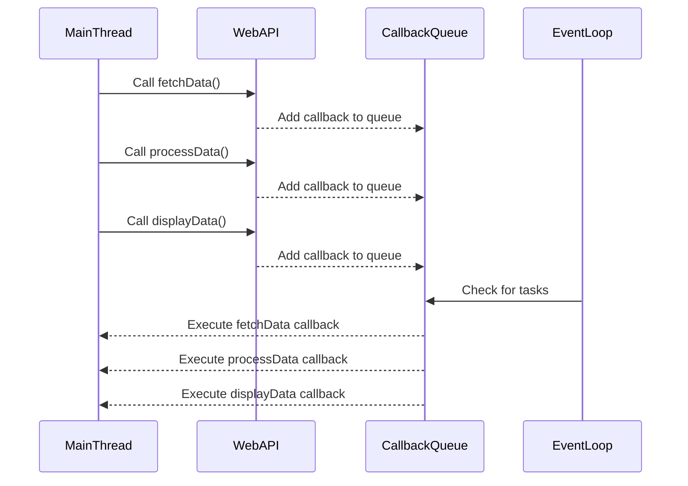

## 2.7 Asynchronous JavaScript: Callbacks, Promises, and Async/Await

Asynchronous programming is a cornerstone of JavaScript, enabling developers to write non-blocking code that can handle multiple operations simultaneously. This capability is crucial for modern web applications, which often need to perform tasks such as fetching data from a server, reading files, or handling user interactions without freezing the user interface. In this section, we will explore the evolution of asynchronous programming in JavaScript, from callbacks to promises, and finally to the `async`/`await` syntax.

### The Importance of Asynchronous Programming in JavaScript

JavaScript is single-threaded, meaning it executes one operation at a time. Without asynchronous programming, any long-running task would block the execution of subsequent code, leading to a poor user experience. Asynchronous programming allows JavaScript to perform tasks in the background, freeing up the main thread to continue executing other code.

### Callbacks: The Foundation of Asynchronous JavaScript

#### What Are Callbacks?

A callback is a function passed as an argument to another function, which is then invoked inside the outer function to complete some kind of routine or action. Callbacks are the simplest form of asynchronous programming in JavaScript.

```javascript
function fetchData(callback) {
    setTimeout(() => {
        const data = { name: "John Doe", age: 30 };
        callback(data);
    }, 2000);
}

fetchData((data) => {
    console.log("Data received:", data);
});
```

In this example, `fetchData` simulates an asynchronous operation using `setTimeout`. The callback function is executed once the data is "fetched."

#### Issues with Callbacks: Callback Hell

While callbacks are straightforward, they can lead to complex and hard-to-maintain code, especially when dealing with multiple asynchronous operations. This situation is often referred to as "callback hell" or the "pyramid of doom."

```javascript
function fetchData(callback) {
    setTimeout(() => {
        callback(null, { name: "John Doe", age: 30 });
    }, 2000);
}

function processData(data, callback) {
    setTimeout(() => {
        callback(null, `Processed data for ${data.name}`);
    }, 2000);
}

function displayData(processedData, callback) {
    setTimeout(() => {
        callback(null, `Displaying: ${processedData}`);
    }, 2000);
}

fetchData((err, data) => {
    if (err) {
        console.error("Error fetching data:", err);
    } else {
        processData(data, (err, processedData) => {
            if (err) {
                console.error("Error processing data:", err);
            } else {
                displayData(processedData, (err, result) => {
                    if (err) {
                        console.error("Error displaying data:", err);
                    } else {
                        console.log(result);
                    }
                });
            }
        });
    }
});
```

As seen in the example above, nesting callbacks can quickly become unwieldy, making the code difficult to read and maintain.

### Promises: A Better Way to Handle Asynchronous Code

#### Introduction to Promises

Promises provide a more elegant way to handle asynchronous operations. A promise represents a value that may be available now, or in the future, or never. Promises have three states: pending, fulfilled, and rejected.

```javascript
function fetchData() {
    return new Promise((resolve, reject) => {
        setTimeout(() => {
            const data = { name: "John Doe", age: 30 };
            resolve(data);
        }, 2000);
    });
}

fetchData()
    .then((data) => {
        console.log("Data received:", data);
    })
    .catch((error) => {
        console.error("Error:", error);
    });
```

In this example, `fetchData` returns a promise that resolves with data after a delay. The `then` method is used to handle the resolved value, while `catch` handles any errors.

#### Chaining Promises

Promises can be chained to handle multiple asynchronous operations in sequence, improving code readability and maintainability.

```javascript
function fetchData() {
    return new Promise((resolve, reject) => {
        setTimeout(() => {
            resolve({ name: "John Doe", age: 30 });
        }, 2000);
    });
}

function processData(data) {
    return new Promise((resolve, reject) => {
        setTimeout(() => {
            resolve(`Processed data for ${data.name}`);
        }, 2000);
    });
}

function displayData(processedData) {
    return new Promise((resolve, reject) => {
        setTimeout(() => {
            resolve(`Displaying: ${processedData}`);
        }, 2000);
    });
}

fetchData()
    .then(processData)
    .then(displayData)
    .then((result) => {
        console.log(result);
    })
    .catch((error) => {
        console.error("Error:", error);
    });
```

By returning promises from each function, we can chain them together, avoiding the deeply nested structure of callbacks.

### Async/Await: Syntactic Sugar for Promises

#### Introduction to Async/Await

Introduced in ES2017, `async`/`await` provides a more synchronous-looking syntax for working with promises, making asynchronous code easier to read and write.

```javascript
async function fetchData() {
    return new Promise((resolve, reject) => {
        setTimeout(() => {
            resolve({ name: "John Doe", age: 30 });
        }, 2000);
    });
}

async function processData(data) {
    return new Promise((resolve, reject) => {
        setTimeout(() => {
            resolve(`Processed data for ${data.name}`);
        }, 2000);
    });
}

async function displayData(processedData) {
    return new Promise((resolve, reject) => {
        setTimeout(() => {
            resolve(`Displaying: ${processedData}`);
        }, 2000);
    });
}

async function main() {
    try {
        const data = await fetchData();
        const processedData = await processData(data);
        const result = await displayData(processedData);
        console.log(result);
    } catch (error) {
        console.error("Error:", error);
    }
}

main();
```

In this example, the `main` function uses `await` to pause execution until each promise is resolved, resulting in a more linear and readable flow of asynchronous operations.

#### Error Handling with Async/Await

Error handling with `async`/`await` is straightforward, using `try`/`catch` blocks to handle any errors that occur during the execution of asynchronous code.

```javascript
async function main() {
    try {
        const data = await fetchData();
        const processedData = await processData(data);
        const result = await displayData(processedData);
        console.log(result);
    } catch (error) {
        console.error("Error:", error);
    }
}

main();
```

### Best Practices for Asynchronous JavaScript

1. **Use Promises or Async/Await**: Prefer promises or `async`/`await` over callbacks for better readability and maintainability.
2. **Handle Errors Gracefully**: Always handle errors using `catch` with promises or `try`/`catch` with `async`/`await`.
3. **Avoid Blocking the Event Loop**: Ensure that asynchronous operations do not block the event loop, which can degrade performance.
4. **Use Promise.all for Concurrent Operations**: When multiple asynchronous operations can be performed concurrently, use `Promise.all` to execute them in parallel.

```javascript
async function main() {
    try {
        const [data1, data2] = await Promise.all([fetchData1(), fetchData2()]);
        console.log("Data1:", data1);
        console.log("Data2:", data2);
    } catch (error) {
        console.error("Error:", error);
    }
}

main();
```

### Visualizing Asynchronous JavaScript

To better understand how asynchronous JavaScript works, let's visualize the flow of asynchronous operations using a sequence diagram.



This diagram illustrates how asynchronous operations are handled by the event loop, allowing the main thread to remain responsive.

### Try It Yourself

Experiment with the code examples provided in this section. Try modifying the delay times, introducing errors, or chaining additional asynchronous operations to see how the code behaves. This hands-on practice will deepen your understanding of asynchronous JavaScript.

### Knowledge Check

- What are the three states of a promise?
- How does `async`/`await` improve the readability of asynchronous code?
- What is "callback hell," and how can it be avoided?
- How can you handle errors in asynchronous code using promises?
- Why is it important to avoid blocking the event loop in JavaScript?

### Summary

In this section, we've explored the evolution of asynchronous programming in JavaScript, from callbacks to promises, and finally to `async`/`await`. Each approach offers unique advantages and challenges, but together they provide a powerful toolkit for writing efficient, non-blocking code. As you continue your journey in mastering JavaScript, remember to apply these concepts and best practices to build responsive and performant web applications.

## Quiz: Mastering Asynchronous JavaScript



### What are the three states of a promise?

- [x] Pending, Fulfilled, Rejected
- [ ] Initialized, Completed, Failed
- [ ] Waiting, Success, Error
- [ ] Start, Process, End

> **Explanation:** A promise can be in one of three states: pending (initial state), fulfilled (operation completed successfully), or rejected (operation failed).

### How does `async`/`await` improve the readability of asynchronous code?

- [x] By making asynchronous code look synchronous
- [ ] By eliminating the need for error handling
- [ ] By reducing the number of lines of code
- [ ] By automatically resolving promises

> **Explanation:** `async`/`await` syntax allows asynchronous code to be written in a more linear and readable manner, similar to synchronous code.

### What is "callback hell," and how can it be avoided?

- [x] A situation where callbacks are nested too deeply, making code hard to read; it can be avoided using promises or `async`/`await`.
- [ ] A scenario where callbacks are used incorrectly, leading to errors; it can be avoided by using only synchronous code.
- [ ] A condition where callbacks are executed out of order; it can be avoided by using event listeners.
- [ ] A problem where callbacks are not defined; it can be avoided by defining all callbacks in advance.

> **Explanation:** "Callback hell" occurs when multiple callbacks are nested, leading to complex and hard-to-maintain code. Using promises or `async`/`await` can help avoid this issue.

### How can you handle errors in asynchronous code using promises?

- [x] By using the `catch` method
- [ ] By using the `finally` method
- [ ] By using the `then` method
- [ ] By using the `await` keyword

> **Explanation:** The `catch` method is used to handle errors in promises, allowing you to define a callback to be executed if the promise is rejected.

### Why is it important to avoid blocking the event loop in JavaScript?

- [x] To ensure the application remains responsive
- [ ] To prevent memory leaks
- [ ] To increase code readability
- [ ] To reduce the number of HTTP requests

> **Explanation:** Blocking the event loop can cause the application to become unresponsive, as it prevents other code from executing.

### What is the purpose of `Promise.all`?

- [x] To execute multiple promises concurrently and wait for all of them to resolve
- [ ] To execute promises sequentially
- [ ] To handle errors in promises
- [ ] To convert callbacks into promises

> **Explanation:** `Promise.all` is used to execute multiple promises concurrently and returns a single promise that resolves when all the promises have resolved.

### Which of the following is a benefit of using promises over callbacks?

- [x] Improved error handling
- [ ] Reduced code complexity
- [ ] Automatic code execution
- [ ] Elimination of asynchronous operations

> **Explanation:** Promises provide a more structured way to handle errors compared to callbacks, improving error handling in asynchronous code.

### What keyword is used to pause the execution of an `async` function until a promise is resolved?

- [x] await
- [ ] async
- [ ] pause
- [ ] wait

> **Explanation:** The `await` keyword is used to pause the execution of an `async` function until the promise is resolved.

### Can `async`/`await` be used with non-promise values?

- [x] True
- [ ] False

> **Explanation:** `async`/`await` can be used with non-promise values, and they will be automatically wrapped in a resolved promise.

### What is the main advantage of using `async`/`await` over promise chaining?

- [x] Improved readability and maintainability of code
- [ ] Faster execution of asynchronous operations
- [ ] Automatic error handling
- [ ] Elimination of the need for promises

> **Explanation:** `async`/`await` improves the readability and maintainability of asynchronous code by providing a more synchronous-looking syntax.



Remember, this is just the beginning. As you progress, you'll build more complex and interactive web pages. Keep experimenting, stay curious, and enjoy the journey!
