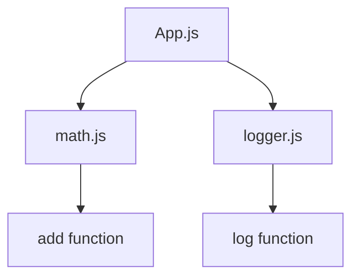

## 2.8 Modules and Code Organization

In the realm of JavaScript development, structuring and organizing code efficiently is crucial for maintainability and scalability. Modules play a pivotal role in achieving this by encapsulating code into reusable units. Let's delve into the concept of modules, their evolution, and their significance in modern web development.

### Understanding Modules in JavaScript

Modules are self-contained units of code that encapsulate functionality, making it easier to manage, maintain, and reuse code across different parts of an application. They help in breaking down complex applications into smaller, manageable pieces, promoting separation of concerns and enhancing code readability.

#### Importance of Modules

- **Maintainability**: Modules allow developers to isolate changes to specific parts of the application without affecting others.
- **Reusability**: Code can be reused across different projects or parts of the same project.
- **Namespace Management**: Modules help in avoiding global namespace pollution by encapsulating variables and functions.

### Module Patterns in JavaScript Prior to ES6

Before the introduction of ES6 modules, JavaScript developers relied on various patterns to simulate modular behavior. Let's explore some of these patterns:

#### The Revealing Module Pattern

The Revealing Module Pattern is a popular design pattern that allows developers to create private and public members within a module. It uses closures to encapsulate private variables and functions, exposing only the necessary parts.

```javascript
const myModule = (function() {
  // Private variables and functions
  let privateVar = 'I am private';
  
  function privateFunction() {
    console.log(privateVar);
  }

  // Public API
  return {
    publicMethod: function() {
      privateFunction();
    }
  };
})();

myModule.publicMethod(); // Outputs: I am private
```

### Introduction to ES6 Module Syntax

With the advent of ES6, JavaScript introduced a native module system, providing a standardized way to define and import/export modules. This system is based on two main keywords: `import` and `export`.

#### Exporting Modules

Modules can export variables, functions, or classes using the `export` keyword. There are two types of exports: named exports and default exports.

- **Named Exports**: Allow multiple exports from a module.

```javascript
// math.js
export const pi = 3.14159;
export function add(a, b) {
  return a + b;
}
```

- **Default Exports**: Allow a single default export per module.

```javascript
// logger.js
export default function log(message) {
  console.log(message);
}
```

#### Importing Modules

Modules can be imported using the `import` keyword. The syntax varies depending on whether the module uses named or default exports.

- **Importing Named Exports**:

```javascript
import { pi, add } from './math.js';
console.log(add(pi, 2)); // Outputs: 5.14159
```

- **Importing Default Exports**:

```javascript
import log from './logger.js';
log('Hello, World!'); // Outputs: Hello, World!
```

### Splitting Code into Modules

Organizing code into modules involves identifying logical units of functionality and separating them into different files. This approach enhances code readability and maintainability.

#### Example: Splitting a Simple Application

Consider a simple application that performs mathematical operations and logs results. We can split this application into separate modules:

1. **math.js**: Contains mathematical functions.
2. **logger.js**: Handles logging.
3. **app.js**: Main application logic.

```javascript
// math.js
export function multiply(a, b) {
  return a * b;
}

// logger.js
export default function log(message) {
  console.log(message);
}

// app.js
import { multiply } from './math.js';
import log from './logger.js';

const result = multiply(3, 4);
log(`Result: ${result}`); // Outputs: Result: 12
```

### Module Bundlers and Their Role

Module bundlers are tools that process and bundle JavaScript modules into a single file or a set of files for use in a browser. They handle dependencies, optimize code, and improve performance.

#### Popular Module Bundlers

- **[Webpack](https://webpack.js.org/)**: A powerful bundler that supports code splitting, lazy loading, and hot module replacement.
- **[Rollup](https://rollupjs.org/)**: Focuses on ES6 modules and is known for producing smaller, more efficient bundles.
- **[Parcel](https://parceljs.org/)**: A zero-configuration bundler that automatically handles dependencies and optimizations.

### Differences Between CommonJS and ES6 Modules

JavaScript has two primary module systems: CommonJS and ES6 modules. Understanding their differences is crucial for effective module management.

- **CommonJS**: Used primarily in Node.js. Modules are loaded synchronously using `require()`.

```javascript
// CommonJS example
const fs = require('fs');
```

- **ES6 Modules**: Used in modern JavaScript environments. Modules are loaded asynchronously using `import`.

```javascript
// ES6 example
import fs from 'fs';
```

#### Key Differences

- **Syntax**: CommonJS uses `require()` and `module.exports`, while ES6 uses `import` and `export`.
- **Loading**: CommonJS is synchronous, whereas ES6 modules are asynchronous.
- **Scope**: CommonJS modules are wrapped in a function, while ES6 modules have a top-level scope.

### Dynamic Imports and Tree Shaking

Dynamic imports and tree shaking are advanced techniques that enhance module management and performance.

#### Dynamic Imports

Dynamic imports allow modules to be loaded on demand, reducing initial load time and improving performance.

```javascript
// Dynamic import example
import('./math.js').then(module => {
  console.log(module.add(2, 3)); // Outputs: 5
});
```

#### Tree Shaking

Tree shaking is a technique used by bundlers to remove unused code from the final bundle, reducing file size and improving performance.

### Visualizing Module Interaction

To better understand how modules interact, let's visualize the process using a flowchart:



This diagram illustrates how `app.js` imports functions from `math.js` and `logger.js`, demonstrating the modular structure of the application.

### References and Further Reading

- [MDN Web Docs: Modules](https://developer.mozilla.org/en-US/docs/Web/JavaScript/Guide/Modules)
- [JavaScript Modules: A Beginner's Guide](https://www.sitepoint.com/understanding-es6-modules/)
- [Webpack Documentation](https://webpack.js.org/)
- [Rollup Documentation](https://rollupjs.org/)
- [Parcel Documentation](https://parceljs.org/)

### Knowledge Check

- What are the benefits of using modules in JavaScript?
- How do ES6 modules differ from CommonJS modules?
- What role do module bundlers play in JavaScript development?
- How can dynamic imports improve application performance?

### Exercises

1. **Exercise 1**: Split a simple application into modules and use ES6 import/export syntax to manage dependencies.
2. **Exercise 2**: Use a module bundler to bundle a set of JavaScript modules and analyze the output.
3. **Exercise 3**: Implement dynamic imports in an application and observe the impact on load time.

### Embrace the Journey

Remember, mastering modules and code organization is a continuous journey. As you progress, you'll discover new patterns and techniques that enhance your development workflow. Keep experimenting, stay curious, and enjoy the journey!

## Mastering JavaScript Modules and Code Organization



### What is the primary benefit of using modules in JavaScript?

- [x] Maintainability and reusability
- [ ] Faster execution
- [ ] Reduced code size
- [ ] Enhanced security

> **Explanation:** Modules help in organizing code into reusable units, making it easier to maintain and reuse across different parts of an application.

### Which keyword is used to export a function in ES6 modules?

- [ ] require
- [x] export
- [ ] module.exports
- [ ] define

> **Explanation:** The `export` keyword is used in ES6 modules to export functions, variables, or classes.

### How do CommonJS modules differ from ES6 modules in terms of loading?

- [x] CommonJS is synchronous, ES6 is asynchronous
- [ ] CommonJS is asynchronous, ES6 is synchronous
- [ ] Both are synchronous
- [ ] Both are asynchronous

> **Explanation:** CommonJS modules are loaded synchronously using `require()`, while ES6 modules are loaded asynchronously using `import`.

### What is the purpose of tree shaking in module bundling?

- [ ] To increase code size
- [x] To remove unused code
- [ ] To enhance security
- [ ] To improve readability

> **Explanation:** Tree shaking is a technique used to remove unused code from the final bundle, reducing file size and improving performance.

### Which module bundler is known for zero-configuration?

- [ ] Webpack
- [ ] Rollup
- [x] Parcel
- [ ] Browserify

> **Explanation:** Parcel is a zero-configuration bundler that automatically handles dependencies and optimizations.

### What is a dynamic import in JavaScript?

- [x] Importing modules on demand
- [ ] Importing modules at compile time
- [ ] Importing modules synchronously
- [ ] Importing modules with `require()`

> **Explanation:** Dynamic imports allow modules to be loaded on demand, reducing initial load time and improving performance.

### Which of the following is a named export in ES6?

- [x] export const pi = 3.14;
- [ ] export default 3.14;
- [ ] module.exports = 3.14;
- [ ] define('pi', 3.14);

> **Explanation:** Named exports allow multiple exports from a module, using the `export` keyword followed by the declaration.

### What is the main advantage of using module bundlers?

- [ ] Faster execution
- [ ] Enhanced security
- [x] Efficient dependency management
- [ ] Reduced code readability

> **Explanation:** Module bundlers efficiently manage dependencies, optimize code, and improve performance by bundling modules into a single file or set of files.

### Which syntax is used for importing default exports in ES6?

- [ ] import { default } from 'module';
- [x] import name from 'module';
- [ ] require('module');
- [ ] define(['module'], function() {});

> **Explanation:** Default exports are imported using the `import name from 'module';` syntax.

### True or False: ES6 modules can be used in Node.js without any additional tools.

- [ ] True
- [x] False

> **Explanation:** ES6 modules require additional tools or configurations to be used in Node.js, as Node.js primarily uses CommonJS modules.




