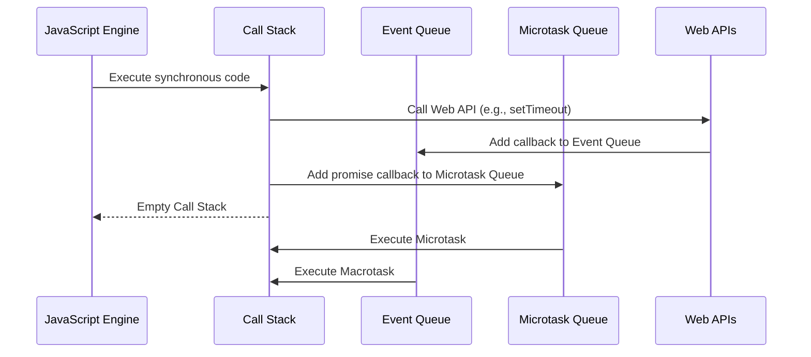

## 2.9 Event Loop and Concurrency Model

JavaScript's event loop and concurrency model are fundamental concepts that enable the language to handle asynchronous operations efficiently. Understanding these concepts is crucial for mastering modern web development and avoiding common pitfalls associated with asynchronous programming.

### JavaScript's Single-Threaded Execution Model

JavaScript is a single-threaded language, meaning it executes code in a single sequence, one operation at a time. This single-threaded nature can be both a strength and a limitation. While it simplifies the programming model by avoiding issues like race conditions and deadlocks, it also means that JavaScript must rely on asynchronous mechanisms to handle tasks that could block the main thread, such as network requests or file I/O.

### Components of the Event Loop

The event loop is the core mechanism that allows JavaScript to perform non-blocking operations despite being single-threaded. It consists of several key components:

- **Call Stack**: The call stack is where JavaScript keeps track of function calls. When a function is invoked, it is added to the top of the stack. Once the function completes, it is removed from the stack. If the stack is empty, the event loop can pick up tasks from the event queue.

- **Event Queue**: The event queue holds messages or tasks that are waiting to be processed. These tasks are typically callbacks from asynchronous operations like `setTimeout`, network requests, or DOM events.

- **Web APIs**: These are browser-provided APIs that handle tasks asynchronously. Examples include `setTimeout`, `fetch`, and DOM event listeners. When these APIs complete their tasks, they push their callbacks to the event queue.

- **Microtask Queue**: This queue holds tasks that need to be executed after the current operation completes but before the event loop continues with the next event in the event queue. Promises and `MutationObserver` callbacks are examples of microtasks.

- **Macrotask Queue**: This queue is for tasks that are scheduled to run after the current event loop cycle. Examples include `setTimeout`, `setInterval`, and I/O tasks.

### How Asynchronous Events Are Handled

The event loop continuously checks the call stack to see if it is empty. If it is, the event loop processes the first task in the event queue. This mechanism allows JavaScript to handle asynchronous events without blocking the main thread.

#### Example: `setTimeout`

```javascript
console.log('Start');

setTimeout(() => {
  console.log('Timeout');
}, 0);

console.log('End');
```

**Explanation**: In this example, "Start" and "End" are logged immediately because they are synchronous operations. The `setTimeout` function schedules its callback to be executed after the current stack is empty, placing it in the macrotask queue. Thus, "Timeout" is logged last.

### Promises and `async`/`await`

Promises and `async`/`await` provide a more elegant way to handle asynchronous operations. They rely on the microtask queue, which has a higher priority than the macrotask queue.

#### Example: Promises

```javascript
console.log('Start');

Promise.resolve().then(() => {
  console.log('Promise');
});

console.log('End');
```

**Explanation**: Here, "Start" and "End" are logged first. The `Promise` callback is added to the microtask queue and is executed before any macrotasks, so "Promise" is logged before any `setTimeout` callbacks.

#### Example: `async`/`await`

```javascript
async function asyncFunction() {
  console.log('Async Start');
  await Promise.resolve();
  console.log('Async End');
}

console.log('Start');
asyncFunction();
console.log('End');
```

**Explanation**: "Start" is logged first, followed by "Async Start". The `await` pauses the execution of `asyncFunction`, allowing "End" to be logged. After the promise resolves, "Async End" is logged.

### Microtasks vs. Macrotasks

Understanding the difference between microtasks and macrotasks is crucial for predicting the order of execution in JavaScript.

- **Microtasks**: These are executed immediately after the currently executing script and before any macrotasks. They include promise callbacks and `MutationObserver` callbacks.

- **Macrotasks**: These are executed after the microtask queue is empty. They include `setTimeout`, `setInterval`, and I/O callbacks.

#### Execution Order Example

```javascript
console.log('Start');

setTimeout(() => {
  console.log('Macrotask');
}, 0);

Promise.resolve().then(() => {
  console.log('Microtask');
});

console.log('End');
```

**Explanation**: The output will be "Start", "End", "Microtask", "Macrotask". The promise callback (microtask) is executed before the `setTimeout` callback (macrotask).

### Importance of Understanding the Event Loop

Grasping the event loop's mechanics is essential for writing efficient and bug-free asynchronous code. It helps developers avoid common pitfalls such as:

- **Callback Hell**: Deeply nested callbacks can lead to unreadable code. Promises and `async`/`await` can help flatten the structure.

- **Race Conditions**: Occur when the timing of asynchronous operations affects the program's behavior. Understanding the event loop can help prevent these issues.

- **Blocking the Event Loop**: Long-running operations can block the event loop, causing the UI to freeze. Offloading heavy computations to web workers can mitigate this.

### Visualizing the Event Loop

To better understand the event loop, let's visualize how JavaScript interacts with web browsers and web pages.



**Diagram Explanation**: This sequence diagram illustrates how JavaScript processes synchronous code, interacts with web APIs, and handles tasks in the event and microtask queues.

### Try It Yourself

Experiment with the examples provided by modifying the code. Try adding more `setTimeout` calls with different delays or chaining multiple promises to see how the execution order changes. This hands-on approach will deepen your understanding of the event loop.

### References and Further Reading

- [MDN Web Docs: Event Loop](https://developer.mozilla.org/en-US/docs/Web/JavaScript/EventLoop)
- [JavaScript Info: Event Loop](https://javascript.info/event-loop)

### Knowledge Check

Test your understanding of the event loop and concurrency model with the following quiz.

## Mastering JavaScript Event Loop and Concurrency Model Quiz



### What is the primary role of the event loop in JavaScript?

- [x] To manage asynchronous operations and ensure non-blocking execution
- [ ] To execute synchronous code faster
- [ ] To handle memory management
- [ ] To optimize network requests

> **Explanation:** The event loop manages asynchronous operations, allowing JavaScript to perform non-blocking execution despite being single-threaded.

### Which of the following is a microtask in JavaScript?

- [x] Promise callbacks
- [ ] setTimeout callbacks
- [ ] DOM events
- [ ] I/O operations

> **Explanation:** Promise callbacks are microtasks, which are executed before any macrotasks like `setTimeout`.

### What happens when the call stack is empty?

- [x] The event loop processes the next task in the event queue
- [ ] The JavaScript engine shuts down
- [ ] The browser refreshes the page
- [ ] The call stack is refilled with previous tasks

> **Explanation:** When the call stack is empty, the event loop processes the next task from the event queue.

### How does `async`/`await` improve asynchronous code readability?

- [x] By allowing asynchronous code to be written in a synchronous style
- [ ] By making all code run faster
- [ ] By eliminating the need for promises
- [ ] By automatically handling errors

> **Explanation:** `async`/`await` allows developers to write asynchronous code in a synchronous style, improving readability.

### In what order are tasks executed in JavaScript?

- [x] Synchronous code, microtasks, macrotasks
- [ ] Macrotasks, microtasks, synchronous code
- [ ] Microtasks, synchronous code, macrotasks
- [ ] Synchronous code, macrotasks, microtasks

> **Explanation:** JavaScript executes synchronous code first, followed by microtasks, and then macrotasks.

### What is a common pitfall when using `setTimeout`?

- [x] Assuming it executes immediately after the specified delay
- [ ] Using it for synchronous operations
- [ ] Expecting it to handle errors automatically
- [ ] Using it to manage memory

> **Explanation:** `setTimeout` does not execute immediately after the delay; it waits for the call stack to be empty.

### Which of the following can block the event loop?

- [x] Long-running synchronous operations
- [ ] Promise rejections
- [ ] setTimeout with zero delay
- [ ] DOM events

> **Explanation:** Long-running synchronous operations can block the event loop, causing the UI to freeze.

### What is the purpose of the microtask queue?

- [x] To execute tasks immediately after the current operation completes
- [ ] To store tasks for future execution
- [ ] To manage network requests
- [ ] To handle DOM events

> **Explanation:** The microtask queue executes tasks immediately after the current operation, before any macrotasks.

### How can you avoid callback hell?

- [x] By using promises or `async`/`await`
- [ ] By nesting more callbacks
- [ ] By using `setTimeout`
- [ ] By avoiding asynchronous code

> **Explanation:** Promises and `async`/`await` help avoid callback hell by flattening the structure of asynchronous code.

### True or False: JavaScript is a multi-threaded language.

- [ ] True
- [x] False

> **Explanation:** JavaScript is a single-threaded language, relying on the event loop to handle asynchronous operations.



Remember, understanding the event loop is just the beginning. As you progress, you'll build more complex and interactive web applications. Keep experimenting, stay curious, and enjoy the journey!
