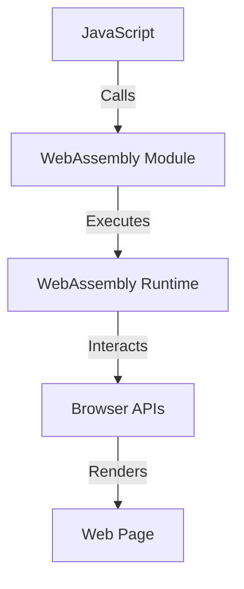

## 20.1 Introduction to WebAssembly (WASM)

WebAssembly (WASM) is a game-changer in the world of web development, offering a new way to run high-performance applications on the web. In this section, we will delve into what WebAssembly is, its purpose, and how it complements JavaScript. We will also explore its use cases and browser support, encouraging you to consider WebAssembly for computationally intensive tasks.

### What is WebAssembly?

WebAssembly is a low-level binary format that serves as a compilation target for high-level languages like C, C++, and Rust. It is designed to be a portable, efficient, and safe execution format for the web. WebAssembly enables developers to run code at near-native speed by taking advantage of common hardware capabilities available on a wide range of platforms.

#### Key Features of WebAssembly

- **Binary Format**: WebAssembly is a compact binary format that allows for fast download and execution times.
- **Portability**: It is designed to run on any platform that supports the WebAssembly runtime, making it highly portable.
- **Performance**: WebAssembly code runs at near-native speed, making it ideal for performance-critical applications.
- **Security**: WebAssembly is executed in a safe, sandboxed environment, ensuring that it cannot perform harmful operations on the host system.

### The Purpose of WebAssembly

The primary purpose of WebAssembly is to enable high-performance applications on the web. While JavaScript is a versatile and powerful language, it has limitations when it comes to performance, especially for computationally intensive tasks. WebAssembly addresses these limitations by providing a way to run code that is compiled from languages traditionally used for high-performance applications.

### Limitations of JavaScript for Performance-Critical Applications

JavaScript is a dynamic, interpreted language that is well-suited for a wide range of applications. However, it has some inherent limitations when it comes to performance:

- **Single-Threaded**: JavaScript runs in a single-threaded environment, which can be a bottleneck for CPU-intensive tasks.
- **Garbage Collection**: The automatic memory management in JavaScript can introduce latency and unpredictability in performance.
- **Dynamic Typing**: The dynamic nature of JavaScript can lead to slower execution compared to statically typed languages.

### How WebAssembly Complements JavaScript

WebAssembly is not a replacement for JavaScript but rather a complement to it. By using WebAssembly, developers can offload performance-critical parts of their applications to a more efficient execution environment while continuing to use JavaScript for the rest of the application. This allows developers to leverage the strengths of both technologies.

#### Example: Integrating WebAssembly with JavaScript

Let's look at a simple example of how WebAssembly can be integrated with JavaScript. Suppose we have a computationally intensive function written in C that we want to run in a web application.

```c
// example.c
int factorial(int n) {
    if (n <= 1) return 1;
    return n * factorial(n - 1);
}
```

We can compile this C code to WebAssembly using a tool like Emscripten:

```bash
emcc example.c -s WASM=1 -o example.js
```

This command generates a `example.wasm` file and a JavaScript file to load and interact with the WebAssembly module.

In our JavaScript code, we can then load and use the WebAssembly module:

```javascript
// example.js
fetch('example.wasm')
  .then(response => response.arrayBuffer())
  .then(bytes => WebAssembly.instantiate(bytes))
  .then(results => {
    const factorial = results.instance.exports.factorial;
    console.log(factorial(5)); // Outputs: 120
  });
```

### Use Cases Suitable for WebAssembly

WebAssembly is particularly well-suited for applications that require high performance and low latency. Some common use cases include:

- **Games**: High-performance games that require fast graphics rendering and complex physics calculations.
- **Image and Video Processing**: Applications that involve real-time image and video processing.
- **Scientific Simulations**: Complex simulations that require significant computational power.
- **Cryptography**: Implementing cryptographic algorithms that need to run efficiently and securely.

### Browser Support for WebAssembly

WebAssembly is supported by all major modern browsers, including Chrome, Firefox, Safari, and Edge. This widespread support ensures that WebAssembly applications can run on a wide range of devices and platforms.

#### Visualizing WebAssembly's Interaction with Browsers



*Figure: Interaction between JavaScript, WebAssembly, and the Browser.*

### Encouraging the Use of WebAssembly

As web applications continue to grow in complexity and demand more performance, WebAssembly provides a powerful tool for developers to meet these challenges. By considering WebAssembly for computationally intensive tasks, developers can create more responsive and efficient applications.

### Try It Yourself

To get started with WebAssembly, try compiling a simple C or C++ program to WebAssembly using Emscripten. Experiment with integrating the compiled WebAssembly module into a JavaScript application and observe the performance improvements.

### Knowledge Check

- What is WebAssembly, and what are its key features?
- How does WebAssembly complement JavaScript?
- What are some use cases suitable for WebAssembly?
- How is WebAssembly supported across modern browsers?

### Summary

WebAssembly is a powerful addition to the web development toolkit, enabling high-performance applications that were previously not feasible with JavaScript alone. By understanding how to leverage WebAssembly, developers can create more efficient and responsive web applications.

Remember, this is just the beginning. As you progress, you'll build more complex and interactive web applications using WebAssembly. Keep experimenting, stay curious, and enjoy the journey!

## WebAssembly and JavaScript Quiz



### What is WebAssembly?

- [x] A low-level binary format for high-performance web applications
- [ ] A new JavaScript framework
- [ ] A CSS preprocessor
- [ ] A database management system

> **Explanation:** WebAssembly is a low-level binary format designed for high-performance applications on the web.

### How does WebAssembly complement JavaScript?

- [x] By offloading performance-critical tasks to a more efficient execution environment
- [ ] By replacing JavaScript entirely
- [ ] By providing a new syntax for JavaScript
- [ ] By enhancing CSS capabilities

> **Explanation:** WebAssembly complements JavaScript by allowing developers to offload performance-critical tasks to a more efficient execution environment while using JavaScript for other parts of the application.

### Which of the following is a suitable use case for WebAssembly?

- [x] Real-time video processing
- [ ] Simple form validation
- [ ] Basic DOM manipulation
- [ ] Styling web pages

> **Explanation:** WebAssembly is suitable for performance-intensive tasks like real-time video processing.

### What is a limitation of JavaScript that WebAssembly addresses?

- [x] Single-threaded execution
- [ ] Lack of support for CSS
- [ ] Inability to create databases
- [ ] Lack of HTML rendering capabilities

> **Explanation:** JavaScript's single-threaded execution can be a bottleneck for performance-critical tasks, which WebAssembly addresses by providing a more efficient execution environment.

### Which browsers support WebAssembly?

- [x] Chrome
- [x] Firefox
- [x] Safari
- [x] Edge

> **Explanation:** WebAssembly is supported by all major modern browsers, including Chrome, Firefox, Safari, and Edge.

### What is the primary purpose of WebAssembly?

- [x] To enable high-performance applications on the web
- [ ] To replace HTML
- [ ] To create new web standards
- [ ] To manage databases

> **Explanation:** The primary purpose of WebAssembly is to enable high-performance applications on the web.

### What is a key feature of WebAssembly?

- [x] Portability
- [ ] Inability to run on mobile devices
- [ ] Lack of security
- [ ] Slow execution

> **Explanation:** WebAssembly is designed to be portable, allowing it to run on any platform that supports the WebAssembly runtime.

### How can WebAssembly be integrated with JavaScript?

- [x] By compiling high-performance code to WebAssembly and calling it from JavaScript
- [ ] By writing WebAssembly code directly in JavaScript files
- [ ] By using WebAssembly as a CSS preprocessor
- [ ] By replacing JavaScript with WebAssembly entirely

> **Explanation:** WebAssembly can be integrated with JavaScript by compiling high-performance code to WebAssembly and calling it from JavaScript.

### What is a benefit of using WebAssembly?

- [x] Near-native execution speed
- [ ] Increased file size
- [ ] Reduced security
- [ ] Slower performance

> **Explanation:** WebAssembly provides near-native execution speed, making it ideal for performance-critical applications.

### True or False: WebAssembly is a replacement for JavaScript.

- [ ] True
- [x] False

> **Explanation:** WebAssembly is not a replacement for JavaScript; it is a complement that allows developers to offload performance-critical tasks to a more efficient execution environment.




