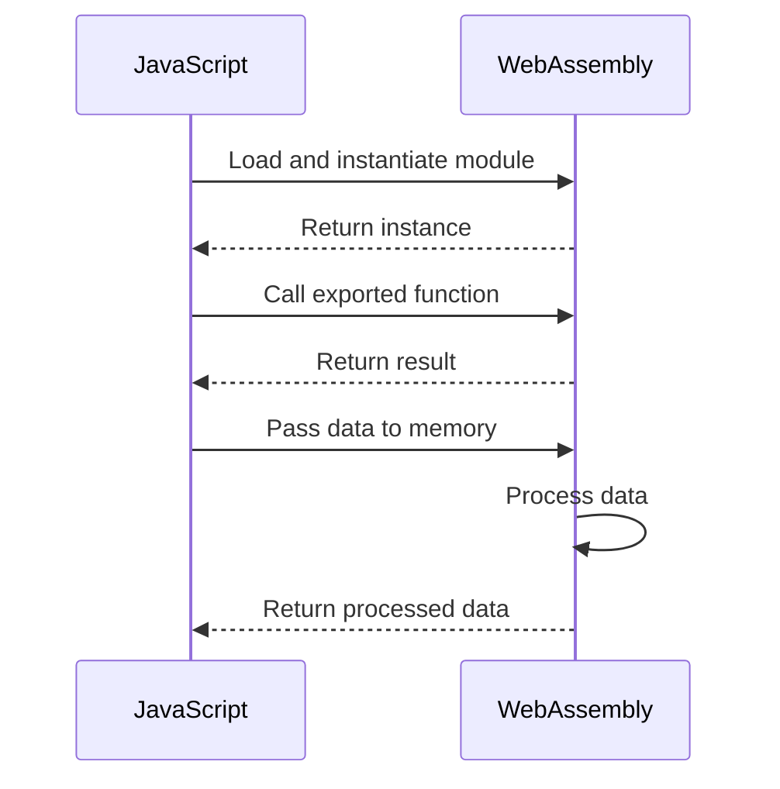

## 20.2 Interacting Between JavaScript and WASM

WebAssembly (WASM) is a powerful technology that allows developers to run high-performance code on the web. It is designed to complement JavaScript, enabling developers to leverage the strengths of both languages. In this section, we will explore how JavaScript interacts with WebAssembly, including loading modules, calling functions, and sharing data efficiently.

### Understanding WebAssembly and JavaScript Interaction

WebAssembly is a binary instruction format that allows code written in languages like C, C++, and Rust to run on the web at near-native speed. JavaScript, being the most widely used language for web development, serves as the glue that binds WebAssembly modules to web applications. This interaction is facilitated through a set of JavaScript APIs that allow developers to load, instantiate, and communicate with WebAssembly modules.

### Loading and Instantiating WebAssembly Modules

To interact with WebAssembly from JavaScript, the first step is to load and instantiate a WebAssembly module. This process involves fetching the WebAssembly binary, compiling it, and then instantiating it to create an instance that can be used to call functions and share data.

#### Loading a WebAssembly Module

The `WebAssembly` JavaScript API provides a straightforward way to load and compile WebAssembly modules. The `WebAssembly.instantiateStreaming()` function is commonly used for this purpose, as it allows for efficient streaming compilation.

```javascript
// Fetch and instantiate a WebAssembly module
async function loadWasmModule(url) {
    const response = await fetch(url);
    const wasmModule = await WebAssembly.instantiateStreaming(response);
    return wasmModule.instance;
}

// Usage
loadWasmModule('module.wasm').then(instance => {
    console.log('WebAssembly module loaded:', instance);
});
```

In this example, we use `fetch()` to retrieve the WebAssembly binary from a URL. The `WebAssembly.instantiateStreaming()` function then compiles and instantiates the module in one step, returning a promise that resolves to a `WebAssembly.Instance` object.

#### Instantiating a WebAssembly Module

If you have the WebAssembly binary data available, you can use the `WebAssembly.instantiate()` function to compile and instantiate the module.

```javascript
// Compile and instantiate a WebAssembly module from binary data
async function instantiateWasm(binary) {
    const wasmModule = await WebAssembly.instantiate(binary);
    return wasmModule.instance;
}

// Usage with binary data
const binaryData = new Uint8Array([...]); // WebAssembly binary data
instantiateWasm(binaryData).then(instance => {
    console.log('WebAssembly module instantiated:', instance);
});
```

### Calling WebAssembly Functions from JavaScript

Once a WebAssembly module is instantiated, you can call its exported functions from JavaScript. These functions are accessible through the `exports` property of the `WebAssembly.Instance` object.

#### Example: Calling a WebAssembly Function

Consider a simple WebAssembly module that exports a function to add two numbers:

```wasm
(module
  (func $add (param $a i32) (param $b i32) (result i32)
    local.get $a
    local.get $b
    i32.add)
  (export "add" (func $add)))
```

To call this function from JavaScript, you can use the following code:

```javascript
// Load and call a WebAssembly function
async function callWasmFunction(url) {
    const instance = await loadWasmModule(url);
    const result = instance.exports.add(5, 3);
    console.log('Result of add function:', result);
}

// Usage
callWasmFunction('add.wasm');
```

In this example, the `add` function is called with two arguments, and the result is logged to the console.

### Passing Data Between JavaScript and WebAssembly

Passing data between JavaScript and WebAssembly involves understanding how data types are represented in both environments. WebAssembly supports basic data types like integers and floats, but more complex data structures require careful handling.

#### Handling Primitive Data Types

Primitive data types like integers and floats can be passed directly between JavaScript and WebAssembly. However, it's important to note that WebAssembly uses a different memory model, which can affect how data is accessed and modified.

```javascript
// Example of passing primitive data types
const result = instance.exports.add(10, 20);
console.log('Result:', result); // Outputs: 30
```

#### Working with Memory and Data Types

WebAssembly modules have their own linear memory, which is a contiguous block of memory that can be accessed by both WebAssembly and JavaScript. To share more complex data structures, you need to allocate memory in the WebAssembly module and use it to store data.

##### Example: Passing an Array

To pass an array from JavaScript to WebAssembly, you can write the array data into the WebAssembly module's memory and then access it from a WebAssembly function.

```javascript
// Allocate memory and pass an array to WebAssembly
function passArrayToWasm(instance, array) {
    const memory = new Uint32Array(instance.exports.memory.buffer);
    memory.set(array, 0); // Write array data to memory starting at index 0
    const sum = instance.exports.sumArray(array.length);
    console.log('Sum of array:', sum);
}

// WebAssembly module with a function to sum an array
(module
  (memory (export "memory") 1)
  (func $sumArray (param $length i32) (result i32)
    (local $sum i32)
    (local $i i32)
    (loop $loop
      (br_if $loop (i32.ge_u (local.get $i) (local.get $length)))
      (local.set $sum (i32.add (local.get $sum) (i32.load (local.get $i))))
      (local.set $i (i32.add (local.get $i) (i32.const 1)))
    )
    (local.get $sum))
  (export "sumArray" (func $sumArray)))
```

In this example, we allocate memory for the array and use the `set()` method to write the array data to the WebAssembly module's memory. The `sumArray` function then reads the data from memory and calculates the sum.

### Tools for Rust and WebAssembly Integration

When working with Rust and WebAssembly, tools like [wasm-bindgen](https://github.com/rustwasm/wasm-bindgen) can simplify the process of integrating Rust code with JavaScript. `wasm-bindgen` provides a bridge between Rust and JavaScript, allowing you to call Rust functions from JavaScript and vice versa.

#### Using wasm-bindgen

To use `wasm-bindgen`, you need to add it as a dependency in your Rust project and use it to generate bindings for your WebAssembly module.

```rust
// Rust function to add two numbers
#[wasm_bindgen]
pub fn add(a: i32, b: i32) -> i32 {
    a + b
}
```

After compiling the Rust code to WebAssembly, you can use the generated bindings in JavaScript:

```javascript
// Import the wasm-bindgen generated module
import * as wasm from './my_module_bg.wasm';

// Call the Rust function from JavaScript
const result = wasm.add(10, 20);
console.log('Result from Rust:', result);
```

`wasm-bindgen` handles the conversion of data types and memory management, making it easier to work with complex data structures.

### Best Practices for Efficient Communication

Efficient communication between JavaScript and WebAssembly is crucial for minimizing overhead and maximizing performance. Here are some best practices to consider:

- **Minimize Data Transfers**: Reduce the amount of data transferred between JavaScript and WebAssembly by processing data within the WebAssembly module whenever possible.
- **Use Shared Memory Wisely**: Take advantage of WebAssembly's linear memory to share data efficiently. Allocate memory in the WebAssembly module and use it to store data that needs to be accessed by both environments.
- **Optimize Function Calls**: Limit the number of function calls between JavaScript and WebAssembly, as each call incurs overhead. Batch operations and process data in bulk to reduce the number of calls.
- **Leverage Tools and Libraries**: Use tools like `wasm-bindgen` to simplify integration and handle data type conversions automatically.

### Visualizing JavaScript and WebAssembly Interaction

To better understand the interaction between JavaScript and WebAssembly, let's visualize the process using a sequence diagram.



This diagram illustrates the typical flow of interaction between JavaScript and WebAssembly, including loading the module, calling functions, and sharing data.

### Knowledge Check

To reinforce your understanding of JavaScript and WebAssembly interaction, consider the following questions:

1. What is the purpose of the `WebAssembly.instantiateStreaming()` function?
2. How can you pass an array from JavaScript to a WebAssembly module?
3. What are some best practices for efficient communication between JavaScript and WebAssembly?
4. How does `wasm-bindgen` simplify Rust and WebAssembly integration?

### Exercises

1. Modify the example code to pass a string from JavaScript to WebAssembly and process it in a WebAssembly function.
2. Experiment with different data types and observe how they are handled when passed between JavaScript and WebAssembly.
3. Use `wasm-bindgen` to create a WebAssembly module that exports a function to calculate the factorial of a number. Call this function from JavaScript and display the result.

### Summary

In this section, we explored how JavaScript interacts with WebAssembly, including loading modules, calling functions, and sharing data. We discussed the use of tools like `wasm-bindgen` for Rust and WebAssembly integration and highlighted best practices for efficient communication. Remember, this is just the beginning. As you progress, you'll build more complex and interactive web applications. Keep experimenting, stay curious, and enjoy the journey!

## Quiz: Mastering JavaScript and WebAssembly Interaction



### What is the primary purpose of WebAssembly in web development?

- [x] To run high-performance code on the web
- [ ] To replace JavaScript entirely
- [ ] To create web pages
- [ ] To manage databases

> **Explanation:** WebAssembly is designed to run high-performance code on the web, complementing JavaScript.

### Which JavaScript API is commonly used to load and compile WebAssembly modules?

- [x] WebAssembly.instantiateStreaming()
- [ ] WebAssembly.compile()
- [ ] WebAssembly.load()
- [ ] WebAssembly.fetch()

> **Explanation:** `WebAssembly.instantiateStreaming()` is used to efficiently load and compile WebAssembly modules.

### How can you pass an array from JavaScript to a WebAssembly module?

- [x] By writing the array data into the WebAssembly module's memory
- [ ] By converting the array to a string
- [ ] By using JSON.stringify()
- [ ] By using localStorage

> **Explanation:** You can pass an array by writing its data into the WebAssembly module's memory.

### What is wasm-bindgen used for?

- [x] To simplify Rust and WebAssembly integration
- [ ] To compile JavaScript to WebAssembly
- [ ] To debug WebAssembly modules
- [ ] To create WebAssembly binaries

> **Explanation:** `wasm-bindgen` simplifies the integration of Rust code with JavaScript and WebAssembly.

### Which of the following is a best practice for efficient communication between JavaScript and WebAssembly?

- [x] Minimize data transfers
- [ ] Use JSON for all data
- [ ] Avoid using WebAssembly memory
- [ ] Call functions frequently

> **Explanation:** Minimizing data transfers helps reduce overhead and improve performance.

### What is the role of WebAssembly's linear memory?

- [x] To provide a contiguous block of memory accessible by both WebAssembly and JavaScript
- [ ] To store JavaScript variables
- [ ] To compile WebAssembly modules
- [ ] To manage browser cookies

> **Explanation:** WebAssembly's linear memory is a contiguous block of memory accessible by both WebAssembly and JavaScript.

### How can you optimize function calls between JavaScript and WebAssembly?

- [x] Limit the number of calls and batch operations
- [ ] Use JSON.stringify() for all data
- [ ] Call functions in a loop
- [ ] Avoid using WebAssembly functions

> **Explanation:** Limiting the number of calls and batching operations helps reduce overhead.

### What is the benefit of using WebAssembly for web applications?

- [x] Near-native performance for computational tasks
- [ ] Simplified HTML structure
- [ ] Easier CSS styling
- [ ] Enhanced browser compatibility

> **Explanation:** WebAssembly provides near-native performance for computational tasks, enhancing web applications.

### True or False: WebAssembly can only be used with JavaScript.

- [x] False
- [ ] True

> **Explanation:** WebAssembly can be used with other languages like Rust, C, and C++.

### Which tool can help with debugging WebAssembly modules?

- [x] Chrome DevTools
- [ ] JSON.stringify()
- [ ] localStorage
- [ ] WebAssembly.fetch()

> **Explanation:** Chrome DevTools provides tools for debugging WebAssembly modules.



Remember, mastering the interaction between JavaScript and WebAssembly is a powerful skill that can significantly enhance the performance and capabilities of your web applications. Keep exploring and experimenting with these technologies to unlock their full potential.
