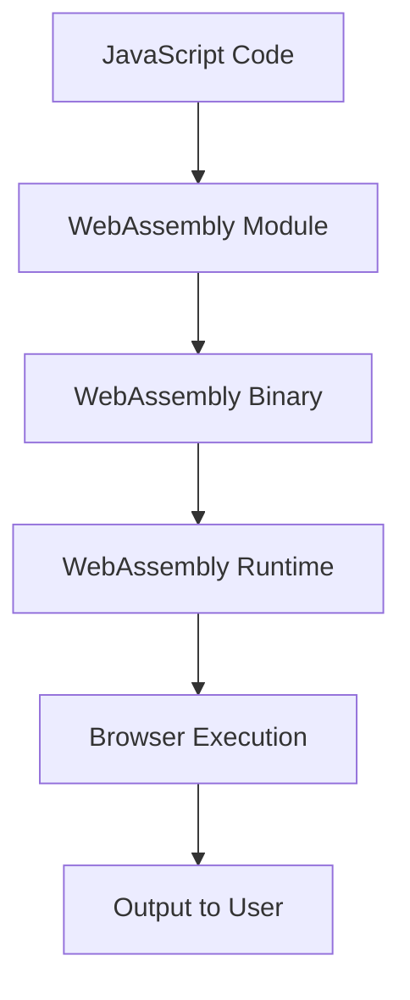

## 20.3 Performance Benefits and Use Cases

WebAssembly (Wasm) has emerged as a powerful tool for enhancing the performance of web applications. By allowing code written in languages like C, C++, and Rust to run in the browser with near-native speed, WebAssembly opens up new possibilities for web development. In this section, we'll explore how WebAssembly achieves its performance benefits, compare it with JavaScript through benchmarking, and examine various use cases where its application is particularly advantageous.

### Understanding WebAssembly's Performance

WebAssembly is designed to be a portable, low-level bytecode that can be executed by web browsers. It achieves near-native performance through several key mechanisms:

1. **Binary Format**: WebAssembly uses a compact binary format that is faster to download and parse than JavaScript's text-based format. This reduces the time it takes for code to be ready for execution.

2. **Ahead-of-Time Compilation**: Unlike JavaScript, which is typically interpreted or just-in-time (JIT) compiled, WebAssembly can be compiled ahead of time (AOT). This means that the code is optimized and ready to run as soon as it is loaded.

3. **Efficient Memory Management**: WebAssembly provides a linear memory model that allows for efficient memory allocation and access. This is particularly beneficial for applications that require intensive data processing.

4. **Sandboxed Execution**: WebAssembly runs in a secure, sandboxed environment, which ensures that it cannot access the host system's resources directly. This makes it safe to execute potentially untrusted code at high speeds.

### Benchmarking WebAssembly vs. JavaScript

To understand the performance benefits of WebAssembly, let's look at some benchmarking results comparing it to JavaScript. These benchmarks typically focus on computationally intensive tasks, where WebAssembly's strengths are most apparent.

#### Example Benchmark: Matrix Multiplication

Consider a benchmark that involves multiplying two large matrices. This task is computationally intensive and benefits from efficient execution.

```javascript
// JavaScript implementation of matrix multiplication
function multiplyMatricesJS(a, b) {
    const result = [];
    for (let i = 0; i < a.length; i++) {
        result[i] = [];
        for (let j = 0; j < b[0].length; j++) {
            let sum = 0;
            for (let k = 0; k < a[0].length; k++) {
                sum += a[i][k] * b[k][j];
            }
            result[i][j] = sum;
        }
    }
    return result;
}
```

```wasm
;; WebAssembly implementation of matrix multiplication (pseudo-code)
(module
  (func $multiplyMatricesWasm (param $a i32) (param $b i32) (result i32)
    ;; WebAssembly code for matrix multiplication
  )
  (export "multiplyMatricesWasm" (func $multiplyMatricesWasm))
)
```

In this benchmark, WebAssembly typically outperforms JavaScript by a significant margin, especially as the size of the matrices increases. This is due to WebAssembly's efficient execution model and its ability to leverage hardware optimizations.

### Use Cases for WebAssembly

WebAssembly is particularly beneficial in scenarios that require high performance and computational efficiency. Let's explore some of these use cases:

#### Gaming and Interactive Graphics

WebAssembly is a game-changer for web-based gaming and interactive graphics. It allows developers to bring complex 3D games and graphics-intensive applications to the web without sacrificing performance.

- **Example**: The popular game engine Unity has adopted WebAssembly to enable developers to deploy high-performance games directly in the browser. This eliminates the need for plugins and provides a seamless gaming experience.

- **Case Study**: [Unity WebGL](https://unity.com/features/webgl) showcases how WebAssembly can be used to run complex games in the browser, offering near-native performance and broad compatibility.

#### Video and Audio Processing

WebAssembly excels in tasks that involve processing large amounts of data, such as video and audio processing. By leveraging WebAssembly, developers can implement codecs and processing algorithms that run efficiently in the browser.

- **Example**: The [FFmpeg](https://ffmpeg.org/) library, a popular tool for handling multimedia data, has been compiled to WebAssembly. This allows developers to perform video and audio encoding, decoding, and processing directly in the browser.

- **Case Study**: [FFmpeg.wasm](https://github.com/ffmpegwasm/ffmpeg.wasm) demonstrates how WebAssembly can be used to bring powerful multimedia processing capabilities to web applications.

#### Scientific Simulations

Scientific simulations often require significant computational resources. WebAssembly enables these simulations to run efficiently in the browser, making it easier to share and collaborate on scientific research.

- **Example**: WebAssembly can be used to run complex simulations in fields such as physics, chemistry, and biology. By compiling existing simulation software to WebAssembly, researchers can make their tools accessible to a wider audience.

- **Case Study**: The [Open Chemistry](https://openchemistry.org/) project uses WebAssembly to provide web-based tools for molecular visualization and analysis, enabling researchers to perform simulations directly in their browsers.

#### Cryptographic Computations

Cryptographic operations are computationally intensive and require high performance to ensure security and efficiency. WebAssembly is well-suited for implementing cryptographic algorithms in the browser.

- **Example**: Libraries like [libsodium](https://libsodium.org/) have been compiled to WebAssembly, allowing developers to perform secure cryptographic operations in web applications.

- **Case Study**: [Sodium Native](https://github.com/sodium-friends/sodium-native) provides a WebAssembly-based implementation of the libsodium library, enabling secure and efficient cryptographic computations in the browser.

### Considerations for WebAssembly

While WebAssembly offers significant performance benefits, it may not always be necessary or appropriate for every application. Here are some considerations to keep in mind:

- **Complexity**: WebAssembly requires a different development approach compared to JavaScript. Developers need to be familiar with languages like C, C++, or Rust to write WebAssembly modules.

- **Use Case Suitability**: WebAssembly is most beneficial for computationally intensive tasks. For simpler applications, the overhead of using WebAssembly may not be justified.

- **Interoperability**: While WebAssembly can interoperate with JavaScript, there may be performance overhead when switching between the two. It's important to design applications to minimize these transitions.

- **Browser Support**: WebAssembly is supported by all major browsers, but it's important to ensure compatibility with the specific features and APIs used in your application.

### Conclusion

WebAssembly is a powerful tool for enhancing the performance of web applications. By enabling near-native execution of code in the browser, it opens up new possibilities for gaming, multimedia processing, scientific simulations, and cryptographic computations. However, it's important to carefully consider the use case and development complexity before adopting WebAssembly. As you explore the potential of WebAssembly, remember that this is just the beginning. Keep experimenting, stay curious, and enjoy the journey!

### Try It Yourself

To get hands-on experience with WebAssembly, try compiling a simple C or C++ program to WebAssembly using tools like [Emscripten](https://emscripten.org/). Experiment with different optimization levels and observe the performance differences in the browser.

### Visualizing WebAssembly's Interaction with JavaScript



**Diagram Description**: This diagram illustrates the interaction between JavaScript and WebAssembly. JavaScript code interacts with a WebAssembly module, which is compiled into a binary format. The WebAssembly runtime executes this binary, and the output is presented to the user through the browser.

### Knowledge Check

## WebAssembly Performance and Use Cases Quiz



### What is one of the key mechanisms by which WebAssembly achieves near-native performance?

- [x] Ahead-of-Time Compilation
- [ ] Just-In-Time Compilation
- [ ] Text-Based Format
- [ ] Direct System Access

> **Explanation:** WebAssembly achieves near-native performance through Ahead-of-Time Compilation, which allows code to be optimized and ready for execution as soon as it is loaded.

### Which of the following is a use case where WebAssembly is particularly beneficial?

- [x] Gaming and Interactive Graphics
- [ ] Simple Form Validation
- [ ] Basic DOM Manipulation
- [ ] Static Website Rendering

> **Explanation:** WebAssembly is particularly beneficial for gaming and interactive graphics due to its ability to handle complex computations efficiently.

### What is a potential drawback of using WebAssembly?

- [x] Development Complexity
- [ ] Lack of Browser Support
- [ ] Inability to Interoperate with JavaScript
- [ ] Poor Performance

> **Explanation:** WebAssembly requires a different development approach and familiarity with languages like C, C++, or Rust, which can add complexity to the development process.

### Which library has been compiled to WebAssembly for multimedia processing?

- [x] FFmpeg
- [ ] jQuery
- [ ] Lodash
- [ ] Bootstrap

> **Explanation:** FFmpeg, a popular tool for handling multimedia data, has been compiled to WebAssembly, allowing for video and audio processing in the browser.

### What is a consideration when deciding whether to use WebAssembly?

- [x] Use Case Suitability
- [ ] Lack of JavaScript Support
- [ ] Limited Browser Compatibility
- [ ] Inability to Handle Large Data

> **Explanation:** It's important to consider whether the use case is suitable for WebAssembly, as it is most beneficial for computationally intensive tasks.

### Which of the following is a case study of WebAssembly adoption in gaming?

- [x] Unity WebGL
- [ ] React Native
- [ ] AngularJS
- [ ] Vue.js

> **Explanation:** Unity WebGL is a case study of WebAssembly adoption in gaming, showcasing how complex games can be run in the browser with near-native performance.

### What is the primary format used by WebAssembly for code?

- [x] Binary Format
- [ ] Text-Based Format
- [ ] XML Format
- [ ] JSON Format

> **Explanation:** WebAssembly uses a binary format, which is compact and faster to download and parse than text-based formats.

### Which of the following is NOT a benefit of WebAssembly?

- [ ] Efficient Memory Management
- [ ] Sandboxed Execution
- [x] Direct System Access
- [ ] Near-Native Performance

> **Explanation:** WebAssembly does not allow direct system access; it runs in a secure, sandboxed environment to ensure safety.

### What is a key advantage of WebAssembly in scientific simulations?

- [x] High Computational Efficiency
- [ ] Simplified Code Structure
- [ ] Reduced Development Time
- [ ] Enhanced Visual Design

> **Explanation:** WebAssembly provides high computational efficiency, making it ideal for running complex scientific simulations in the browser.

### True or False: WebAssembly can only be used with JavaScript.

- [ ] True
- [x] False

> **Explanation:** False. WebAssembly can be used with other languages like C, C++, and Rust, which can be compiled to WebAssembly for execution in the browser.


