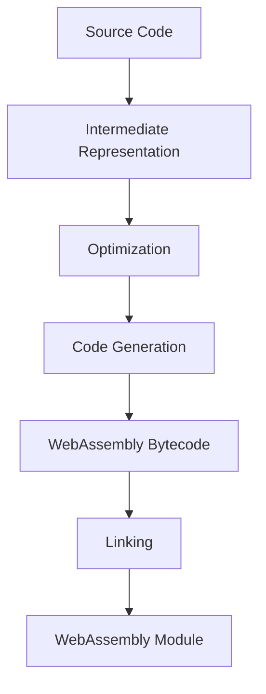

## 20.4 Compiling Other Languages to WASM

WebAssembly (WASM) is a powerful technology that allows developers to run code written in multiple languages on the web. By compiling languages like C, C++, and Rust to WebAssembly, developers can leverage existing codebases and libraries, enhancing the capabilities of web applications. This section will guide you through the process of compiling these languages to WebAssembly, introduce essential tools and compilers, and discuss the challenges and opportunities this technology presents.

### Understanding the Compilation Process

The process of compiling high-level languages to WebAssembly involves several steps. At a high level, the source code is transformed into an intermediate representation, optimized, and then converted into WebAssembly bytecode. This bytecode can be executed in the browser, providing near-native performance.

#### Key Steps in the Compilation Process

1. **Source Code Analysis**: The compiler analyzes the source code to understand its structure and semantics.
2. **Intermediate Representation (IR)**: The code is translated into an intermediate representation, which is a lower-level, platform-independent code.
3. **Optimization**: The IR is optimized to improve performance and reduce size.
4. **Code Generation**: The optimized IR is converted into WebAssembly bytecode.
5. **Linking**: The bytecode is linked with other modules and libraries to create a complete WebAssembly module.

### Tools and Compilers

Several tools and compilers facilitate the compilation of different languages to WebAssembly. Let's explore some of the most popular ones:

#### Emscripten for C and C++

[Emscripten](https://emscripten.org/) is a powerful toolchain for compiling C and C++ code to WebAssembly. It leverages the LLVM compiler infrastructure to generate highly optimized WebAssembly modules. Emscripten also provides a comprehensive runtime environment, including support for standard libraries and system calls.

**Example: Compiling C Code with Emscripten**

```bash
# Install Emscripten
git clone https://github.com/emscripten-core/emsdk.git
cd emsdk
./emsdk install latest
./emsdk activate latest
source ./emsdk_env.sh

# Compile C code to WebAssembly
emcc hello.c -o hello.html
```

In this example, `hello.c` is a simple C program. The `emcc` command compiles it to WebAssembly, generating an HTML file (`hello.html`) that can be opened in a browser.

#### Rust and WebAssembly

Rust is a systems programming language known for its safety and performance. The Rust and WebAssembly ecosystem provides tools and libraries to compile Rust code to WebAssembly efficiently.

**Example: Compiling Rust Code to WebAssembly**

```bash
# Install Rust and the wasm32 target
curl --proto '=https' --tlsv1.2 -sSf https://sh.rustup.rs | sh
rustup target add wasm32-unknown-unknown

# Create a new Rust project
cargo new hello-wasm
cd hello-wasm

# Compile Rust code to WebAssembly
cargo build --target wasm32-unknown-unknown
```

This example demonstrates how to set up a Rust project and compile it to WebAssembly using the `wasm32-unknown-unknown` target.

#### AssemblyScript for TypeScript-like Syntax

[AssemblyScript](https://www.assemblyscript.org/) is a TypeScript-like language that compiles to WebAssembly. It is designed to be familiar to JavaScript and TypeScript developers, making it an excellent choice for those looking to leverage WebAssembly without learning a new language.

**Example: Compiling AssemblyScript Code**

```bash
# Install AssemblyScript
npm install -g assemblyscript

# Create a new AssemblyScript project
npx asinit .

# Compile AssemblyScript code to WebAssembly
npm run asbuild
```

This example shows how to set up an AssemblyScript project and compile it to WebAssembly using the `asbuild` script.

### Challenges in Compiling to WebAssembly

While compiling other languages to WebAssembly offers many benefits, it also presents several challenges:

#### Memory Management

WebAssembly operates in a linear memory model, which can be challenging for languages with complex memory management requirements. Developers must carefully manage memory allocation and deallocation to avoid issues such as memory leaks and buffer overflows.

#### Debugging

Debugging WebAssembly code can be more complex than traditional web development. Tools like [WebAssembly Studio](https://webassembly.studio/) and browser developer tools provide some support, but the debugging experience is not as mature as for JavaScript.

#### Integration with JavaScript

Integrating WebAssembly modules with JavaScript requires careful consideration of data types and memory management. Developers must use JavaScript APIs to interact with WebAssembly modules, which can introduce complexity.

### Leveraging Mature Libraries

One of the significant advantages of compiling other languages to WebAssembly is the ability to leverage mature libraries from other ecosystems. This can significantly reduce development time and effort, as developers can reuse existing code and libraries.

For example, developers can compile C++ libraries for image processing or machine learning to WebAssembly and use them in web applications. This enables web developers to access powerful functionality that would otherwise be challenging to implement in JavaScript alone.

### Try It Yourself

To get hands-on experience with compiling other languages to WebAssembly, try modifying the code examples provided. Experiment with different languages and tools to see how they work together. Consider creating a small web application that uses a WebAssembly module compiled from another language.

### Visualizing the Compilation Process

To better understand the compilation process, let's visualize it using a flowchart:



This flowchart illustrates the steps involved in compiling high-level languages to WebAssembly, from source code to the final WebAssembly module.

### Further Reading and Resources

- [Emscripten Documentation](https://emscripten.org/docs/)
- [Rust and WebAssembly Book](https://rustwasm.github.io/book/)
- [AssemblyScript Documentation](https://www.assemblyscript.org/docs/)
- [WebAssembly Studio](https://webassembly.studio/)

### Knowledge Check

To reinforce your understanding of compiling other languages to WebAssembly, consider the following questions and challenges:

1. What are the key steps in the compilation process from high-level languages to WebAssembly?
2. How does Emscripten facilitate the compilation of C and C++ code to WebAssembly?
3. What are some challenges developers face when compiling to WebAssembly?
4. How can developers leverage mature libraries from other ecosystems using WebAssembly?
5. Try compiling a simple C++ program to WebAssembly using Emscripten. What challenges did you encounter?

### Embrace the Journey

Compiling other languages to WebAssembly opens up new possibilities for web development. By leveraging existing codebases and libraries, developers can create more powerful and efficient web applications. Remember, this is just the beginning. As you progress, you'll discover new ways to integrate WebAssembly into your projects. Keep experimenting, stay curious, and enjoy the journey!

## Quiz: Mastering WebAssembly Compilation



### What is the primary benefit of compiling other languages to WebAssembly?

- [x] Reusing existing codebases and libraries
- [ ] Improving JavaScript performance
- [ ] Simplifying web development
- [ ] Reducing server load

> **Explanation:** Compiling other languages to WebAssembly allows developers to reuse existing codebases and libraries, enhancing web applications' capabilities.

### Which tool is commonly used to compile C and C++ code to WebAssembly?

- [x] Emscripten
- [ ] Babel
- [ ] TypeScript
- [ ] Node.js

> **Explanation:** Emscripten is a toolchain specifically designed for compiling C and C++ code to WebAssembly.

### What is a challenge associated with compiling to WebAssembly?

- [x] Memory management
- [ ] Lack of browser support
- [ ] High latency
- [ ] Limited functionality

> **Explanation:** Memory management is a challenge when compiling to WebAssembly due to its linear memory model.

### Which language is known for its safety and performance and can be compiled to WebAssembly?

- [x] Rust
- [ ] Python
- [ ] Java
- [ ] PHP

> **Explanation:** Rust is a systems programming language known for its safety and performance, and it can be compiled to WebAssembly.

### What is the role of the intermediate representation in the compilation process?

- [x] It is a lower-level, platform-independent code
- [ ] It is the final output of the compilation
- [ ] It is used for debugging purposes
- [ ] It is a graphical representation of the code

> **Explanation:** The intermediate representation is a lower-level, platform-independent code used in the compilation process.

### Which tool provides a TypeScript-like syntax for compiling to WebAssembly?

- [x] AssemblyScript
- [ ] TypeScript
- [ ] Babel
- [ ] Webpack

> **Explanation:** AssemblyScript provides a TypeScript-like syntax for compiling to WebAssembly.

### What is a significant advantage of using WebAssembly in web applications?

- [x] Access to mature libraries from other ecosystems
- [ ] Simplified code structure
- [ ] Reduced development time
- [ ] Enhanced user interface

> **Explanation:** WebAssembly allows developers to access mature libraries from other ecosystems, enhancing web applications' capabilities.

### What is the purpose of the linking step in the compilation process?

- [x] To create a complete WebAssembly module
- [ ] To optimize the code
- [ ] To generate intermediate representation
- [ ] To analyze the source code

> **Explanation:** The linking step creates a complete WebAssembly module by combining bytecode with other modules and libraries.

### Which of the following is a tool for debugging WebAssembly code?

- [x] WebAssembly Studio
- [ ] Visual Studio Code
- [ ] Eclipse
- [ ] IntelliJ IDEA

> **Explanation:** WebAssembly Studio is a tool that provides support for debugging WebAssembly code.

### True or False: WebAssembly bytecode can be executed directly in the browser.

- [x] True
- [ ] False

> **Explanation:** WebAssembly bytecode can be executed directly in the browser, providing near-native performance.


