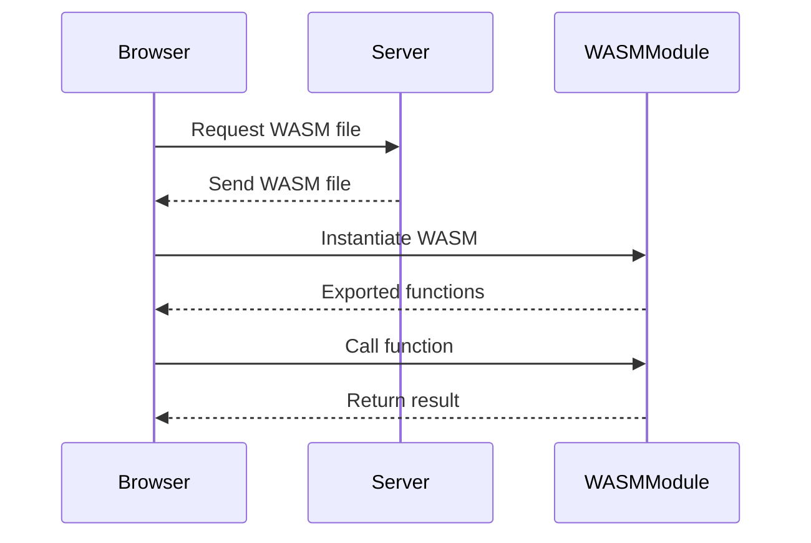

## 20.5 Integrating WASM into Web Applications

WebAssembly (WASM) is a powerful technology that allows developers to run high-performance code on the web. By integrating WASM into web applications, developers can leverage the speed and efficiency of compiled languages like C, C++, and Rust, while maintaining the flexibility and accessibility of JavaScript. This guide will walk you through the process of integrating WASM into your web applications, covering best practices, tools, and techniques for seamless integration.

### Understanding WebAssembly

WebAssembly is a binary instruction format designed to be a portable target for the compilation of high-level languages. It enables high-performance applications on the web, providing a way to run code written in languages other than JavaScript. WASM is supported by all major browsers, making it a viable option for enhancing web applications.

### Loading WebAssembly Modules

To integrate WASM into a web application, you first need to load the WebAssembly module. This can be done using the `fetch` API and the `WebAssembly.instantiate` method. Here's a basic example:

```javascript
// Fetch the WebAssembly module
fetch('module.wasm')
  .then(response => response.arrayBuffer())
  .then(bytes => WebAssembly.instantiate(bytes))
  .then(results => {
    const instance = results.instance;
    // Use the exported functions from the WASM module
    console.log(instance.exports.add(2, 3)); // Example function call
  })
  .catch(console.error);
```

In this example, we use `fetch` to retrieve the WASM binary, convert it to an `ArrayBuffer`, and then instantiate it using `WebAssembly.instantiate`. The instantiated module provides access to the exported functions, which can be called just like regular JavaScript functions.

### Asynchronous Loading and Initialization

Loading WASM modules is inherently asynchronous due to the use of `fetch`. It's important to handle this asynchronous nature properly to ensure that your application remains responsive. You can use `async/await` syntax to make the code cleaner and more readable:

```javascript
async function loadWasmModule(url) {
  try {
    const response = await fetch(url);
    const bytes = await response.arrayBuffer();
    const results = await WebAssembly.instantiate(bytes);
    return results.instance;
  } catch (error) {
    console.error('Error loading WASM module:', error);
  }
}

(async () => {
  const wasmInstance = await loadWasmModule('module.wasm');
  if (wasmInstance) {
    console.log(wasmInstance.exports.add(2, 3));
  }
})();
```

This approach makes it easier to manage the asynchronous loading process and handle any errors that may occur.

### Bundling and Deploying WebAssembly Modules

When deploying a web application that uses WASM, it's important to bundle and deploy the WASM files efficiently. Tools like Webpack can be used to automate this process. Webpack can handle the compilation and bundling of WASM modules, ensuring that they are included in your build process.

To use Webpack with WASM, you need to configure it to recognize `.wasm` files. Here's a basic Webpack configuration:

```javascript
const path = require('path');

module.exports = {
  entry: './src/index.js',
  output: {
    filename: 'bundle.js',
    path: path.resolve(__dirname, 'dist'),
  },
  module: {
    rules: [
      {
        test: /\.wasm$/,
        type: 'webassembly/async',
      },
    ],
  },
  experiments: {
    asyncWebAssembly: true,
  },
};
```

This configuration tells Webpack to treat `.wasm` files as asynchronous WebAssembly modules, allowing them to be loaded dynamically.

### Handling Browser Compatibility and Feature Detection

While WASM is supported by all major browsers, it's still important to perform feature detection to ensure compatibility. You can use the `WebAssembly` object to check if the browser supports WASM:

```javascript
if (typeof WebAssembly === 'object') {
  console.log('WebAssembly is supported');
} else {
  console.log('WebAssembly is not supported');
}
```

This simple check can help you provide fallback solutions or alternative implementations for browsers that do not support WASM.

### Using wasm-pack for Packaging

[wasm-pack](https://github.com/rustwasm/wasm-pack) is a tool that simplifies the process of building and packaging Rust code for use with WASM. It automates many of the steps involved in compiling Rust to WASM, making it easier to integrate Rust code into your web applications.

To use wasm-pack, you need to have Rust and Cargo installed on your system. Once installed, you can use wasm-pack to build your Rust code:

```bash
wasm-pack build
```

This command compiles your Rust code to WASM and generates the necessary JavaScript bindings, making it easy to import and use the WASM module in your web application.

### Security Implications and Mitigation

Integrating WASM into web applications introduces some security considerations. Since WASM modules are binary, they can be more difficult to inspect and audit than JavaScript code. It's important to follow best practices to mitigate potential security risks:

1. **Validate Input**: Ensure that all input to your WASM modules is validated to prevent buffer overflows and other vulnerabilities.
2. **Use HTTPS**: Always serve WASM modules over HTTPS to prevent man-in-the-middle attacks.
3. **Limit Permissions**: WASM runs in a sandboxed environment, but it's still important to limit the permissions and capabilities of your modules.
4. **Regular Audits**: Regularly audit your WASM modules for security vulnerabilities and keep them up to date with the latest security patches.

### Visualizing WebAssembly Integration

To better understand how WASM integrates with web applications, let's visualize the process using a sequence diagram:



This diagram illustrates the flow of data between the browser, server, and WASM module during the integration process.

### Try It Yourself

To get hands-on experience with integrating WASM into web applications, try modifying the code examples provided in this guide. Experiment with different WASM modules, explore the use of `async/await` for loading, and try bundling your modules with Webpack. By experimenting with these concepts, you'll gain a deeper understanding of how WASM can enhance your web applications.

### Key Takeaways

- WebAssembly (WASM) allows high-performance code execution in web applications.
- Use `fetch` and `WebAssembly.instantiate` to load and instantiate WASM modules.
- Handle asynchronous loading with `async/await` for cleaner code.
- Bundle and deploy WASM modules using tools like Webpack.
- Perform feature detection to ensure browser compatibility.
- Use wasm-pack for packaging Rust code for WASM.
- Follow security best practices to mitigate potential risks.

### Knowledge Check

To reinforce your understanding of integrating WASM into web applications, try answering the following questions:

## WebAssembly Integration Quiz



### What is the primary purpose of WebAssembly (WASM)?

- [x] To enable high-performance applications on the web
- [ ] To replace JavaScript in web development
- [ ] To create animations in web applications
- [ ] To manage databases in web applications

> **Explanation:** WebAssembly is designed to enable high-performance applications on the web by allowing code written in languages like C, C++, and Rust to run efficiently in the browser.

### Which method is used to load a WebAssembly module in a web application?

- [ ] `WebAssembly.load`
- [x] `WebAssembly.instantiate`
- [ ] `WebAssembly.fetch`
- [ ] `WebAssembly.compile`

> **Explanation:** `WebAssembly.instantiate` is used to load and instantiate a WebAssembly module in a web application.

### What tool can be used to bundle and deploy WebAssembly modules in a web application?

- [ ] Gulp
- [ ] Grunt
- [x] Webpack
- [ ] Parcel

> **Explanation:** Webpack can be used to bundle and deploy WebAssembly modules in a web application, handling the compilation and bundling process.

### How can you check if a browser supports WebAssembly?

- [ ] `typeof WASM === 'object'`
- [x] `typeof WebAssembly === 'object'`
- [ ] `typeof Module === 'object'`
- [ ] `typeof Assembly === 'object'`

> **Explanation:** You can check if a browser supports WebAssembly by checking if `typeof WebAssembly === 'object'`.

### What is the purpose of wasm-pack?

- [x] To build and package Rust code for use with WebAssembly
- [ ] To compile JavaScript code to WebAssembly
- [ ] To minify WebAssembly modules
- [ ] To debug WebAssembly modules

> **Explanation:** wasm-pack is a tool used to build and package Rust code for use with WebAssembly, simplifying the integration process.

### Which of the following is a security best practice when integrating WASM into web applications?

- [x] Validate all input to WASM modules
- [ ] Use HTTP instead of HTTPS
- [ ] Grant full permissions to WASM modules
- [ ] Avoid regular audits of WASM modules

> **Explanation:** Validating all input to WASM modules is a security best practice to prevent vulnerabilities like buffer overflows.

### What is the benefit of using `async/await` when loading WASM modules?

- [ ] It makes the code run faster
- [x] It makes the code cleaner and more readable
- [ ] It eliminates the need for error handling
- [ ] It allows synchronous loading of modules

> **Explanation:** Using `async/await` makes the code cleaner and more readable by handling asynchronous operations in a more straightforward manner.

### Which of the following is NOT a benefit of using WebAssembly in web applications?

- [ ] Improved performance
- [ ] Cross-browser compatibility
- [ ] Ability to run code written in languages other than JavaScript
- [x] Automatic code minification

> **Explanation:** Automatic code minification is not a benefit of using WebAssembly. WASM provides improved performance, cross-browser compatibility, and the ability to run code written in languages other than JavaScript.

### True or False: WebAssembly modules can be directly edited in the browser.

- [ ] True
- [x] False

> **Explanation:** WebAssembly modules are binary files and cannot be directly edited in the browser. They need to be compiled from source code written in languages like C, C++, or Rust.

### Which of the following tools can be used to automate the build process for WebAssembly modules?

- [x] Webpack
- [ ] Babel
- [ ] ESLint
- [ ] Prettier

> **Explanation:** Webpack can be used to automate the build process for WebAssembly modules, handling the compilation and bundling of WASM files.



Remember, this is just the beginning. As you progress, you'll build more complex and interactive web applications using WebAssembly. Keep experimenting, stay curious, and enjoy the journey!
