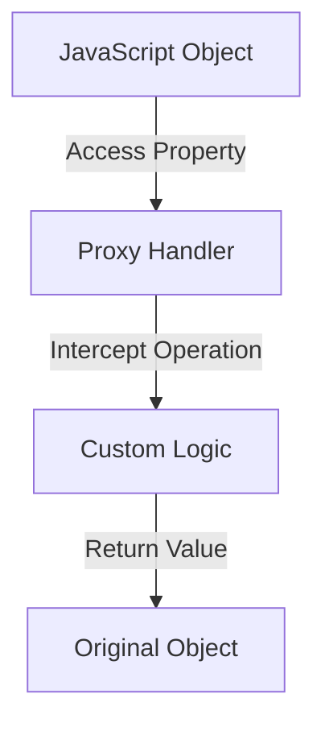

## 21.1 Introduction to Metaprogramming

Metaprogramming is a powerful programming paradigm that allows programs to treat other programs as their data. This means that a program can be designed to read, generate, analyze, or transform other programs, and even modify itself while running. In the context of JavaScript, metaprogramming leverages the language's dynamic nature to create flexible and reusable code.

### What is Metaprogramming?

Metaprogramming involves writing code that can manipulate other code. This can include generating code at runtime, modifying existing code, or even creating new code structures dynamically. The significance of metaprogramming lies in its ability to enhance code flexibility, reduce redundancy, and enable more abstract and high-level programming constructs.

### The Significance of Metaprogramming in Software Development

Metaprogramming is significant in software development for several reasons:

- **Code Reusability**: By abstracting common patterns and behaviors, metaprogramming allows developers to write more reusable code.
- **Dynamic Behavior**: It enables dynamic code execution, allowing programs to adapt to different conditions at runtime.
- **Reduction of Boilerplate Code**: Metaprogramming can automate repetitive tasks, reducing the amount of boilerplate code developers need to write.
- **Enhanced Flexibility**: It provides the ability to modify program behavior without altering the source code directly.

### JavaScript's Dynamic Nature and Metaprogramming

JavaScript is inherently dynamic, making it an ideal language for metaprogramming. Its features such as first-class functions, dynamic typing, and the ability to manipulate objects and functions at runtime facilitate metaprogramming techniques.

#### Key Features Enabling Metaprogramming in JavaScript

1. **First-Class Functions**: Functions in JavaScript are first-class citizens, meaning they can be assigned to variables, passed as arguments, and returned from other functions. This allows for higher-order functions and dynamic function creation.

2. **Dynamic Typing**: JavaScript's dynamic typing allows variables to hold any type of data, which can change at runtime. This flexibility is crucial for metaprogramming.

3. **Prototype-Based Inheritance**: JavaScript's prototype-based inheritance model allows objects to inherit properties and methods from other objects, enabling dynamic behavior modification.

4. **Reflect API**: The Reflect API provides methods for intercepting and manipulating JavaScript operations, such as property access and function invocation.

5. **Proxies**: Proxies allow developers to define custom behavior for fundamental operations on objects, such as property lookup, assignment, and function invocation.

### Examples of Metaprogramming in JavaScript

Let's explore some common metaprogramming techniques in JavaScript with examples.

#### Example 1: Dynamic Function Creation

```javascript
// Creating a function dynamically
function createFunction(operation) {
  return new Function('a', 'b', `return a ${operation} b;`);
}

const add = createFunction('+');
const subtract = createFunction('-');

console.log(add(5, 3)); // Output: 8
console.log(subtract(5, 3)); // Output: 2
```

In this example, we dynamically create functions for addition and subtraction using the `Function` constructor. This allows us to generate functions based on runtime data.

#### Example 2: Using Proxies for Dynamic Behavior

```javascript
// Using a Proxy to log property access
const target = {
  message1: "Hello",
  message2: "World"
};

const handler = {
  get: function(target, prop, receiver) {
    console.log(`Property '${prop}' accessed`);
    return target[prop];
  }
};

const proxy = new Proxy(target, handler);

console.log(proxy.message1); // Logs: Property 'message1' accessed
                             // Output: Hello
console.log(proxy.message2); // Logs: Property 'message2' accessed
                             // Output: World
```

Here, we use a Proxy to intercept property access on an object, logging each access. This demonstrates how Proxies can be used to add dynamic behavior to objects.

#### Example 3: Reflect API for Safe Object Manipulation

```javascript
// Using Reflect to safely manipulate objects
const obj = {
  name: "JavaScript"
};

// Using Reflect to set a property
Reflect.set(obj, 'version', 'ESNext');
console.log(obj.version); // Output: ESNext

// Using Reflect to delete a property
Reflect.deleteProperty(obj, 'name');
console.log(obj.name); // Output: undefined
```

The Reflect API provides a set of static methods that mirror the operations of JavaScript's built-in operators. This example shows how to use Reflect to safely manipulate object properties.

### Scenarios Where Metaprogramming Enhances Code Flexibility and Reuse

Metaprogramming is particularly useful in scenarios where code needs to be highly flexible and reusable. Some common use cases include:

- **Framework Development**: Frameworks often use metaprogramming to provide flexible APIs and automate common tasks.
- **ORMs (Object-Relational Mappers)**: ORMs use metaprogramming to dynamically generate SQL queries based on object models.
- **Middleware and Plugins**: Metaprogramming allows middleware and plugins to modify or extend the behavior of existing code without altering the core logic.
- **Dynamic API Clients**: API clients can use metaprogramming to dynamically generate methods for interacting with different endpoints.

### Importance of Understanding Core Concepts

Before diving into advanced metaprogramming techniques, it's crucial to have a solid understanding of JavaScript's core concepts, such as closures, scope, and the event loop. These foundational concepts are essential for effectively leveraging metaprogramming in JavaScript.

### Visualizing Metaprogramming Concepts

To better understand metaprogramming, let's visualize some of the key concepts using Mermaid.js diagrams.

#### Diagram: JavaScript Object Manipulation with Proxies



This diagram illustrates how a Proxy intercepts operations on a JavaScript object, allowing custom logic to be executed before interacting with the original object.

### References and Further Reading

- [MDN Web Docs: Metaprogramming](https://developer.mozilla.org/en-US/docs/Web/JavaScript/Guide/Meta_programming)
- [JavaScript.info: Proxies](https://javascript.info/proxy)
- [Reflect API on MDN](https://developer.mozilla.org/en-US/docs/Web/JavaScript/Reference/Global_Objects/Reflect)

### Knowledge Check

- What is metaprogramming, and why is it significant in software development?
- How does JavaScript's dynamic nature facilitate metaprogramming?
- Provide an example of using Proxies in JavaScript.
- What are some scenarios where metaprogramming enhances code flexibility and reuse?

### Embrace the Journey

Remember, metaprogramming is just one of the many powerful tools in a developer's toolkit. As you continue to explore JavaScript, you'll discover new ways to write dynamic and flexible code. Keep experimenting, stay curious, and enjoy the journey!

## Mastering Metaprogramming in JavaScript



### What is metaprogramming?

- [x] A programming paradigm where programs can manipulate other programs as data
- [ ] A method for optimizing code performance
- [ ] A technique for debugging code
- [ ] A way to write code in multiple languages

> **Explanation:** Metaprogramming involves writing programs that can treat other programs as their data, allowing for dynamic code manipulation.

### Which JavaScript feature is crucial for metaprogramming?

- [x] Dynamic Typing
- [ ] Static Typing
- [ ] Manual Memory Management
- [ ] Strong Typing

> **Explanation:** JavaScript's dynamic typing allows variables to hold any type of data, which is crucial for metaprogramming.

### What does the Reflect API provide?

- [x] Methods for intercepting and manipulating JavaScript operations
- [ ] A way to create new data types
- [ ] A method for optimizing loops
- [ ] A tool for debugging code

> **Explanation:** The Reflect API provides methods for intercepting and manipulating JavaScript operations, such as property access and function invocation.

### How can Proxies be used in JavaScript?

- [x] To define custom behavior for fundamental operations on objects
- [ ] To optimize code execution speed
- [ ] To create new data types
- [ ] To debug code

> **Explanation:** Proxies allow developers to define custom behavior for fundamental operations on objects, such as property lookup and assignment.

### What is a common use case for metaprogramming?

- [x] Framework Development
- [ ] Manual Memory Management
- [ ] Static Code Analysis
- [ ] Code Compilation

> **Explanation:** Frameworks often use metaprogramming to provide flexible APIs and automate common tasks.

### Which of the following is NOT a benefit of metaprogramming?

- [ ] Code Reusability
- [ ] Dynamic Behavior
- [ ] Reduction of Boilerplate Code
- [x] Increased Code Complexity

> **Explanation:** While metaprogramming offers many benefits, it can also increase code complexity if not used carefully.

### What is the role of first-class functions in metaprogramming?

- [x] They allow functions to be treated as data, enabling dynamic function creation
- [ ] They optimize code execution speed
- [ ] They provide static typing
- [ ] They enable manual memory management

> **Explanation:** First-class functions in JavaScript allow functions to be treated as data, enabling dynamic function creation and manipulation.

### How does metaprogramming reduce boilerplate code?

- [x] By automating repetitive tasks
- [ ] By optimizing code execution speed
- [ ] By providing static typing
- [ ] By enabling manual memory management

> **Explanation:** Metaprogramming can automate repetitive tasks, reducing the amount of boilerplate code developers need to write.

### What is a potential drawback of metaprogramming?

- [x] Increased Code Complexity
- [ ] Reduced Code Flexibility
- [ ] Decreased Code Reusability
- [ ] Limited Dynamic Behavior

> **Explanation:** While metaprogramming offers many benefits, it can also increase code complexity if not used carefully.

### True or False: Metaprogramming is only useful in JavaScript.

- [ ] True
- [x] False

> **Explanation:** Metaprogramming is a paradigm that can be used in many programming languages, not just JavaScript.


