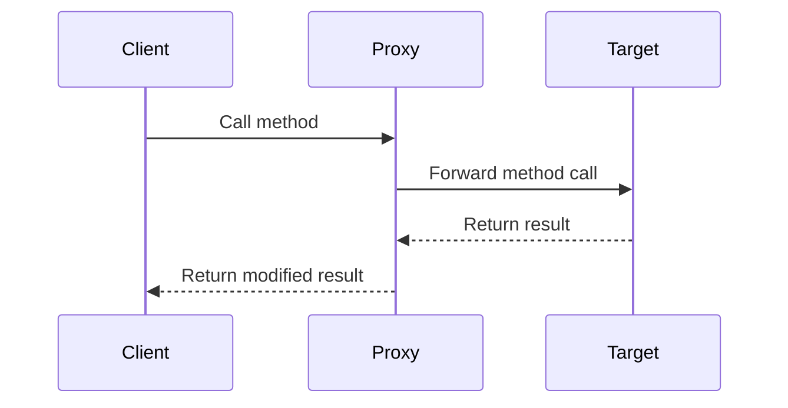

## 21.10 Risks and Limitations of Metaprogramming

Metaprogramming in JavaScript offers powerful capabilities by allowing programs to treat other programs as their data. This means you can write code that manipulates other code, dynamically altering its behavior. While this can lead to elegant solutions and significant flexibility, it also introduces several risks and limitations. In this section, we will explore these potential downsides, providing insights into how to use metaprogramming judiciously.

### Understanding Metaprogramming

Before diving into the risks, let's briefly revisit what metaprogramming entails. Metaprogramming involves writing code that can read, generate, analyze, or transform other code. In JavaScript, this is often achieved through features like:

- **Proxies**: Intercepting and defining custom behavior for fundamental operations.
- **Reflect API**: Performing reflective operations on objects.
- **Dynamic code evaluation**: Using `eval()` or `new Function()` to execute code strings.

### Code Complexity and Maintainability

One of the primary risks of metaprogramming is the increased complexity it introduces to codebases. Metaprogramming can lead to code that is difficult to understand and maintain. This complexity arises from:

- **Implicit Behavior**: Metaprogramming often involves implicit operations that are not immediately obvious to someone reading the code. This can make it challenging to trace how data flows through the application.
- **Dynamic Nature**: Since metaprogramming often involves dynamic code execution, it can be hard to predict the behavior of the code at runtime, especially if the code being manipulated is not well-documented.
- **Obfuscation**: The use of metaprogramming can obfuscate the logic of the application, making it harder for developers to understand the intent behind the code.

#### Example: Overuse of Proxies

```javascript
const handler = {
  get: function(target, prop, receiver) {
    if (prop === 'secret') {
      return 'Access Denied';
    }
    return Reflect.get(...arguments);
  }
};

const obj = new Proxy({}, handler);

console.log(obj.secret); // Access Denied
console.log(obj.anythingElse); // undefined
```

In this example, the use of a Proxy to intercept property access can make it difficult to understand what properties are available on `obj` and what their values might be. This can lead to confusion and errors if not documented properly.

### Risk of Bugs and Unintended Side Effects

Metaprogramming can introduce subtle bugs and unintended side effects, especially when dealing with complex systems. These issues often arise from:

- **Unexpected Interactions**: Metaprogramming can lead to unexpected interactions between different parts of the codebase, especially if the metaprogramming logic is not well-isolated.
- **Side Effects**: Dynamic code execution can have side effects that are difficult to predict, leading to bugs that are hard to reproduce and fix.
- **Error Handling**: Metaprogramming can complicate error handling, as errors may occur in dynamically generated code that is not directly visible in the source code.

#### Example: Dynamic Code Execution

```javascript
function executeCode(code) {
  try {
    eval(code);
  } catch (error) {
    console.error('Error executing code:', error);
  }
}

executeCode('console.log("Hello, World!");'); // Works fine
executeCode('console.log(unknownVariable);'); // Error executing code: ReferenceError: unknownVariable is not defined
```

Using `eval()` to execute code strings can lead to errors that are difficult to handle, especially if the input code is not controlled or validated.

### Situations Where Metaprogramming May Be Overkill

Metaprogramming is a powerful tool, but it is not always the right solution. In some cases, simpler, more straightforward approaches may be more appropriate. Consider the following scenarios:

- **Simple Logic**: For straightforward logic that can be implemented with basic control structures, metaprogramming may add unnecessary complexity.
- **Performance-Critical Code**: Metaprogramming can introduce performance overhead, especially if it involves dynamic code execution or complex proxy logic.
- **Readability and Maintainability**: If the primary goal is to write code that is easy to read and maintain, metaprogramming may not be the best choice.

### Guidelines for Using Metaprogramming Judiciously

To mitigate the risks associated with metaprogramming, consider the following guidelines:

- **Limit Scope**: Use metaprogramming sparingly and limit its scope to specific areas where it provides clear benefits.
- **Document Thoroughly**: Provide comprehensive documentation for any metaprogramming logic, explaining its purpose and how it works.
- **Test Extensively**: Implement thorough testing for metaprogramming code to catch potential bugs and side effects.
- **Consider Alternatives**: Before resorting to metaprogramming, consider whether simpler alternatives could achieve the same result.

### Importance of Documentation and Code Clarity

Documentation is crucial when using metaprogramming, as it helps other developers understand the intent and behavior of the code. Clear documentation should include:

- **Purpose**: Explain why metaprogramming is used and what problem it solves.
- **Behavior**: Describe how the metaprogramming logic works and any assumptions it makes.
- **Examples**: Provide examples of how the metaprogramming code is used in practice.

### Impact on Debugging and Tooling Support

Metaprogramming can complicate debugging and reduce tooling support. This is because:

- **Dynamic Code**: Debugging dynamically generated code can be challenging, as it may not be directly visible in the source code.
- **Tool Limitations**: Some development tools may not fully support metaprogramming features, making it harder to analyze and refactor code.

### Visualizing Metaprogramming Challenges

To better understand the challenges of metaprogramming, let's visualize the flow of a program using a Proxy to intercept method calls.



In this diagram, the Proxy intercepts method calls from the Client to the Target, potentially modifying the result. This can introduce complexity and make it harder to understand the flow of data.

### Knowledge Check

To reinforce your understanding of metaprogramming risks, consider the following questions:

- What are some potential downsides of using metaprogramming in JavaScript?
- How can metaprogramming lead to increased code complexity?
- What are some guidelines for using metaprogramming judiciously?
- Why is documentation important when using metaprogramming?
- How can metaprogramming impact debugging and tooling support?

### Embrace the Journey

Remember, metaprogramming is a powerful tool, but it should be used with caution. By understanding its risks and limitations, you can make informed decisions about when and how to use it effectively. Keep experimenting, stay curious, and enjoy the journey of mastering JavaScript design patterns!

## Quiz: Understanding Metaprogramming Risks and Limitations



### What is a primary risk of using metaprogramming in JavaScript?

- [x] Increased code complexity
- [ ] Improved performance
- [ ] Simplified codebase
- [ ] Enhanced readability

> **Explanation:** Metaprogramming can lead to increased code complexity, making it harder to understand and maintain.

### How can metaprogramming introduce bugs?

- [x] Through unexpected interactions and side effects
- [ ] By simplifying logic
- [ ] By improving error handling
- [ ] By reducing dynamic behavior

> **Explanation:** Metaprogramming can introduce bugs through unexpected interactions and side effects, especially in complex systems.

### When might metaprogramming be considered overkill?

- [x] For simple logic that can be implemented with basic control structures
- [ ] For performance-critical code
- [ ] For complex algorithms
- [ ] For dynamic user interfaces

> **Explanation:** Metaprogramming may be overkill for simple logic that can be implemented with basic control structures.

### What is a guideline for using metaprogramming judiciously?

- [x] Limit its scope to specific areas where it provides clear benefits
- [ ] Use it extensively throughout the codebase
- [ ] Avoid documentation
- [ ] Ignore testing

> **Explanation:** Limiting the scope of metaprogramming to specific areas where it provides clear benefits is a guideline for using it judiciously.

### Why is documentation important for metaprogramming?

- [x] It helps other developers understand the intent and behavior of the code
- [ ] It reduces code complexity
- [ ] It improves performance
- [ ] It eliminates bugs

> **Explanation:** Documentation is important for metaprogramming because it helps other developers understand the intent and behavior of the code.

### How can metaprogramming impact debugging?

- [x] It can complicate debugging due to dynamic code execution
- [ ] It simplifies debugging
- [ ] It eliminates the need for debugging
- [ ] It enhances tooling support

> **Explanation:** Metaprogramming can complicate debugging due to dynamic code execution, which may not be directly visible in the source code.

### What is a potential downside of using proxies in metaprogramming?

- [x] They can obfuscate the logic of the application
- [ ] They improve code readability
- [ ] They enhance performance
- [ ] They simplify error handling

> **Explanation:** Proxies can obfuscate the logic of the application, making it harder to understand and maintain.

### What should be included in documentation for metaprogramming?

- [x] Purpose, behavior, and examples
- [ ] Only the purpose
- [ ] Only the behavior
- [ ] Only examples

> **Explanation:** Documentation for metaprogramming should include the purpose, behavior, and examples to help other developers understand the code.

### How can metaprogramming affect tooling support?

- [x] Some development tools may not fully support metaprogramming features
- [ ] It enhances tooling support
- [ ] It eliminates the need for tools
- [ ] It simplifies tool integration

> **Explanation:** Some development tools may not fully support metaprogramming features, making it harder to analyze and refactor code.

### True or False: Metaprogramming should be used extensively in all JavaScript projects.

- [ ] True
- [x] False

> **Explanation:** Metaprogramming should be used judiciously and not extensively in all JavaScript projects, as it can introduce complexity and other risks.




