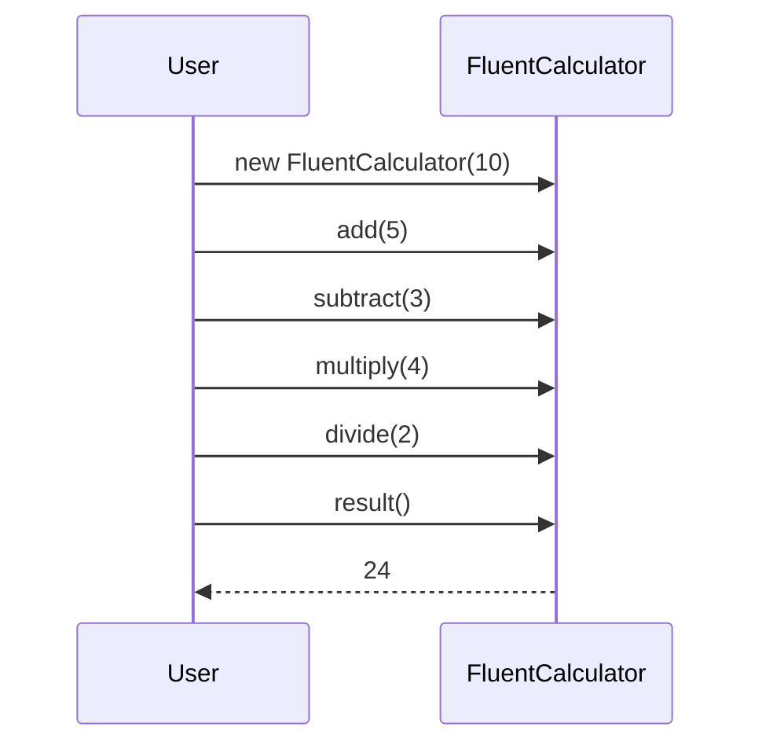

## 21.11 Implementing Fluent Interfaces

Fluent interfaces are a powerful design pattern in JavaScript that enhance code readability and developer experience by allowing method chaining. This pattern is widely used in modern JavaScript libraries and frameworks, making it an essential concept for developers to master. In this section, we will explore what fluent interfaces are, their benefits, and how to implement them effectively in JavaScript.

### What Are Fluent Interfaces?

A fluent interface is a method of designing object-oriented APIs that rely on method chaining to improve readability and flow. The term "fluent" refers to the smooth and expressive nature of the code, which reads almost like natural language. This pattern is particularly useful for creating domain-specific languages (DSLs) within your code.

#### Key Characteristics of Fluent Interfaces

- **Method Chaining**: Each method returns the object itself, allowing multiple method calls to be chained together.
- **Readability**: The code is designed to be easy to read and understand, often resembling natural language.
- **Expressiveness**: Fluent interfaces allow developers to express complex operations in a concise and clear manner.

### Benefits of Fluent Interfaces

Fluent interfaces offer several advantages that make them a popular choice in JavaScript development:

- **Improved Readability**: Code that uses fluent interfaces is often more readable and easier to understand, reducing the cognitive load on developers.
- **Conciseness**: By chaining methods together, you can achieve more with less code, making your programs more concise.
- **Enhanced Developer Experience**: Fluent interfaces provide a more intuitive and enjoyable coding experience, which can lead to increased productivity.

### Implementing Fluent Interfaces in JavaScript

To implement a fluent interface, you need to ensure that each method in your class or object returns the object itself. This allows you to chain multiple method calls together seamlessly.

#### Example: Creating a Fluent API for a Calculator

Let's start by creating a simple calculator class that uses a fluent interface:

```javascript
class FluentCalculator {
  constructor(value = 0) {
    this.value = value;
  }

  add(number) {
    this.value += number;
    return this; // Return the object itself for chaining
  }

  subtract(number) {
    this.value -= number;
    return this;
  }

  multiply(number) {
    this.value *= number;
    return this;
  }

  divide(number) {
    if (number !== 0) {
      this.value /= number;
    } else {
      console.error("Cannot divide by zero");
    }
    return this;
  }

  result() {
    return this.value;
  }
}

// Usage
const result = new FluentCalculator(10)
  .add(5)
  .subtract(3)
  .multiply(4)
  .divide(2)
  .result();

console.log(result); // Output: 24
```

In this example, each method returns the `FluentCalculator` object itself, allowing us to chain method calls together. This makes the code more readable and expressive.

### Best Practices for Designing Fluent APIs

When designing fluent APIs, consider the following best practices to ensure consistency and predictability:

1. **Return `this`**: Always return the object itself from methods to enable chaining.
2. **Maintain State Consistency**: Ensure that the object's state remains consistent throughout the chain of method calls.
3. **Handle Errors Gracefully**: Implement error handling to prevent the chain from breaking unexpectedly.
4. **Provide Clear Documentation**: Document the API thoroughly to help developers understand how to use it effectively.
5. **Encourage Predictability**: Design methods to behave predictably, avoiding side effects that could confuse users.

### Popular Libraries Using Fluent Interfaces

Several popular JavaScript libraries and frameworks utilize fluent interfaces to enhance their APIs. Here are a few notable examples:

- **jQuery**: jQuery's API is built around method chaining, allowing developers to perform complex DOM manipulations with ease.
- **Lodash**: Lodash provides a fluent API for working with arrays, objects, and other data structures, making it a favorite among developers for data manipulation tasks.
- **D3.js**: D3.js uses a fluent interface to create complex data visualizations, enabling developers to chain together transformations and animations.

### Considerations for Error Handling and State Management

When implementing fluent interfaces, it's important to consider how errors and state changes are handled:

- **Error Handling**: Ensure that errors are handled gracefully within the chain. Consider using try-catch blocks or returning error objects to prevent the chain from breaking.
- **State Management**: Be mindful of how state changes affect the object. Ensure that each method call results in a predictable state change, and document any side effects.

### Encouraging Consistency and Predictability

Consistency and predictability are key to a successful fluent interface. Here are some tips to achieve this:

- **Consistent Method Naming**: Use consistent naming conventions for methods to make the API intuitive.
- **Predictable Behavior**: Ensure that methods behave predictably and do not introduce unexpected side effects.
- **Clear Documentation**: Provide clear and comprehensive documentation to help developers understand how to use the API effectively.

### Try It Yourself

To get a better understanding of fluent interfaces, try modifying the `FluentCalculator` class to add new operations, such as modulus or exponentiation. Experiment with different method names and see how they affect the readability and expressiveness of the code.

### Visualizing Fluent Interfaces

To better understand how fluent interfaces work, let's visualize the method chaining process using a sequence diagram:



This diagram illustrates the sequence of method calls in the `FluentCalculator` example, showing how each method returns the object itself, allowing for seamless chaining.

### References and Further Reading

- [MDN Web Docs: Method Chaining](https://developer.mozilla.org/en-US/docs/Web/JavaScript/Guide/Working_with_Objects#method_chaining)
- [Lodash Documentation](https://lodash.com/docs/)
- [jQuery API Documentation](https://api.jquery.com/)

### Knowledge Check

To reinforce your understanding of fluent interfaces, consider the following questions:

1. What is the primary benefit of using fluent interfaces in JavaScript?
2. How does method chaining improve code readability?
3. What are some popular JavaScript libraries that use fluent interfaces?
4. How can you handle errors gracefully in a fluent API?
5. Why is consistency important when designing fluent interfaces?

### Embrace the Journey

Remember, mastering fluent interfaces is just one step in your journey to becoming a proficient JavaScript developer. As you continue to explore design patterns and advanced techniques, you'll gain a deeper understanding of how to write clean, maintainable, and expressive code. Keep experimenting, stay curious, and enjoy the journey!

## Quiz: Mastering Fluent Interfaces in JavaScript



### What is a fluent interface in JavaScript?

- [x] A design pattern that uses method chaining for improved readability.
- [ ] A pattern that focuses on asynchronous programming.
- [ ] A pattern that uses callbacks for error handling.
- [ ] A pattern that relies on global variables for state management.

> **Explanation:** A fluent interface is a design pattern that uses method chaining to create more readable and expressive code.

### Which of the following is a key characteristic of fluent interfaces?

- [x] Method chaining
- [ ] Asynchronous execution
- [ ] Global state management
- [ ] Callback functions

> **Explanation:** Method chaining is a key characteristic of fluent interfaces, allowing multiple method calls to be chained together.

### What is the primary benefit of using fluent interfaces?

- [x] Improved code readability
- [ ] Faster execution speed
- [ ] Reduced memory usage
- [ ] Simplified error handling

> **Explanation:** The primary benefit of fluent interfaces is improved code readability, making it easier for developers to understand and maintain the code.

### How can you handle errors gracefully in a fluent API?

- [x] Use try-catch blocks or return error objects.
- [ ] Ignore errors and continue execution.
- [ ] Use global variables to track errors.
- [ ] Rely on external libraries for error handling.

> **Explanation:** Using try-catch blocks or returning error objects can help handle errors gracefully in a fluent API.

### Which popular JavaScript library uses fluent interfaces?

- [x] jQuery
- [ ] React
- [ ] Angular
- [ ] Vue.js

> **Explanation:** jQuery is a popular JavaScript library that uses fluent interfaces for DOM manipulation.

### What should a method in a fluent interface return?

- [x] The object itself
- [ ] A promise
- [ ] A callback function
- [ ] A global variable

> **Explanation:** A method in a fluent interface should return the object itself to enable method chaining.

### Why is consistency important in fluent interfaces?

- [x] It ensures predictable behavior and improves usability.
- [ ] It reduces the need for documentation.
- [ ] It allows for faster execution.
- [ ] It simplifies error handling.

> **Explanation:** Consistency ensures predictable behavior and improves the usability of fluent interfaces.

### What is a common use case for fluent interfaces?

- [x] Creating domain-specific languages (DSLs)
- [ ] Managing global state
- [ ] Handling asynchronous operations
- [ ] Implementing security features

> **Explanation:** Fluent interfaces are commonly used to create domain-specific languages (DSLs) within code.

### How does method chaining affect code conciseness?

- [x] It allows more to be done with less code.
- [ ] It increases the number of lines of code.
- [ ] It requires additional comments for clarity.
- [ ] It complicates the code structure.

> **Explanation:** Method chaining allows more to be done with less code, making the code more concise.

### True or False: Fluent interfaces are only useful for object-oriented programming.

- [ ] True
- [x] False

> **Explanation:** Fluent interfaces can be used in both object-oriented and functional programming paradigms to improve code readability and expressiveness.


