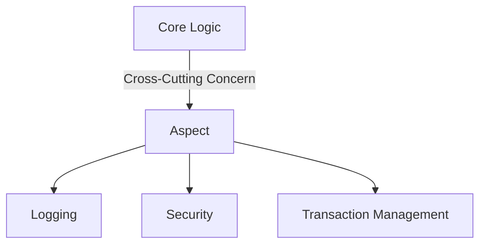

## 21.12 Aspect-Oriented Programming in JavaScript

Aspect-Oriented Programming (AOP) is a programming paradigm that aims to increase modularity by allowing the separation of cross-cutting concerns. In this section, we will delve into the principles of AOP, explore how it can be implemented in JavaScript, and discuss its benefits and potential drawbacks. We will also highlight some libraries that facilitate AOP in JavaScript.

### Understanding Aspect-Oriented Programming

**Aspect-Oriented Programming (AOP)** is a paradigm that complements traditional programming paradigms like Object-Oriented Programming (OOP) by addressing cross-cutting concerns. These are aspects of a program that affect multiple modules and are often difficult to modularize using traditional methods. Examples include logging, security, transaction management, and error handling.

#### Principles of AOP

1. **Separation of Concerns**: AOP allows developers to separate cross-cutting concerns from the main business logic, making the codebase cleaner and more maintainable.
2. **Modularity**: By encapsulating cross-cutting concerns in separate modules called aspects, AOP enhances modularity.
3. **Reusability**: Aspects can be reused across different parts of an application, reducing code duplication.
4. **Maintainability**: Changes to cross-cutting concerns can be made in one place, simplifying maintenance.

### Implementing AOP in JavaScript

JavaScript, being a highly dynamic language, offers several techniques to implement AOP, such as monkey patching, proxies, and decorators.

#### Monkey Patching

**Monkey patching** involves modifying or extending existing code at runtime. While powerful, it can lead to maintenance challenges if not used carefully.

```javascript
// Original function
function greet(name) {
    console.log(`Hello, ${name}!`);
}

// Monkey patching to add logging
const originalGreet = greet;
greet = function(name) {
    console.log(`greet() called with argument: ${name}`);
    originalGreet(name);
};

// Usage
greet('Alice');
```

#### Proxies

**Proxies** in JavaScript allow you to intercept and redefine fundamental operations for objects. They provide a cleaner way to implement AOP by separating the aspect logic from the core logic.

```javascript
const handler = {
    get: function(target, property) {
        console.log(`Accessing property: ${property}`);
        return target[property];
    }
};

const user = { name: 'Alice', age: 30 };
const proxyUser = new Proxy(user, handler);

// Usage
console.log(proxyUser.name);
```

#### Decorators

**Decorators** are a proposed feature in JavaScript that allows you to modify classes and methods. They are particularly useful for implementing AOP by wrapping additional behavior around existing functionality.

```javascript
function log(target, key, descriptor) {
    const originalMethod = descriptor.value;
    descriptor.value = function(...args) {
        console.log(`Calling ${key} with arguments: ${args}`);
        return originalMethod.apply(this, args);
    };
    return descriptor;
}

class User {
    @log
    greet(name) {
        console.log(`Hello, ${name}!`);
    }
}

// Usage
const user = new User();
user.greet('Alice');
```

### Cross-Cutting Concerns

Cross-cutting concerns are aspects of a program that affect multiple modules. Common examples include:

- **Logging**: Capturing and recording application events.
- **Security Checks**: Validating user permissions and access rights.
- **Transaction Management**: Ensuring data consistency across operations.
- **Error Handling**: Managing exceptions and errors in a centralized manner.

### Libraries for AOP in JavaScript

Several libraries facilitate AOP in JavaScript, providing tools and abstractions to manage cross-cutting concerns effectively.

#### aspect.js

[aspect.js](https://github.com/mgechev/aspect.js/) is a lightweight library that provides AOP capabilities in JavaScript. It allows you to define aspects and apply them to functions or methods.

```javascript
import { before } from 'aspect.js';

class UserService {
    getUser(id) {
        console.log(`Fetching user with id: ${id}`);
        // Fetch user logic
    }
}

before(UserService.prototype, 'getUser', function(id) {
    console.log(`Before fetching user with id: ${id}`);
});

const service = new UserService();
service.getUser(1);
```

### Benefits and Drawbacks of AOP

#### Benefits

- **Improved Modularity**: AOP separates cross-cutting concerns, leading to a more modular codebase.
- **Enhanced Maintainability**: Changes to aspects can be made in one place, reducing the risk of errors.
- **Increased Reusability**: Aspects can be reused across different parts of an application.

#### Drawbacks

- **Complexity**: AOP can introduce complexity, making the code harder to understand and debug.
- **Performance Overhead**: The additional layer of abstraction can lead to performance overhead.
- **Tooling and Support**: Limited support in some environments and tools.

### Design Considerations

When implementing AOP, careful design is crucial to avoid code complexity and maintain readability. Consider the following:

- **Identify Cross-Cutting Concerns**: Clearly identify which concerns are cross-cutting and benefit from AOP.
- **Use AOP Judiciously**: Apply AOP where it provides clear benefits, avoiding overuse.
- **Maintain Documentation**: Document aspects and their interactions with the core logic to aid understanding.

### JavaScript Unique Features

JavaScript's dynamic nature and features like proxies and decorators make it well-suited for AOP. These features allow for flexible and powerful implementations of cross-cutting concerns.

### Differences and Similarities

AOP is often compared to other paradigms like OOP. While OOP focuses on encapsulating data and behavior within objects, AOP focuses on separating concerns that cut across multiple objects.

### Try It Yourself

Experiment with the code examples provided. Try modifying the logging aspect to include timestamps or add a security check aspect that validates user permissions before executing a function.

### Visualizing AOP in JavaScript

Below is a diagram illustrating how AOP separates cross-cutting concerns from core logic.



### References and Links

- [MDN Web Docs: Proxies](https://developer.mozilla.org/en-US/docs/Web/JavaScript/Reference/Global_Objects/Proxy)
- [MDN Web Docs: Decorators](https://developer.mozilla.org/en-US/docs/Web/JavaScript/Reference/Statements/decorator)
- [aspect.js GitHub Repository](https://github.com/mgechev/aspect.js/)

### Knowledge Check

- What are cross-cutting concerns, and why are they important in AOP?
- How can proxies be used to implement AOP in JavaScript?
- What are the benefits and drawbacks of using AOP?

### Embrace the Journey

Remember, mastering AOP is a journey. As you progress, you'll discover more ways to enhance modularity and manage cross-cutting concerns in your applications. Keep experimenting, stay curious, and enjoy the journey!

## Quiz: Mastering Aspect-Oriented Programming in JavaScript



### What is the primary goal of Aspect-Oriented Programming (AOP)?

- [x] To separate cross-cutting concerns from core logic
- [ ] To enhance object-oriented principles
- [ ] To improve performance
- [ ] To simplify syntax

> **Explanation:** AOP aims to separate cross-cutting concerns, such as logging and security, from the core business logic to improve modularity.

### Which JavaScript feature allows intercepting and redefining fundamental operations on objects?

- [ ] Decorators
- [x] Proxies
- [ ] Closures
- [ ] Callbacks

> **Explanation:** Proxies in JavaScript allow intercepting and redefining operations on objects, making them suitable for implementing AOP.

### What is a common drawback of using AOP?

- [ ] Improved modularity
- [x] Increased complexity
- [ ] Enhanced maintainability
- [ ] Reusability

> **Explanation:** AOP can introduce complexity, making the code harder to understand and debug.

### Which library provides AOP capabilities in JavaScript?

- [ ] Lodash
- [ ] jQuery
- [x] aspect.js
- [ ] Axios

> **Explanation:** aspect.js is a library that provides AOP capabilities in JavaScript.

### What is monkey patching?

- [x] Modifying existing code at runtime
- [ ] Creating new classes
- [ ] Using proxies to intercept operations
- [ ] Implementing decorators

> **Explanation:** Monkey patching involves modifying or extending existing code at runtime.

### Which of the following is a cross-cutting concern?

- [ ] User interface design
- [x] Logging
- [ ] Data storage
- [ ] Network requests

> **Explanation:** Logging is a cross-cutting concern that affects multiple parts of an application.

### How can decorators be used in AOP?

- [ ] By creating new objects
- [x] By wrapping additional behavior around existing functionality
- [ ] By modifying the DOM
- [ ] By handling events

> **Explanation:** Decorators can wrap additional behavior around existing functionality, making them useful for AOP.

### What is a benefit of using AOP?

- [ ] Increased code duplication
- [ ] Reduced modularity
- [x] Enhanced maintainability
- [ ] Decreased reusability

> **Explanation:** AOP enhances maintainability by allowing changes to cross-cutting concerns in one place.

### Which technique involves modifying existing code at runtime?

- [x] Monkey patching
- [ ] Using proxies
- [ ] Implementing decorators
- [ ] Creating new classes

> **Explanation:** Monkey patching involves modifying or extending existing code at runtime.

### True or False: AOP is primarily used to enhance performance.

- [ ] True
- [x] False

> **Explanation:** AOP is not primarily used to enhance performance; it is used to separate cross-cutting concerns and improve modularity.


