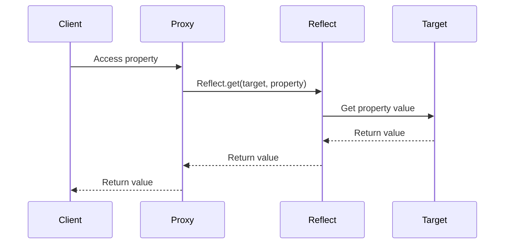

## 21.2 Reflection and Introspection with Reflect API

Reflection and introspection are powerful concepts in programming that allow developers to examine and modify the structure and behavior of programs at runtime. In JavaScript, the introduction of the Reflect API in ECMAScript 6 (ES6) has brought these capabilities to the forefront, enabling developers to perform operations that were previously cumbersome or impossible.

### Understanding Reflection and Introspection

**Reflection** is the ability of a program to inspect and modify its own structure and behavior at runtime. This includes examining objects, functions, and their properties, as well as dynamically invoking methods or altering object states.

**Introspection** is a subset of reflection that focuses on examining the structure of objects and types without modifying them. It allows developers to query the properties and methods of objects, understand their types, and make decisions based on this information.

### Introducing the Reflect API

The [Reflect API](https://developer.mozilla.org/en-US/docs/Web/JavaScript/Reference/Global_Objects/Reflect) is a built-in object in JavaScript that provides methods for interceptable JavaScript operations. It is designed to complement the Proxy object by providing a set of static methods that mirror the operations of JavaScript's internal methods.

#### Purpose of the Reflect API

- **Standardization**: Reflect methods provide a standard way to perform operations that were previously done using non-standard techniques.
- **Consistency**: The API offers a consistent interface for performing operations like property access, assignment, and function invocation.
- **Interoperability with Proxies**: Reflect methods are often used in conjunction with Proxy objects to intercept and redefine fundamental operations.

### Key Methods of the Reflect API

Let's explore some of the key methods provided by the Reflect API and how they can be used in JavaScript.

#### Reflect.get

The `Reflect.get` method is used to retrieve the value of a property from an object. It is similar to the property access operator (`.` or `[]`), but it provides a more flexible and consistent interface.

```javascript
const person = {
  name: 'Alice',
  age: 30
};

// Using Reflect.get to access a property
const name = Reflect.get(person, 'name');
console.log(name); // Output: Alice
```

#### Reflect.set

The `Reflect.set` method is used to assign a value to a property of an object. It returns a boolean indicating whether the operation was successful.

```javascript
const person = {
  name: 'Alice',
  age: 30
};

// Using Reflect.set to modify a property
Reflect.set(person, 'age', 31);
console.log(person.age); // Output: 31
```

#### Reflect.has

The `Reflect.has` method checks if a property exists in an object, similar to the `in` operator.

```javascript
const person = {
  name: 'Alice',
  age: 30
};

// Using Reflect.has to check for a property
const hasName = Reflect.has(person, 'name');
console.log(hasName); // Output: true
```

#### Reflect.deleteProperty

The `Reflect.deleteProperty` method is used to delete a property from an object, similar to the `delete` operator.

```javascript
const person = {
  name: 'Alice',
  age: 30
};

// Using Reflect.deleteProperty to remove a property
Reflect.deleteProperty(person, 'age');
console.log(person.age); // Output: undefined
```

### Reflect API and Proxy Objects

The Reflect API is often used in conjunction with Proxy objects to intercept and redefine fundamental operations. Proxies allow developers to create custom behavior for fundamental operations on objects, such as property access, assignment, and function invocation.

#### Example: Using Reflect with Proxy

```javascript
const target = {
  name: 'Alice',
  age: 30
};

const handler = {
  get(target, property, receiver) {
    console.log(`Getting ${property}`);
    return Reflect.get(target, property, receiver);
  },
  set(target, property, value, receiver) {
    console.log(`Setting ${property} to ${value}`);
    return Reflect.set(target, property, value, receiver);
  }
};

const proxy = new Proxy(target, handler);

console.log(proxy.name); // Output: Getting name \n Alice
proxy.age = 31;          // Output: Setting age to 31
```

### Use Cases for Reflect API

The Reflect API is particularly useful in scenarios where dynamic property access and operation interception are required. Here are some common use cases:

- **Dynamic Property Access**: Reflect methods allow for dynamic access and modification of object properties, which is useful in scenarios where property names are not known at compile time.
- **Operation Interception**: When used with Proxy objects, Reflect methods enable interception and customization of fundamental operations, allowing for advanced metaprogramming techniques.
- **Consistency and Error Handling**: Reflect methods provide a consistent interface for performing operations and return boolean values to indicate success or failure, enabling better error handling.

### Best Practices and Potential Pitfalls

While the Reflect API offers powerful capabilities, it is important to use it judiciously to avoid potential pitfalls:

- **Avoid Overuse**: Overusing reflection and introspection can lead to code that is difficult to understand and maintain. Use these techniques only when necessary.
- **Performance Considerations**: Reflection can introduce performance overhead, so it should be used with caution in performance-critical applications.
- **Security Implications**: Be mindful of security implications when using reflection, especially when dealing with untrusted input or dynamic code execution.

### Visualizing Reflect API Operations

To better understand how the Reflect API interacts with objects and proxies, let's visualize the process using a sequence diagram.



**Diagram Description**: This sequence diagram illustrates how a client accesses a property through a proxy, which uses the Reflect API to retrieve the property value from the target object.

### Try It Yourself

Experiment with the Reflect API by modifying the code examples provided. Try adding new properties, deleting existing ones, or intercepting different operations using proxies. Observe how the Reflect API methods provide a consistent and flexible interface for these operations.

### Knowledge Check

To reinforce your understanding of the Reflect API, consider the following questions and exercises:

- What is the difference between reflection and introspection?
- How does the Reflect API complement Proxy objects in JavaScript?
- Write a function that uses `Reflect.set` to update multiple properties of an object at once.
- What are some potential pitfalls of using reflection and introspection in JavaScript?

### Summary

The Reflect API in JavaScript provides powerful reflection and introspection capabilities, enabling developers to perform dynamic operations on objects and functions. By offering a consistent and flexible interface, the Reflect API complements Proxy objects and facilitates advanced metaprogramming techniques. However, it is important to use these capabilities judiciously to avoid potential pitfalls related to performance, security, and code maintainability.

Remember, this is just the beginning. As you progress, you'll build more complex and interactive web applications using these advanced techniques. Keep experimenting, stay curious, and enjoy the journey!

## Test Your Knowledge on JavaScript Reflect API and Introspection



### What is the primary purpose of the Reflect API in JavaScript?

- [x] To provide a standard interface for interceptable operations
- [ ] To replace all existing JavaScript operators
- [ ] To enhance the performance of JavaScript applications
- [ ] To simplify the syntax of JavaScript

> **Explanation:** The Reflect API provides a standard interface for interceptable operations, complementing Proxy objects.

### Which method would you use to check if a property exists in an object using the Reflect API?

- [ ] Reflect.get
- [ ] Reflect.set
- [x] Reflect.has
- [ ] Reflect.deleteProperty

> **Explanation:** The `Reflect.has` method is used to check if a property exists in an object.

### How does the Reflect API complement Proxy objects?

- [x] By providing methods that mirror JavaScript's internal operations
- [ ] By replacing Proxy objects entirely
- [ ] By enhancing the performance of Proxy objects
- [ ] By simplifying the creation of Proxy objects

> **Explanation:** The Reflect API complements Proxy objects by providing methods that mirror JavaScript's internal operations, allowing for consistent interception.

### What is a potential pitfall of using reflection in JavaScript?

- [x] It can introduce performance overhead
- [ ] It simplifies code too much
- [ ] It eliminates the need for error handling
- [ ] It always improves security

> **Explanation:** Reflection can introduce performance overhead, so it should be used judiciously.

### Which Reflect method is used to delete a property from an object?

- [ ] Reflect.get
- [ ] Reflect.set
- [ ] Reflect.has
- [x] Reflect.deleteProperty

> **Explanation:** The `Reflect.deleteProperty` method is used to delete a property from an object.

### What does the Reflect.set method return?

- [x] A boolean indicating success or failure
- [ ] The previous value of the property
- [ ] The new value of the property
- [ ] An error message if the operation fails

> **Explanation:** The `Reflect.set` method returns a boolean indicating whether the operation was successful.

### Which of the following is a use case for the Reflect API?

- [x] Dynamic property access
- [ ] Static code analysis
- [ ] Compiling JavaScript to machine code
- [ ] Simplifying HTML structure

> **Explanation:** The Reflect API is useful for dynamic property access and operation interception.

### What is the output of `Reflect.get({name: 'Alice'}, 'name')`?

- [x] Alice
- [ ] undefined
- [ ] null
- [ ] An error

> **Explanation:** The `Reflect.get` method retrieves the value of the `name` property, which is "Alice".

### Which Reflect method would you use to assign a value to a property?

- [ ] Reflect.get
- [x] Reflect.set
- [ ] Reflect.has
- [ ] Reflect.deleteProperty

> **Explanation:** The `Reflect.set` method is used to assign a value to a property of an object.

### True or False: The Reflect API can be used to modify the structure of JavaScript code at runtime.

- [x] True
- [ ] False

> **Explanation:** The Reflect API provides methods for reflection and introspection, allowing modification of object properties and behavior at runtime.




