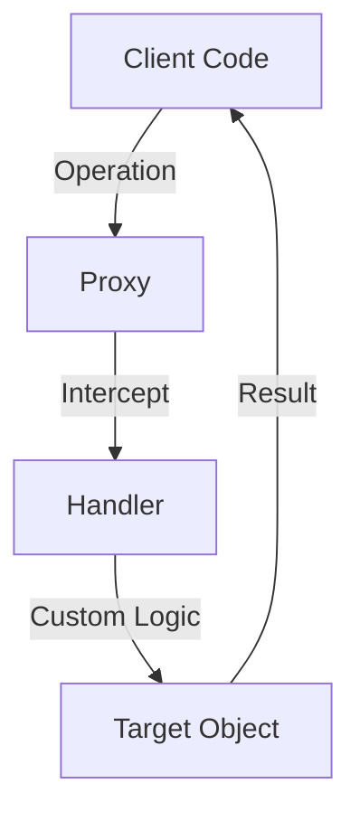

## 21.3 Proxies for Intercepting Operations

In the realm of JavaScript, proxies offer a powerful mechanism for intercepting and redefining fundamental operations on objects. This capability allows developers to create custom behaviors and abstractions that can significantly enhance the flexibility and functionality of their applications. In this section, we will delve into the concept of proxies, explore how they work, and examine their practical applications.

### Understanding JavaScript Proxies

A **Proxy** in JavaScript is an object that wraps another object (known as the target) and intercepts operations performed on it. This interception is achieved through handler functions, which are defined to customize the behavior of the target object. Proxies can be used to intercept a wide range of operations, including property access, assignment, enumeration, function invocation, and more.

#### How Proxies Work

The core idea behind proxies is to provide a layer of abstraction that allows developers to define custom behavior for operations on objects. This is done by creating a proxy object that acts as an intermediary between the client code and the target object. The proxy object can intercept operations and execute custom logic before delegating the operation to the target object.

### Creating Proxy Objects

To create a proxy, you need two components: a target object and a handler object. The target object is the object you want to wrap, and the handler object contains traps, which are functions that define custom behavior for intercepted operations.

Here's a basic example of creating a proxy:

```javascript
// Define the target object
const target = {
  message: "Hello, World!"
};

// Define the handler with traps
const handler = {
  get: function(target, property) {
    console.log(`Getting property: ${property}`);
    return target[property];
  }
};

// Create the proxy
const proxy = new Proxy(target, handler);

// Access a property through the proxy
console.log(proxy.message); // Output: Getting property: message
                            //         Hello, World!
```

In this example, the `get` trap is used to intercept property access on the target object. Whenever a property is accessed through the proxy, the `get` trap logs a message and then returns the property value from the target object.

### Available Traps in Proxies

JavaScript proxies provide a variety of traps that can be used to intercept different operations. Here are some of the most commonly used traps:

- **`get(target, property, receiver)`**: Intercepts property access.
- **`set(target, property, value, receiver)`**: Intercepts property assignment.
- **`has(target, property)`**: Intercepts the `in` operator.
- **`deleteProperty(target, property)`**: Intercepts property deletion.
- **`apply(target, thisArg, argumentsList)`**: Intercepts function calls.
- **`construct(target, argumentsList, newTarget)`**: Intercepts `new` operator.
- **`ownKeys(target)`**: Intercepts `Object.getOwnPropertyNames` and `Object.keys`.
- **`defineProperty(target, property, descriptor)`**: Intercepts `Object.defineProperty`.
- **`getOwnPropertyDescriptor(target, property)`**: Intercepts `Object.getOwnPropertyDescriptor`.

Each trap provides a way to customize the behavior of the target object for specific operations. Let's explore some practical use cases for proxies.

### Use Cases for Proxies

#### Validation

Proxies can be used to enforce validation rules on objects. For example, you can use the `set` trap to validate property values before they are assigned:

```javascript
const validator = {
  set: function(target, property, value) {
    if (property === 'age' && typeof value !== 'number') {
      throw new TypeError('Age must be a number');
    }
    target[property] = value;
    return true;
  }
};

const person = new Proxy({}, validator);

person.age = 30; // Valid
console.log(person.age); // Output: 30

person.age = 'thirty'; // Throws TypeError: Age must be a number
```

In this example, the `set` trap ensures that the `age` property is always assigned a numeric value.

#### Property Access Control

Proxies can be used to control access to object properties. This is useful for implementing encapsulation and hiding certain properties from external access:

```javascript
const secret = {
  _password: 'supersecret'
};

const accessControl = {
  get: function(target, property) {
    if (property.startsWith('_')) {
      throw new Error(`Access to property "${property}" is denied`);
    }
    return target[property];
  }
};

const secureObject = new Proxy(secret, accessControl);

console.log(secureObject._password); // Throws Error: Access to property "_password" is denied
```

Here, the `get` trap prevents access to properties that start with an underscore, effectively hiding them from external access.

#### Observable Objects

Proxies can be used to create observable objects that notify listeners of changes. This is particularly useful in reactive programming and state management:

```javascript
function createObservable(target, callback) {
  return new Proxy(target, {
    set: function(target, property, value) {
      target[property] = value;
      callback(property, value);
      return true;
    }
  });
}

const data = { count: 0 };
const observableData = createObservable(data, (property, value) => {
  console.log(`Property ${property} changed to ${value}`);
});

observableData.count = 1; // Output: Property count changed to 1
```

In this example, the `set` trap is used to notify a callback function whenever a property value changes.

### Proxies and the Reflect API

The **Reflect API** is a built-in object that provides methods for interceptable JavaScript operations. It is often used in conjunction with proxies to perform default operations on the target object. This is particularly useful when you want to extend the behavior of an operation without completely overriding it.

Here's an example of using the Reflect API with a proxy:

```javascript
const handler = {
  get: function(target, property, receiver) {
    console.log(`Getting property: ${property}`);
    return Reflect.get(target, property, receiver);
  }
};

const target = { name: 'Alice' };
const proxy = new Proxy(target, handler);

console.log(proxy.name); // Output: Getting property: name
                         //         Alice
```

In this example, the `Reflect.get` method is used to perform the default property access operation after logging a message.

### Performance Considerations and Compatibility

While proxies offer powerful capabilities, they can introduce performance overhead due to the additional layer of abstraction. It's important to use proxies judiciously and be aware of their impact on performance, especially in performance-critical applications.

Proxies are supported in modern browsers and Node.js, but they may not be available in older environments. It's important to check compatibility and consider polyfills or alternative approaches if necessary.

### Try It Yourself

Experiment with the following code examples to gain a deeper understanding of proxies. Try modifying the handler functions to implement different behaviors, such as logging, validation, or access control.

### Visualizing Proxy Interception

To better understand how proxies intercept operations, consider the following diagram:



**Caption**: This diagram illustrates the flow of an operation intercepted by a proxy. The client code interacts with the proxy, which delegates the operation to the handler for custom logic before passing it to the target object.

### Knowledge Check

Reflect on the concepts covered in this section by answering the following questions:

1. What is a proxy in JavaScript, and how does it work?
2. How can proxies be used to enforce validation rules on objects?
3. What is the Reflect API, and how does it relate to proxies?
4. What are some common traps available in proxies?
5. How can proxies be used to create observable objects?

### Summary

In this section, we've explored the concept of proxies in JavaScript and how they can be used to intercept and redefine operations on objects. We've discussed various use cases, including validation, property access control, and observable objects. We've also highlighted the relationship between proxies and the Reflect API, as well as performance considerations and compatibility issues. By leveraging proxies, developers can create powerful abstractions and custom behaviors that enhance the flexibility and functionality of their applications.

Remember, this is just the beginning. As you progress, you'll discover even more ways to harness the power of proxies in your JavaScript projects. Keep experimenting, stay curious, and enjoy the journey!

## Quiz: Mastering JavaScript Proxies



### What is a proxy in JavaScript?

- [x] An object that wraps another object and intercepts operations on it
- [ ] A function that executes asynchronously
- [ ] A method for encrypting data
- [ ] A built-in JavaScript library

> **Explanation:** A proxy is an object that wraps another object and intercepts operations performed on it, allowing for custom behavior.

### Which trap is used to intercept property access in a proxy?

- [x] get
- [ ] set
- [ ] apply
- [ ] construct

> **Explanation:** The `get` trap is used to intercept property access operations in a proxy.

### How can proxies be used for validation?

- [x] By using the set trap to enforce rules before assigning values
- [ ] By using the get trap to log property access
- [ ] By using the apply trap to intercept function calls
- [ ] By using the construct trap to intercept object creation

> **Explanation:** Proxies can use the `set` trap to enforce validation rules before assigning values to properties.

### What is the Reflect API used for in relation to proxies?

- [x] To perform default operations on the target object
- [ ] To encrypt data
- [ ] To create asynchronous functions
- [ ] To define new data types

> **Explanation:** The Reflect API provides methods for performing default operations on the target object, often used in conjunction with proxies.

### Which of the following is NOT a trap available in proxies?

- [ ] get
- [ ] set
- [ ] apply
- [x] encrypt

> **Explanation:** `encrypt` is not a trap available in proxies. Common traps include `get`, `set`, and `apply`.

### How can proxies be used to create observable objects?

- [x] By using the set trap to notify listeners of changes
- [ ] By using the get trap to log property access
- [ ] By using the apply trap to intercept function calls
- [ ] By using the construct trap to intercept object creation

> **Explanation:** Proxies can use the `set` trap to notify listeners of changes, making objects observable.

### What is a potential drawback of using proxies?

- [x] Performance overhead
- [ ] Lack of flexibility
- [ ] Inability to intercept operations
- [ ] Limited browser support

> **Explanation:** Proxies can introduce performance overhead due to the additional layer of abstraction.

### Are proxies supported in all JavaScript environments?

- [ ] Yes, in all environments
- [x] No, they may not be available in older environments
- [ ] Yes, but only in Node.js
- [ ] No, they are only available in modern browsers

> **Explanation:** Proxies are supported in modern browsers and Node.js, but may not be available in older environments.

### What is the purpose of the handler object in a proxy?

- [x] To define traps for intercepting operations
- [ ] To store data
- [ ] To execute asynchronous functions
- [ ] To encrypt data

> **Explanation:** The handler object in a proxy defines traps for intercepting operations on the target object.

### True or False: Proxies can be used to intercept function calls.

- [x] True
- [ ] False

> **Explanation:** Proxies can intercept function calls using the `apply` trap.


