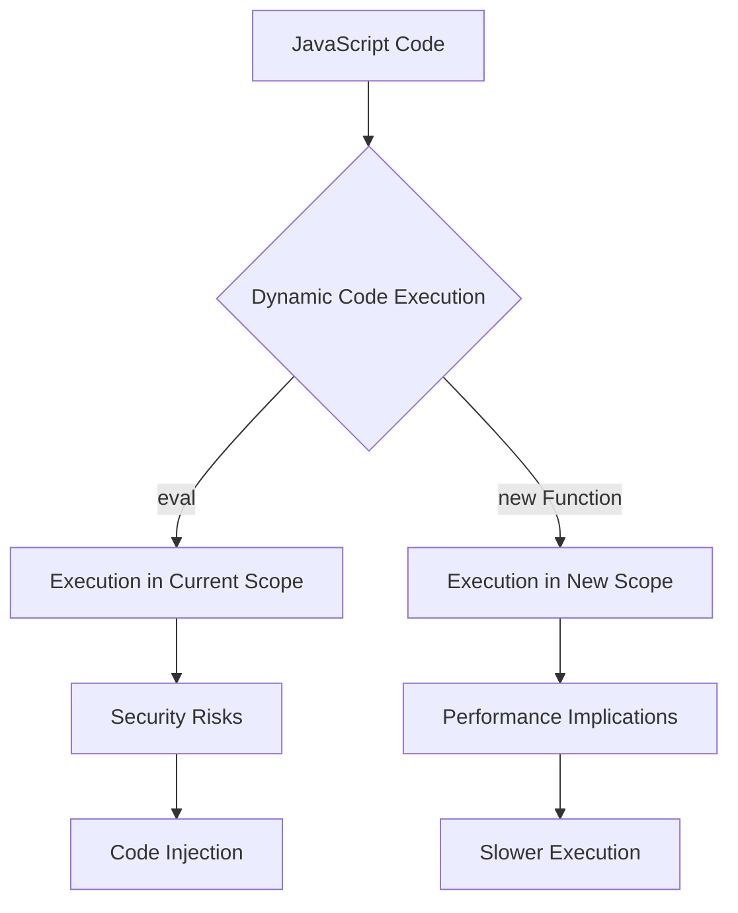

## 21.4 Using `eval` and `new Function`

### Introduction

In JavaScript, the ability to execute code dynamically can be both a powerful tool and a potential pitfall. Two primary mechanisms for dynamic code execution are `eval` and `new Function`. While these tools offer flexibility, they also come with significant security and performance concerns. In this section, we will explore how `eval` and `new Function` work, provide examples of their use, discuss the associated risks, and highlight safer alternatives.

### Understanding `eval`

The `eval` function in JavaScript takes a string as an argument and executes it as code within the current execution context. This means that any variables or functions defined in the string are accessible in the surrounding scope.

#### How `eval` Works

```javascript
// Example of using eval
let a = 2;
let b = 3;
let result = eval('a + b'); // Evaluates the expression 'a + b'
console.log(result); // Outputs: 5
```

In this example, `eval` evaluates the string `'a + b'` and returns the result. It can execute any JavaScript code, including expressions, statements, and even function definitions.

#### Security Risks of `eval`

Using `eval` poses significant security risks, especially when executing code from untrusted sources. It can lead to code injection attacks, where malicious code is executed in the context of your application. This can compromise data integrity and user privacy.

#### Performance Implications

`eval` can also degrade performance. Since it interprets the string at runtime, it bypasses many of the optimizations that JavaScript engines apply to regular code. This can lead to slower execution and increased memory usage.

### Understanding `new Function`

The `new Function` constructor creates a new function object. It allows you to define a function with a dynamic body, specified as a string.

#### How `new Function` Works

```javascript
// Example of using new Function
let sumFunction = new Function('a', 'b', 'return a + b;');
console.log(sumFunction(2, 3)); // Outputs: 5
```

In this example, `new Function` creates a function that takes two parameters, `a` and `b`, and returns their sum. Unlike `eval`, `new Function` does not have access to the local scope, which can mitigate some security risks.

### Security and Performance Considerations

While `new Function` is generally safer than `eval`, it still poses security risks if used with untrusted input. Additionally, like `eval`, it can impact performance due to the lack of compile-time optimizations.

### Alternatives to `eval` and `new Function`

Given the risks associated with `eval` and `new Function`, it's important to consider alternative approaches for achieving dynamic behavior in JavaScript.

#### Using Proxies

Proxies allow you to intercept and redefine fundamental operations for objects. They provide a way to add dynamic behavior without executing code strings.

```javascript
// Example of using Proxy
let target = {};
let handler = {
  get: function(obj, prop) {
    return prop in obj ? obj[prop] : `Property ${prop} does not exist`;
  }
};

let proxy = new Proxy(target, handler);
console.log(proxy.name); // Outputs: Property name does not exist
```

#### Higher-Order Functions

Higher-order functions are functions that take other functions as arguments or return them as results. They can be used to create dynamic behavior without the need for `eval`.

```javascript
// Example of using higher-order functions
function createMultiplier(multiplier) {
  return function(value) {
    return value * multiplier;
  };
}

let double = createMultiplier(2);
console.log(double(5)); // Outputs: 10
```

### Best Practices

- **Avoid `eval` in Production**: Due to its security and performance implications, avoid using `eval` in production code.
- **Use Linters**: Tools like ESLint can help detect and prevent misuse of `eval` and `new Function`.
- **Validate Input**: If you must use dynamic code execution, ensure that all input is validated and sanitized to prevent injection attacks.

### Tools and Linters

Linters and static analysis tools can help identify and prevent the misuse of `eval` and `new Function`. ESLint, for example, provides rules that can flag the use of these functions.

### Conclusion

While `eval` and `new Function` offer powerful capabilities for dynamic code execution, they come with significant risks. By understanding these risks and considering alternative approaches, you can write safer and more efficient JavaScript code. Remember, this is just the beginning. As you progress, you'll build more complex and interactive web pages. Keep experimenting, stay curious, and enjoy the journey!

### Visualizing Dynamic Code Execution



This diagram illustrates the flow of dynamic code execution using `eval` and `new Function`, highlighting the associated security risks and performance implications.

### Knowledge Check

#### Mastering Dynamic Code Execution in JavaScript



### What is the primary function of `eval` in JavaScript?

- [x] To execute a string as code within the current execution context
- [ ] To create a new function object
- [ ] To optimize code execution
- [ ] To handle asynchronous operations

> **Explanation:** `eval` executes a string as code within the current execution context, allowing access to variables and functions in the surrounding scope.

### What is a significant risk associated with using `eval`?

- [x] Code injection attacks
- [ ] Improved performance
- [ ] Enhanced security
- [ ] Simplified code structure

> **Explanation:** `eval` poses a risk of code injection attacks, where malicious code can be executed in the context of your application.

### How does `new Function` differ from `eval`?

- [x] `new Function` does not have access to the local scope
- [ ] `new Function` is faster than `eval`
- [ ] `new Function` is safer than `eval`
- [ ] `new Function` can only execute expressions

> **Explanation:** `new Function` creates a new function object and does not have access to the local scope, which can mitigate some security risks.

### What is an alternative to using `eval` for dynamic behavior?

- [x] Proxies
- [ ] `setTimeout`
- [ ] `setInterval`
- [ ] `console.log`

> **Explanation:** Proxies allow you to intercept and redefine fundamental operations for objects, providing a way to add dynamic behavior without executing code strings.

### Which tool can help detect misuse of `eval`?

- [x] ESLint
- [ ] Babel
- [ ] Webpack
- [ ] Node.js

> **Explanation:** ESLint is a linter that can help detect and prevent misuse of `eval` and `new Function`.

### What is a performance implication of using `eval`?

- [x] Slower execution due to lack of compile-time optimizations
- [ ] Faster execution due to runtime interpretation
- [ ] Improved memory usage
- [ ] Enhanced code readability

> **Explanation:** `eval` can degrade performance because it interprets the string at runtime, bypassing many optimizations that JavaScript engines apply to regular code.

### Why should `eval` be avoided in production code?

- [x] Due to security and performance implications
- [ ] Because it is deprecated
- [ ] Because it is not supported in modern browsers
- [ ] Because it is difficult to use

> **Explanation:** `eval` should be avoided in production code due to its security risks and performance implications.

### What is a higher-order function?

- [x] A function that takes other functions as arguments or returns them as results
- [ ] A function that executes immediately
- [ ] A function that is defined within another function
- [ ] A function that is called asynchronously

> **Explanation:** Higher-order functions are functions that take other functions as arguments or return them as results, allowing for dynamic behavior without `eval`.

### True or False: `new Function` can access variables in the local scope.

- [ ] True
- [x] False

> **Explanation:** `new Function` creates a new function object and does not have access to the local scope, which can mitigate some security risks.

### What is a safer alternative to `eval` for executing dynamic code?

- [x] Higher-order functions
- [ ] `setTimeout`
- [ ] `setInterval`
- [ ] `console.log`

> **Explanation:** Higher-order functions can be used to create dynamic behavior without the need for `eval`, providing a safer alternative.


