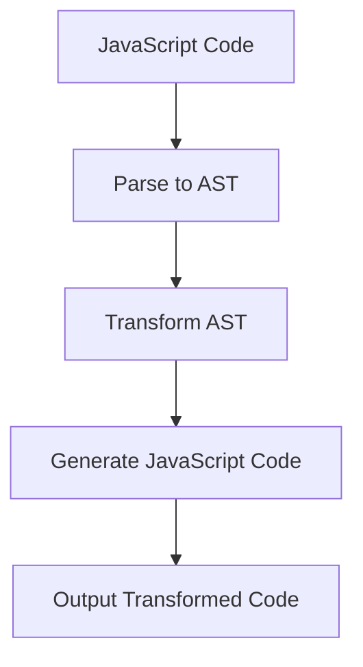

## 21.5 AST Manipulation with Babel

In the realm of JavaScript development, the ability to transform and optimize code programmatically is a powerful skill. This is where Abstract Syntax Tree (AST) manipulation comes into play, and tools like [Babel](https://babeljs.io/) make this process accessible and efficient. In this section, we'll delve into the intricacies of AST manipulation using Babel, exploring how it can be leveraged for code transformations, optimizations, and custom syntax extensions.

### Understanding Abstract Syntax Trees (AST)

An Abstract Syntax Tree (AST) is a tree representation of the abstract syntactic structure of source code. Each node in the tree denotes a construct occurring in the source code. The syntax tree does not represent every detail of the syntax, but rather the structural and semantic content.

#### Key Features of AST

- **Hierarchical Structure**: ASTs represent the hierarchical structure of the source code, capturing the nesting of statements and expressions.
- **Abstract Representation**: Unlike concrete syntax trees, ASTs abstract away certain syntactic details, focusing on the logical structure.
- **Facilitates Code Analysis and Transformation**: ASTs are pivotal in enabling static code analysis and transformations.

### Babel: Parsing JavaScript into AST

[Babel](https://babeljs.io/) is a popular JavaScript compiler that allows developers to use next-generation JavaScript, today. It parses JavaScript code into an AST, which can then be transformed and compiled back into JavaScript.

#### How Babel Works

1. **Parsing**: Babel uses [babel-parser](https://babeljs.io/docs/en/babel-parser) to parse JavaScript code into an AST.
2. **Transformation**: The AST is transformed using Babel plugins, which can modify the tree to implement new syntax or optimizations.
3. **Generation**: The transformed AST is then converted back into JavaScript code.

```javascript
// Example: Parsing JavaScript code into an AST
const babelParser = require('@babel/parser');

const code = `const square = (n) => n * n;`;
const ast = babelParser.parse(code, {
  sourceType: 'module',
  plugins: ['jsx']
});

console.log(ast);
```

### Writing Custom Babel Plugins

Babel plugins are the heart of AST manipulation. They allow you to traverse and transform the AST, enabling custom code transformations.

#### Creating a Simple Babel Plugin

Let's create a simple Babel plugin that transforms all `let` declarations into `var` declarations.

```javascript
module.exports = function(babel) {
  const { types: t } = babel;

  return {
    visitor: {
      VariableDeclaration(path) {
        if (path.node.kind === 'let') {
          path.node.kind = 'var';
        }
      }
    }
  };
};
```

#### Explanation

- **Visitor Pattern**: Babel uses the visitor pattern to traverse the AST. Each node type has a corresponding visitor method.
- **Path Manipulation**: The `path` object provides methods to manipulate the AST nodes.

### Use Cases for AST Manipulation

AST manipulation has a wide range of applications in modern web development:

1. **Code Optimization**: Transformations can optimize code for performance, such as inlining functions or removing dead code.
2. **Linting and Code Quality**: ASTs enable static analysis tools to enforce coding standards and detect potential errors.
3. **Transpiling New Syntax**: Babel can transpile modern JavaScript syntax into older versions for compatibility.

#### Example: Code Optimization

Consider a plugin that removes console.log statements from production code:

```javascript
module.exports = function(babel) {
  const { types: t } = babel;

  return {
    visitor: {
      CallExpression(path) {
        if (
          t.isMemberExpression(path.node.callee) &&
          path.node.callee.object.name === 'console' &&
          path.node.callee.property.name === 'log'
        ) {
          path.remove();
        }
      }
    }
  };
};
```

### Tools for AST Exploration

- **[AST Explorer](https://astexplorer.net/)**: A web-based tool for exploring ASTs. It supports various parsers and allows you to experiment with custom transformations.
- **babel-parser**: Babel's parser for generating ASTs from JavaScript code.

### Complexities and Learning Curve

While AST manipulation is powerful, it comes with a learning curve:

- **Understanding AST Structures**: Familiarity with the structure of ASTs is crucial for effective manipulation.
- **Complex Transformations**: Complex transformations require a deep understanding of both the source code and the AST.
- **Performance Considerations**: Transformations can impact performance, especially in large codebases.

### Visualizing AST Manipulation

To better understand how AST manipulation works, let's visualize the transformation process using a flowchart.



**Figure 1**: The process of transforming JavaScript code using Babel.

### Try It Yourself

Experiment with the provided code examples by modifying the transformations. For instance, try creating a plugin that converts all arrow functions to regular functions.

### Knowledge Check

- What is an AST and why is it important in code transformation?
- How does Babel parse JavaScript code into an AST?
- What are some common use cases for AST manipulation?

### Summary

In this section, we've explored the fundamentals of AST manipulation using Babel. From understanding the structure of ASTs to writing custom Babel plugins, we've covered the essential concepts and techniques. Remember, mastering AST manipulation opens up a world of possibilities for code transformation and optimization.

### Embrace the Journey

As you delve deeper into AST manipulation, keep experimenting and exploring new possibilities. The journey of mastering JavaScript design patterns is filled with opportunities to innovate and optimize. Stay curious and enjoy the process!

## Quiz: Mastering AST Manipulation with Babel



### What is an Abstract Syntax Tree (AST)?

- [x] A tree representation of the abstract syntactic structure of source code.
- [ ] A tool for compiling JavaScript code.
- [ ] A method for optimizing code performance.
- [ ] A library for parsing HTML.

> **Explanation:** An AST is a tree representation of the abstract syntactic structure of source code, used for code analysis and transformation.

### Which tool does Babel use to parse JavaScript code into an AST?

- [x] babel-parser
- [ ] babel-transform
- [ ] babel-generator
- [ ] babel-optimizer

> **Explanation:** Babel uses babel-parser to parse JavaScript code into an AST.

### What is the primary purpose of a Babel plugin?

- [x] To transform and manipulate the AST.
- [ ] To compile JavaScript code into machine code.
- [ ] To generate HTML from JavaScript.
- [ ] To optimize network requests.

> **Explanation:** Babel plugins are used to transform and manipulate the AST for code transformations.

### What is a common use case for AST manipulation?

- [x] Code optimization and linting.
- [ ] Compiling JavaScript into C++.
- [ ] Generating CSS from JavaScript.
- [ ] Creating databases.

> **Explanation:** AST manipulation is commonly used for code optimization, linting, and transpiling new syntax.

### Which of the following is a tool for exploring ASTs?

- [x] AST Explorer
- [ ] Babel Compiler
- [ ] JavaScript Optimizer
- [ ] Node.js

> **Explanation:** AST Explorer is a web-based tool for exploring ASTs and experimenting with transformations.

### What is the visitor pattern used for in Babel?

- [x] Traversing and manipulating the AST.
- [ ] Compiling code into machine language.
- [ ] Generating HTML templates.
- [ ] Optimizing network requests.

> **Explanation:** The visitor pattern is used in Babel to traverse and manipulate the AST nodes.

### What is a potential challenge of AST manipulation?

- [x] Understanding complex AST structures.
- [ ] Writing CSS styles.
- [ ] Managing network connections.
- [ ] Creating databases.

> **Explanation:** Understanding complex AST structures is a challenge in AST manipulation.

### What is the output of Babel's transformation process?

- [x] Transformed JavaScript code.
- [ ] Compiled machine code.
- [ ] HTML templates.
- [ ] CSS stylesheets.

> **Explanation:** Babel's transformation process outputs transformed JavaScript code.

### Which library is used by Babel to generate ASTs?

- [x] babel-parser
- [ ] babel-transform
- [ ] babel-generator
- [ ] babel-optimizer

> **Explanation:** Babel uses babel-parser to generate ASTs from JavaScript code.

### True or False: AST manipulation can be used for code linting.

- [x] True
- [ ] False

> **Explanation:** True, AST manipulation can be used for code linting and enforcing coding standards.


