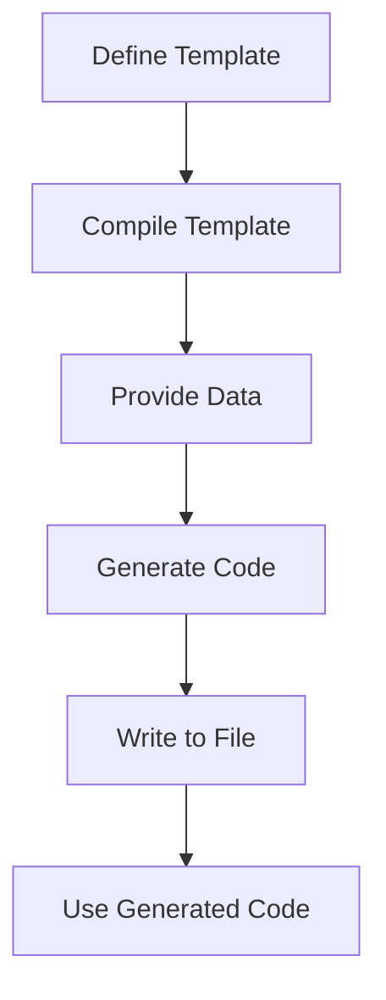

## 21.6 Code Generation Techniques

In the realm of software development, code generation is a powerful technique that can automate repetitive tasks, reduce human error, and enable advanced metaprogramming patterns. By generating code programmatically, developers can focus on more complex and creative aspects of their projects. In this section, we will explore various code generation techniques in JavaScript, discuss their benefits, and provide practical examples to illustrate their application.

### Understanding Code Generation

Code generation involves creating code automatically using tools or scripts. This can be particularly beneficial in scenarios where repetitive patterns emerge, such as creating API clients, generating boilerplate code, or producing documentation. By automating these tasks, developers can save time and reduce the likelihood of errors.

#### Benefits of Code Generation

- **Efficiency**: Automates repetitive coding tasks, allowing developers to focus on more complex problems.
- **Consistency**: Ensures uniformity across codebases, reducing discrepancies and potential bugs.
- **Scalability**: Facilitates the rapid development of large-scale applications by automating routine tasks.
- **Maintainability**: Reduces the need for manual updates, as changes can be propagated through templates or scripts.

### Scenarios for Code Generation

Let's explore some common scenarios where code generation can be particularly beneficial:

1. **API Client Generation**: Automatically generate client-side code to interact with APIs, ensuring consistency and reducing manual coding errors.
2. **Boilerplate Code**: Create standard code structures or templates for new projects, such as setting up a new React component or Express server.
3. **Documentation**: Generate documentation from code comments or annotations, ensuring that documentation stays up-to-date with the codebase.

### Generating Code Strings

One of the simplest forms of code generation involves creating code strings dynamically. This can be useful for generating small snippets of code or templates. Let's look at an example:

```javascript
// Function to generate a simple JavaScript function as a string
function generateFunctionString(functionName, params, body) {
    return `
    function ${functionName}(${params.join(', ')}) {
        ${body}
    }
    `;
}

// Example usage
const functionString = generateFunctionString('add', ['a', 'b'], 'return a + b;');
console.log(functionString);
```

In this example, we define a function `generateFunctionString` that takes a function name, parameters, and body as arguments and returns a string representing a JavaScript function. This technique can be extended to generate more complex code structures.

### Writing Code to Files

Once we have generated code strings, the next step is to write them to files. This can be achieved using Node.js's `fs` module, which provides file system operations.

```javascript
const fs = require('fs');

// Function to write generated code to a file
function writeCodeToFile(filename, code) {
    fs.writeFileSync(filename, code, 'utf8');
    console.log(`Code written to ${filename}`);
}

// Example usage
const code = generateFunctionString('multiply', ['x', 'y'], 'return x * y;');
writeCodeToFile('multiply.js', code);
```

This example demonstrates how to write a generated code string to a file named `multiply.js`. By automating this process, we can quickly generate and save code files.

### Using Templates for Code Generation

Templates can greatly simplify code generation by providing a structured way to define code patterns. Libraries like [Handlebars](https://handlebarsjs.com/) or [EJS](https://ejs.co/) can be used to create templates that are populated with dynamic data.

#### Example with Handlebars

```javascript
const Handlebars = require('handlebars');
const fs = require('fs');

// Define a template
const templateSource = `
function {{functionName}}({{#each params}}{{this}}, {{/each}}) {
    {{body}}
}
`;

// Compile the template
const template = Handlebars.compile(templateSource);

// Generate code using the template
const data = {
    functionName: 'subtract',
    params: ['a', 'b'],
    body: 'return a - b;'
};

const generatedCode = template(data);

// Write the generated code to a file
writeCodeToFile('subtract.js', generatedCode);
```

In this example, we use Handlebars to define a template for a JavaScript function. The template is then compiled and populated with data to generate the final code. This approach allows for more complex and flexible code generation.

### Code Generation Libraries

Several libraries and tools can assist with code generation in JavaScript. These libraries provide powerful features for creating and managing code templates.

- **Yeoman**: A scaffolding tool that helps generate boilerplate code for projects.
- **Plop**: A micro-generator framework that allows you to create custom generators for your projects.
- **Swagger Codegen**: Generates API client libraries from OpenAPI specifications.

#### Example with Plop

Plop is a simple tool that allows you to create generators for repetitive tasks. Here's a basic example of using Plop to generate a React component:

```javascript
// plopfile.js
module.exports = function (plop) {
    plop.setGenerator('component', {
        description: 'Create a new React component',
        prompts: [
            {
                type: 'input',
                name: 'name',
                message: 'Component name:'
            }
        ],
        actions: [
            {
                type: 'add',
                path: 'src/components/{{pascalCase name}}.js',
                templateFile: 'plop-templates/component.hbs'
            }
        ]
    });
};
```

In this example, we define a Plop generator that prompts the user for a component name and generates a new React component file using a Handlebars template.

### Use Cases for Code Generation

Code generation can be applied in various contexts to improve efficiency and consistency. Here are some common use cases:

- **Creating API Clients**: Automatically generate client-side code to interact with APIs, ensuring consistency and reducing manual coding errors.
- **Generating Boilerplate Code**: Create standard code structures or templates for new projects, such as setting up a new React component or Express server.
- **Producing Documentation**: Generate documentation from code comments or annotations, ensuring that documentation stays up-to-date with the codebase.

### Risks and Considerations

While code generation offers many benefits, it's important to consider potential risks and maintainability:

- **Complexity**: Generated code can become complex and difficult to understand, especially if the generation logic is not well-documented.
- **Readability**: Ensure that generated code is readable and follows coding standards to facilitate maintenance.
- **Overhead**: Consider the overhead of maintaining code generation scripts and templates, especially in rapidly evolving projects.

### Maintaining Code Readability

To maintain readability in generated code, consider the following best practices:

- **Use Descriptive Names**: Ensure that generated code uses clear and descriptive names for variables, functions, and classes.
- **Follow Coding Standards**: Adhere to established coding standards and conventions to ensure consistency.
- **Document Generation Logic**: Provide documentation for code generation scripts and templates to aid understanding and maintenance.

### Encouraging Maintainability

When implementing code generation, it's crucial to consider the long-term maintainability of the generated code. Here are some tips to ensure maintainability:

- **Modularize Generation Logic**: Break down code generation scripts into modular components to facilitate updates and maintenance.
- **Version Control**: Use version control systems to track changes in generation scripts and templates.
- **Regular Reviews**: Conduct regular reviews of generated code to ensure it remains relevant and up-to-date.

### Try It Yourself

To get hands-on experience with code generation, try modifying the examples provided in this section. Experiment with different templates, parameters, and generation logic to see how they affect the generated code. Consider creating a custom generator for a repetitive task in your own projects.

### Visualizing Code Generation Workflow

To better understand the code generation process, let's visualize a typical workflow using a Mermaid.js diagram:



This diagram illustrates the steps involved in generating code: defining a template, compiling it, providing data, generating code, writing it to a file, and finally using the generated code.

### Conclusion

Code generation is a powerful technique that can significantly enhance productivity and consistency in software development. By automating repetitive tasks, developers can focus on more complex and creative aspects of their projects. However, it's important to consider the potential risks and maintainability of generated code. By following best practices and using appropriate tools, developers can harness the full potential of code generation in JavaScript.

Remember, this is just the beginning. As you progress, you'll build more complex and interactive applications. Keep experimenting, stay curious, and enjoy the journey!

## Quiz: Mastering JavaScript Code Generation Techniques



### What is a primary benefit of code generation?

- [x] Automates repetitive coding tasks
- [ ] Increases code complexity
- [ ] Reduces code readability
- [ ] Eliminates the need for testing

> **Explanation:** Code generation automates repetitive tasks, allowing developers to focus on more complex problems.

### Which library can be used for creating templates in JavaScript?

- [x] Handlebars
- [ ] jQuery
- [ ] Lodash
- [ ] Axios

> **Explanation:** Handlebars is a popular library for creating templates in JavaScript.

### What is a common use case for code generation?

- [x] Creating API clients
- [ ] Debugging code
- [ ] Writing unit tests
- [ ] Refactoring legacy code

> **Explanation:** Code generation is often used to create API clients, ensuring consistency and reducing manual coding errors.

### Which Node.js module is used to write files in JavaScript?

- [x] fs
- [ ] http
- [ ] path
- [ ] os

> **Explanation:** The `fs` module in Node.js provides file system operations, including writing files.

### What is a potential risk of code generation?

- [x] Generated code can become complex and difficult to understand
- [ ] It always improves code readability
- [ ] It eliminates the need for documentation
- [ ] It reduces the need for testing

> **Explanation:** Generated code can become complex and difficult to understand, especially if the generation logic is not well-documented.

### Which tool is a scaffolding tool for generating boilerplate code?

- [x] Yeoman
- [ ] Babel
- [ ] Webpack
- [ ] ESLint

> **Explanation:** Yeoman is a scaffolding tool that helps generate boilerplate code for projects.

### What should be considered to maintain readability in generated code?

- [x] Use descriptive names and follow coding standards
- [ ] Avoid using comments
- [ ] Use complex variable names
- [ ] Ignore coding standards

> **Explanation:** To maintain readability, use descriptive names and follow coding standards.

### Which of the following is a code generation library?

- [x] Plop
- [ ] React
- [ ] Vue.js
- [ ] Angular

> **Explanation:** Plop is a micro-generator framework that allows you to create custom generators for your projects.

### What is an advantage of using templates in code generation?

- [x] Provides a structured way to define code patterns
- [ ] Increases code complexity
- [ ] Reduces code maintainability
- [ ] Eliminates the need for testing

> **Explanation:** Templates provide a structured way to define code patterns, making code generation more flexible and manageable.

### Code generation can help in maintaining code consistency across a codebase.

- [x] True
- [ ] False

> **Explanation:** Code generation ensures uniformity across codebases, reducing discrepancies and potential bugs.


