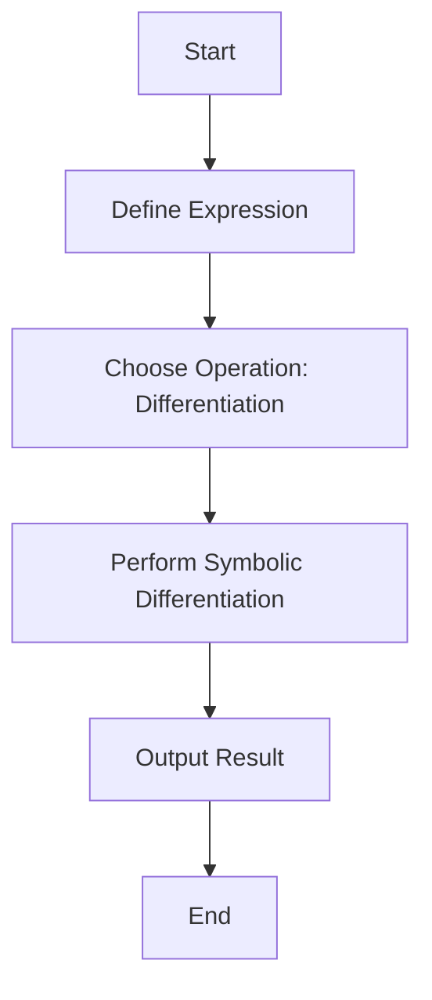

## 21.7 Symbolic Computation

Symbolic computation, also known as symbolic algebra, is a fascinating area of computer science where symbols and expressions are manipulated algebraically rather than numerically. This approach allows for the representation and manipulation of mathematical expressions in their symbolic form, enabling advanced mathematical computations that are crucial in fields such as scientific computing, engineering, and artificial intelligence.

### Understanding Symbolic Computation

Symbolic computation involves the manipulation of mathematical symbols and expressions to perform operations such as differentiation, integration, and equation solving. Unlike numerical computation, which deals with approximate values, symbolic computation retains the exact form of expressions, allowing for precise and analytical solutions.

#### Key Concepts

- **Symbols and Expressions**: In symbolic computation, variables are treated as symbols rather than specific values. This allows for the manipulation of expressions in their algebraic form.
- **Algebraic Manipulation**: Operations such as simplification, expansion, and factorization are performed on expressions to transform them into desired forms.
- **Analytical Solutions**: Symbolic computation provides exact solutions to mathematical problems, which is particularly useful in theoretical research and complex problem-solving.

### Symbolic Computation Libraries in JavaScript

JavaScript, traditionally known for its role in web development, has evolved to support advanced mathematical computations through various libraries. Two prominent libraries that facilitate symbolic computation in JavaScript are **Algebrite** and **mathjs**.

#### Algebrite

[Algebrite](http://algebrite.org/) is a JavaScript library designed for symbolic mathematics. It provides a wide range of functionalities, including symbolic differentiation, integration, equation solving, and more.

- **Installation**: You can install Algebrite using npm:
  ```bash
  npm install algebrite
  ```

- **Basic Usage**: Here's a simple example of using Algebrite for symbolic differentiation:
  ```javascript
  const Algebrite = require('algebrite');

  // Define a symbolic expression
  const expression = 'x^2 + 3*x + 2';

  // Perform symbolic differentiation
  const derivative = Algebrite.diff(expression, 'x').toString();

  console.log(`The derivative of ${expression} is ${derivative}`);
  // Output: The derivative of x^2 + 3*x + 2 is 2*x + 3
  ```

#### mathjs

[mathjs](https://mathjs.org/) is another powerful library that supports both numerical and symbolic computations. It offers a flexible expression parser and a comprehensive set of mathematical functions.

- **Installation**: Install mathjs via npm:
  ```bash
  npm install mathjs
  ```

- **Basic Usage**: Here's an example of using mathjs for symbolic integration:
  ```javascript
  const math = require('mathjs');

  // Define a symbolic expression
  const expression = 'x^2 + 3*x + 2';

  // Perform symbolic integration
  const integral = math.integrate(expression, 'x').toString();

  console.log(`The integral of ${expression} is ${integral}`);
  // Output: The integral of x^2 + 3*x + 2 is 1/3*x^3 + 3/2*x^2 + 2*x
  ```

### Applications of Symbolic Computation

Symbolic computation is widely used in various domains, including:

- **Scientific Computing**: Enables precise modeling and simulation of complex systems.
- **Engineering**: Facilitates the design and analysis of engineering systems through exact solutions.
- **Artificial Intelligence**: Supports symbolic reasoning and knowledge representation.

### Symbolic Differentiation and Integration

Symbolic differentiation and integration are fundamental operations in calculus, and symbolic computation allows these operations to be performed analytically.

#### Symbolic Differentiation

Symbolic differentiation involves finding the derivative of a function with respect to a variable. This operation is crucial in optimization, physics, and engineering.

- **Example**: Differentiate the expression \\( f(x) = x^3 + 2x^2 + x \\):
  ```javascript
  const Algebrite = require('algebrite');

  const expression = 'x^3 + 2*x^2 + x';
  const derivative = Algebrite.diff(expression, 'x').toString();

  console.log(`The derivative of ${expression} is ${derivative}`);
  // Output: The derivative of x^3 + 2*x^2 + x is 3*x^2 + 4*x + 1
  ```

#### Symbolic Integration

Symbolic integration involves finding the integral of a function, which is essential in calculating areas, volumes, and solving differential equations.

- **Example**: Integrate the expression \\( f(x) = x^2 + 3x + 2 \\):
  ```javascript
  const math = require('mathjs');

  const expression = 'x^2 + 3*x + 2';
  const integral = math.integrate(expression, 'x').toString();

  console.log(`The integral of ${expression} is ${integral}`);
  // Output: The integral of x^2 + 3*x + 2 is 1/3*x^3 + 3/2*x^2 + 2*x
  ```

### Solving Equations Symbolically

Symbolic computation allows for the exact solving of algebraic equations, which is vital in many scientific and engineering applications.

- **Example**: Solve the quadratic equation \\( x^2 + 3x + 2 = 0 \\):
  ```javascript
  const Algebrite = require('algebrite');

  const equation = 'x^2 + 3*x + 2 = 0';
  const solutions = Algebrite.roots(equation).toString();

  console.log(`The solutions of ${equation} are ${solutions}`);
  // Output: The solutions of x^2 + 3*x + 2 = 0 are -1, -2
  ```

### Limitations and Performance Considerations

While symbolic computation offers precise solutions, it comes with certain limitations and performance considerations:

- **Complexity**: Symbolic manipulation can become computationally intensive for large and complex expressions.
- **Performance**: Symbolic computations are generally slower than numerical computations due to the complexity of algebraic manipulations.
- **Memory Usage**: Large symbolic expressions can consume significant memory resources.

### Encouraging Experimentation

To fully harness the power of symbolic computation in JavaScript, we encourage you to experiment with the libraries discussed. Try modifying the code examples provided, or explore additional functionalities such as symbolic simplification, expansion, and factorization.

### Visualizing Symbolic Computation

To better understand the process of symbolic computation, let's visualize the steps involved in symbolic differentiation using a flowchart.



**Figure**: Flowchart illustrating the process of symbolic differentiation.

### Knowledge Check

To reinforce your understanding of symbolic computation in JavaScript, try answering the following questions and challenges.

## Symbolic Computation Quiz: Test Your Knowledge



### What is symbolic computation?

- [x] Manipulation of symbols and expressions algebraically
- [ ] Numerical computation of mathematical expressions
- [ ] Approximation of mathematical solutions
- [ ] Graphical representation of data

> **Explanation:** Symbolic computation involves the manipulation of symbols and expressions in their algebraic form, allowing for precise and analytical solutions.

### Which library is used for symbolic mathematics in JavaScript?

- [x] Algebrite
- [ ] Lodash
- [ ] D3.js
- [ ] Axios

> **Explanation:** Algebrite is a JavaScript library designed for symbolic mathematics, providing functionalities such as differentiation, integration, and equation solving.

### What is the output of differentiating the expression \( x^2 + 3x + 2 \) using Algebrite?

- [x] 2*x + 3
- [ ] x^2 + 3x + 2
- [ ] 3*x^2 + 4*x + 1
- [ ] 1/3*x^3 + 3/2*x^2 + 2*x

> **Explanation:** The derivative of \( x^2 + 3x + 2 \) is \( 2*x + 3 \).

### Which operation is NOT typically performed in symbolic computation?

- [ ] Differentiation
- [ ] Integration
- [x] Approximation
- [ ] Equation Solving

> **Explanation:** Symbolic computation focuses on exact solutions, not approximations.

### What is a limitation of symbolic computation?

- [x] Computational intensity for large expressions
- [ ] Inability to handle algebraic expressions
- [ ] Lack of precision in solutions
- [ ] Limited to numerical calculations

> **Explanation:** Symbolic computation can become computationally intensive for large and complex expressions.

### Which library supports both numerical and symbolic computations in JavaScript?

- [x] mathjs
- [ ] jQuery
- [ ] React
- [ ] Express

> **Explanation:** mathjs supports both numerical and symbolic computations, offering a flexible expression parser and a comprehensive set of mathematical functions.

### What is the integral of the expression \( x^2 + 3x + 2 \) using mathjs?

- [x] 1/3*x^3 + 3/2*x^2 + 2*x
- [ ] 2*x + 3
- [ ] x^2 + 3x + 2
- [ ] 3*x^2 + 4*x + 1

> **Explanation:** The integral of \( x^2 + 3x + 2 \) is \( 1/3*x^3 + 3/2*x^2 + 2*x \).

### What is a common application of symbolic computation?

- [x] Scientific computing
- [ ] Web design
- [ ] Data visualization
- [ ] Network security

> **Explanation:** Symbolic computation is widely used in scientific computing for precise modeling and simulation of complex systems.

### True or False: Symbolic computation provides approximate solutions.

- [ ] True
- [x] False

> **Explanation:** Symbolic computation provides exact solutions, unlike numerical computation which deals with approximations.

### Which of the following is NOT a feature of symbolic computation?

- [ ] Exact solutions
- [ ] Algebraic manipulation
- [x] Graphical rendering
- [ ] Analytical solutions

> **Explanation:** Symbolic computation focuses on exact and analytical solutions through algebraic manipulation, not graphical rendering.



Remember, this is just the beginning. As you progress, you'll build more complex and interactive web pages. Keep experimenting, stay curious, and enjoy the journey!

---


