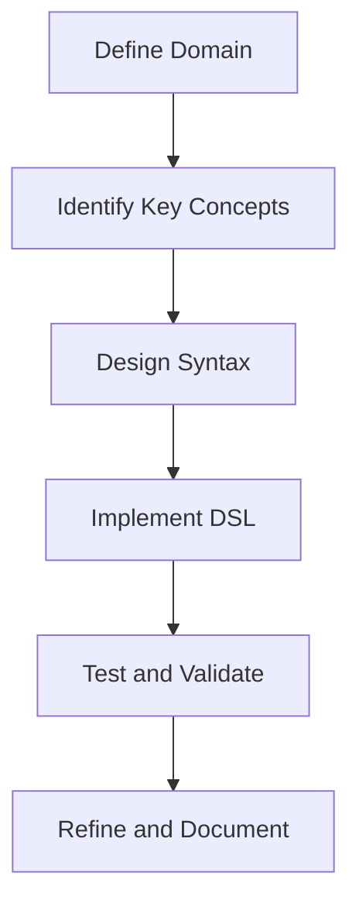

## 21.9 Domain-Specific Languages (DSLs)

### Introduction to Domain-Specific Languages (DSLs)

Domain-Specific Languages (DSLs) are specialized mini-languages tailored to a particular application domain. Unlike general-purpose programming languages, DSLs are designed to be more expressive and concise for specific tasks, making them powerful tools for developers who need to solve domain-specific problems efficiently.

In JavaScript, DSLs can be implemented as internal DSLs, which means they are built using the host language's syntax and semantics. This approach allows developers to leverage JavaScript's flexibility and dynamic nature to create expressive and readable code tailored to specific domains.

### What is a Domain-Specific Language?

A Domain-Specific Language is a programming language or specification language dedicated to a particular problem domain, a particular problem representation technique, and/or a particular solution technique. DSLs are often used to simplify complex tasks by providing a higher level of abstraction and a more intuitive syntax for domain experts.

#### Characteristics of DSLs

- **Expressiveness**: DSLs provide constructs that closely match the domain concepts, making them more expressive for domain-specific tasks.
- **Conciseness**: DSLs allow for more concise code, reducing boilerplate and focusing on the essential parts of the problem.
- **Readability**: DSLs are often designed to be readable by non-programmers, such as domain experts, enabling better collaboration and understanding.

### Examples of Internal DSLs in JavaScript

JavaScript's flexibility makes it an excellent choice for creating internal DSLs. Here are a few examples of how DSLs can be implemented in JavaScript:

#### Example 1: Query Builder DSL

A query builder DSL allows developers to construct database queries using a more intuitive and readable syntax. Here's a simple example of a query builder DSL in JavaScript:

```javascript
class QueryBuilder {
  constructor() {
    this.query = {};
  }

  select(fields) {
    this.query.select = fields;
    return this;
  }

  from(table) {
    this.query.from = table;
    return this;
  }

  where(condition) {
    this.query.where = condition;
    return this;
  }

  build() {
    return this.query;
  }
}

// Usage
const query = new QueryBuilder()
  .select(['name', 'age'])
  .from('users')
  .where({ age: { $gt: 18 } })
  .build();

console.log(query);
```

#### Example 2: Configuration File DSL

Configuration files often benefit from a DSL approach, allowing for more readable and maintainable configurations. Here's an example of a configuration DSL in JavaScript:

```javascript
function configureApp(config) {
  return {
    setPort(port) {
      config.port = port;
      return this;
    },
    enableFeature(feature) {
      config.features.push(feature);
      return this;
    },
    setDatabase(dbConfig) {
      config.database = dbConfig;
      return this;
    },
    getConfig() {
      return config;
    }
  };
}

// Usage
const appConfig = configureApp({ features: [] })
  .setPort(3000)
  .enableFeature('logging')
  .setDatabase({ host: 'localhost', port: 5432 })
  .getConfig();

console.log(appConfig);
```

### Techniques for Designing DSLs

Designing a DSL involves several techniques to ensure it is expressive, readable, and maintainable. Here are some key techniques:

#### Fluent Interfaces

Fluent interfaces are a common technique used in DSL design. They allow method chaining, enabling a more readable and expressive syntax. In JavaScript, fluent interfaces can be implemented by returning `this` from methods, allowing for chaining.

#### Method Chaining

Method chaining is a technique where each method returns the object it belongs to, allowing multiple method calls to be chained together. This approach is often used in DSLs to create a more natural and readable syntax.

#### Use Cases for DSLs

DSLs can be applied in various domains to simplify complex tasks. Here are some common use cases:

- **Query Builders**: DSLs can be used to construct database queries in a more readable and maintainable way.
- **Configuration Files**: DSLs can simplify the creation and management of configuration files, making them more intuitive and less error-prone.
- **Testing Frameworks**: DSLs can be used to create expressive and readable testing frameworks, allowing for more natural test definitions.

### Considerations for Parsing, Validation, and Error Handling

When designing a DSL, it's essential to consider parsing, validation, and error handling to ensure the DSL is robust and user-friendly.

#### Parsing

Parsing is the process of analyzing a string of symbols, either in natural language or computer languages. In the context of DSLs, parsing involves converting the DSL syntax into a format that can be executed or interpreted by the host language.

#### Validation

Validation ensures that the DSL syntax and semantics are correct and that the DSL is used as intended. This step is crucial to prevent errors and ensure the DSL behaves as expected.

#### Error Handling

Error handling involves providing meaningful error messages and handling errors gracefully. This step is essential to ensure that users of the DSL can quickly identify and resolve issues.

### Balancing Expressiveness with Readability and Maintainability

When designing a DSL, it's crucial to balance expressiveness with readability and maintainability. While DSLs should be expressive and concise, they should also be easy to read and maintain. Here are some tips for achieving this balance:

- **Keep it Simple**: Avoid adding unnecessary complexity to the DSL. Focus on the essential parts of the domain and keep the syntax simple and intuitive.
- **Provide Clear Documentation**: Ensure that the DSL is well-documented, with clear examples and explanations of its syntax and semantics.
- **Encourage Consistency**: Encourage consistent usage of the DSL to ensure that it remains readable and maintainable over time.

### Try It Yourself

To get a better understanding of DSLs, try modifying the code examples provided in this section. Experiment with adding new methods to the query builder or configuration DSLs, and see how they affect the syntax and functionality. This hands-on approach will help you gain a deeper understanding of how DSLs work and how they can be applied in your projects.

### Visualizing DSL Design

To better understand how DSLs are structured and how they interact with the host language, let's visualize the process using a flowchart. This diagram illustrates the steps involved in designing and implementing a DSL in JavaScript.



**Diagram Description**: This flowchart represents the process of designing a DSL. It starts with defining the domain and identifying key concepts, followed by designing the syntax, implementing the DSL, testing and validating it, and finally refining and documenting the DSL.

### References and Further Reading

For more information on DSLs and their applications, consider exploring the following resources:

- [Martin Fowler's DSL Book](https://martinfowler.com/books/dsl.html)
- [MDN Web Docs on JavaScript](https://developer.mozilla.org/en-US/docs/Web/JavaScript)
- [Fluent Interface Pattern](https://en.wikipedia.org/wiki/Fluent_interface)

### Knowledge Check

To reinforce your understanding of DSLs, consider the following questions and exercises:

1. What are the key characteristics of a Domain-Specific Language?
2. How can method chaining be used to create a fluent interface in JavaScript?
3. What are some common use cases for DSLs in JavaScript applications?
4. How can you ensure that a DSL is both expressive and maintainable?
5. Try modifying the query builder example to add support for sorting results.

### Embrace the Journey

Remember, creating a DSL is an iterative process. As you experiment with different designs and approaches, you'll gain a deeper understanding of how to create expressive and maintainable DSLs. Keep experimenting, stay curious, and enjoy the journey!

### Quiz: Mastering Domain-Specific Languages in JavaScript



### What is a Domain-Specific Language (DSL)?

- [x] A specialized mini-language tailored to a specific application domain
- [ ] A general-purpose programming language
- [ ] A type of database query language
- [ ] A language used for web development

> **Explanation:** A DSL is a specialized mini-language designed for a specific application domain, providing more expressive and concise ways to handle domain-specific tasks.

### Which of the following is a characteristic of a DSL?

- [x] Expressiveness
- [x] Conciseness
- [x] Readability
- [ ] Complexity

> **Explanation:** DSLs are characterized by their expressiveness, conciseness, and readability, making them suitable for domain-specific tasks.

### What technique is commonly used in DSL design to enable method chaining?

- [x] Fluent Interfaces
- [ ] Callback Functions
- [ ] Event Listeners
- [ ] Promises

> **Explanation:** Fluent interfaces are commonly used in DSL design to enable method chaining, allowing for a more readable and expressive syntax.

### What is the purpose of parsing in the context of DSLs?

- [x] Converting DSL syntax into a format that can be executed or interpreted
- [ ] Compiling the DSL into machine code
- [ ] Encrypting the DSL for security
- [ ] Translating the DSL into another language

> **Explanation:** Parsing in the context of DSLs involves converting the DSL syntax into a format that can be executed or interpreted by the host language.

### Which of the following is a common use case for DSLs?

- [x] Query Builders
- [x] Configuration Files
- [x] Testing Frameworks
- [ ] Operating System Kernels

> **Explanation:** Common use cases for DSLs include query builders, configuration files, and testing frameworks, where they provide more expressive and concise solutions.

### How can you ensure that a DSL is maintainable?

- [x] Keep the syntax simple and intuitive
- [x] Provide clear documentation
- [x] Encourage consistent usage
- [ ] Add as many features as possible

> **Explanation:** To ensure a DSL is maintainable, keep the syntax simple and intuitive, provide clear documentation, and encourage consistent usage.

### What is the benefit of using a DSL for configuration files?

- [x] Simplifies creation and management
- [ ] Increases complexity
- [ ] Requires more code
- [ ] Reduces readability

> **Explanation:** Using a DSL for configuration files simplifies their creation and management, making them more intuitive and less error-prone.

### What is the role of validation in DSL design?

- [x] Ensuring the DSL syntax and semantics are correct
- [ ] Compiling the DSL into machine code
- [ ] Encrypting the DSL for security
- [ ] Translating the DSL into another language

> **Explanation:** Validation ensures that the DSL syntax and semantics are correct, preventing errors and ensuring the DSL behaves as expected.

### What is a key consideration when designing a DSL?

- [x] Balancing expressiveness with readability and maintainability
- [ ] Adding as many features as possible
- [ ] Making it as complex as possible
- [ ] Ensuring it is only usable by developers

> **Explanation:** A key consideration when designing a DSL is balancing expressiveness with readability and maintainability to ensure it is both powerful and user-friendly.

### True or False: DSLs are only used in web development.

- [ ] True
- [x] False

> **Explanation:** False. DSLs are used in various domains, not just web development, to provide expressive and concise solutions for domain-specific tasks.




