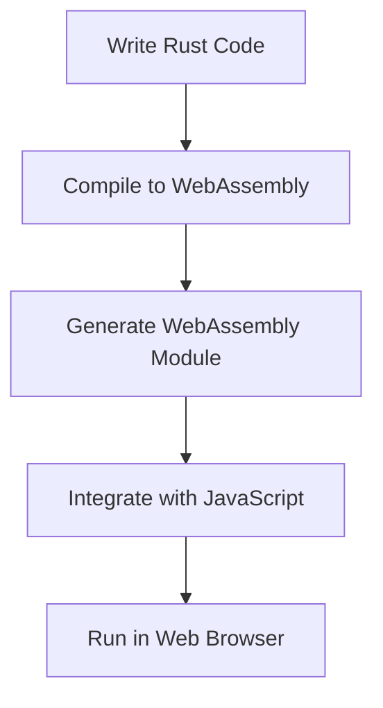

## 22.10 Rust and WebAssembly Interoperability

In the ever-evolving landscape of web development, performance and reliability are paramount. As applications grow in complexity, developers seek ways to optimize performance-critical parts of their code. Enter Rust and WebAssembly (Wasm), a powerful duo that can significantly enhance the capabilities of JavaScript applications. In this section, we'll explore how Rust, known for its safety and performance, can be compiled to WebAssembly and integrated seamlessly with JavaScript.

### Introduction to Rust

Rust is a systems programming language that emphasizes safety, speed, and concurrency. It achieves memory safety without a garbage collector, making it an excellent choice for performance-critical applications. Rust's ownership model ensures that data races and null pointer dereferences are virtually eliminated, providing a robust foundation for building reliable software.

#### Key Benefits of Rust

- **Memory Safety**: Rust's ownership system prevents common bugs such as null pointer dereferences and buffer overflows.
- **Performance**: Rust's performance is comparable to C and C++, making it ideal for computationally intensive tasks.
- **Concurrency**: Rust's concurrency model allows developers to write safe concurrent code without data races.
- **Ecosystem**: Rust has a growing ecosystem with tools and libraries that support various domains, including web development.

### Compiling Rust to WebAssembly

WebAssembly is a binary instruction format that allows code written in languages like Rust to run in web browsers at near-native speed. By compiling Rust to WebAssembly, developers can leverage Rust's performance and safety features in web applications.

#### Steps to Compile Rust to WebAssembly

1. **Install Rust and wasm-pack**: Ensure you have Rust installed on your system. Then, install `wasm-pack`, a tool that streamlines the process of compiling Rust to WebAssembly.

   ```bash
   # Install Rust
   curl --proto '=https' --tlsv1.2 -sSf https://sh.rustup.rs | sh

   # Install wasm-pack
   cargo install wasm-pack
   ```

2. **Create a New Rust Project**: Use Cargo, Rust's package manager, to create a new project.

   ```bash
   cargo new my_wasm_project --lib
   cd my_wasm_project
   ```

3. **Write Rust Code**: Implement your Rust code in the `src/lib.rs` file. Here's a simple example of a function that adds two numbers:

   ```rust
   #[no_mangle]
   pub extern "C" fn add(a: i32, b: i32) -> i32 {
       a + b
   }
   ```

4. **Compile to WebAssembly**: Use `wasm-pack` to compile your Rust code to WebAssembly.

   ```bash
   wasm-pack build --target web
   ```

5. **Integrate with JavaScript**: Use the generated WebAssembly module in your JavaScript application.

### Integrating Rust-Generated WebAssembly with JavaScript

Once you've compiled your Rust code to WebAssembly, you can integrate it into your JavaScript application. The following example demonstrates how to load and use a WebAssembly module in a JavaScript application.

#### JavaScript Integration Example

```html
<!DOCTYPE html>
<html lang="en">
<head>
    <meta charset="UTF-8">
    <meta name="viewport" content="width=device-width, initial-scale=1.0">
    <title>Rust and WebAssembly Integration</title>
</head>
<body>
    <h1>Rust and WebAssembly Integration</h1>
    <button id="calculate">Calculate</button>
    <p id="result"></p>

    <script type="module">
        import init, { add } from './pkg/my_wasm_project.js';

        async function run() {
            await init();
            const result = add(5, 3);
            document.getElementById('result').textContent = `5 + 3 = ${result}`;
        }

        document.getElementById('calculate').addEventListener('click', run);
    </script>
</body>
</html>
```

### Tooling for Rust and WebAssembly

Several tools facilitate the process of compiling Rust to WebAssembly and integrating it with JavaScript. Two of the most popular tools are `wasm-bindgen` and `wasm-pack`.

#### wasm-bindgen

[wasm-bindgen](https://github.com/rustwasm/wasm-bindgen) is a library and CLI tool that facilitates high-level interactions between Rust and JavaScript. It allows Rust code to call JavaScript functions and vice versa, making it easier to integrate Rust-generated WebAssembly modules into JavaScript applications.

#### wasm-pack

[wasm-pack](https://github.com/rustwasm/wasm-pack) is a tool that streamlines the process of building, testing, and publishing Rust-generated WebAssembly packages. It automates many of the steps involved in compiling Rust to WebAssembly, making it easier for developers to focus on writing code.

### Use Cases for Rust and WebAssembly

Rust and WebAssembly are particularly well-suited for performance-critical parts of an application. Here are some use cases where Rust can optimize performance:

- **Game Development**: Rust's performance and safety make it an excellent choice for game engines and physics simulations.
- **Data Processing**: Rust can handle large datasets efficiently, making it ideal for data processing and analysis tasks.
- **Cryptography**: Rust's safety features ensure that cryptographic operations are secure and reliable.
- **Real-Time Applications**: Rust's performance and concurrency model make it suitable for real-time applications such as video streaming and virtual reality.

### Resources for Learning Rust and WebAssembly Interoperability

To further explore Rust and WebAssembly interoperability, consider the following resources:

- [The Rust Programming Language](https://doc.rust-lang.org/book/): The official Rust book, a comprehensive guide to learning Rust.
- [Rust and WebAssembly](https://rustwasm.github.io/book/): A guide to using Rust and WebAssembly together.
- [MDN Web Docs on WebAssembly](https://developer.mozilla.org/en-US/docs/WebAssembly): A detailed resource on WebAssembly and its use in web development.

### Visualizing Rust and WebAssembly Integration

To better understand how Rust and WebAssembly interact with JavaScript, let's visualize the process using a flowchart.



**Figure 1**: The process of integrating Rust-generated WebAssembly with JavaScript.

### Knowledge Check

Before we conclude, let's reinforce our understanding with a few questions:

- What are the key benefits of using Rust for web development?
- How does `wasm-bindgen` facilitate Rust and JavaScript interoperability?
- In what scenarios would you choose Rust over JavaScript for performance optimization?

### Conclusion

Rust and WebAssembly offer a powerful combination for enhancing JavaScript applications with improved performance and reliability. By leveraging Rust's safety and performance features, developers can optimize performance-critical parts of their applications, resulting in faster and more reliable web experiences. Remember, this is just the beginning. As you progress, you'll discover more ways to integrate Rust and WebAssembly into your projects. Keep experimenting, stay curious, and enjoy the journey!

## Test Your Knowledge on Rust and WebAssembly Interoperability



### What is a key benefit of using Rust in web development?

- [x] Memory safety without a garbage collector
- [ ] Built-in garbage collection
- [ ] Dynamic typing
- [ ] Lack of concurrency support

> **Explanation:** Rust provides memory safety without a garbage collector, making it ideal for performance-critical applications.

### Which tool is used to compile Rust code to WebAssembly?

- [x] wasm-pack
- [ ] npm
- [ ] Webpack
- [ ] Babel

> **Explanation:** wasm-pack is a tool that streamlines the process of compiling Rust to WebAssembly.

### What does wasm-bindgen facilitate?

- [x] High-level interactions between Rust and JavaScript
- [ ] Low-level memory management
- [ ] Dynamic typing in Rust
- [ ] Automatic code generation

> **Explanation:** wasm-bindgen facilitates high-level interactions between Rust and JavaScript, allowing them to call each other's functions.

### In which scenario is Rust particularly beneficial?

- [x] Performance-critical applications
- [ ] Simple static websites
- [ ] Basic form validation
- [ ] Styling web pages

> **Explanation:** Rust is beneficial for performance-critical applications due to its speed and safety features.

### What is the primary purpose of WebAssembly?

- [x] To run code at near-native speed in web browsers
- [ ] To replace JavaScript entirely
- [ ] To provide a new styling language
- [ ] To manage databases

> **Explanation:** WebAssembly allows code to run at near-native speed in web browsers, enhancing performance.

### Which of the following is a use case for Rust and WebAssembly?

- [x] Game development
- [ ] Basic HTML rendering
- [ ] CSS styling
- [ ] Simple animations

> **Explanation:** Rust and WebAssembly are well-suited for game development due to their performance and safety features.

### What is the role of wasm-pack in Rust and WebAssembly integration?

- [x] It automates the process of building, testing, and publishing Rust-generated WebAssembly packages.
- [ ] It provides a GUI for Rust development.
- [ ] It manages CSS styles.
- [ ] It compiles JavaScript to WebAssembly.

> **Explanation:** wasm-pack automates the process of building, testing, and publishing Rust-generated WebAssembly packages.

### How does Rust ensure memory safety?

- [x] Through its ownership model
- [ ] By using a garbage collector
- [ ] By dynamically typing variables
- [ ] By using global variables

> **Explanation:** Rust ensures memory safety through its ownership model, which prevents common bugs like null pointer dereferences.

### Which library helps Rust call JavaScript functions?

- [x] wasm-bindgen
- [ ] React
- [ ] Angular
- [ ] Vue.js

> **Explanation:** wasm-bindgen helps Rust call JavaScript functions and vice versa, facilitating interoperability.

### True or False: Rust can be used to optimize performance-critical parts of a web application.

- [x] True
- [ ] False

> **Explanation:** Rust is ideal for optimizing performance-critical parts of a web application due to its speed and safety features.


