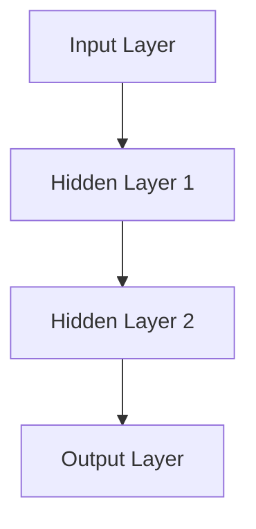

## 22.12 Artificial Intelligence and Neural Networks

Artificial Intelligence (AI) and neural networks have become integral components of modern software development, enabling applications to perform complex data analysis and make intelligent decisions. In this section, we will explore how JavaScript can be used to implement AI and neural networks, leveraging libraries like Brain.js and TensorFlow.js. We will also discuss the practical applications of these technologies, such as image recognition, natural language processing, and predictive analytics, while considering ethical implications and data privacy concerns.

### Understanding Artificial Intelligence and Neural Networks

Artificial Intelligence refers to the simulation of human intelligence in machines, enabling them to perform tasks that typically require human cognition, such as visual perception, speech recognition, decision-making, and language translation. Neural networks, a subset of AI, are computational models inspired by the human brain's structure and function. They consist of interconnected nodes (neurons) that process data and learn patterns through training.

#### Key Concepts of Neural Networks

1. **Neurons and Layers**: Neural networks are composed of layers of neurons. Each neuron receives input, processes it, and passes the output to the next layer. Layers can be categorized into input, hidden, and output layers.

2. **Activation Functions**: These functions determine the output of a neuron. Common activation functions include sigmoid, tanh, and ReLU (Rectified Linear Unit).

3. **Training and Learning**: Neural networks learn by adjusting weights and biases through a process called training. This involves feeding data into the network, calculating errors, and updating weights using algorithms like backpropagation.

4. **Overfitting and Underfitting**: Overfitting occurs when a model learns the training data too well, failing to generalize to new data. Underfitting happens when a model is too simple to capture the underlying patterns.

### JavaScript Libraries for AI and Neural Networks

JavaScript, traditionally a front-end language, has evolved to support AI and neural networks through powerful libraries. Let's explore two popular libraries: Brain.js and TensorFlow.js.

#### Brain.js

[Brain.js](https://brain.js.org/) is a simple, lightweight library for neural networks in JavaScript. It is suitable for beginners and can be used for tasks like pattern recognition and classification.

- **Installation**: You can install Brain.js using npm:

  ```bash
  npm install brain.js
  ```

- **Creating a Simple Neural Network**: Let's create a basic neural network using Brain.js to recognize patterns.

  ```javascript
  const brain = require('brain.js');
  const net = new brain.NeuralNetwork();

  // Training data
  const trainingData = [
    { input: [0, 0], output: [0] },
    { input: [0, 1], output: [1] },
    { input: [1, 0], output: [1] },
    { input: [1, 1], output: [0] }
  ];

  // Train the network
  net.train(trainingData);

  // Test the network
  const output = net.run([1, 0]); // [1]
  console.log(output);
  ```

  > **Explanation**: This example demonstrates a simple XOR problem, where the network learns to output 1 for inputs [0, 1] and [1, 0], and 0 otherwise.

#### TensorFlow.js

[TensorFlow.js](https://www.tensorflow.org/js) is a more comprehensive library that allows you to build and train machine learning models in the browser or on Node.js. It supports both high-level APIs for quick model creation and low-level APIs for custom model development.

- **Installation**: Install TensorFlow.js via npm:

  ```bash
  npm install @tensorflow/tfjs
  ```

- **Building a Neural Network**: Here's how to build a simple neural network using TensorFlow.js.

  ```javascript
  const tf = require('@tensorflow/tfjs');

  // Define a model for linear regression
  const model = tf.sequential();
  model.add(tf.layers.dense({ units: 1, inputShape: [1] }));

  // Compile the model
  model.compile({ loss: 'meanSquaredError', optimizer: 'sgd' });

  // Generate some synthetic data for training
  const xs = tf.tensor2d([1, 2, 3, 4], [4, 1]);
  const ys = tf.tensor2d([1, 3, 5, 7], [4, 1]);

  // Train the model
  model.fit(xs, ys, { epochs: 10 }).then(() => {
    // Use the model to predict values
    model.predict(tf.tensor2d([5], [1, 1])).print();
  });
  ```

  > **Explanation**: This example demonstrates a simple linear regression model, where the network learns to predict the output based on input data.

### Training Models: Browser vs. Server-Side

Training AI models can be resource-intensive, and choosing between browser-based and server-side training depends on your application's requirements.

- **Browser-Based Training**: Ideal for small models and real-time applications. It leverages the client's computational resources, reducing server load. However, it may be limited by the client's hardware capabilities.

- **Server-Side Training**: Suitable for large models and complex computations. It utilizes powerful server resources, allowing for faster training and deployment. However, it requires data transfer between the client and server, which may raise privacy concerns.

### Applications of AI and Neural Networks

AI and neural networks have a wide range of applications in web development:

1. **Image Recognition**: Identifying objects and patterns in images. Useful in applications like facial recognition and content moderation.

2. **Natural Language Processing (NLP)**: Analyzing and understanding human language. Applications include chatbots, sentiment analysis, and language translation.

3. **Predictive Analytics**: Forecasting future trends based on historical data. Used in recommendation systems, financial forecasting, and customer behavior analysis.

### Ethical Considerations and Data Privacy

As we integrate AI into our applications, it's crucial to consider ethical implications and data privacy:

- **Bias and Fairness**: Ensure models are trained on diverse datasets to avoid bias and discrimination.

- **Transparency**: Make AI decisions transparent and explainable to users.

- **Data Privacy**: Protect user data by implementing robust security measures and obtaining consent for data collection and processing.

### Try It Yourself

Experiment with the code examples provided in this section. Try modifying the neural network architecture, training data, or activation functions to observe how these changes affect the model's performance. Consider building a simple application that utilizes AI, such as a chatbot or image classifier.

### Visualizing Neural Networks

To better understand the structure and flow of neural networks, let's visualize a simple neural network using Mermaid.js.



> **Description**: This diagram represents a basic neural network with two hidden layers. Each layer consists of neurons that process data and pass it to the next layer.

### Knowledge Check

- What are the key components of a neural network?
- How do activation functions influence a neural network's output?
- What are the advantages and limitations of training models in the browser?
- How can AI be applied to natural language processing tasks?
- What ethical considerations should be taken into account when developing AI applications?

### Summary

In this section, we explored the implementation of artificial intelligence and neural networks in JavaScript applications. We introduced libraries like Brain.js and TensorFlow.js, provided examples of building simple neural network models, and discussed the trade-offs between browser-based and server-side training. We also highlighted practical applications and emphasized the importance of ethical considerations and data privacy.

Remember, this is just the beginning. As you progress, you'll build more complex and interactive applications. Keep experimenting, stay curious, and enjoy the journey!

## Quiz: Mastering AI and Neural Networks in JavaScript



### What is a neural network composed of?

- [x] Neurons and layers
- [ ] Only neurons
- [ ] Only layers
- [ ] Activation functions

> **Explanation:** Neural networks are composed of neurons organized into layers.

### Which JavaScript library is suitable for beginners to implement neural networks?

- [x] Brain.js
- [ ] TensorFlow.js
- [ ] React.js
- [ ] Angular.js

> **Explanation:** Brain.js is a simple, lightweight library suitable for beginners.

### What is the purpose of an activation function in a neural network?

- [x] To determine the output of a neuron
- [ ] To initialize weights
- [ ] To compile the model
- [ ] To train the model

> **Explanation:** Activation functions determine the output of a neuron based on its input.

### What is overfitting in the context of neural networks?

- [x] When a model learns the training data too well
- [ ] When a model fails to learn the training data
- [ ] When a model is too simple
- [ ] When a model is too complex

> **Explanation:** Overfitting occurs when a model learns the training data too well and fails to generalize to new data.

### Which of the following is an application of AI in web development?

- [x] Image recognition
- [x] Natural language processing
- [ ] Database management
- [ ] File compression

> **Explanation:** AI can be applied to image recognition and natural language processing tasks.

### What is a key advantage of browser-based training?

- [x] Reduces server load
- [ ] Requires powerful server resources
- [ ] Increases data transfer
- [ ] Enhances data privacy

> **Explanation:** Browser-based training leverages the client's computational resources, reducing server load.

### What should be considered to ensure AI models are fair?

- [x] Training on diverse datasets
- [ ] Using only large datasets
- [ ] Avoiding transparency
- [ ] Ignoring data privacy

> **Explanation:** Training on diverse datasets helps ensure AI models are fair and unbiased.

### How can AI decisions be made transparent to users?

- [x] By explaining the decision-making process
- [ ] By hiding the algorithms
- [ ] By using complex models
- [ ] By avoiding user feedback

> **Explanation:** Explaining the decision-making process makes AI decisions transparent to users.

### What is the role of TensorFlow.js in AI development?

- [x] To build and train machine learning models in JavaScript
- [ ] To manage databases
- [ ] To create UI components
- [ ] To handle HTTP requests

> **Explanation:** TensorFlow.js is used to build and train machine learning models in JavaScript.

### True or False: Data privacy is not a concern in AI applications.

- [ ] True
- [x] False

> **Explanation:** Data privacy is a significant concern in AI applications, requiring robust security measures.




