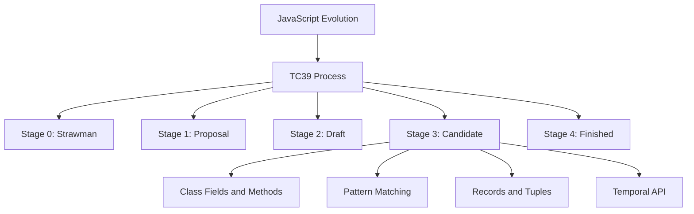

## 22.14 Exploring Future JavaScript Features (ESNext Proposals)

JavaScript is a dynamic and evolving language, continuously adapting to the needs of developers and the ever-changing landscape of web development. The evolution of JavaScript is guided by the TC39 committee, which is responsible for the ECMAScript specification. This section explores the ESNext proposals, which are potential future features of JavaScript. We will delve into the TC39 process, examine some exciting proposals currently in the pipeline, and discuss how these features can impact your coding practices and design patterns.

### Understanding the TC39 Process

The TC39 committee, also known as the Ecma Technical Committee 39, is responsible for evolving JavaScript. It follows a rigorous process to propose, evaluate, and standardize new features. This process consists of five stages:

1. **Stage 0: Strawman** - An initial idea or proposal for a new feature.
2. **Stage 1: Proposal** - A formal proposal with a detailed description and examples.
3. **Stage 2: Draft** - The feature is being actively developed and refined.
4. **Stage 3: Candidate** - The feature is complete and ready for feedback from implementers.
5. **Stage 4: Finished** - The feature is ready to be included in the ECMAScript standard.

Each stage represents a level of maturity and readiness for the feature to be adopted by the JavaScript community. Let's explore some of the current Stage 3 and Stage 2 proposals that are shaping the future of JavaScript.

### Class Fields and Methods

The Class Fields and Methods proposal introduces a more intuitive way to define class properties and methods. This proposal aims to enhance the readability and maintainability of class-based code by allowing developers to define fields directly within the class body.

#### Key Features

- **Public and Private Fields**: Define fields directly in the class body, with the option to make them private using the `#` symbol.
- **Static Fields and Methods**: Define static properties and methods that belong to the class itself, rather than instances.

#### Example

```javascript
class Person {
  // Public field
  name = 'Anonymous';

  // Private field
  #age = 30;

  constructor(name, age) {
    this.name = name;
    this.#age = age;
  }

  // Public method
  greet() {
    console.log(`Hello, my name is ${this.name}.`);
  }

  // Private method
  #getAge() {
    return this.#age;
  }

  // Static method
  static species() {
    return 'Homo sapiens';
  }
}

const person = new Person('Alice', 25);
person.greet(); // Hello, my name is Alice.
console.log(Person.species()); // Homo sapiens
```

#### Benefits

- **Encapsulation**: Private fields and methods enhance encapsulation, preventing external access.
- **Cleaner Syntax**: Simplifies the syntax for defining fields and methods, improving code readability.

### Pattern Matching

Pattern Matching is a powerful feature that allows developers to destructure and match complex data structures in a concise and expressive way. It is similar to switch statements but with more flexibility and expressiveness.

#### Example

```javascript
function getType(value) {
  switch (value) {
    case { type: 'number' }:
      return 'This is a number';
    case { type: 'string' }:
      return 'This is a string';
    default:
      return 'Unknown type';
  }
}

console.log(getType({ type: 'number', value: 42 })); // This is a number
console.log(getType({ type: 'string', value: 'Hello' })); // This is a string
```

#### Benefits

- **Expressiveness**: Provides a more expressive way to handle complex data structures.
- **Readability**: Improves code readability by reducing boilerplate code.

### Records and Tuples

The Records and Tuples proposal introduces immutable data structures to JavaScript. Records are similar to objects, and Tuples are similar to arrays, but both are deeply immutable.

#### Example

```javascript
const record = #{ name: 'Alice', age: 25 };
const tuple = #[1, 2, 3];

console.log(record.name); // Alice
console.log(tuple[0]); // 1

// Attempting to modify will throw an error
// record.name = 'Bob'; // Error
// tuple[0] = 4; // Error
```

#### Benefits

- **Immutability**: Ensures data integrity by preventing modifications.
- **Performance**: Optimizes performance by reducing unnecessary data copying.

### Temporal API

The Temporal API is a modern date and time API for JavaScript, designed to address the shortcomings of the existing Date object. It provides a comprehensive set of features for working with dates and times.

#### Example

```javascript
const now = Temporal.Now.instant();
const date = Temporal.PlainDate.from('2023-10-15');
const time = Temporal.PlainTime.from('14:30');

console.log(now.toString()); // Current date and time
console.log(date.toString()); // 2023-10-15
console.log(time.toString()); // 14:30
```

#### Benefits

- **Precision**: Offers precise date and time calculations.
- **Flexibility**: Provides a flexible API for various date and time operations.

### Experimenting with ESNext Proposals

To experiment with ESNext proposals, you can use transpilers like Babel. Babel allows you to write code using future JavaScript features and transpile it to a version compatible with current environments.

#### Setting Up Babel

1. **Install Babel**: Use npm to install Babel and the necessary plugins.

   ```bash
   npm install --save-dev @babel/core @babel/cli @babel/preset-env
   ```

2. **Configure Babel**: Create a `.babelrc` file to configure Babel.

   ```json
   {
     "presets": ["@babel/preset-env"],
     "plugins": [
       "@babel/plugin-proposal-class-properties",
       "@babel/plugin-proposal-record-and-tuple",
       "@babel/plugin-proposal-pattern-matching",
       "@babel/plugin-proposal-temporal"
     ]
   }
   ```

3. **Transpile Code**: Use Babel CLI to transpile your code.

   ```bash
   npx babel src --out-dir dist
   ```

### Staying Updated with Language Developments

Staying updated with the latest JavaScript developments is crucial for leveraging new features and improving your coding practices. Follow the TC39 GitHub repository, participate in community discussions, and experiment with proposals to stay ahead.

### Potential Impacts on Coding Practices and Design Patterns

The introduction of new features can significantly impact coding practices and design patterns. For example:

- **Class Fields**: Enhance encapsulation and modularity in object-oriented design.
- **Pattern Matching**: Simplify complex conditional logic, improving code clarity.
- **Records and Tuples**: Promote immutability, leading to more predictable and maintainable code.
- **Temporal API**: Enable precise date and time handling, reducing errors in time-sensitive applications.

### Conclusion

Exploring future JavaScript features through ESNext proposals provides a glimpse into the language's evolution. By understanding and experimenting with these proposals, you can prepare for upcoming changes and enhance your development skills. Remember, this is just the beginning. As you progress, you'll build more complex and interactive web pages. Keep experimenting, stay curious, and enjoy the journey!

### Try It Yourself

Experiment with the code examples provided in this section. Try modifying them to see how the proposed features work in different scenarios. For instance, create a class with private fields and methods, or use pattern matching to handle various data structures.

### Visualizing JavaScript's Future Features



This diagram illustrates the TC39 process and highlights some of the exciting proposals currently in the pipeline.

### Knowledge Check

## Understanding Future JavaScript Features



### What is the TC39 committee responsible for?

- [x] Evolving JavaScript and the ECMAScript specification
- [ ] Managing JavaScript libraries
- [ ] Developing JavaScript frameworks
- [ ] Creating JavaScript tutorials

> **Explanation:** The TC39 committee is responsible for evolving JavaScript and the ECMAScript specification.

### What stage indicates a feature is ready for feedback from implementers?

- [ ] Stage 0
- [ ] Stage 1
- [ ] Stage 2
- [x] Stage 3

> **Explanation:** Stage 3 indicates that a feature is complete and ready for feedback from implementers.

### Which proposal introduces immutable data structures to JavaScript?

- [ ] Class Fields and Methods
- [ ] Pattern Matching
- [x] Records and Tuples
- [ ] Temporal API

> **Explanation:** The Records and Tuples proposal introduces immutable data structures to JavaScript.

### What symbol is used to define private fields in the Class Fields proposal?

- [ ] @
- [ ] $
- [x] #
- [ ] %

> **Explanation:** The `#` symbol is used to define private fields in the Class Fields proposal.

### Which API provides a modern approach to date and time handling in JavaScript?

- [ ] Date API
- [ ] Time API
- [ ] Calendar API
- [x] Temporal API

> **Explanation:** The Temporal API provides a modern approach to date and time handling in JavaScript.

### How can developers experiment with ESNext proposals?

- [x] By using transpilers like Babel
- [ ] By waiting for browser support
- [ ] By using only Node.js
- [ ] By writing in TypeScript

> **Explanation:** Developers can experiment with ESNext proposals by using transpilers like Babel.

### What is a benefit of using pattern matching in JavaScript?

- [ ] It reduces code readability
- [x] It simplifies complex conditional logic
- [ ] It increases code verbosity
- [ ] It limits data structure handling

> **Explanation:** Pattern matching simplifies complex conditional logic, improving code clarity.

### Which proposal enhances encapsulation in JavaScript classes?

- [x] Class Fields and Methods
- [ ] Pattern Matching
- [ ] Records and Tuples
- [ ] Temporal API

> **Explanation:** The Class Fields and Methods proposal enhances encapsulation in JavaScript classes.

### What is the main advantage of using Records and Tuples?

- [ ] They are mutable
- [x] They are immutable
- [ ] They are faster than arrays
- [ ] They are only for numbers

> **Explanation:** The main advantage of using Records and Tuples is that they are immutable.

### The Temporal API is designed to address the shortcomings of which JavaScript object?

- [x] Date
- [ ] Array
- [ ] Object
- [ ] Function

> **Explanation:** The Temporal API is designed to address the shortcomings of the Date object in JavaScript.



Remember, staying informed about future JavaScript features is essential for modern web development. Embrace the journey of learning and experimenting with these exciting proposals!
