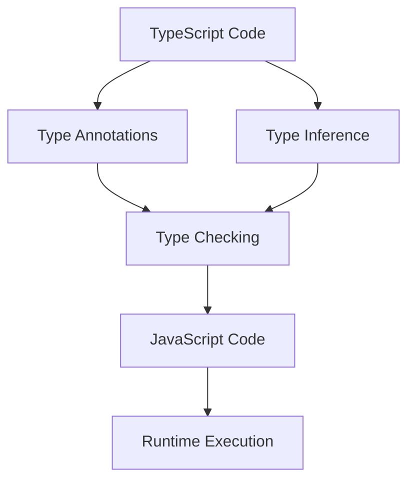

## 22.15 Formal Verification and Type Systems with TypeScript

In the ever-evolving landscape of software development, ensuring code correctness and reliability is paramount. Formal verification and static type systems play a crucial role in achieving this goal. In this section, we will delve into the concepts of formal verification and how TypeScript, with its robust type system, enhances JavaScript development by providing tools for static analysis and type checking.

### Understanding Formal Verification

**Formal verification** is a process used to prove or disprove the correctness of a system's design with respect to a certain formal specification or property, using formal methods of mathematics. It involves creating a mathematical model of the system and using logical reasoning to ensure that the system behaves as expected.

#### Importance of Formal Verification

- **Error Detection**: Formal verification helps in identifying errors that might not be caught by traditional testing methods.
- **Reliability**: It ensures that the software behaves correctly under all possible conditions.
- **Security**: By proving the absence of certain types of vulnerabilities, formal verification enhances the security of the software.

### TypeScript: Enhancing Code Reliability through Static Typing

TypeScript is a superset of JavaScript that introduces static typing to the language. This means that TypeScript allows developers to specify types for variables, function parameters, and return values, which are checked at compile time. This feature helps in catching errors early in the development process, leading to more robust and maintainable code.

#### Key Features of TypeScript

1. **Static Typing**: TypeScript's static typing system allows developers to define types for variables, function parameters, and return values, reducing runtime errors.

2. **Type Inference**: TypeScript can automatically infer types based on the context, reducing the need for explicit type annotations.

3. **Generics**: Generics enable developers to create reusable components that work with any data type.

4. **Type Guards**: Type guards allow developers to narrow down the type of a variable within a conditional block.

5. **Conditional Types**: Conditional types provide a way to choose between types based on a condition.

6. **Mapped Types**: Mapped types allow developers to create new types by transforming existing ones.

### Advanced TypeScript Features

Let's explore some advanced TypeScript features that enhance code reliability and maintainability.

#### Generics

Generics provide a way to create reusable components that can work with any data type. They allow developers to define functions, classes, and interfaces that are not tied to a specific type.

```typescript
// A generic function that returns the input value
function identity<T>(value: T): T {
    return value;
}

// Using the generic function with different types
let numberIdentity = identity<number>(42);
let stringIdentity = identity<string>("Hello, TypeScript!");

console.log(numberIdentity); // Output: 42
console.log(stringIdentity); // Output: Hello, TypeScript!
```

#### Type Guards

Type guards are used to narrow down the type of a variable within a conditional block. They help in writing safer code by ensuring that operations are performed on the correct type.

```typescript
function isString(value: unknown): value is string {
    return typeof value === 'string';
}

function printValue(value: unknown) {
    if (isString(value)) {
        console.log(`String value: ${value}`);
    } else {
        console.log('Not a string');
    }
}

printValue("Hello"); // Output: String value: Hello
printValue(42); // Output: Not a string
```

#### Conditional Types

Conditional types allow developers to choose between types based on a condition. They are useful for creating flexible and adaptable types.

```typescript
type IsString<T> = T extends string ? "Yes" : "No";

type Test1 = IsString<string>; // "Yes"
type Test2 = IsString<number>; // "No"
```

#### Mapped Types

Mapped types enable developers to create new types by transforming existing ones. They are particularly useful for creating utility types.

```typescript
type Readonly<T> = {
    readonly [P in keyof T]: T[P];
};

interface User {
    name: string;
    age: number;
}

type ReadonlyUser = Readonly<User>;

const user: ReadonlyUser = {
    name: "Alice",
    age: 30
};

// user.name = "Bob"; // Error: Cannot assign to 'name' because it is a read-only property.
```

### Tools for Static Analysis and Type Checking

TypeScript provides a robust set of tools for static analysis and type checking, which help in identifying potential issues in the code before runtime.

- **TypeScript Compiler (tsc)**: The TypeScript compiler performs type checking and transpiles TypeScript code to JavaScript.

- **ESLint**: ESLint is a popular tool for identifying and fixing problems in JavaScript code. It can be configured to work with TypeScript for additional type checking.

- **TSLint**: Although deprecated in favor of ESLint, TSLint was specifically designed for TypeScript and provided static analysis capabilities.

### Benefits of Integrating TypeScript into Large Codebases

Integrating TypeScript into large codebases offers several benefits:

- **Improved Code Quality**: Static typing helps in catching errors early, leading to higher code quality.

- **Enhanced Maintainability**: Type annotations and interfaces make the code more readable and easier to maintain.

- **Refactoring Support**: TypeScript's type system provides better support for refactoring, reducing the risk of introducing bugs.

- **Interoperability**: TypeScript can seamlessly integrate with existing JavaScript code, allowing for gradual adoption.

### Best Practices for Gradual Typing and Managing Type Complexity

When adopting TypeScript, it's important to follow best practices to manage type complexity and ensure a smooth transition.

1. **Start Small**: Begin by adding TypeScript to a small part of the codebase and gradually expand its usage.

2. **Use `any` Sparingly**: While `any` can be useful for quick migrations, overusing it defeats the purpose of static typing.

3. **Leverage Type Inference**: Rely on TypeScript's type inference capabilities to reduce the need for explicit type annotations.

4. **Define Interfaces and Types**: Use interfaces and type aliases to define complex types and improve code readability.

5. **Refactor Incrementally**: Refactor the codebase incrementally, focusing on one module or component at a time.

6. **Adopt a Linter**: Use a linter like ESLint to enforce coding standards and catch potential issues early.

### Visualizing TypeScript's Type System

To better understand how TypeScript's type system works, let's visualize the interaction between different types and features using a Mermaid.js diagram.



**Diagram Explanation**: This diagram illustrates the flow of TypeScript code through the type system. Type annotations and type inference contribute to type checking, which ensures code correctness before transpiling to JavaScript for runtime execution.

### Conclusion

Formal verification and static type systems are essential tools for ensuring code correctness and reliability. TypeScript, with its robust type system, enhances JavaScript development by providing static typing, type inference, and advanced features like generics, type guards, conditional types, and mapped types. By integrating TypeScript into large codebases and following best practices, developers can improve code quality, maintainability, and refactoring support.

### Knowledge Check

To reinforce your understanding of formal verification and TypeScript's type system, try answering the following questions.

## Test Your Knowledge on Formal Verification and Type Systems with TypeScript



### What is formal verification?

- [x] A process to prove or disprove the correctness of a system's design using formal methods
- [ ] A method to test software performance under load
- [ ] A technique for optimizing code execution speed
- [ ] A way to document software requirements

> **Explanation:** Formal verification involves using mathematical methods to ensure a system's design meets its specifications.

### How does TypeScript enhance code reliability?

- [x] By introducing static typing to JavaScript
- [ ] By providing runtime error handling
- [ ] By optimizing code for faster execution
- [ ] By simplifying syntax for developers

> **Explanation:** TypeScript enhances code reliability by allowing developers to define types that are checked at compile time, reducing runtime errors.

### What are generics in TypeScript used for?

- [x] Creating reusable components that work with any data type
- [ ] Defining fixed types for variables
- [ ] Optimizing code execution speed
- [ ] Simplifying syntax for developers

> **Explanation:** Generics allow developers to create components that can operate with any data type, enhancing reusability.

### What is a type guard in TypeScript?

- [x] A mechanism to narrow down the type of a variable within a conditional block
- [ ] A tool for optimizing code execution
- [ ] A method for defining fixed types
- [ ] A way to document software requirements

> **Explanation:** Type guards help ensure that operations are performed on the correct type by narrowing down variable types within conditionals.

### What is the purpose of conditional types in TypeScript?

- [x] To choose between types based on a condition
- [ ] To define fixed types for variables
- [ ] To optimize code execution speed
- [ ] To simplify syntax for developers

> **Explanation:** Conditional types allow developers to select types dynamically based on conditions, providing flexibility in type definitions.

### What are mapped types in TypeScript?

- [x] Types that transform existing types into new ones
- [ ] Types that define fixed values for variables
- [ ] Types that optimize code execution speed
- [ ] Types that simplify syntax for developers

> **Explanation:** Mapped types enable developers to create new types by transforming existing ones, useful for creating utility types.

### What tool is used for static analysis and type checking in TypeScript?

- [x] TypeScript Compiler (tsc)
- [ ] Node.js
- [ ] Babel
- [ ] Webpack

> **Explanation:** The TypeScript Compiler (tsc) performs type checking and transpiles TypeScript code to JavaScript.

### What is a benefit of integrating TypeScript into large codebases?

- [x] Improved code quality and maintainability
- [ ] Faster code execution
- [ ] Simplified syntax for developers
- [ ] Reduced code size

> **Explanation:** TypeScript's static typing and type annotations improve code quality and maintainability, especially in large codebases.

### What is a best practice for managing type complexity in TypeScript?

- [x] Use interfaces and type aliases to define complex types
- [ ] Avoid using any type annotations
- [ ] Rely solely on type inference
- [ ] Use the any type extensively

> **Explanation:** Defining complex types with interfaces and type aliases improves code readability and manageability.

### True or False: TypeScript can seamlessly integrate with existing JavaScript code.

- [x] True
- [ ] False

> **Explanation:** TypeScript is designed to integrate with existing JavaScript code, allowing for gradual adoption and interoperability.



Remember, this is just the beginning. As you progress, you'll build more complex and interactive applications. Keep experimenting, stay curious, and enjoy the journey!
