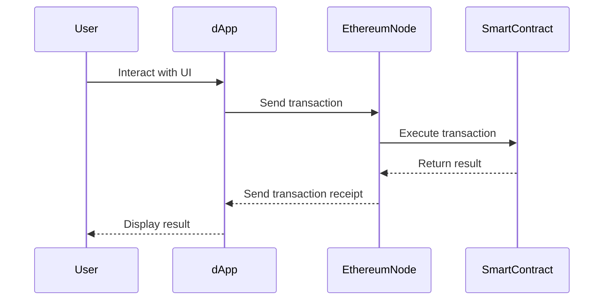

## 22.2 Blockchain and Smart Contracts with JavaScript

Blockchain technology has revolutionized the way we think about data security, transparency, and decentralization. In this section, we will explore how JavaScript, a versatile and widely-used programming language, can be leveraged to interact with blockchain technologies. We will delve into the development of decentralized applications (dApps) and smart contracts, focusing on platforms like Ethereum. Let's embark on this journey to understand the synergy between JavaScript and blockchain.

### Understanding Blockchain Technology

Blockchain is a distributed ledger technology that allows data to be stored across a network of computers in a way that is secure, transparent, and immutable. Each block in a blockchain contains a list of transactions, and these blocks are linked together in chronological order, forming a chain. Here are some key concepts:

- **Decentralization**: Unlike traditional databases that are centralized, blockchain data is distributed across multiple nodes, enhancing security and resilience.
- **Immutability**: Once data is recorded on a blockchain, it cannot be altered or deleted, ensuring data integrity.
- **Consensus Mechanisms**: These are protocols used to achieve agreement on the blockchain network about the state of the ledger. Common mechanisms include Proof of Work (PoW) and Proof of Stake (PoS).

### JavaScript and Blockchain Platforms

JavaScript can be used to interact with blockchain platforms, with Ethereum being one of the most popular. Ethereum allows developers to create smart contracts and dApps. Let's explore how JavaScript fits into this ecosystem.

#### Ethereum and Smart Contracts

Ethereum is a decentralized platform that enables the creation of smart contracts—self-executing contracts with the terms of the agreement directly written into code. Smart contracts run on the Ethereum Virtual Machine (EVM), which is a decentralized computing environment.

**Solidity** is the primary language for writing smart contracts on Ethereum. It is a statically-typed language designed for developing smart contracts that run on the EVM.

### Tools and Libraries for JavaScript Blockchain Development

Several tools and libraries facilitate JavaScript development in the blockchain space. Here are some key ones:

#### Web3.js

[Web3.js](https://web3js.readthedocs.io/en/v1.7.1/) is a JavaScript library that allows you to interact with the Ethereum blockchain. It provides an API to connect to Ethereum nodes, enabling you to send transactions, interact with smart contracts, and retrieve blockchain data.

```javascript
// Example: Connecting to an Ethereum node using Web3.js
const Web3 = require('web3');
const web3 = new Web3('https://mainnet.infura.io/v3/YOUR_INFURA_PROJECT_ID');

// Get the latest block number
web3.eth.getBlockNumber().then(console.log);
```

#### Truffle Suite

[Truffle](https://www.trufflesuite.com/) is a development framework for Ethereum that provides tools for writing, testing, and deploying smart contracts. It simplifies the development process by offering a suite of tools, including:

- **Truffle**: A development environment and testing framework.
- **Ganache**: A personal blockchain for Ethereum development.
- **Drizzle**: A collection of front-end libraries for building dApps.

### Writing and Deploying Smart Contracts

To write and deploy smart contracts, you'll typically use Solidity and tools like Truffle. Here's a basic example of a smart contract written in Solidity:

```solidity
// SPDX-License-Identifier: MIT
pragma solidity ^0.8.0;

contract SimpleStorage {
    uint256 private storedData;

    function set(uint256 x) public {
        storedData = x;
    }

    function get() public view returns (uint256) {
        return storedData;
    }
}
```

#### Deploying with Truffle

To deploy this contract, you would use Truffle's migration feature. First, compile the contract:

```bash
truffle compile
```

Then, create a migration script:

```javascript
// migrations/2_deploy_contracts.js
const SimpleStorage = artifacts.require("SimpleStorage");

module.exports = function(deployer) {
  deployer.deploy(SimpleStorage);
};
```

Finally, deploy the contract to a network:

```bash
truffle migrate --network development
```

### Building Basic dApps

Decentralized applications (dApps) are applications that run on a blockchain network. They consist of a smart contract backend and a front-end user interface. Here's a simple example of a dApp using Web3.js and React:

```javascript
// Example: Interacting with a smart contract in a React component
import React, { useState, useEffect } from 'react';
import Web3 from 'web3';
import SimpleStorage from './contracts/SimpleStorage.json';

const App = () => {
  const [storageValue, setStorageValue] = useState(0);
  const [web3, setWeb3] = useState(null);
  const [contract, setContract] = useState(null);

  useEffect(() => {
    const init = async () => {
      const web3 = new Web3(Web3.givenProvider || 'http://localhost:7545');
      setWeb3(web3);

      const networkId = await web3.eth.net.getId();
      const deployedNetwork = SimpleStorage.networks[networkId];
      const instance = new web3.eth.Contract(
        SimpleStorage.abi,
        deployedNetwork && deployedNetwork.address,
      );
      setContract(instance);
    };
    init();
  }, []);

  const getStorageValue = async () => {
    const response = await contract.methods.get().call();
    setStorageValue(response);
  };

  return (
    <div>
      <button onClick={getStorageValue}>Get Storage Value</button>
      <p>Stored Value: {storageValue}</p>
    </div>
  );
};

export default App;
```

### Security Considerations and Best Practices

Security is paramount in blockchain development due to the immutable nature of blockchain transactions. Here are some best practices:

- **Code Audits**: Regularly audit your smart contract code to identify vulnerabilities.
- **Use Established Libraries**: Leverage well-tested libraries and frameworks to reduce the risk of introducing bugs.
- **Test Thoroughly**: Implement comprehensive testing strategies, including unit tests and integration tests.
- **Handle Exceptions**: Ensure proper error handling in smart contracts to prevent unexpected behavior.

### Challenges in Blockchain Development

Blockchain development comes with its own set of challenges:

- **Scalability**: Blockchain networks can face scalability issues due to the need for consensus among nodes. Solutions like sharding and layer 2 protocols are being explored.
- **Consensus Mechanisms**: Different blockchains use various consensus mechanisms, each with its own trade-offs in terms of security, speed, and energy consumption.
- **Complexity**: Developing dApps and smart contracts requires a deep understanding of blockchain principles and the specific platform being used.

### Visualizing JavaScript's Interaction with Blockchain



*Figure 1: Interaction between a user, a dApp, an Ethereum node, and a smart contract.*

### Further Reading and Resources

- [Ethereum Documentation](https://ethereum.org/en/developers/docs/)
- [Web3.js Documentation](https://web3js.readthedocs.io/en/v1.7.1/)
- [Truffle Suite Documentation](https://www.trufflesuite.com/docs)

### Knowledge Check

- What is the primary language used for writing smart contracts on Ethereum?
- How does Web3.js facilitate interaction with the Ethereum blockchain?
- What are some security considerations when developing smart contracts?
- Describe the role of Truffle in blockchain development.
- What challenges might developers face when building dApps?

### Embrace the Journey

Remember, this is just the beginning. As you progress, you'll build more complex and interactive decentralized applications. Keep experimenting, stay curious, and enjoy the journey!

## Blockchain and Smart Contracts with JavaScript: Quiz



### What is the primary language used for writing smart contracts on Ethereum?

- [x] Solidity
- [ ] JavaScript
- [ ] Python
- [ ] C++

> **Explanation:** Solidity is the primary language used for writing smart contracts on Ethereum.

### Which library allows JavaScript to interact with the Ethereum blockchain?

- [x] Web3.js
- [ ] jQuery
- [ ] React.js
- [ ] Angular.js

> **Explanation:** Web3.js is a JavaScript library that allows interaction with the Ethereum blockchain.

### What is a key feature of blockchain technology?

- [x] Immutability
- [ ] Centralization
- [ ] Volatility
- [ ] Anonymity

> **Explanation:** Immutability is a key feature of blockchain technology, ensuring data integrity.

### What tool is used for writing, testing, and deploying smart contracts?

- [x] Truffle
- [ ] Ganache
- [ ] Remix
- [ ] MetaMask

> **Explanation:** Truffle is a development framework for writing, testing, and deploying smart contracts.

### What is a common challenge in blockchain development?

- [x] Scalability
- [ ] Simplicity
- [ ] Centralization
- [ ] Anonymity

> **Explanation:** Scalability is a common challenge in blockchain development due to consensus requirements.

### What is the role of a smart contract?

- [x] Self-executing contract with terms written in code
- [ ] A traditional legal document
- [ ] A database management system
- [ ] A user interface for dApps

> **Explanation:** A smart contract is a self-executing contract with terms written in code.

### Which consensus mechanism is commonly used in Ethereum?

- [x] Proof of Work (PoW)
- [ ] Proof of Stake (PoS)
- [ ] Delegated Proof of Stake (DPoS)
- [ ] Byzantine Fault Tolerance (BFT)

> **Explanation:** Ethereum commonly uses Proof of Work (PoW) as its consensus mechanism.

### What is a dApp?

- [x] Decentralized application
- [ ] Desktop application
- [ ] Data application
- [ ] Dynamic application

> **Explanation:** A dApp is a decentralized application that runs on a blockchain network.

### What is the purpose of Ganache in the Truffle Suite?

- [x] Personal blockchain for development
- [ ] Smart contract compiler
- [ ] Front-end library
- [ ] Testing framework

> **Explanation:** Ganache is a personal blockchain for Ethereum development, part of the Truffle Suite.

### True or False: Blockchain data can be altered once recorded.

- [ ] True
- [x] False

> **Explanation:** Blockchain data is immutable, meaning it cannot be altered once recorded.


