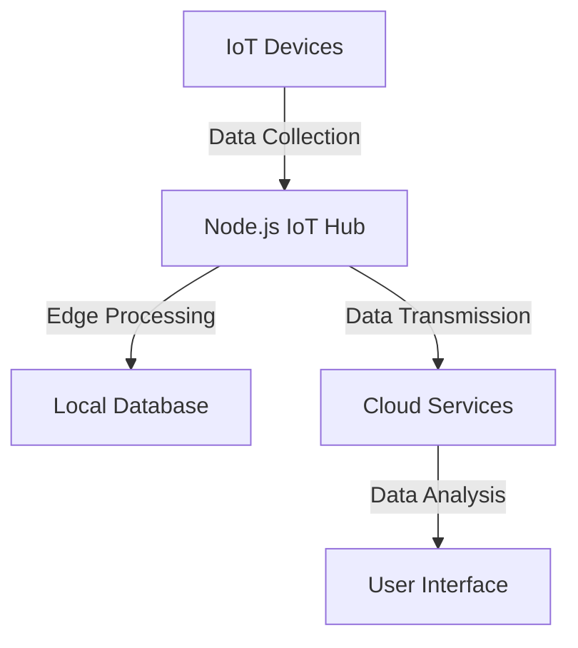

## 22.4 Internet of Things (IoT) with Node.js

The Internet of Things (IoT) is a transformative technology that connects everyday objects to the internet, enabling them to send and receive data. This connectivity allows for smarter, more efficient systems across various domains, from smart homes to industrial automation. In this section, we will explore how Node.js, with its asynchronous, event-driven architecture, is an excellent choice for developing IoT applications. We will delve into the IoT ecosystem, common use cases, and how Node.js can be used to interact with hardware, communicate using various protocols, and build IoT hubs and edge computing solutions.

### Understanding the IoT Ecosystem

The IoT ecosystem comprises a network of physical devices, vehicles, home appliances, and other items embedded with electronics, software, sensors, and connectivity. These devices collect and exchange data, enabling automation and intelligent decision-making.

#### Common Use Cases

- **Smart Homes**: Automating lighting, heating, and security systems.
- **Industrial IoT (IIoT)**: Monitoring machinery and optimizing production processes.
- **Healthcare**: Remote patient monitoring and health data collection.
- **Agriculture**: Precision farming with soil sensors and weather stations.
- **Transportation**: Fleet management and real-time tracking.

### Why Node.js for IoT?

Node.js is particularly well-suited for IoT applications due to its non-blocking, event-driven architecture. This makes it efficient for handling multiple concurrent connections, which is a common requirement in IoT systems. Here are some reasons why Node.js is a popular choice for IoT development:

- **Asynchronous I/O**: Node.js can handle numerous I/O operations without blocking the execution of code, making it ideal for IoT devices that need to communicate frequently.
- **Event-Driven**: The event-driven nature of Node.js allows for real-time data processing, which is crucial for IoT applications.
- **Cross-Platform**: Node.js can run on various platforms, including microcontrollers and single-board computers like Raspberry Pi.
- **Rich Ecosystem**: A vast collection of libraries and modules available through npm makes it easy to integrate with different hardware and protocols.

### Interacting with Hardware Using Node.js

Node.js can interface with hardware components using libraries such as [Johnny-Five](http://johnny-five.io/), which provides a comprehensive API for interacting with various sensors, actuators, and other devices.

#### Example: Blinking an LED with Johnny-Five

Let's start with a simple example of blinking an LED using the Johnny-Five library.

```javascript
// Import the Johnny-Five library
const { Board, Led } = require("johnny-five");

// Create a new board instance
const board = new Board();

// When the board is ready, execute the following code
board.on("ready", function() {
  // Create an LED on pin 13
  const led = new Led(13);

  // Blink the LED every 500ms
  led.blink(500);
});
```

**Explanation**: In this example, we create a new `Board` instance, which represents the physical board (e.g., Arduino). When the board is ready, we instantiate an `Led` object on pin 13 and use the `blink` method to make it blink every 500 milliseconds.

### Communication Protocols in IoT

IoT devices communicate using various protocols, each with its own strengths and use cases. Node.js supports several communication protocols that are commonly used in IoT applications.

#### MQTT (Message Queuing Telemetry Transport)

MQTT is a lightweight messaging protocol designed for low-bandwidth, high-latency networks. It is ideal for IoT devices that need to send small amounts of data over unreliable networks.

```javascript
// Import the MQTT library
const mqtt = require('mqtt');

// Connect to the MQTT broker
const client = mqtt.connect('mqtt://broker.hivemq.com');

// Subscribe to a topic
client.on('connect', () => {
  client.subscribe('home/temperature', (err) => {
    if (!err) {
      console.log('Subscribed to home/temperature');
    }
  });
});

// Handle incoming messages
client.on('message', (topic, message) => {
  console.log(`Received message on ${topic}: ${message.toString()}`);
});
```

**Explanation**: This code connects to an MQTT broker and subscribes to the `home/temperature` topic. When a message is received on this topic, it is logged to the console.

#### HTTP and WebSockets

HTTP is a widely used protocol for web communication, and WebSockets provide a full-duplex communication channel over a single TCP connection, making them suitable for real-time data exchange.

```javascript
// Import the WebSocket library
const WebSocket = require('ws');

// Create a WebSocket server
const wss = new WebSocket.Server({ port: 8080 });

// Handle connection events
wss.on('connection', (ws) => {
  console.log('New client connected');

  // Send a message to the client
  ws.send('Welcome to the WebSocket server');

  // Handle incoming messages
  ws.on('message', (message) => {
    console.log(`Received: ${message}`);
  });

  // Handle client disconnection
  ws.on('close', () => {
    console.log('Client disconnected');
  });
});
```

**Explanation**: This example sets up a WebSocket server that listens for connections on port 8080. When a client connects, a welcome message is sent, and incoming messages from the client are logged.

### Building IoT Hubs and Edge Computing Solutions

An IoT hub acts as a central point for managing and routing data between IoT devices and applications. Node.js can be used to build IoT hubs that aggregate data from multiple devices and perform edge computing tasks.

#### Edge Computing

Edge computing involves processing data closer to the source (i.e., the IoT devices) rather than sending all data to a centralized cloud server. This reduces latency and bandwidth usage, making it ideal for time-sensitive applications.

```javascript
// Example of edge computing with Node.js
const { Board, Sensor } = require("johnny-five");
const board = new Board();

board.on("ready", function() {
  // Create a temperature sensor on pin A0
  const temperature = new Sensor("A0");

  // Read temperature data and process it locally
  temperature.on("change", function() {
    const celsius = this.value * 0.48828125;
    console.log(`Temperature: ${celsius.toFixed(2)}°C`);

    // Perform edge processing, e.g., trigger an alert if temperature exceeds a threshold
    if (celsius > 30) {
      console.log("Alert: High temperature detected!");
    }
  });
});
```

**Explanation**: In this example, a temperature sensor is connected to pin A0. The sensor's data is processed locally to check if the temperature exceeds a certain threshold, triggering an alert if necessary.

### Security Considerations for IoT Devices

Security is a critical concern in IoT applications due to the potential for unauthorized access and data breaches. Here are some best practices for securing IoT devices:

- **Authentication and Authorization**: Ensure that only authorized users and devices can access the IoT network.
- **Data Encryption**: Use encryption protocols such as TLS to protect data in transit.
- **Regular Updates**: Keep firmware and software up to date to protect against vulnerabilities.
- **Network Segmentation**: Isolate IoT devices from other network segments to limit the impact of a potential breach.

### Prototyping with Raspberry Pi

[Raspberry Pi](https://www.raspberrypi.org/) is a popular platform for prototyping IoT applications due to its affordability, versatility, and support for various programming languages, including Node.js.

#### Setting Up a Raspberry Pi for IoT Development

1. **Install Raspbian OS**: Download and install the Raspbian OS on your Raspberry Pi.
2. **Set Up Node.js**: Install Node.js on the Raspberry Pi using the package manager.
3. **Connect Sensors and Actuators**: Use the GPIO pins to connect sensors and actuators to the Raspberry Pi.
4. **Develop and Test**: Write and test your Node.js code to interact with the connected hardware.

### Try It Yourself

Experiment with the code examples provided in this section. Try modifying the LED blinking interval or adding additional sensors to the temperature monitoring example. Explore different communication protocols and see how they can be integrated into your IoT projects.

### Visualizing IoT Architecture with Node.js

Below is a diagram illustrating a typical IoT architecture using Node.js, showcasing the interaction between devices, IoT hubs, and cloud services.



**Diagram Description**: This flowchart represents an IoT architecture where IoT devices collect data and send it to a Node.js IoT hub. The hub performs edge processing and stores data locally or transmits it to cloud services for further analysis and visualization.

### References and Links

- [Johnny-Five](http://johnny-five.io/): A JavaScript Robotics and IoT platform.
- [Raspberry Pi](https://www.raspberrypi.org/): Official Raspberry Pi website for resources and guides.
- [MQTT Protocol](https://mqtt.org/): Official MQTT website for protocol specifications and resources.
- [WebSockets](https://developer.mozilla.org/en-US/docs/Web/API/WebSockets_API): MDN Web Docs on WebSockets API.

### Knowledge Check

To reinforce your understanding of IoT with Node.js, consider the following questions and exercises:

- What are the advantages of using Node.js for IoT applications?
- How does the Johnny-Five library facilitate hardware interaction in Node.js?
- Describe the differences between MQTT and WebSockets in the context of IoT.
- Implement a simple IoT application using Node.js and Raspberry Pi to monitor environmental conditions.

### Embrace the Journey

Remember, this is just the beginning of your journey into IoT with Node.js. As you progress, you'll build more complex and interactive systems. Keep experimenting, stay curious, and enjoy the journey!

## Quiz: Mastering IoT with Node.js



### What is a key advantage of using Node.js for IoT applications?

- [x] Asynchronous I/O
- [ ] Synchronous processing
- [ ] High memory usage
- [ ] Lack of libraries

> **Explanation:** Node.js's asynchronous I/O is ideal for handling multiple concurrent connections, which is common in IoT applications.

### Which library is commonly used for interacting with hardware in Node.js?

- [x] Johnny-Five
- [ ] Express
- [ ] React
- [ ] Lodash

> **Explanation:** Johnny-Five is a popular library for interacting with hardware components in Node.js.

### What protocol is lightweight and suitable for IoT devices with low-bandwidth networks?

- [x] MQTT
- [ ] HTTP
- [ ] FTP
- [ ] SMTP

> **Explanation:** MQTT is a lightweight messaging protocol designed for low-bandwidth, high-latency networks, making it ideal for IoT devices.

### What is the purpose of edge computing in IoT?

- [x] Processing data closer to the source
- [ ] Sending all data to the cloud
- [ ] Increasing latency
- [ ] Reducing data security

> **Explanation:** Edge computing involves processing data closer to the source, reducing latency and bandwidth usage.

### Which platform is popular for prototyping IoT applications?

- [x] Raspberry Pi
- [ ] Arduino
- [ ] BeagleBone
- [ ] ESP8266

> **Explanation:** Raspberry Pi is a popular platform for prototyping IoT applications due to its affordability and versatility.

### What is a common security practice for IoT devices?

- [x] Data encryption
- [ ] Ignoring updates
- [ ] Using default passwords
- [ ] Disabling firewalls

> **Explanation:** Data encryption is a common security practice to protect data in transit for IoT devices.

### Which protocol provides a full-duplex communication channel over a single TCP connection?

- [x] WebSockets
- [ ] HTTP
- [ ] FTP
- [ ] SMTP

> **Explanation:** WebSockets provide a full-duplex communication channel over a single TCP connection, suitable for real-time data exchange.

### What is the role of an IoT hub?

- [x] Central point for managing and routing data
- [ ] Device for collecting temperature data
- [ ] Protocol for data encryption
- [ ] Sensor for measuring humidity

> **Explanation:** An IoT hub acts as a central point for managing and routing data between IoT devices and applications.

### Which of the following is a benefit of using Node.js for IoT?

- [x] Cross-platform compatibility
- [ ] High memory usage
- [ ] Synchronous processing
- [ ] Lack of libraries

> **Explanation:** Node.js's cross-platform compatibility allows it to run on various platforms, including microcontrollers and single-board computers.

### True or False: Node.js is not suitable for real-time data processing in IoT applications.

- [ ] True
- [x] False

> **Explanation:** False. Node.js's event-driven nature makes it suitable for real-time data processing in IoT applications.




