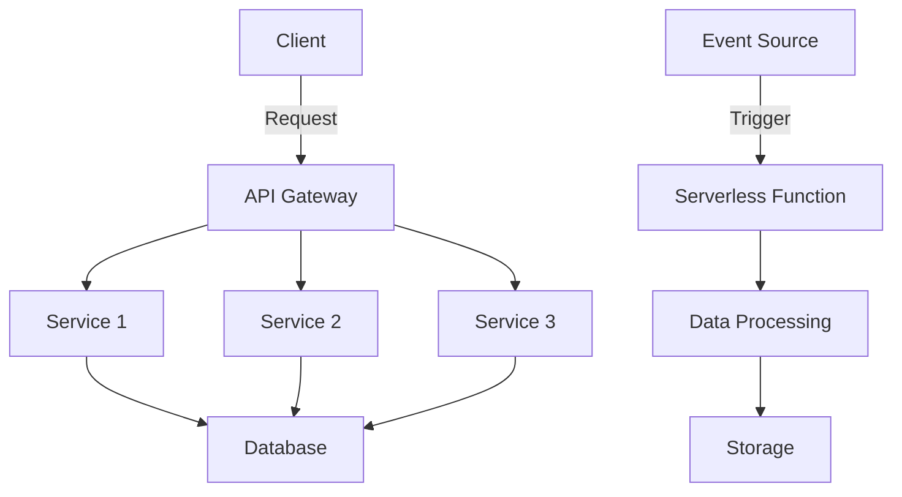

## 22.6 Microservices and Serverless Architectures

In the ever-evolving landscape of web development, microservices and serverless architectures have emerged as powerful paradigms for building scalable, flexible, and efficient applications. This section will delve into these advanced architectural patterns, exploring how JavaScript and Node.js are pivotal in their implementation.

### Understanding Microservices Architecture

Microservices architecture is a design pattern that structures an application as a collection of loosely coupled services. Each service is a small, independent unit that focuses on a specific business capability. This approach contrasts with the traditional monolithic architecture, where all components are tightly integrated into a single application.

#### Benefits of Microservices

1. **Scalability**: Microservices allow for independent scaling of services based on demand, optimizing resource usage.
2. **Flexibility**: Developers can use different technologies and languages for different services, choosing the best tool for each task.
3. **Resilience**: Failure in one service does not necessarily affect the entire system, enhancing fault tolerance.
4. **Faster Development**: Teams can work on different services simultaneously, speeding up development and deployment cycles.

#### Key Participants in Microservices

- **Service**: A standalone unit that performs a specific function.
- **API Gateway**: Manages requests from clients and routes them to the appropriate services.
- **Service Registry**: Keeps track of service instances and their locations.
- **Load Balancer**: Distributes incoming requests across multiple service instances.

### Building Microservices with Node.js

Node.js, with its non-blocking I/O and event-driven architecture, is an excellent choice for building microservices. Let's explore a simple example of creating a microservice using Node.js and Express.

```javascript
// Importing necessary modules
const express = require('express');
const app = express();
const PORT = process.env.PORT || 3000;

// Sample service: User Service
app.get('/users', (req, res) => {
  // Simulating a database call
  const users = [
    { id: 1, name: 'Alice' },
    { id: 2, name: 'Bob' }
  ];
  res.json(users);
});

// Starting the server
app.listen(PORT, () => {
  console.log(`User service running on port ${PORT}`);
});
```

In this example, we define a simple user service that returns a list of users. This service can be independently deployed and scaled.

### Serverless Computing

Serverless computing is a cloud-computing model where the cloud provider dynamically manages the allocation of machine resources. This model allows developers to focus on writing code without worrying about infrastructure management.

#### Popular Serverless Platforms

- **AWS Lambda**: Allows you to run code in response to events without provisioning or managing servers.
- **Azure Functions**: Provides a serverless compute service that enables you to run event-triggered code.
- **Google Cloud Functions**: Offers a lightweight, event-driven computing service.

#### Example: AWS Lambda with Node.js

Let's create a simple AWS Lambda function using Node.js.

```javascript
// Lambda function to return a greeting
exports.handler = async (event) => {
  const name = event.queryStringParameters.name || 'World';
  const response = {
    statusCode: 200,
    body: JSON.stringify(`Hello, ${name}!`),
  };
  return response;
};
```

This function responds to HTTP requests with a greeting message. It demonstrates how serverless functions can be used to handle specific tasks without the need for server management.

### Event-Driven Architectures

Event-driven architecture (EDA) is a design pattern in which decoupled components communicate through the production and consumption of events. This pattern is closely related to serverless computing, as serverless functions are often triggered by events.

#### Benefits of Event-Driven Architectures

- **Decoupling**: Components are independent and only communicate through events, reducing dependencies.
- **Scalability**: Systems can scale by adding more consumers to handle increased event loads.
- **Real-Time Processing**: Enables real-time data processing and responsiveness.

### Best Practices for Designing Scalable Applications

1. **Decouple Services**: Ensure services are independent and communicate through well-defined APIs.
2. **Use Asynchronous Communication**: Leverage message queues and event streams for non-blocking communication.
3. **Implement Monitoring and Logging**: Use tools like Prometheus and Grafana for monitoring, and ELK stack for logging.
4. **Automate Deployment**: Use CI/CD pipelines to automate the deployment process.
5. **Design for Failure**: Implement retries, fallbacks, and circuit breakers to handle failures gracefully.

### Considerations for Microservices and Serverless Architectures

- **Orchestration**: Use tools like Kubernetes for managing microservices deployments.
- **State Management**: Consider using databases or distributed caches for managing state in stateless services.
- **Security**: Implement authentication and authorization mechanisms to secure services.
- **Cost Management**: Monitor and optimize resource usage to control costs in serverless environments.

### Trade-offs Between Microservices and Monolithic Architectures

While microservices offer numerous benefits, they also come with challenges such as increased complexity in managing distributed systems and potential latency issues due to network communication. Monolithic architectures, on the other hand, are simpler to develop and deploy but can become difficult to scale and maintain as the application grows.

### Visualizing Microservices and Serverless Architectures



**Diagram Description**: This diagram illustrates a typical microservices architecture with an API Gateway routing requests to multiple services, each interacting with a shared database. It also shows an event-driven serverless function triggered by an event source, processing data, and storing results.

### Knowledge Check

- What are the main benefits of using microservices architecture?
- How does serverless computing differ from traditional server-based models?
- What role does Node.js play in building microservices?
- How can event-driven architectures enhance scalability?
- What are some best practices for designing scalable applications?

### Embrace the Journey

Remember, adopting microservices and serverless architectures is a journey. Start small, experiment, and gradually scale your applications. Keep learning, stay curious, and enjoy the process of building modern, scalable web applications.

## Quiz: Mastering Microservices and Serverless Architectures



### What is a key benefit of microservices architecture?

- [x] Independent scaling of services
- [ ] Single codebase for all components
- [ ] Centralized database management
- [ ] Reduced deployment complexity

> **Explanation:** Microservices architecture allows for independent scaling of services, optimizing resource usage.

### Which platform is commonly used for serverless computing?

- [x] AWS Lambda
- [ ] Apache Tomcat
- [ ] Docker Swarm
- [ ] Jenkins

> **Explanation:** AWS Lambda is a popular platform for serverless computing, allowing code to run in response to events without server management.

### How does Node.js benefit microservices development?

- [x] Non-blocking I/O and event-driven architecture
- [ ] Built-in database management
- [ ] Automatic scaling of services
- [ ] Integrated GUI development tools

> **Explanation:** Node.js's non-blocking I/O and event-driven architecture make it suitable for building efficient microservices.

### What is a characteristic of event-driven architecture?

- [x] Decoupled components communicating through events
- [ ] Tight coupling of services
- [ ] Synchronous communication
- [ ] Centralized event processing

> **Explanation:** Event-driven architecture features decoupled components that communicate through events, enhancing scalability and flexibility.

### What is a best practice for designing scalable applications?

- [x] Use asynchronous communication
- [ ] Centralize all services in a single database
- [ ] Avoid monitoring and logging
- [ ] Deploy manually without automation

> **Explanation:** Asynchronous communication using message queues and event streams is a best practice for designing scalable applications.

### What is a challenge of microservices architecture?

- [x] Increased complexity in managing distributed systems
- [ ] Limited technology choices for services
- [ ] Inability to scale services independently
- [ ] Reduced fault tolerance

> **Explanation:** Microservices architecture can increase complexity in managing distributed systems, requiring careful orchestration and monitoring.

### Which tool is used for orchestrating microservices deployments?

- [x] Kubernetes
- [ ] Apache Kafka
- [ ] Jenkins
- [ ] MySQL

> **Explanation:** Kubernetes is a popular tool for orchestrating microservices deployments, managing containerized applications.

### What is a consideration for serverless architectures?

- [x] Cost management and resource optimization
- [ ] Centralized server management
- [ ] Fixed resource allocation
- [ ] Manual scaling of functions

> **Explanation:** In serverless architectures, cost management and resource optimization are important considerations to control expenses.

### How do serverless functions typically get triggered?

- [x] By events
- [ ] By direct user input
- [ ] By scheduled tasks only
- [ ] By manual execution

> **Explanation:** Serverless functions are typically triggered by events, such as HTTP requests or changes in data.

### True or False: Microservices architecture simplifies deployment but increases complexity in managing distributed systems.

- [x] True
- [ ] False

> **Explanation:** While microservices architecture simplifies deployment by allowing independent service updates, it increases complexity in managing distributed systems.



By understanding and implementing microservices and serverless architectures, you can build modern, scalable applications that leverage the full potential of JavaScript and Node.js. Keep experimenting, stay curious, and enjoy the journey of mastering these advanced topics.
