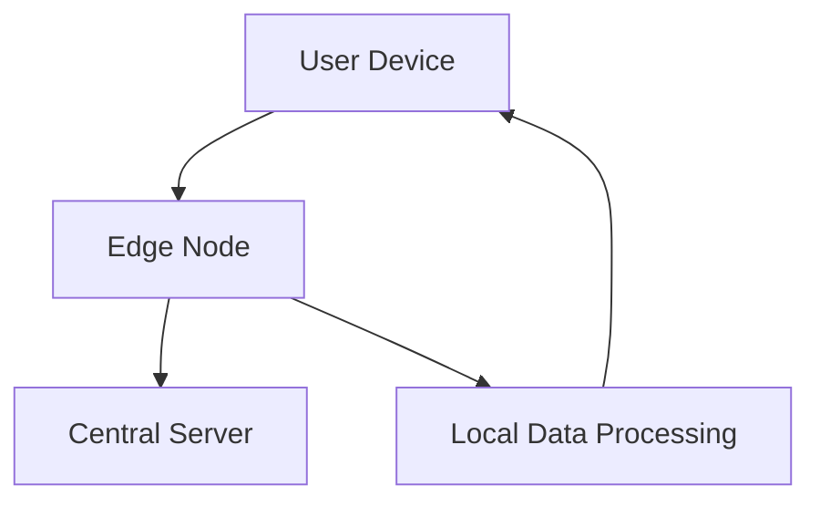

## 22.7 Edge Computing with JavaScript

### Introduction to Edge Computing

Edge computing is a paradigm shift in how we process data, moving computation and data storage closer to the location where it is needed, rather than relying on a centralized data center. This approach reduces latency, saves bandwidth, and enhances the performance of applications, especially those that require real-time data processing.

#### Importance of Edge Computing

In today's digital landscape, the demand for faster and more efficient data processing is ever-increasing. Edge computing addresses this demand by:

- **Reducing Latency**: By processing data closer to the source, edge computing minimizes the time it takes for data to travel to a central server and back.
- **Improving Bandwidth Efficiency**: By handling data locally, edge computing reduces the amount of data that needs to be sent over the network.
- **Enhancing Privacy and Security**: Processing data locally can reduce the risk of data breaches during transmission.
- **Enabling Real-Time Processing**: Applications that require immediate data processing, such as IoT devices, benefit significantly from edge computing.

### Scenarios Where Edge Computing is Beneficial

Edge computing is particularly advantageous in scenarios where real-time data processing is crucial. Let's explore some of these scenarios:

#### Internet of Things (IoT)

IoT devices generate massive amounts of data that need to be processed quickly. Edge computing allows these devices to process data locally, reducing the need for constant communication with a central server. This is especially important in applications like smart cities, autonomous vehicles, and industrial automation.

#### Content Delivery Networks (CDNs)

CDNs use edge computing to cache content closer to users, reducing load times and improving user experience. By processing requests at the edge, CDNs can deliver content more efficiently and handle higher traffic volumes.

#### Augmented Reality (AR) and Virtual Reality (VR)

AR and VR applications require low-latency data processing to provide seamless user experiences. Edge computing enables these applications to process data in real-time, enhancing performance and reducing lag.

### Running JavaScript on Edge Devices

JavaScript, with its versatility and ubiquity, is a natural fit for edge computing. Platforms like [Cloudflare Workers](https://workers.cloudflare.com/) allow developers to run JavaScript code at the edge, bringing computation closer to users.

#### Example: Cloudflare Workers

Cloudflare Workers is a serverless platform that enables developers to run JavaScript code at the edge of Cloudflare's network. This allows for rapid response times and efficient data processing. Here's a simple example of a Cloudflare Worker:

```javascript
addEventListener('fetch', event => {
  event.respondWith(handleRequest(event.request));
});

async function handleRequest(request) {
  // Process the request and return a response
  return new Response('Hello from the edge!', {
    headers: { 'content-type': 'text/plain' },
  });
}
```

In this example, the worker listens for fetch events, processes the request, and returns a response. This code runs at the edge, providing fast and efficient responses to user requests.

#### Benefits of Running JavaScript on Edge Devices

- **Reduced Bandwidth Usage**: By processing data locally, edge computing reduces the amount of data that needs to be transmitted over the network.
- **Improved Response Times**: With computation happening closer to the user, applications can respond more quickly to requests.
- **Scalability**: Edge computing allows applications to scale more efficiently by distributing computation across multiple edge nodes.

### Challenges of Edge Computing with JavaScript

While edge computing offers numerous benefits, it also presents several challenges:

#### Resource Constraints

Edge devices often have limited computational power and storage capacity compared to centralized servers. Developers must optimize their code to run efficiently on these devices.

#### Security Concerns

Processing data at the edge introduces new security challenges. Ensuring data integrity and protecting against unauthorized access are critical considerations.

#### Complexity in Deployment

Deploying applications across multiple edge nodes can be complex, requiring careful orchestration and management.

### Tools and Frameworks Supporting Edge Computing with JavaScript

Several tools and frameworks support edge computing with JavaScript, making it easier for developers to build and deploy applications at the edge:

- **Cloudflare Workers**: A serverless platform for running JavaScript at the edge.
- **AWS Lambda@Edge**: Extends AWS Lambda to run code closer to users of your application, improving performance and reducing latency.
- **EdgeEngine**: A platform for deploying JavaScript applications at the edge, providing tools for managing and scaling edge deployments.

### Visualizing Edge Computing Architecture

To better understand how edge computing works, let's visualize the architecture using a Mermaid.js diagram:



**Diagram Description**: This diagram illustrates the flow of data in an edge computing architecture. User devices communicate with edge nodes, which handle local data processing and communicate with central servers as needed.

### Conclusion

Edge computing with JavaScript offers a powerful solution for improving application performance and reducing latency. By processing data closer to the source, developers can create more responsive and efficient applications. However, it's essential to consider the challenges and choose the right tools and frameworks to support edge computing initiatives.

### Knowledge Check

- What is edge computing, and why is it important?
- How does edge computing benefit IoT applications?
- Provide an example of running JavaScript on an edge platform.
- What are some challenges associated with edge computing?
- Name a tool or framework that supports edge computing with JavaScript.

### Embrace the Journey

Remember, this is just the beginning. As you explore edge computing with JavaScript, you'll discover new ways to optimize your applications and deliver better experiences to your users. Keep experimenting, stay curious, and enjoy the journey!

## Edge Computing with JavaScript Quiz



### What is a primary benefit of edge computing?

- [x] Reduced latency
- [ ] Increased centralization
- [ ] Higher bandwidth usage
- [ ] Slower response times

> **Explanation:** Edge computing reduces latency by processing data closer to the source.

### Which platform allows running JavaScript at the edge?

- [x] Cloudflare Workers
- [ ] AWS S3
- [ ] Google Cloud Storage
- [ ] Microsoft Azure Blob

> **Explanation:** Cloudflare Workers is a platform that allows running JavaScript at the edge.

### What is a challenge of edge computing?

- [x] Resource constraints
- [ ] Unlimited computational power
- [ ] Centralized data processing
- [ ] Increased bandwidth usage

> **Explanation:** Edge devices often have limited computational power and storage capacity.

### How does edge computing benefit IoT devices?

- [x] By enabling real-time data processing
- [ ] By increasing data transmission to central servers
- [ ] By reducing local processing
- [ ] By centralizing data storage

> **Explanation:** Edge computing enables IoT devices to process data locally, allowing for real-time data processing.

### Which of the following is a tool for edge computing with JavaScript?

- [x] AWS Lambda@Edge
- [ ] Google Cloud Functions
- [ ] Microsoft Azure Functions
- [ ] Firebase Functions

> **Explanation:** AWS Lambda@Edge is a tool that supports edge computing with JavaScript.

### What is a security concern with edge computing?

- [x] Ensuring data integrity
- [ ] Unlimited data storage
- [ ] Centralized access control
- [ ] Reduced data privacy

> **Explanation:** Ensuring data integrity is a critical security concern in edge computing.

### What is the role of edge nodes in edge computing?

- [x] Handling local data processing
- [ ] Centralizing data storage
- [ ] Increasing latency
- [ ] Reducing computational power

> **Explanation:** Edge nodes handle local data processing, reducing latency and improving performance.

### How does edge computing improve bandwidth efficiency?

- [x] By processing data locally
- [ ] By increasing data transmission
- [ ] By centralizing data processing
- [ ] By reducing local computation

> **Explanation:** Edge computing processes data locally, reducing the amount of data transmitted over the network.

### What is a benefit of running JavaScript on edge devices?

- [x] Improved response times
- [ ] Increased bandwidth usage
- [ ] Centralized data processing
- [ ] Slower application performance

> **Explanation:** Running JavaScript on edge devices improves response times by processing data closer to the user.

### True or False: Edge computing centralizes data processing.

- [ ] True
- [x] False

> **Explanation:** Edge computing decentralizes data processing by moving computation closer to the data source.


