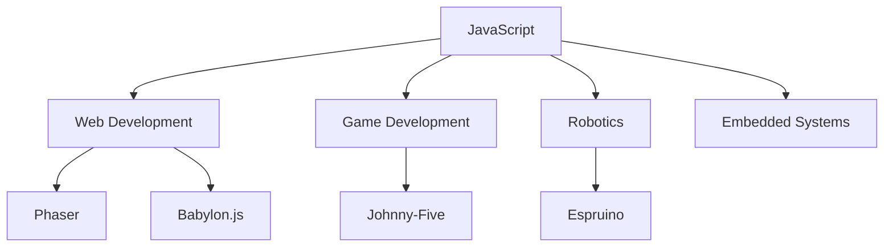

## 22.8 JavaScript in Unconventional Domains: Game Development and Beyond

JavaScript, traditionally known for its role in web development, has expanded its reach into various unconventional domains. This section explores how JavaScript is utilized in game development, robotics, and embedded systems, showcasing its flexibility and adaptability across different platforms.

### JavaScript in Game Development

JavaScript has become a powerful tool in game development, thanks to its versatility and the availability of robust game engines like [Phaser](https://phaser.io/) and [Babylon.js](https://www.babylonjs.com/). These engines allow developers to create engaging and interactive games that run seamlessly in web browsers.

#### Phaser: A 2D Game Framework

Phaser is a fast, free, and fun open-source framework for Canvas and WebGL-powered browser games. It provides a comprehensive suite of tools for building 2D games, including physics engines, sprite management, and input handling.

**Example: Creating a Simple Game with Phaser**

Let's build a simple game using Phaser where a player controls a character to collect stars.

```javascript
// Import Phaser library
import Phaser from 'phaser';

// Create a new Phaser game instance
const config = {
    type: Phaser.AUTO,
    width: 800,
    height: 600,
    physics: {
        default: 'arcade',
        arcade: {
            gravity: { y: 300 },
            debug: false
        }
    },
    scene: {
        preload: preload,
        create: create,
        update: update
    }
};

const game = new Phaser.Game(config);

function preload() {
    this.load.image('sky', 'assets/sky.png');
    this.load.image('ground', 'assets/platform.png');
    this.load.image('star', 'assets/star.png');
    this.load.spritesheet('dude', 'assets/dude.png', { frameWidth: 32, frameHeight: 48 });
}

function create() {
    this.add.image(400, 300, 'sky');

    const platforms = this.physics.add.staticGroup();
    platforms.create(400, 568, 'ground').setScale(2).refreshBody();

    const player = this.physics.add.sprite(100, 450, 'dude');
    player.setBounce(0.2);
    player.setCollideWorldBounds(true);

    this.physics.add.collider(player, platforms);

    const stars = this.physics.add.group({
        key: 'star',
        repeat: 11,
        setXY: { x: 12, y: 0, stepX: 70 }
    });

    stars.children.iterate(function (child) {
        child.setBounceY(Phaser.Math.FloatBetween(0.4, 0.8));
    });

    this.physics.add.collider(stars, platforms);
    this.physics.add.overlap(player, stars, collectStar, null, this);
}

function update() {
    // Game logic for player movement and interaction
}

function collectStar(player, star) {
    star.disableBody(true, true);
    // Update score or game state
}
```

**Try It Yourself**: Modify the game to include obstacles or power-ups. Experiment with different physics settings to change the gameplay dynamics.

#### Babylon.js: A 3D Game Engine

Babylon.js is a powerful, beautiful, simple, and open-source 3D engine. It allows developers to create stunning 3D experiences directly in the browser.

**Example: Creating a 3D Scene with Babylon.js**

```javascript
// Import Babylon.js library
import * as BABYLON from 'babylonjs';

// Create the canvas and engine
const canvas = document.getElementById('renderCanvas');
const engine = new BABYLON.Engine(canvas, true);

// Create the scene
const createScene = function () {
    const scene = new BABYLON.Scene(engine);

    // Add a camera
    const camera = new BABYLON.ArcRotateCamera('camera1', Math.PI / 2, Math.PI / 2, 2, BABYLON.Vector3.Zero(), scene);
    camera.attachControl(canvas, true);

    // Add a light
    const light = new BABYLON.HemisphericLight('light1', new BABYLON.Vector3(1, 1, 0), scene);

    // Add a sphere
    const sphere = BABYLON.MeshBuilder.CreateSphere('sphere', { diameter: 1 }, scene);

    return scene;
};

// Render the scene
const scene = createScene();
engine.runRenderLoop(function () {
    scene.render();
});

// Resize the engine on window resize
window.addEventListener('resize', function () {
    engine.resize();
});
```

**Try It Yourself**: Add more objects to the scene, such as cubes or planes. Experiment with different lighting and camera settings to create unique visual effects.

### JavaScript in Robotics

JavaScript's reach extends beyond the browser into the world of robotics. Libraries like [Johnny-Five](http://johnny-five.io/) enable developers to control hardware using JavaScript, making it accessible for building robots and IoT devices.

**Example: Controlling an LED with Johnny-Five**

```javascript
// Import Johnny-Five library
const { Board, Led } = require('johnny-five');

// Initialize the board
const board = new Board();

board.on('ready', () => {
    // Create an LED on pin 13
    const led = new Led(13);

    // Blink the LED
    led.blink(500);
});
```

**Try It Yourself**: Connect different sensors or actuators to the board and control them using JavaScript. Experiment with different configurations to create interactive robotic projects.

### JavaScript in Embedded Systems

JavaScript is also making its way into embedded systems, thanks to platforms like [Espruino](https://www.espruino.com/), which allows JavaScript to run on microcontrollers. This opens up possibilities for using JavaScript in hardware programming and IoT applications.

**Example: Blinking an LED with Espruino**

```javascript
// Load the Espruino module
const onInit = function () {
    // Set pin mode
    pinMode(LED1, 'output');

    // Toggle the LED every second
    setInterval(() => {
        digitalWrite(LED1, !digitalRead(LED1));
    }, 1000);
};

// Initialize the board
onInit();
```

**Try It Yourself**: Connect additional components like buttons or sensors and interact with them using JavaScript. Explore the capabilities of microcontrollers with JavaScript.

### Flexibility and Versatility of JavaScript

JavaScript's flexibility and versatility make it an ideal choice for various unconventional domains. Its ability to run on different platforms, from web browsers to microcontrollers, allows developers to leverage their existing skills across multiple fields.

#### Key Advantages of JavaScript

- **Cross-Platform Compatibility**: JavaScript can run on virtually any platform, making it a versatile choice for developers.
- **Rich Ecosystem**: With a vast array of libraries and frameworks, JavaScript provides tools for almost any task.
- **Community Support**: A large and active community ensures continuous improvement and support for JavaScript projects.

### Visualizing JavaScript's Interaction with Different Domains



**Diagram Description**: This flowchart illustrates JavaScript's interaction with various domains, highlighting its versatility and adaptability.

### Knowledge Check

- **What are some advantages of using JavaScript in game development?**
- **How does Johnny-Five enable JavaScript to interact with hardware?**
- **What makes JavaScript suitable for embedded systems?**

### Summary

JavaScript's adaptability and extensive ecosystem make it a powerful tool in unconventional domains such as game development, robotics, and embedded systems. By leveraging JavaScript, developers can create innovative solutions across various platforms, expanding the possibilities of what can be achieved with this versatile language.

**Remember, this is just the beginning. As you progress, you'll discover even more ways to harness the power of JavaScript in unconventional domains. Keep experimenting, stay curious, and enjoy the journey!**

## Quiz: Exploring JavaScript in Unconventional Domains



### What is Phaser primarily used for in JavaScript development?

- [x] 2D game development
- [ ] 3D modeling
- [ ] Robotics control
- [ ] Embedded systems programming

> **Explanation:** Phaser is a framework specifically designed for creating 2D games in JavaScript.

### Which library allows JavaScript to control hardware for robotics?

- [ ] Phaser
- [ ] Babylon.js
- [x] Johnny-Five
- [ ] Espruino

> **Explanation:** Johnny-Five is a JavaScript library that enables developers to control hardware and build robotics projects.

### What is a key feature of Babylon.js?

- [ ] It is used for 2D game development.
- [x] It is a 3D game engine.
- [ ] It controls microcontrollers.
- [ ] It is a robotics library.

> **Explanation:** Babylon.js is a powerful 3D engine used for creating 3D games and experiences in JavaScript.

### How does Espruino allow JavaScript to be used in embedded systems?

- [x] By running JavaScript on microcontrollers
- [ ] By providing a 3D game engine
- [ ] By enabling web development
- [ ] By controlling robotic hardware

> **Explanation:** Espruino allows JavaScript to run on microcontrollers, making it suitable for embedded systems programming.

### What is a primary advantage of using JavaScript across different domains?

- [x] Cross-platform compatibility
- [ ] Limited library support
- [ ] High hardware requirements
- [ ] Lack of community support

> **Explanation:** JavaScript's cross-platform compatibility makes it a versatile choice for various domains.

### Which of the following is NOT a domain where JavaScript is commonly used?

- [ ] Web development
- [ ] Game development
- [ ] Robotics
- [x] Quantum computing

> **Explanation:** While JavaScript is used in many domains, quantum computing is not a common area for JavaScript applications.

### What makes JavaScript suitable for game development?

- [x] Its versatility and robust game engines
- [ ] Its high computational power
- [ ] Its lack of community support
- [ ] Its inability to run on browsers

> **Explanation:** JavaScript's versatility and the availability of robust game engines like Phaser and Babylon.js make it suitable for game development.

### Which of the following is a 3D game engine for JavaScript?

- [ ] Phaser
- [x] Babylon.js
- [ ] Johnny-Five
- [ ] Espruino

> **Explanation:** Babylon.js is a 3D game engine that allows developers to create 3D experiences in JavaScript.

### What is a benefit of using Johnny-Five in robotics?

- [x] It allows JavaScript to control hardware.
- [ ] It is a 3D game engine.
- [ ] It is used for web development.
- [ ] It runs JavaScript on microcontrollers.

> **Explanation:** Johnny-Five enables JavaScript to control hardware, making it beneficial for robotics projects.

### True or False: JavaScript can only be used for web development.

- [ ] True
- [x] False

> **Explanation:** JavaScript is versatile and can be used in various domains beyond web development, such as game development, robotics, and embedded systems.


