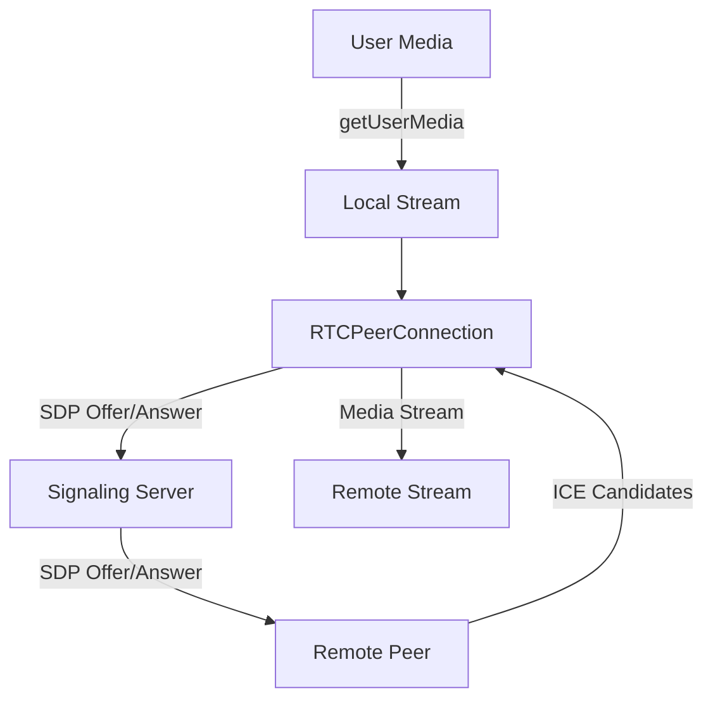

## 22.9 WebRTC for Real-Time Communication

WebRTC (Web Real-Time Communication) is a powerful technology that enables real-time audio, video, and data sharing directly between browsers and mobile applications. It is an open-source project that provides web applications and sites with real-time communication capabilities via simple JavaScript APIs. In this section, we will explore the fundamentals of WebRTC, its architecture, and how to implement it in JavaScript for various use cases such as video conferencing, file sharing, and live streaming.

### What is WebRTC?

WebRTC is a set of protocols and APIs that allow peer-to-peer communication directly between browsers without the need for an intermediary server. This technology is particularly useful for applications that require low-latency communication, such as video conferencing, voice calls, and real-time data sharing.

#### Key Capabilities of WebRTC

- **Audio and Video Communication**: WebRTC supports high-quality audio and video communication, making it ideal for video conferencing and voice calls.
- **Data Channels**: It allows for the exchange of arbitrary data between peers, enabling use cases like file sharing and gaming.
- **Cross-Platform Support**: WebRTC is supported by most modern browsers, including Chrome, Firefox, Safari, and Edge, as well as mobile platforms like Android and iOS.

### WebRTC Architecture

WebRTC's architecture is designed to facilitate direct peer-to-peer communication. The main components involved in a WebRTC connection are:

- **MediaStream**: Represents a stream of media content, such as audio or video.
- **RTCPeerConnection**: Manages the connection to another WebRTC device and handles the transmission of media and data.
- **RTCDataChannel**: Provides a channel for bidirectional data communication.

#### Protocols and APIs

WebRTC uses several protocols to establish and maintain peer-to-peer connections:

- **Session Description Protocol (SDP)**: Used to describe multimedia communication sessions.
- **Interactive Connectivity Establishment (ICE)**: A framework to allow WebRTC to traverse NATs and firewalls.
- **STUN (Session Traversal Utilities for NAT)**: Helps clients find out their public IP address and the type of NAT they are behind.
- **TURN (Traversal Using Relays around NAT)**: Relays media when a direct peer-to-peer connection cannot be established.

### Setting Up a Simple WebRTC Application

Let's walk through the process of setting up a basic video chat application using WebRTC. This example will demonstrate how to establish a peer-to-peer connection and exchange video streams between two browsers.

#### Step 1: Get User Media

First, we need to access the user's camera and microphone using the `getUserMedia` API.

```javascript
navigator.mediaDevices.getUserMedia({ video: true, audio: true })
  .then(stream => {
    // Display the local video stream
    const localVideo = document.getElementById('localVideo');
    localVideo.srcObject = stream;
  })
  .catch(error => {
    console.error('Error accessing media devices.', error);
  });
```

#### Step 2: Create an RTCPeerConnection

Next, create an `RTCPeerConnection` to manage the connection to the remote peer.

```javascript
const configuration = {
  iceServers: [
    { urls: 'stun:stun.l.google.com:19302' }
  ]
};

const peerConnection = new RTCPeerConnection(configuration);

// Add the local stream to the connection
stream.getTracks().forEach(track => peerConnection.addTrack(track, stream));
```

#### Step 3: Establish a Connection

To establish a connection, we need to exchange SDP offer and answer between peers. This process is known as signaling and typically involves a signaling server.

```javascript
peerConnection.createOffer()
  .then(offer => peerConnection.setLocalDescription(offer))
  .then(() => {
    // Send the offer to the remote peer via signaling server
  });

// When receiving an offer from a remote peer
peerConnection.setRemoteDescription(new RTCSessionDescription(remoteOffer))
  .then(() => peerConnection.createAnswer())
  .then(answer => peerConnection.setLocalDescription(answer))
  .then(() => {
    // Send the answer back to the remote peer
  });
```

#### Step 4: Handle ICE Candidates

ICE candidates are used to establish the best path for the connection. We need to exchange these candidates between peers.

```javascript
peerConnection.onicecandidate = event => {
  if (event.candidate) {
    // Send the candidate to the remote peer
  }
};

// When receiving a candidate from a remote peer
peerConnection.addIceCandidate(new RTCIceCandidate(remoteCandidate))
  .catch(error => console.error('Error adding received ICE candidate', error));
```

#### Step 5: Display Remote Video

Finally, display the remote video stream when it becomes available.

```javascript
peerConnection.ontrack = event => {
  const remoteVideo = document.getElementById('remoteVideo');
  remoteVideo.srcObject = event.streams[0];
};
```

### Use Cases for WebRTC

WebRTC is versatile and can be used in various real-time communication scenarios:

- **Video Conferencing**: Platforms like Google Meet and Zoom use WebRTC to provide high-quality video conferencing capabilities.
- **File Sharing**: WebRTC's data channels enable peer-to-peer file sharing without the need for a server.
- **Live Streaming**: WebRTC can be used for low-latency live streaming applications, such as broadcasting events or gaming.

### Signaling Mechanisms

Signaling is the process of coordinating communication between peers. It involves the exchange of control messages, such as session descriptions and ICE candidates. While WebRTC does not specify a signaling protocol, common methods include WebSockets, XHR, and SIP.

### STUN and TURN Servers

STUN and TURN servers are essential for WebRTC to function across different network configurations:

- **STUN Servers**: Help clients discover their public IP address and determine the type of NAT they are behind.
- **TURN Servers**: Relay media when a direct connection cannot be established, ensuring connectivity even in restrictive network environments.

### Security Considerations

Security is a critical aspect of WebRTC:

- **Encryption**: WebRTC encrypts all media and data streams using SRTP (Secure Real-time Transport Protocol) and DTLS (Datagram Transport Layer Security).
- **Permissions**: Browsers require explicit user permission to access media devices, ensuring user privacy.
- **Network Security**: Use secure signaling channels (e.g., HTTPS, WSS) to protect signaling data.

### Handling Media Permissions

When accessing media devices, it's important to handle permissions gracefully:

- **Request Permissions**: Use `getUserMedia` to request access to the camera and microphone.
- **Handle Denials**: Provide feedback to users if they deny permissions, and offer alternatives if possible.

### Visualizing WebRTC Architecture

Below is a diagram illustrating the WebRTC architecture and the flow of data between peers.



**Diagram Description**: This diagram shows the flow of data in a WebRTC connection, from obtaining user media to establishing a peer-to-peer connection and exchanging media streams.

### Try It Yourself

Experiment with the code examples provided by:

- Modifying the `getUserMedia` constraints to test different media configurations.
- Implementing a simple signaling server using WebSockets to facilitate SDP and ICE candidate exchange.
- Adding a data channel to exchange text messages or files between peers.

### Knowledge Check

- What are the main components of a WebRTC connection?
- How does WebRTC ensure secure communication between peers?
- What role do STUN and TURN servers play in WebRTC?
- How can you handle media permissions in a WebRTC application?

### Summary

WebRTC is a powerful tool for enabling real-time communication in web applications. By understanding its architecture, protocols, and APIs, you can build robust applications for video conferencing, file sharing, and more. Remember to consider security and user permissions when implementing WebRTC solutions.

### Embrace the Journey

As you explore WebRTC, remember that this is just the beginning. The possibilities for real-time communication are vast, and with practice, you'll be able to create more complex and interactive applications. Keep experimenting, stay curious, and enjoy the journey!

## WebRTC for Real-Time Communication Quiz



### What is WebRTC primarily used for?

- [x] Real-time audio, video, and data communication
- [ ] Static web page rendering
- [ ] Server-side scripting
- [ ] Database management

> **Explanation:** WebRTC is designed for real-time communication, enabling peer-to-peer audio, video, and data exchange.

### Which protocol does WebRTC use for describing multimedia communication sessions?

- [x] SDP (Session Description Protocol)
- [ ] HTTP (Hypertext Transfer Protocol)
- [ ] FTP (File Transfer Protocol)
- [ ] SMTP (Simple Mail Transfer Protocol)

> **Explanation:** SDP is used in WebRTC to describe multimedia communication sessions.

### What is the role of a STUN server in WebRTC?

- [x] Helps clients discover their public IP address
- [ ] Relays media between peers
- [ ] Encrypts media streams
- [ ] Manages signaling data

> **Explanation:** STUN servers help clients find out their public IP address and the type of NAT they are behind.

### How does WebRTC ensure media stream security?

- [x] By encrypting streams using SRTP and DTLS
- [ ] By using HTTP for signaling
- [ ] By storing media on a server
- [ ] By using plain text communication

> **Explanation:** WebRTC uses SRTP and DTLS to encrypt media streams, ensuring secure communication.

### What is the purpose of the `RTCPeerConnection` API?

- [x] Manages the connection to another WebRTC device
- [ ] Accesses the user's media devices
- [ ] Sends HTTP requests
- [ ] Manages local storage

> **Explanation:** `RTCPeerConnection` is responsible for managing the connection to another WebRTC device.

### Which API is used to access the user's camera and microphone?

- [x] `getUserMedia`
- [ ] `fetch`
- [ ] `XMLHttpRequest`
- [ ] `localStorage`

> **Explanation:** `getUserMedia` is the API used to access the user's camera and microphone.

### What is a TURN server used for in WebRTC?

- [x] Relays media when a direct connection cannot be established
- [ ] Provides encryption for media streams
- [ ] Manages signaling data
- [ ] Stores user credentials

> **Explanation:** TURN servers relay media when a direct peer-to-peer connection cannot be established.

### Which of the following is NOT a component of WebRTC?

- [ ] MediaStream
- [x] XMLHttpRequest
- [ ] RTCPeerConnection
- [ ] RTCDataChannel

> **Explanation:** XMLHttpRequest is not a component of WebRTC; it is used for making HTTP requests.

### What is the main challenge that signaling mechanisms address in WebRTC?

- [x] Coordinating communication between peers
- [ ] Encrypting media streams
- [ ] Accessing user media devices
- [ ] Managing local storage

> **Explanation:** Signaling mechanisms coordinate communication between peers by exchanging control messages.

### True or False: WebRTC requires a server to relay media between peers.

- [ ] True
- [x] False

> **Explanation:** WebRTC is designed for peer-to-peer communication, and media is typically exchanged directly between peers without a server.


