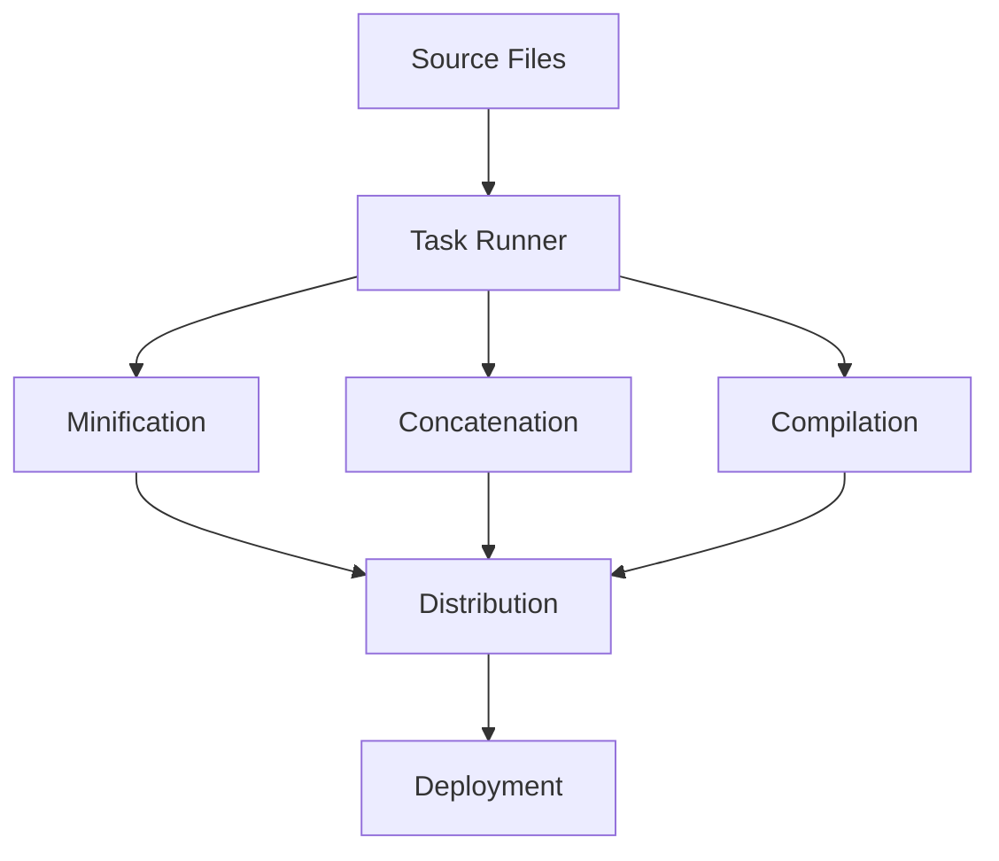

## 23.1 Task Runners: Grunt and Gulp

In modern web development, efficiency and productivity are paramount. Task runners like Grunt and Gulp play a crucial role in automating repetitive tasks, allowing developers to focus on writing code rather than managing mundane processes. This section delves into the purpose of task runners, compares Grunt and Gulp, and provides practical examples to get you started.

### Understanding Task Runners

Task runners are tools that automate common development tasks such as minification, compilation, unit testing, linting, and more. By automating these tasks, developers can streamline their workflows, reduce errors, and ensure consistency across projects.

#### Why Use Task Runners?

- **Efficiency**: Automate repetitive tasks to save time.
- **Consistency**: Ensure tasks are performed the same way every time.
- **Error Reduction**: Minimize human error by automating processes.
- **Focus**: Allow developers to concentrate on coding rather than task management.

### Grunt vs. Gulp: A Comparative Analysis

Grunt and Gulp are two popular task runners in the JavaScript ecosystem. While both serve the same fundamental purpose, they differ in their approach and configuration.

#### Grunt: Configuration Over Code

Grunt is known for its configuration-centric approach. It uses a `Gruntfile` to define tasks and their configurations. Grunt tasks are typically defined in JSON format, making it straightforward but sometimes verbose.

**Key Features of Grunt:**

- **Configuration-Based**: Tasks are defined in a configuration file.
- **Extensive Plugin Ecosystem**: A wide range of plugins available for various tasks.
- **Sequential Task Execution**: Tasks are executed in the order they are defined.

**Example Gruntfile:**

```javascript
module.exports = function(grunt) {
  // Project configuration.
  grunt.initConfig({
    pkg: grunt.file.readJSON('package.json'),
    uglify: {
      build: {
        src: 'src/js/*.js',
        dest: 'dist/js/app.min.js'
      }
    },
    cssmin: {
      target: {
        files: [{
          expand: true,
          cwd: 'src/css',
          src: ['*.css', '!*.min.css'],
          dest: 'dist/css',
          ext: '.min.css'
        }]
      }
    }
  });

  // Load the plugins.
  grunt.loadNpmTasks('grunt-contrib-uglify');
  grunt.loadNpmTasks('grunt-contrib-cssmin');

  // Default task(s).
  grunt.registerTask('default', ['uglify', 'cssmin']);
};
```

#### Gulp: Code Over Configuration

Gulp takes a code-centric approach, using JavaScript to define tasks. This makes Gulp more flexible and easier to read for those familiar with JavaScript.

**Key Features of Gulp:**

- **Code-Based**: Tasks are defined using JavaScript code.
- **Stream-Based**: Uses Node.js streams for fast build processes.
- **Parallel Task Execution**: Capable of running tasks concurrently.

**Example Gulpfile:**

```javascript
const { src, dest, series, parallel } = require('gulp');
const uglify = require('gulp-uglify');
const cssmin = require('gulp-cssmin');

function minifyJs() {
  return src('src/js/*.js')
    .pipe(uglify())
    .pipe(dest('dist/js'));
}

function minifyCss() {
  return src('src/css/*.css')
    .pipe(cssmin())
    .pipe(dest('dist/css'));
}

exports.default = series(minifyJs, minifyCss);
```

### Setting Up Grunt and Gulp

#### Setting Up Grunt

1. **Install Grunt CLI**: Ensure you have Node.js installed, then install Grunt CLI globally.
   ```bash
   npm install -g grunt-cli
   ```

2. **Initialize Your Project**: Create a `package.json` file if you don't have one.
   ```bash
   npm init -y
   ```

3. **Install Grunt Locally**: Install Grunt and any plugins you need.
   ```bash
   npm install grunt --save-dev
   npm install grunt-contrib-uglify grunt-contrib-cssmin --save-dev
   ```

4. **Create a Gruntfile**: Define your tasks in a `Gruntfile.js`.

5. **Run Grunt**: Execute tasks using the `grunt` command.
   ```bash
   grunt
   ```

#### Setting Up Gulp

1. **Install Gulp CLI**: Ensure Node.js is installed, then install Gulp CLI globally.
   ```bash
   npm install -g gulp-cli
   ```

2. **Initialize Your Project**: Create a `package.json` file.
   ```bash
   npm init -y
   ```

3. **Install Gulp Locally**: Install Gulp and any plugins you need.
   ```bash
   npm install gulp gulp-uglify gulp-cssmin --save-dev
   ```

4. **Create a Gulpfile**: Define your tasks in a `gulpfile.js`.

5. **Run Gulp**: Execute tasks using the `gulp` command.
   ```bash
   gulp
   ```

### Automating Common Tasks

Task runners can automate a variety of tasks. Here are some common examples:

#### Minification

Minification reduces the size of JavaScript and CSS files by removing unnecessary characters.

- **Grunt**: Use `grunt-contrib-uglify` for JavaScript and `grunt-contrib-cssmin` for CSS.
- **Gulp**: Use `gulp-uglify` for JavaScript and `gulp-cssmin` for CSS.

#### Concatenation

Concatenation combines multiple files into one, reducing the number of HTTP requests.

- **Grunt**: Use `grunt-contrib-concat`.
- **Gulp**: Use `gulp-concat`.

#### Compilation

Compilation transforms code from one language to another, such as from Sass to CSS or TypeScript to JavaScript.

- **Grunt**: Use `grunt-sass` for Sass and `grunt-typescript` for TypeScript.
- **Gulp**: Use `gulp-sass` for Sass and `gulp-typescript` for TypeScript.

### Best Practices for Task Runners

- **Organize Tasks**: Group related tasks together and use descriptive names.
- **Manage Dependencies**: Use `package.json` to manage dependencies and ensure consistency.
- **Use Plugins Wisely**: Only include necessary plugins to keep your build process efficient.
- **Integrate with npm Scripts**: Use npm scripts to run task runners as part of your build process.

### Task Runners in Modern Workflows

Task runners like Grunt and Gulp are often used alongside module bundlers like Webpack and Rollup. While task runners automate individual tasks, bundlers handle module dependencies and optimize code for production.

**Integrating Task Runners with npm Scripts:**

- Define scripts in `package.json` to run task runners.
- Use task runners for tasks not handled by bundlers, such as image optimization or deployment scripts.

### Visualizing Task Runner Workflow

Below is a flowchart illustrating how task runners fit into a typical development workflow:



**Description**: This diagram shows how source files are processed by a task runner to perform tasks like minification, concatenation, and compilation, resulting in distribution-ready files for deployment.

### Try It Yourself

Experiment with the provided Grunt and Gulp examples by modifying the source file paths or adding new tasks. Try integrating additional plugins to extend functionality, such as image optimization or linting.

### Knowledge Check

Reflect on the following questions to test your understanding of task runners:

- What are the primary differences between Grunt and Gulp?
- How do task runners improve development workflows?
- What are some common tasks automated by task runners?

### Summary

Task runners like Grunt and Gulp are invaluable tools in modern web development, automating repetitive tasks and enhancing productivity. By understanding their differences and capabilities, you can choose the right tool for your workflow and integrate it seamlessly into your development process. Remember, this is just the beginning. As you progress, you'll discover more advanced techniques and tools to further optimize your workflow. Keep experimenting, stay curious, and enjoy the journey!

## Mastering Task Runners: Grunt and Gulp Quiz



### What is the primary purpose of task runners like Grunt and Gulp?

- [x] Automate repetitive tasks in development workflows
- [ ] Manage database connections
- [ ] Handle user authentication
- [ ] Create UI components

> **Explanation:** Task runners are designed to automate repetitive tasks, enhancing productivity and efficiency in development workflows.

### How does Grunt define tasks?

- [x] Using a configuration file called Gruntfile
- [ ] Through inline JavaScript code
- [ ] By writing shell scripts
- [ ] Using a GUI interface

> **Explanation:** Grunt uses a configuration file called Gruntfile to define tasks in a JSON-like format.

### What is a key feature of Gulp?

- [x] Stream-based processing for fast build processes
- [ ] Uses XML for configuration
- [ ] Requires a GUI for task management
- [ ] Only works with CSS files

> **Explanation:** Gulp uses Node.js streams, which allows for fast and efficient build processes.

### Which of the following tasks can be automated using task runners?

- [x] Minification
- [x] Concatenation
- [x] Compilation
- [ ] User authentication

> **Explanation:** Task runners can automate tasks like minification, concatenation, and compilation, but not user authentication.

### How can task runners be integrated into modern workflows?

- [x] By using npm scripts
- [x] Alongside module bundlers like Webpack
- [ ] As a replacement for version control systems
- [ ] By directly modifying the browser's DOM

> **Explanation:** Task runners can be integrated into modern workflows using npm scripts and alongside module bundlers like Webpack.

### What is the main difference between Grunt and Gulp?

- [x] Grunt is configuration-based, while Gulp is code-based
- [ ] Grunt is faster than Gulp
- [ ] Gulp only works with HTML files
- [ ] Grunt requires a GUI interface

> **Explanation:** Grunt uses a configuration-based approach, while Gulp uses a code-based approach with JavaScript.

### Which command is used to install Gulp CLI globally?

- [x] npm install -g gulp-cli
- [ ] npm install gulp
- [ ] gulp install
- [ ] npm install -g gulp

> **Explanation:** The command `npm install -g gulp-cli` is used to install the Gulp CLI globally.

### What is the role of plugins in task runners?

- [x] Extend functionality by adding new tasks
- [ ] Manage user sessions
- [ ] Handle database queries
- [ ] Create UI components

> **Explanation:** Plugins extend the functionality of task runners by adding new tasks and capabilities.

### What is a common use case for task runners?

- [x] Automating build processes
- [ ] Managing server configurations
- [ ] Designing user interfaces
- [ ] Writing database queries

> **Explanation:** Task runners are commonly used to automate build processes, such as minification and compilation.

### True or False: Task runners can only be used for front-end development.

- [ ] True
- [x] False

> **Explanation:** Task runners can be used for both front-end and back-end development tasks, automating various processes across the development workflow.


