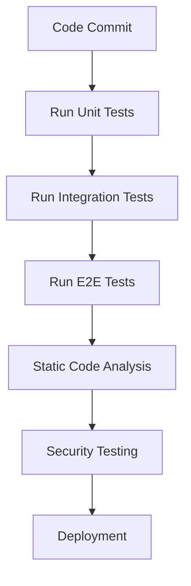

## 23.10 Automating Testing and QA Processes

In the fast-paced world of modern web development, ensuring the reliability and quality of your code is paramount. Automated testing and quality assurance (QA) processes play a crucial role in achieving this goal by reducing manual effort, minimizing human error, and providing consistent feedback. In this section, we will explore the role of automation in testing and QA, demonstrate how to set up automated test suites using popular tools, and discuss best practices for maintaining test coverage and reliability.

### The Role of Automation in Testing and QA

Automated testing involves using software tools to execute tests on your codebase automatically. This approach offers several advantages:

- **Efficiency**: Automated tests can run quickly and repeatedly, saving time compared to manual testing.
- **Consistency**: Automated tests provide consistent results, reducing the risk of human error.
- **Scalability**: As your codebase grows, automated tests can scale to cover more functionality without a proportional increase in effort.
- **Feedback**: Automated tests provide immediate feedback, allowing developers to identify and fix issues early in the development process.

### Setting Up Automated Test Suites

To automate testing, we need to set up test suites using tools like Jest or Mocha. These tools allow us to write and execute tests efficiently.

#### Jest: A Comprehensive Testing Framework

Jest is a popular testing framework for JavaScript, known for its simplicity and powerful features. It provides a complete testing solution, including test runners, assertion libraries, and mocking capabilities.

**Example: Setting Up a Jest Test Suite**

```javascript
// Install Jest using npm
// npm install --save-dev jest

// Create a simple function to test
function sum(a, b) {
  return a + b;
}

// Export the function for testing
module.exports = sum;

// Create a test file: sum.test.js
const sum = require('./sum');

test('adds 1 + 2 to equal 3', () => {
  expect(sum(1, 2)).toBe(3);
});
```

To run the test, add the following script to your `package.json`:

```json
"scripts": {
  "test": "jest"
}
```

Now, you can run the test using the command:

```bash
npm test
```

#### Mocha: A Flexible Testing Framework

Mocha is another popular testing framework that provides flexibility and control over your testing environment. It allows you to use any assertion library, such as Chai, to write expressive tests.

**Example: Setting Up a Mocha Test Suite**

```javascript
// Install Mocha and Chai using npm
// npm install --save-dev mocha chai

// Create a simple function to test
function multiply(a, b) {
  return a * b;
}

// Export the function for testing
module.exports = multiply;

// Create a test file: multiply.test.js
const multiply = require('./multiply');
const chai = require('chai');
const expect = chai.expect;

describe('Multiply Function', () => {
  it('should multiply 2 and 3 to get 6', () => {
    expect(multiply(2, 3)).to.equal(6);
  });
});
```

To run the test, add the following script to your `package.json`:

```json
"scripts": {
  "test": "mocha"
}
```

Now, you can run the test using the command:

```bash
npm test
```

### Continuous Testing Integration with CI Tools

Continuous Integration (CI) is a development practice where developers integrate code into a shared repository frequently. Each integration is verified by an automated build and test process, allowing teams to detect problems early.

#### Integrating Tests with CI Tools

Popular CI tools like Jenkins, Travis CI, and GitHub Actions can be configured to run your test suites automatically whenever code is pushed to the repository.

**Example: Setting Up GitHub Actions for Continuous Testing**

Create a `.github/workflows/test.yml` file in your repository:

```yaml
name: Node.js CI

on:
  push:
    branches: [main]
  pull_request:
    branches: [main]

jobs:
  build:
    runs-on: ubuntu-latest

    strategy:
      matrix:
        node-version: [12.x, 14.x, 16.x]

    steps:
    - uses: actions/checkout@v2
    - name: Use Node.js ${{ matrix.node-version }}
      uses: actions/setup-node@v2
      with:
        node-version: ${{ matrix.node-version }}
    - run: npm install
    - run: npm test
```

This configuration will run your tests on multiple Node.js versions whenever code is pushed to the `main` branch or a pull request is opened.

### End-to-End Testing Automation

End-to-end (E2E) testing simulates real user interactions with your application, ensuring that all components work together as expected. Tools like Cypress and Selenium are commonly used for E2E testing.

#### Cypress: A Modern E2E Testing Tool

Cypress is a JavaScript-based E2E testing framework that provides a fast, reliable, and easy-to-use testing environment.

**Example: Setting Up Cypress for E2E Testing**

```bash
# Install Cypress using npm
npm install --save-dev cypress

# Open Cypress test runner
npx cypress open
```

Create a test file in the `cypress/integration` folder:

```javascript
describe('My First Test', () => {
  it('Visits the Kitchen Sink', () => {
    cy.visit('https://example.cypress.io');
    cy.contains('type').click();
    cy.url().should('include', '/commands/actions');
    cy.get('.action-email').type('fake@email.com').should('have.value', 'fake@email.com');
  });
});
```

#### Selenium: A Versatile E2E Testing Tool

Selenium is a widely-used tool for automating web browsers. It supports multiple programming languages and can be integrated with various testing frameworks.

**Example: Setting Up Selenium for E2E Testing**

```javascript
// Install Selenium WebDriver and Mocha
// npm install --save-dev selenium-webdriver mocha

const { Builder, By, Key, until } = require('selenium-webdriver');

describe('Google Search', function() {
  let driver;

  before(async function() {
    driver = await new Builder().forBrowser('firefox').build();
  });

  it('should open Google and search for Selenium', async function() {
    await driver.get('http://www.google.com');
    await driver.findElement(By.name('q')).sendKeys('Selenium', Key.RETURN);
    await driver.wait(until.titleContains('Selenium'), 1000);
  });

  after(() => driver && driver.quit());
});
```

### Best Practices for Maintaining Test Coverage and Reliability

To ensure your automated tests are effective, follow these best practices:

- **Write Clear and Concise Tests**: Ensure your tests are easy to read and understand.
- **Maintain High Test Coverage**: Aim for comprehensive test coverage to catch potential issues.
- **Use Mocking and Stubbing**: Isolate components and test them independently using mocking and stubbing techniques.
- **Regularly Update Tests**: Keep your tests up-to-date with changes in the codebase.
- **Monitor Test Performance**: Track test execution times and optimize slow tests.
- **Integrate Static Code Analysis**: Use tools like ESLint to enforce coding standards and catch potential issues early.
- **Incorporate Security Testing**: Integrate security testing tools to identify vulnerabilities in your code.

### Integrating Static Code Analysis and Security Testing

Static code analysis involves examining your code without executing it to identify potential issues. Tools like ESLint and SonarQube can be integrated into your CI pipeline to enforce coding standards and detect code smells.

**Example: Integrating ESLint with CI**

Add an ESLint configuration file (`.eslintrc.json`) to your project:

```json
{
  "env": {
    "browser": true,
    "es2021": true
  },
  "extends": "eslint:recommended",
  "parserOptions": {
    "ecmaVersion": 12,
    "sourceType": "module"
  },
  "rules": {
    "indent": ["error", 2],
    "linebreak-style": ["error", "unix"],
    "quotes": ["error", "single"],
    "semi": ["error", "always"]
  }
}
```

Update your CI configuration to run ESLint:

```yaml
- run: npm run lint
```

**Example: Integrating Security Testing with OWASP ZAP**

OWASP ZAP is a popular security testing tool that can be integrated into your CI pipeline to identify vulnerabilities.

```yaml
- name: OWASP ZAP Scan
  uses: zaproxy/action-full-scan@v0.4.0
  with:
    token: ${{ secrets.GITHUB_TOKEN }}
    target: 'http://localhost:8080'
```

### Visualizing the Automated Testing Workflow

To better understand the automated testing workflow, let's visualize it using a flowchart.



**Figure 1**: Automated Testing Workflow

### Knowledge Check

- **What are the benefits of automated testing?**
- **How can you set up a Jest test suite?**
- **What is the role of CI in automated testing?**
- **How does Cypress differ from Selenium for E2E testing?**
- **What are some best practices for maintaining test coverage?**

### Exercises

1. **Set up a Jest test suite** for a simple JavaScript function and run the tests.
2. **Configure a CI pipeline** using GitHub Actions to run your test suite automatically.
3. **Write an E2E test** using Cypress for a simple web application.
4. **Integrate ESLint** into your project and fix any linting errors.
5. **Perform a security scan** using OWASP ZAP and address any identified vulnerabilities.

### Summary

Automating testing and QA processes is essential for ensuring code reliability and efficiency in modern web development. By setting up automated test suites, integrating continuous testing with CI tools, and following best practices, you can maintain high test coverage and reliability. Additionally, incorporating static code analysis and security testing into your workflow helps identify potential issues early, ensuring a robust and secure codebase.

Remember, this is just the beginning. As you progress, you'll build more complex and interactive web applications. Keep experimenting, stay curious, and enjoy the journey!

## Mastering Automated Testing and QA Processes in JavaScript



### What is one of the main benefits of automated testing?

- [x] Efficiency and time-saving
- [ ] Increased manual effort
- [ ] Reduced test coverage
- [ ] Decreased feedback speed

> **Explanation:** Automated testing saves time by running tests quickly and repeatedly, reducing the need for manual testing.

### Which tool is known for its simplicity and powerful features in JavaScript testing?

- [x] Jest
- [ ] Mocha
- [ ] Cypress
- [ ] Selenium

> **Explanation:** Jest is a comprehensive testing framework known for its simplicity and powerful features.

### What is the purpose of Continuous Integration (CI) in testing?

- [x] To verify code integrations with automated builds and tests
- [ ] To increase manual testing efforts
- [ ] To reduce test coverage
- [ ] To delay feedback to developers

> **Explanation:** CI verifies code integrations by running automated builds and tests, providing immediate feedback to developers.

### Which tool is used for end-to-end testing and is known for its fast and reliable testing environment?

- [x] Cypress
- [ ] Jest
- [ ] Mocha
- [ ] ESLint

> **Explanation:** Cypress is a modern E2E testing tool known for its fast and reliable testing environment.

### What is a best practice for maintaining test coverage?

- [x] Writing clear and concise tests
- [ ] Ignoring test performance
- [ ] Avoiding test updates
- [ ] Skipping static code analysis

> **Explanation:** Writing clear and concise tests is a best practice for maintaining high test coverage and reliability.

### Which tool can be used for static code analysis in JavaScript?

- [x] ESLint
- [ ] Cypress
- [ ] Jest
- [ ] Selenium

> **Explanation:** ESLint is a tool used for static code analysis to enforce coding standards and detect potential issues.

### What is the role of OWASP ZAP in automated testing?

- [x] Security testing
- [ ] Unit testing
- [ ] Integration testing
- [ ] Performance testing

> **Explanation:** OWASP ZAP is a security testing tool used to identify vulnerabilities in your code.

### Which of the following is a benefit of using automated E2E testing tools like Cypress?

- [x] Simulating real user interactions
- [ ] Increasing manual testing efforts
- [ ] Reducing test coverage
- [ ] Delaying feedback to developers

> **Explanation:** Automated E2E testing tools like Cypress simulate real user interactions, ensuring all components work together as expected.

### What is a key advantage of integrating tests with CI tools?

- [x] Immediate feedback and early issue detection
- [ ] Increased manual testing efforts
- [ ] Reduced test coverage
- [ ] Delayed feedback to developers

> **Explanation:** Integrating tests with CI tools provides immediate feedback and helps detect issues early in the development process.

### True or False: Automated testing can scale to cover more functionality without a proportional increase in effort.

- [x] True
- [ ] False

> **Explanation:** Automated testing can scale to cover more functionality without a proportional increase in effort, making it efficient and scalable.


