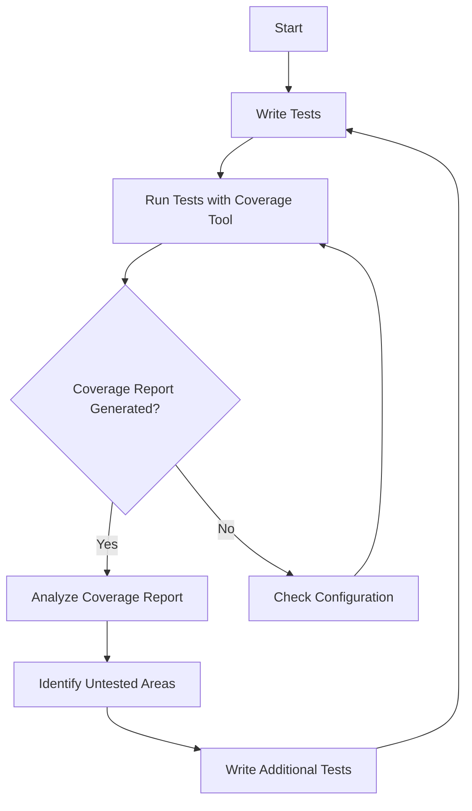

## 23.11 Code Coverage and Reporting

In the ever-evolving landscape of software development, ensuring the quality and reliability of your code is paramount. One of the key strategies to achieve this is through comprehensive testing. However, how do you know if your tests are covering all the critical parts of your code? This is where code coverage comes into play. In this section, we will delve into the concept of code coverage, explore various tools available for measuring it, and discuss best practices for integrating coverage reporting into your development workflow.

### Understanding Code Coverage

Code coverage is a metric used to describe the degree to which the source code of a program is executed when a particular test suite runs. It provides insights into which parts of your code are being tested and which are not, helping you identify untested areas that might contain bugs.

#### Key Metrics of Code Coverage

1. **Line Coverage**: This metric indicates the percentage of executed lines of code. It helps identify which lines have been tested and which have not.

2. **Branch Coverage**: This measures the percentage of executed branches in conditional statements. It ensures that all possible paths (true and false) in your code are tested.

3. **Function Coverage**: This metric shows the percentage of functions that have been called during testing. It helps ensure that all functions are tested.

4. **Statement Coverage**: This is similar to line coverage but focuses on the execution of individual statements rather than lines.

5. **Condition Coverage**: This metric checks whether each boolean sub-expression has been evaluated to both true and false.

### Tools for Measuring Code Coverage

Several tools can help you measure code coverage in JavaScript applications. Let's explore some of the most popular ones:

#### Istanbul (nyc)

[Istanbul](https://istanbul.js.org/), often used with its command-line interface `nyc`, is a widely used tool for measuring code coverage in JavaScript. It provides detailed coverage reports and integrates seamlessly with various testing frameworks.

- **Installation**: You can install `nyc` using npm:

  ```bash
  npm install --save-dev nyc
  ```

- **Usage**: To generate a coverage report, run your tests with `nyc`:

  ```bash
  nyc mocha
  ```

- **Reports**: Istanbul generates reports in multiple formats, including HTML, JSON, and text, making it easy to analyze coverage data.

#### Codecov

[Codecov](https://about.codecov.io/) is a cloud-based service that provides code coverage reports and integrates with various CI/CD pipelines. It offers detailed insights into your code coverage and helps you track coverage over time.

- **Integration**: Codecov can be integrated with popular CI services like Travis CI, CircleCI, and GitHub Actions.

- **Features**: It provides visualizations, historical data, and the ability to set coverage thresholds.

#### Coveralls

[Coveralls](https://coveralls.io/) is another cloud-based service that helps you track code coverage. It integrates with various CI services and provides detailed reports.

- **Integration**: Coveralls supports integration with multiple CI tools and can automatically update coverage reports.

- **Features**: It offers branch coverage, historical data, and the ability to comment on pull requests with coverage information.

### Generating Coverage Reports

Let's walk through an example of generating a code coverage report using Istanbul (nyc) and Mocha, a popular testing framework.

#### Setting Up the Project

1. **Initialize a Node.js Project**: Start by creating a new Node.js project and installing the necessary dependencies.

   ```bash
   mkdir my-project
   cd my-project
   npm init -y
   npm install --save-dev mocha nyc
   ```

2. **Create a Sample Test**: Create a simple JavaScript file and a corresponding test file.

   **`math.js`**:

   ```javascript
   function add(a, b) {
       return a + b;
   }

   function subtract(a, b) {
       return a - b;
   }

   module.exports = { add, subtract };
   ```

   **`test/math.test.js`**:

   ```javascript
   const assert = require('assert');
   const { add, subtract } = require('../math');

   describe('Math Functions', function() {
       it('should add two numbers', function() {
           assert.strictEqual(add(2, 3), 5);
       });

       it('should subtract two numbers', function() {
           assert.strictEqual(subtract(5, 3), 2);
       });
   });
   ```

3. **Run Tests with Coverage**: Use `nyc` to run the tests and generate a coverage report.

   ```bash
   nyc mocha
   ```

4. **View the Report**: After running the command, you will see a coverage report in the terminal. You can also view a detailed HTML report in the `coverage` directory.

### Integrating Coverage Reporting into CI Pipelines

Integrating code coverage reporting into your CI/CD pipeline ensures that coverage data is consistently generated and analyzed. Here's how you can do it:

1. **Choose a CI Service**: Select a CI service that supports code coverage integration, such as Travis CI, CircleCI, or GitHub Actions.

2. **Configure the CI Pipeline**: Add a step in your CI configuration to run tests with coverage and upload the results to a coverage service like Codecov or Coveralls.

   **Example: GitHub Actions Configuration**:

   ```yaml
   name: Node.js CI

   on: [push, pull_request]

   jobs:
     build:
       runs-on: ubuntu-latest

       strategy:
         matrix:
           node-version: [12.x, 14.x, 16.x]

       steps:
       - uses: actions/checkout@v2
       - name: Use Node.js ${{ matrix.node-version }}
         uses: actions/setup-node@v2
         with:
           node-version: ${{ matrix.node-version }}
       - run: npm install
       - run: npm test
       - run: npm run coverage
       - name: Upload coverage to Codecov
         uses: codecov/codecov-action@v2
         with:
           token: ${{ secrets.CODECOV_TOKEN }}
   ```

3. **Analyze Coverage Data**: Use the coverage reports to identify untested areas and prioritize testing efforts.

### Best Practices for Interpreting Coverage Data

While code coverage is a valuable metric, it's important to interpret it correctly and use it effectively:

1. **Set Realistic Coverage Goals**: Aim for a high level of coverage, but understand that 100% coverage is not always necessary or feasible.

2. **Focus on Critical Code Paths**: Prioritize testing critical code paths and business logic over less important code.

3. **Use Coverage Data to Improve Tests**: Use coverage reports to identify untested areas and write additional tests to cover them.

4. **Avoid Coverage Overhead**: Be mindful of the performance impact of coverage tools, especially in large projects.

5. **Combine with Other Quality Metrics**: Use code coverage in conjunction with other quality metrics, such as code complexity and static analysis, to get a comprehensive view of code quality.

### Conclusion

Code coverage is an essential part of modern software development, providing valuable insights into the effectiveness of your test suite. By using tools like Istanbul, Codecov, and Coveralls, you can generate detailed coverage reports and integrate them into your CI/CD pipeline. Remember, while high coverage is desirable, it's important to focus on meaningful tests that cover critical code paths. As you continue to refine your testing strategy, code coverage will be a powerful ally in ensuring the quality and reliability of your JavaScript applications.

### Try It Yourself

Experiment with the code examples provided in this section. Try adding new functions to the `math.js` file and writing corresponding tests. Run the coverage report again to see how the coverage changes. This hands-on practice will help reinforce your understanding of code coverage and reporting.

### Visualizing Code Coverage

To better understand how code coverage tools interact with your code, let's visualize the process using a flowchart.



**Figure 1**: This flowchart illustrates the process of generating and analyzing code coverage reports. It highlights the iterative nature of testing and coverage analysis.

### Knowledge Check

Before we conclude, let's test your understanding of code coverage and reporting with a few questions.

## Code Coverage and Reporting Quiz



### What is code coverage?

- [x] A metric that describes the degree to which the source code of a program is executed when a particular test suite runs.
- [ ] A tool for measuring the performance of a program.
- [ ] A method for debugging code.
- [ ] A process for optimizing code execution.

> **Explanation:** Code coverage measures how much of your code is executed during testing, helping identify untested areas.

### Which of the following is NOT a code coverage metric?

- [ ] Line Coverage
- [ ] Branch Coverage
- [ ] Function Coverage
- [x] Execution Time

> **Explanation:** Execution time is related to performance, not code coverage.

### What is the primary purpose of code coverage tools like Istanbul?

- [x] To measure and report the extent of code execution during testing.
- [ ] To optimize code for better performance.
- [ ] To refactor code for better readability.
- [ ] To compile JavaScript code into machine code.

> **Explanation:** Istanbul and similar tools measure how much of your code is covered by tests.

### How can code coverage be integrated into a CI/CD pipeline?

- [x] By adding a step to run tests with coverage and upload results to a coverage service.
- [ ] By manually checking coverage reports after each deployment.
- [ ] By using a separate server to run coverage tests.
- [ ] By writing custom scripts to analyze coverage data.

> **Explanation:** Integrating coverage into CI/CD involves automated steps to run tests and report coverage.

### What is a realistic goal for code coverage?

- [x] High coverage with a focus on critical code paths.
- [ ] 100% coverage at all costs.
- [ ] Minimal coverage to save time.
- [ ] Coverage only for new code.

> **Explanation:** While high coverage is desirable, focus on covering critical paths rather than achieving 100%.

### Which tool is commonly used for code coverage in JavaScript?

- [x] Istanbul (nyc)
- [ ] JUnit
- [ ] PyTest
- [ ] JSLint

> **Explanation:** Istanbul (nyc) is a popular tool for measuring code coverage in JavaScript.

### What should you do if your coverage report shows untested areas?

- [x] Write additional tests to cover those areas.
- [ ] Ignore them if the coverage percentage is high.
- [ ] Remove the untested code.
- [ ] Rewrite the entire codebase.

> **Explanation:** Writing additional tests helps ensure all important code paths are covered.

### Which of the following is a benefit of using cloud-based coverage services like Codecov?

- [x] They provide visualizations and historical data.
- [ ] They automatically fix coverage issues.
- [ ] They compile code into machine language.
- [ ] They replace the need for local testing.

> **Explanation:** Cloud-based services offer visualizations and track coverage over time.

### What is the impact of high code coverage on code quality?

- [x] It indicates thorough testing but does not guarantee bug-free code.
- [ ] It guarantees that the code is bug-free.
- [ ] It reduces the need for manual testing.
- [ ] It eliminates the need for code reviews.

> **Explanation:** High coverage suggests thorough testing but doesn't ensure the absence of bugs.

### True or False: Code coverage tools can automatically fix untested code.

- [ ] True
- [x] False

> **Explanation:** Code coverage tools only report coverage; they do not fix untested code.



Remember, this is just the beginning. As you progress, you'll build more complex and interactive web applications. Keep experimenting, stay curious, and enjoy the journey!
