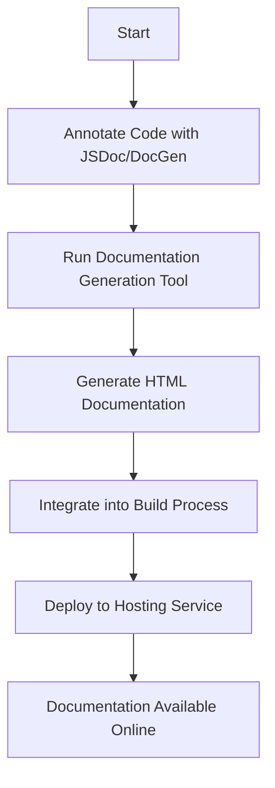

## 23.12 Automating Documentation Generation

In the fast-paced world of software development, maintaining up-to-date and comprehensive documentation is crucial. Automated documentation generation not only saves time but also ensures consistency and accuracy across your JavaScript projects. In this section, we will explore the benefits of automated documentation, introduce tools like JSDoc and DocGen, and demonstrate how to integrate these tools into your build processes. We will also discuss best practices for maintaining documentation and deploying it to hosting services like GitHub Pages.

### Benefits of Automated Documentation

Automating documentation generation offers several advantages:

- **Consistency**: Automated tools ensure that documentation is consistently formatted and styled, reducing discrepancies and errors.
- **Efficiency**: By generating documentation directly from code annotations, developers save time and effort, allowing them to focus on coding rather than manual documentation.
- **Accuracy**: Documentation generated from code annotations is more likely to be accurate and up-to-date, reflecting the current state of the codebase.
- **Scalability**: As projects grow, maintaining manual documentation becomes cumbersome. Automated tools scale effortlessly with the project size.
- **Integration**: Automated documentation can be easily integrated into continuous integration/continuous deployment (CI/CD) pipelines, ensuring that documentation is always current.

### Introducing JSDoc and DocGen

Two popular tools for automating documentation in JavaScript projects are JSDoc and DocGen. Let's explore each tool and how they can be used to generate documentation.

#### JSDoc

[JSDoc](https://jsdoc.app/) is a widely-used tool for generating HTML documentation from JavaScript source code. It uses specially formatted comments to describe the code, which are then parsed to produce documentation.

**Example of JSDoc Annotations:**

```javascript
/**
 * Represents a book.
 * @constructor
 * @param {string} title - The title of the book.
 * @param {string} author - The author of the book.
 */
function Book(title, author) {
  this.title = title;
  this.author = author;
}

/**
 * Get the title of the book.
 * @return {string} The title of the book.
 */
Book.prototype.getTitle = function() {
  return this.title;
};
```

To generate documentation using JSDoc, run the following command in your terminal:

```bash
jsdoc yourFile.js
```

This command will produce an HTML documentation site based on the annotations in your code.

#### DocGen

[DocGen](https://github.com/EducationLink/vue-cli-plugin-docgen) is a tool specifically designed for Vue.js projects. It generates documentation from Vue components, making it an excellent choice for projects that heavily utilize Vue.

**Example of DocGen Usage:**

To use DocGen, first install it as a Vue CLI plugin:

```bash
vue add docgen
```

Then, run the following command to generate documentation:

```bash
npm run docgen
```

This will produce a documentation site for your Vue components, complete with props, events, and slots information.

### Integrating Documentation Generation into Build Processes

Integrating documentation generation into your build process ensures that your documentation is always up-to-date with the latest code changes. This can be achieved by adding documentation generation commands to your build scripts or CI/CD pipelines.

**Example of Integrating JSDoc into a Build Script:**

Add the following script to your `package.json`:

```json
"scripts": {
  "build-docs": "jsdoc -c jsdoc.json"
}
```

You can then run `npm run build-docs` to generate documentation as part of your build process.

**Example of Integrating DocGen into a CI/CD Pipeline:**

In a CI/CD pipeline, you can add a step to generate documentation after running tests:

```yaml
jobs:
  build:
    runs-on: ubuntu-latest
    steps:
      - uses: actions/checkout@v2
      - name: Install dependencies
        run: npm install
      - name: Run tests
        run: npm test
      - name: Generate documentation
        run: npm run docgen
```

### Best Practices for Maintaining Comprehensive and Accurate Documentation

To ensure your documentation remains comprehensive and accurate, consider the following best practices:

- **Annotate Code Thoroughly**: Use JSDoc or similar annotations to describe functions, classes, and modules. Include details about parameters, return values, and exceptions.
- **Review Documentation Regularly**: Regularly review and update documentation to reflect changes in the codebase.
- **Use Version Control**: Track changes to documentation in version control systems like Git to maintain a history of updates.
- **Incorporate Feedback**: Encourage team members to provide feedback on documentation and incorporate their suggestions to improve clarity and completeness.
- **Automate Deployment**: Use tools like GitHub Pages to automatically deploy documentation updates, ensuring that the latest version is always accessible.

### Deploying Documentation to Hosting Services

Deploying your documentation to a hosting service like GitHub Pages makes it easily accessible to your team and users. GitHub Pages is a free service that hosts static websites directly from a GitHub repository.

**Example of Deploying Documentation to GitHub Pages:**

1. **Create a `gh-pages` Branch**: Create a branch named `gh-pages` in your repository.

2. **Build and Deploy Documentation**: Use a tool like `gh-pages` to deploy your documentation to the `gh-pages` branch.

```bash
npm install gh-pages --save-dev
```

Add a deploy script to your `package.json`:

```json
"scripts": {
  "deploy-docs": "gh-pages -d docs"
}
```

Run the deploy script:

```bash
npm run deploy-docs
```

This will publish your documentation to `https://<username>.github.io/<repository>/`.

### Visualizing the Documentation Generation Workflow

To better understand the workflow of automated documentation generation, let's visualize the process using a flowchart.



**Caption**: The flowchart illustrates the process of automating documentation generation, from annotating code to deploying documentation online.

### Knowledge Check

Before we conclude, let's reinforce our understanding with a few questions:

- What are the benefits of automating documentation generation?
- How can JSDoc and DocGen be integrated into build processes?
- What are some best practices for maintaining accurate documentation?

### Embrace the Journey

Remember, automating documentation generation is just one step in mastering JavaScript design patterns and best practices. As you continue to explore and implement these techniques, you'll enhance your development workflow and create more robust, maintainable projects. Keep experimenting, stay curious, and enjoy the journey!

### Quiz: Mastering Automated Documentation Generation



### What is one key benefit of automating documentation generation?

- [x] Consistency in documentation format
- [ ] Increased code complexity
- [ ] Manual updates required
- [ ] Reduced code readability

> **Explanation:** Automated documentation ensures consistency in format and style, reducing discrepancies.

### Which tool is commonly used for generating documentation from JavaScript code annotations?

- [x] JSDoc
- [ ] Webpack
- [ ] Babel
- [ ] ESLint

> **Explanation:** JSDoc is a popular tool for generating documentation from JavaScript code annotations.

### How can JSDoc be integrated into a build process?

- [x] By adding a script in `package.json`
- [ ] By manually running commands
- [ ] By using a different programming language
- [ ] By avoiding code annotations

> **Explanation:** JSDoc can be integrated into a build process by adding a script in `package.json`.

### What is the purpose of using DocGen in Vue.js projects?

- [x] To generate documentation from Vue components
- [ ] To compile Vue components
- [ ] To minify JavaScript code
- [ ] To lint JavaScript code

> **Explanation:** DocGen is used to generate documentation from Vue components, detailing props, events, and slots.

### Which command is used to generate documentation with JSDoc?

- [x] `jsdoc yourFile.js`
- [ ] `npm install jsdoc`
- [ ] `vue add docgen`
- [ ] `npm run build`

> **Explanation:** The command `jsdoc yourFile.js` is used to generate documentation with JSDoc.

### What is a best practice for maintaining accurate documentation?

- [x] Regularly review and update documentation
- [ ] Avoid using annotations
- [ ] Use manual documentation only
- [ ] Ignore feedback from team members

> **Explanation:** Regularly reviewing and updating documentation ensures it remains accurate and up-to-date.

### How can documentation be deployed to GitHub Pages?

- [x] By using the `gh-pages` branch
- [ ] By creating a new repository
- [ ] By using a different hosting service
- [ ] By manually uploading files

> **Explanation:** Documentation can be deployed to GitHub Pages by using the `gh-pages` branch.

### What is the role of the `gh-pages` tool?

- [x] To deploy documentation to GitHub Pages
- [ ] To compile JavaScript code
- [ ] To run tests
- [ ] To lint code

> **Explanation:** The `gh-pages` tool is used to deploy documentation to GitHub Pages.

### Which of the following is a benefit of integrating documentation generation into CI/CD pipelines?

- [x] Ensures documentation is always current
- [ ] Increases manual effort
- [ ] Reduces code quality
- [ ] Complicates the build process

> **Explanation:** Integrating documentation generation into CI/CD pipelines ensures that documentation is always current with the latest code changes.

### True or False: Automated documentation generation can scale with project size.

- [x] True
- [ ] False

> **Explanation:** Automated documentation generation can scale effortlessly with the project size, making it suitable for large projects.



By automating documentation generation, you streamline your development process, ensuring that your documentation is always accurate, comprehensive, and up-to-date. This not only enhances the quality of your projects but also improves collaboration and knowledge sharing within your team.
