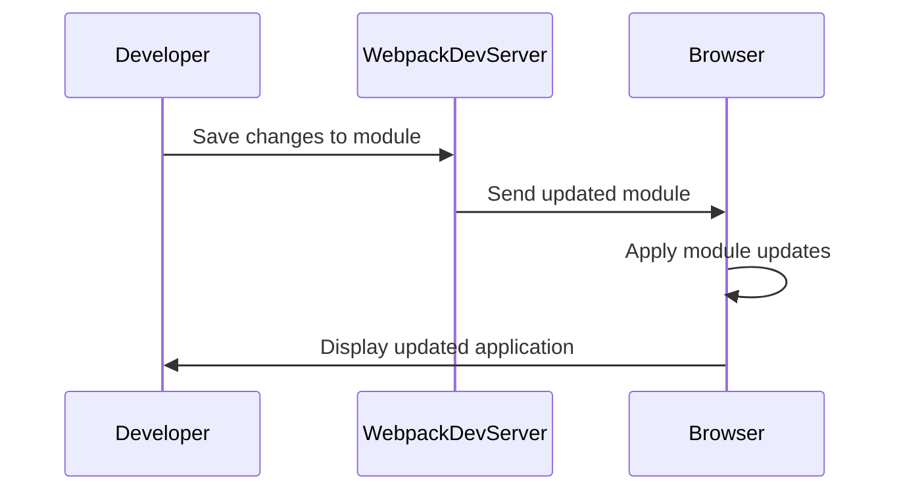

## 23.13 Live Reloading and Hot Module Replacement

In the fast-paced world of web development, efficiency is key. Live Reloading and Hot Module Replacement (HMR) are two powerful techniques that significantly enhance the development workflow by providing immediate feedback and reducing the time spent on repetitive tasks. In this section, we'll delve into what these techniques are, how they work, and how you can leverage them to improve your JavaScript development process.

### What is Live Reloading?

Live Reloading is a development feature that automatically refreshes the browser whenever you make changes to your code. This eliminates the need to manually reload the page, allowing you to see the effects of your changes instantly. Live Reloading is particularly useful for static content updates, such as HTML and CSS changes.

#### How Live Reloading Works

Live Reloading works by monitoring your source files for changes. When a change is detected, the development server triggers a browser refresh. This is typically achieved through a combination of file watchers and a lightweight server that serves your application.

### Setting Up Live Reloading with Webpack Dev Server

Webpack Dev Server is a popular tool for setting up live reloading in JavaScript projects. It provides a simple way to serve your application and automatically reload the browser when changes are made.

#### Step-by-Step Guide to Setting Up Live Reloading

1. **Install Webpack Dev Server**: First, ensure you have Webpack and Webpack Dev Server installed in your project.

   ```bash
   npm install --save-dev webpack webpack-cli webpack-dev-server
   ```

2. **Configure Webpack**: Add a `devServer` configuration to your `webpack.config.js` file.

   ```javascript
   const path = require('path');

   module.exports = {
     entry: './src/index.js',
     output: {
       filename: 'bundle.js',
       path: path.resolve(__dirname, 'dist'),
     },
     devServer: {
       contentBase: path.join(__dirname, 'dist'),
       compress: true,
       port: 9000,
       open: true, // Automatically open the browser
     },
   };
   ```

3. **Run the Dev Server**: Use the following command to start the Webpack Dev Server.

   ```bash
   npx webpack serve
   ```

4. **Make Changes and Observe**: As you make changes to your JavaScript, HTML, or CSS files, the browser will automatically refresh to reflect those changes.

### Introduction to Hot Module Replacement (HMR)

Hot Module Replacement (HMR) takes live reloading a step further by allowing modules to be updated in place without a full page reload. This is particularly beneficial for maintaining the state of your application during development, as it avoids losing the current state when changes are made.

#### How HMR Works

HMR works by exchanging, adding, or removing modules while an application is running, without a full reload. This is achieved through a combination of Webpack's HMR API and the module system.

### Benefits of HMR for Stateful Applications

1. **Preserve Application State**: Unlike live reloading, HMR allows you to retain the application state, which is crucial for debugging and testing stateful applications.

2. **Faster Feedback Loop**: By only updating the changed modules, HMR provides a faster feedback loop, allowing you to see the effects of your changes almost instantly.

3. **Improved Developer Experience**: With HMR, developers can focus more on coding and less on repetitive tasks, improving overall productivity.

### Setting Up HMR with Webpack

To enable HMR in your Webpack setup, you need to make a few additional configurations.

#### Step-by-Step Guide to Setting Up HMR

1. **Enable HMR in Webpack Config**: Add the `hot` option to your `devServer` configuration.

   ```javascript
   const path = require('path');

   module.exports = {
     entry: './src/index.js',
     output: {
       filename: 'bundle.js',
       path: path.resolve(__dirname, 'dist'),
     },
     devServer: {
       contentBase: path.join(__dirname, 'dist'),
       compress: true,
       port: 9000,
       hot: true, // Enable HMR
     },
   };
   ```

2. **Update Entry Point**: Modify your entry point to include the HMR client.

   ```javascript
   module.exports = {
     entry: ['webpack/hot/dev-server', './src/index.js'],
     // other configurations
   };
   ```

3. **Add HMR Plugin**: Include the `HotModuleReplacementPlugin` in your Webpack plugins.

   ```javascript
   const webpack = require('webpack');

   module.exports = {
     // other configurations
     plugins: [
       new webpack.HotModuleReplacementPlugin(),
     ],
   };
   ```

4. **Implement HMR in Your Code**: Use the HMR API in your JavaScript code to handle module updates.

   ```javascript
   if (module.hot) {
     module.hot.accept('./module.js', function() {
       // Handle the updated module
       console.log('Module updated!');
     });
   }
   ```

### Tooling Support in Frameworks

Many modern JavaScript frameworks provide built-in support for HMR, making it easier to integrate into your development workflow.

#### React and HMR

React, one of the most popular JavaScript libraries for building user interfaces, offers excellent support for HMR through tools like [React Refresh](https://github.com/pmmmwh/react-refresh-webpack-plugin).

- **React Refresh**: This plugin enables fast refresh for React components, allowing you to see changes instantly without losing component state.

  ```bash
  npm install --save-dev @pmmmwh/react-refresh-webpack-plugin react-refresh
  ```

  ```javascript
  const ReactRefreshWebpackPlugin = require('@pmmmwh/react-refresh-webpack-plugin');

  module.exports = {
    // other configurations
    plugins: [
      new webpack.HotModuleReplacementPlugin(),
      new ReactRefreshWebpackPlugin(),
    ],
  };
  ```

### Best Practices for Configuring and Using HMR

1. **Modularize Your Code**: Ensure your code is modular to take full advantage of HMR. This means breaking down your application into smaller, independent modules.

2. **Use HMR for Development Only**: HMR is a development tool and should not be used in production environments.

3. **Handle Edge Cases**: Be aware of edge cases where HMR might not work as expected, such as when dealing with global state or non-JavaScript assets.

4. **Test Regularly**: Regularly test your HMR setup to ensure it works as expected and does not introduce unexpected behavior.

### Limitations and Potential Issues with HMR

While HMR is a powerful tool, it does have some limitations and potential issues:

- **Complexity**: Setting up HMR can be complex, especially for large projects with many dependencies.

- **State Management**: While HMR preserves state, it can sometimes lead to inconsistent states if not handled properly.

- **Performance**: In some cases, HMR can introduce performance overhead, especially when dealing with large modules or complex dependencies.

### Visualizing HMR Workflow

To better understand how HMR works, let's visualize the workflow using a Mermaid.js diagram.



**Figure 1**: HMR Workflow - This diagram illustrates the sequence of events in the HMR process, from saving changes to displaying the updated application.

### Try It Yourself

Now that we've covered the basics of live reloading and HMR, it's time to try it yourself. Set up a simple JavaScript project with Webpack and implement live reloading and HMR. Experiment with different configurations and observe how they affect your development workflow.

### Knowledge Check

Before moving on, let's review some key points:

- What is the primary difference between live reloading and HMR?
- How does HMR improve the development experience for stateful applications?
- What are some common tools and frameworks that support HMR?

### Summary

In this section, we've explored the concepts of live reloading and hot module replacement, two essential techniques for modern JavaScript development. By understanding and implementing these techniques, you can significantly enhance your development workflow, reduce repetitive tasks, and improve overall productivity. Remember, this is just the beginning. As you continue to build and refine your skills, you'll discover even more ways to optimize your development process. Keep experimenting, stay curious, and enjoy the journey!

## Mastering Live Reloading and Hot Module Replacement in JavaScript



### What is the primary benefit of live reloading?

- [x] Automatically refreshes the browser on code changes
- [ ] Preserves application state during updates
- [ ] Reduces code complexity
- [ ] Enhances security

> **Explanation:** Live reloading automatically refreshes the browser when code changes are detected, providing immediate feedback.

### How does Hot Module Replacement (HMR) differ from live reloading?

- [x] HMR updates modules without a full page reload
- [ ] HMR requires manual browser refresh
- [ ] HMR is only for CSS changes
- [ ] HMR is slower than live reloading

> **Explanation:** HMR updates modules in place without a full page reload, preserving application state.

### Which tool is commonly used for setting up live reloading in JavaScript projects?

- [x] Webpack Dev Server
- [ ] Babel
- [ ] ESLint
- [ ] Prettier

> **Explanation:** Webpack Dev Server is a popular tool for setting up live reloading in JavaScript projects.

### What is a key advantage of using HMR in stateful applications?

- [x] Preserves application state during updates
- [ ] Requires less configuration
- [ ] Increases application size
- [ ] Simplifies code structure

> **Explanation:** HMR preserves the application state during updates, which is crucial for stateful applications.

### Which plugin enables fast refresh for React components?

- [x] React Refresh
- [ ] Redux
- [ ] Babel
- [ ] ESLint

> **Explanation:** React Refresh is a plugin that enables fast refresh for React components, allowing for instant updates without losing state.

### What is a potential limitation of HMR?

- [x] Can introduce performance overhead
- [ ] Only works with HTML files
- [ ] Requires a production environment
- [ ] Increases security risks

> **Explanation:** HMR can introduce performance overhead, especially in large projects with complex dependencies.

### What should you do to take full advantage of HMR?

- [x] Modularize your code
- [ ] Use HMR in production
- [ ] Avoid testing your setup
- [ ] Combine all modules into one file

> **Explanation:** Modularizing your code allows you to take full advantage of HMR by enabling more granular updates.

### What is the role of the `HotModuleReplacementPlugin` in Webpack?

- [x] Enables HMR functionality
- [ ] Minifies JavaScript files
- [ ] Lints code
- [ ] Formats code

> **Explanation:** The `HotModuleReplacementPlugin` in Webpack enables HMR functionality, allowing modules to be updated in place.

### Which of the following is NOT a benefit of HMR?

- [ ] Faster feedback loop
- [ ] Improved developer experience
- [x] Increased application size
- [ ] Preserved application state

> **Explanation:** HMR does not increase application size; it provides a faster feedback loop, improved developer experience, and preserved application state.

### True or False: HMR should be used in production environments.

- [ ] True
- [x] False

> **Explanation:** HMR is a development tool and should not be used in production environments due to potential performance and security issues.




