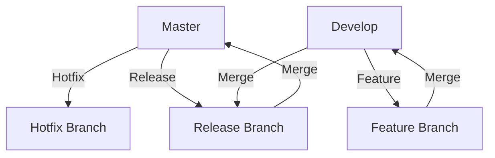

## 23.14 Version Control Best Practices with Git

Version control is a cornerstone of modern software development, enabling teams to collaborate efficiently, track changes, and maintain a history of their codebase. Git, a distributed version control system, has become the industry standard due to its flexibility, speed, and powerful branching capabilities. In this section, we'll explore best practices for using Git effectively in collaborative development environments, covering branching strategies, commit conventions, pull requests, code reviews, and more.

### Importance of Version Control in Development

Version control systems (VCS) like Git are essential for managing changes to source code over time. They allow multiple developers to work on a project simultaneously without overwriting each other's changes. Here are some key benefits of using version control:

- **Collaboration**: Enables multiple developers to work on the same project concurrently.
- **History Tracking**: Maintains a record of every change made to the codebase, facilitating debugging and auditing.
- **Branching and Merging**: Supports parallel development by allowing developers to create branches for new features or bug fixes.
- **Backup and Recovery**: Provides a backup of the codebase, allowing recovery of previous versions if needed.

### Branching Strategies

Branching is a powerful feature in Git that allows developers to diverge from the main codebase to work on new features, bug fixes, or experiments. Choosing the right branching strategy is crucial for maintaining a clean and manageable codebase. Let's explore some popular branching strategies:

#### Gitflow

Gitflow is a robust branching model that defines a strict branching structure for managing releases. It consists of the following branches:

- **Master**: Contains production-ready code.
- **Develop**: Serves as the integration branch for features.
- **Feature Branches**: Created from `develop` for new features.
- **Release Branches**: Created from `develop` when preparing for a new release.
- **Hotfix Branches**: Created from `master` for urgent bug fixes.

**Diagram: Gitflow Branching Model**



#### GitHub Flow

GitHub Flow is a simpler branching strategy suitable for continuous delivery. It consists of the following steps:

1. **Create a Branch**: Start a new branch for each feature or bug fix.
2. **Commit Changes**: Make commits to the branch.
3. **Open a Pull Request**: Once the feature is complete, open a pull request.
4. **Review and Merge**: After review, merge the branch into `main`.
5. **Deploy**: Deploy the changes to production.

#### Trunk-Based Development

Trunk-Based Development emphasizes short-lived branches and frequent integration into the main branch (often called `trunk`). This strategy reduces merge conflicts and encourages continuous integration.

### Writing Meaningful Commit Messages

Commit messages are crucial for understanding the history of a project. A well-written commit message should be clear, concise, and informative. Here are some guidelines for writing effective commit messages:

- **Use the Imperative Mood**: Start with a verb, e.g., "Add", "Fix", "Update".
- **Keep the Subject Line Short**: Limit to 50 characters.
- **Provide Context**: Include a detailed description of the changes if necessary.
- **Reference Issues**: Mention related issue numbers or tickets.

**Example Commit Message**

```
Add user authentication feature

Implemented user login and registration using JWT. Updated the database schema to include user roles. Closes #123.
```

### Best Practices for Pull Requests and Code Reviews

Pull requests (PRs) are a critical part of the development workflow, allowing team members to review and discuss changes before merging them into the main codebase. Here are some best practices for handling pull requests and code reviews:

- **Keep PRs Small**: Smaller pull requests are easier to review and less likely to introduce bugs.
- **Provide a Clear Description**: Explain the purpose of the PR and any relevant context.
- **Request Feedback Early**: Engage reviewers early in the process to catch issues sooner.
- **Use Code Review Tools**: Leverage tools like GitHub's review system to comment on specific lines of code.
- **Address Feedback Promptly**: Respond to reviewer comments and make necessary changes.

### Tools for Code Comparison and Conflict Resolution

Conflicts are inevitable in collaborative development, especially when multiple developers work on the same files. Git provides several tools to help resolve conflicts:

- **Diff Tools**: Use tools like `git diff` or graphical diff tools (e.g., Meld, Beyond Compare) to compare changes.
- **Merge Tools**: Use `git mergetool` to resolve conflicts interactively.
- **Rebasing**: Use `git rebase` to apply changes from one branch onto another, reducing the likelihood of conflicts.

### Using Tags and Semantic Versioning

Tags in Git are used to mark specific points in the repository's history, often used for releases. Semantic versioning (SemVer) is a versioning scheme that conveys meaning about the underlying changes. It follows the format `MAJOR.MINOR.PATCH`, where:

- **MAJOR**: Increments for incompatible changes.
- **MINOR**: Increments for backward-compatible functionality.
- **PATCH**: Increments for backward-compatible bug fixes.

**Example of Tagging a Release**

```bash
git tag -a v1.0.0 -m "Initial release"
git push origin v1.0.0
```

### Knowledge Check

- **What are the benefits of using version control systems like Git?**
- **How does Gitflow differ from GitHub Flow?**
- **What are the key components of a meaningful commit message?**
- **Why is it important to keep pull requests small?**
- **How can semantic versioning help in managing releases?**

### Try It Yourself

Experiment with the branching strategies discussed by creating a new repository and implementing a feature using Gitflow or GitHub Flow. Practice writing commit messages and opening pull requests. Use diff and merge tools to resolve conflicts.

### Summary

In this section, we've explored the importance of version control and best practices for using Git effectively. By adopting a suitable branching strategy, writing meaningful commit messages, and following best practices for pull requests and code reviews, you can enhance collaboration and maintain a clean codebase. Remember, mastering Git is an ongoing journey, so keep experimenting and refining your workflow.

## Mastering Git Version Control Best Practices



### What is the primary benefit of using version control systems like Git?

- [x] Enables collaboration among multiple developers
- [ ] Increases code execution speed
- [ ] Reduces the need for testing
- [ ] Automatically fixes bugs

> **Explanation:** Version control systems like Git enable collaboration among multiple developers by allowing them to work on the same project simultaneously without overwriting each other's changes.

### Which branching strategy involves creating a new branch for each feature or bug fix?

- [ ] Gitflow
- [x] GitHub Flow
- [ ] Trunk-Based Development
- [ ] None of the above

> **Explanation:** GitHub Flow involves creating a new branch for each feature or bug fix, making it suitable for continuous delivery.

### What is the recommended length for a commit message subject line?

- [ ] 100 characters
- [x] 50 characters
- [ ] 150 characters
- [ ] 200 characters

> **Explanation:** The subject line of a commit message should be limited to 50 characters to ensure clarity and conciseness.

### Why is it important to keep pull requests small?

- [x] Easier to review and less likely to introduce bugs
- [ ] Increases the number of commits
- [ ] Reduces the need for testing
- [ ] Automatically merges changes

> **Explanation:** Keeping pull requests small makes them easier to review and less likely to introduce bugs, facilitating a smoother development process.

### What does the MAJOR version number indicate in semantic versioning?

- [x] Incompatible changes
- [ ] Backward-compatible functionality
- [ ] Bug fixes
- [ ] None of the above

> **Explanation:** In semantic versioning, the MAJOR version number indicates incompatible changes that may break existing functionality.

### Which tool can be used to compare changes in Git?

- [x] git diff
- [ ] git commit
- [ ] git push
- [ ] git clone

> **Explanation:** The `git diff` command is used to compare changes between commits, branches, or the working directory.

### What is the purpose of using tags in Git?

- [x] Mark specific points in the repository's history
- [ ] Increase code execution speed
- [ ] Reduce the need for testing
- [ ] Automatically fix bugs

> **Explanation:** Tags in Git are used to mark specific points in the repository's history, often used for releases.

### Which command is used to apply changes from one branch onto another?

- [ ] git merge
- [x] git rebase
- [ ] git commit
- [ ] git push

> **Explanation:** The `git rebase` command is used to apply changes from one branch onto another, helping to reduce conflicts.

### What is a key benefit of using code review tools?

- [x] Facilitate commenting on specific lines of code
- [ ] Increase code execution speed
- [ ] Reduce the need for testing
- [ ] Automatically fix bugs

> **Explanation:** Code review tools facilitate commenting on specific lines of code, allowing for detailed feedback and discussion.

### True or False: Semantic versioning follows the format MAJOR.MINOR.PATCH.

- [x] True
- [ ] False

> **Explanation:** Semantic versioning follows the format MAJOR.MINOR.PATCH, where each component conveys specific information about the changes.


