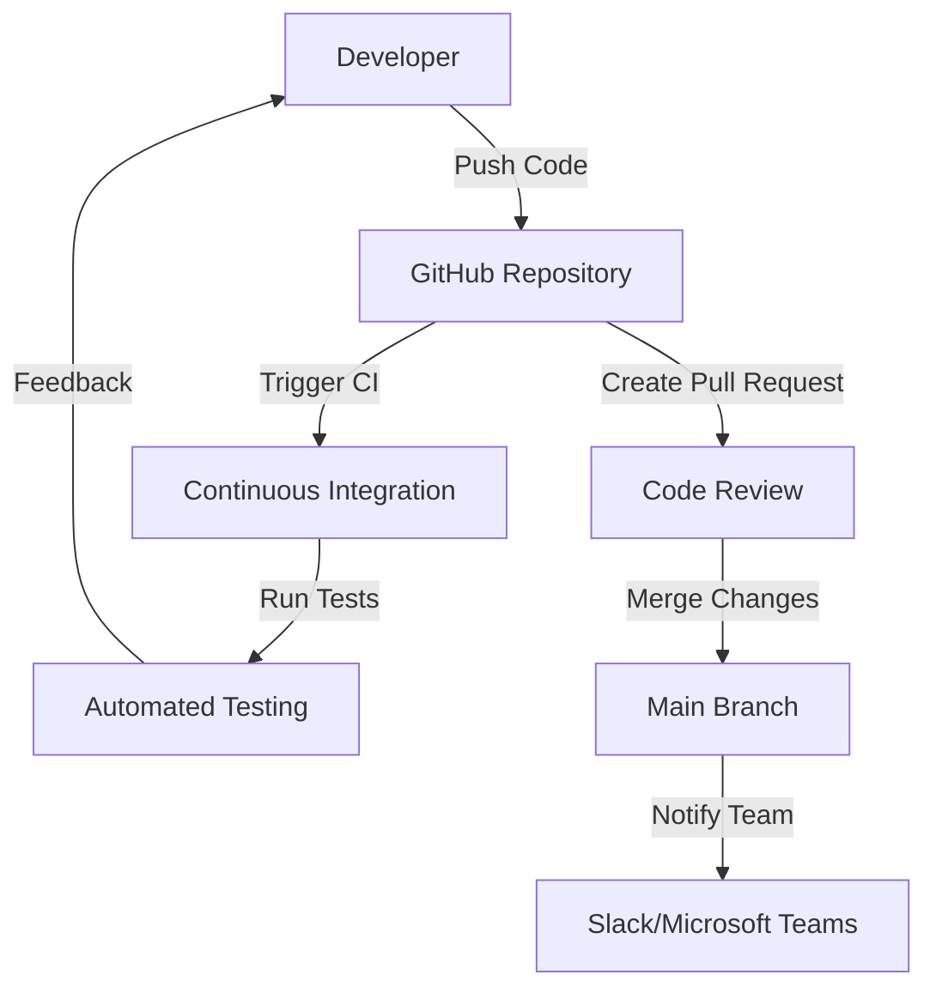

## 23.15 Collaborative Development Workflows

In the fast-paced world of modern web development, collaboration is key to success. Collaborative development workflows are essential for teams to work efficiently, maintain high code quality, and manage projects effectively. This section explores various tools and practices that facilitate collaboration among team members, focusing on platforms like GitHub, GitLab, and Bitbucket, as well as code review processes, continuous integration, and communication tools.

### Collaborative Platforms: GitHub, GitLab, and Bitbucket

Collaborative platforms such as GitHub, GitLab, and Bitbucket have revolutionized how developers work together. These platforms provide a suite of tools that enable version control, code review, project management, and more.

#### GitHub

GitHub is one of the most popular platforms for collaborative development. It offers a range of features that support teamwork:

- **Repositories**: Centralized locations where code is stored and managed.
- **Branches**: Allow developers to work on different features or fixes simultaneously without affecting the main codebase.
- **Pull Requests**: Facilitate code reviews and discussions before merging changes into the main branch.
- **Issues**: Track bugs, enhancements, and tasks.
- **Project Boards**: Visualize and manage project tasks using Kanban-style boards.
- **Wikis**: Document project information, guidelines, and best practices.

#### GitLab

GitLab is another powerful platform that offers similar features to GitHub, with additional capabilities for DevOps:

- **CI/CD Pipelines**: Automate testing, building, and deployment processes.
- **Merge Requests**: Similar to GitHub's pull requests, used for code review and discussion.
- **Milestones**: Organize issues and merge requests into specific timeframes.
- **Epics**: Group related issues and milestones for larger projects.

#### Bitbucket

Bitbucket, part of the Atlassian suite, integrates well with other Atlassian tools like Jira and Confluence:

- **Pull Requests**: Enable code review and discussion.
- **Pipelines**: Automate CI/CD processes.
- **Integrations**: Seamlessly connect with Jira for issue tracking and Confluence for documentation.

### Using Issues, Project Boards, and Wikis for Coordination

Effective coordination is crucial for successful collaboration. Platforms like GitHub, GitLab, and Bitbucket provide tools to help teams stay organized and aligned.

#### Issues

Issues are used to track tasks, bugs, and feature requests. They provide a way to document problems and solutions, assign tasks to team members, and prioritize work.

- **Creating Issues**: Clearly describe the problem or task, including steps to reproduce, expected behavior, and any relevant screenshots or logs.
- **Assigning Issues**: Assign issues to team members based on expertise and workload.
- **Labeling and Prioritizing**: Use labels to categorize issues and prioritize them based on urgency and importance.

#### Project Boards

Project boards offer a visual way to manage tasks and track progress. They are often used in conjunction with issues to provide a high-level overview of the project's status.

- **Kanban Boards**: Organize tasks into columns such as "To Do," "In Progress," and "Done."
- **Scrum Boards**: Use sprints to manage work in time-boxed iterations.
- **Custom Workflows**: Tailor boards to fit the team's specific workflow and processes.

#### Wikis

Wikis are valuable for documenting project information, guidelines, and best practices. They serve as a central repository for knowledge that can be easily accessed and updated by team members.

- **Creating Wikis**: Document project setup instructions, coding standards, and architectural decisions.
- **Maintaining Wikis**: Regularly update wikis to reflect changes in the project or team processes.
- **Collaborative Editing**: Allow team members to contribute to and edit wiki content.

### Code Review Processes and Best Practices

Code reviews are a critical part of collaborative development workflows. They help ensure code quality, catch bugs early, and facilitate knowledge sharing among team members.

#### Code Review Process

1. **Submit a Pull Request**: When a developer completes a feature or fix, they submit a pull request for review.
2. **Assign Reviewers**: Assign one or more team members to review the code.
3. **Review the Code**: Reviewers examine the code for correctness, readability, and adherence to coding standards.
4. **Provide Feedback**: Reviewers leave comments and suggestions for improvements.
5. **Address Feedback**: The author addresses feedback by making changes and updating the pull request.
6. **Approve and Merge**: Once the code meets the team's standards, it is approved and merged into the main branch.

#### Best Practices for Code Reviews

- **Be Constructive**: Provide feedback that is specific, actionable, and respectful.
- **Focus on the Code**: Avoid personal comments and focus on the code's quality and functionality.
- **Encourage Discussion**: Use code reviews as an opportunity for learning and knowledge sharing.
- **Automate Checks**: Use tools like linters and static analysis to automate some aspects of code review.

### Continuous Integration in Collaborative Workflows

Continuous integration (CI) is a practice where code changes are automatically tested and validated. It plays a crucial role in collaborative workflows by ensuring that code is always in a deployable state.

#### Setting Up CI Pipelines

1. **Choose a CI Tool**: Popular CI tools include Jenkins, Travis CI, CircleCI, and GitLab CI.
2. **Define Build Steps**: Specify the steps required to build, test, and deploy the application.
3. **Automate Tests**: Run automated tests to catch bugs early in the development process.
4. **Integrate with Version Control**: Trigger CI pipelines automatically when code is pushed to the repository.

#### Benefits of Continuous Integration

- **Early Bug Detection**: Catch bugs early in the development process, reducing the cost of fixing them.
- **Consistent Builds**: Ensure that builds are consistent and reproducible.
- **Faster Feedback**: Provide developers with quick feedback on their changes.
- **Improved Collaboration**: Encourage collaboration by integrating CI with code review and version control.

### Communication Tools and Integrations

Effective communication is essential for successful collaboration. Tools like Slack and Microsoft Teams facilitate real-time communication and integrate with development platforms to streamline workflows.

#### Slack

Slack is a popular communication tool that offers channels for team discussions, direct messaging, and integrations with other tools.

- **Channels**: Organize discussions by topic, project, or team.
- **Integrations**: Connect Slack with GitHub, GitLab, Bitbucket, and CI tools to receive notifications and updates.
- **Bots and Automation**: Use bots to automate tasks and provide information.

#### Microsoft Teams

Microsoft Teams is another communication tool that offers similar features to Slack, with additional integration with Microsoft Office products.

- **Teams and Channels**: Organize discussions and collaborate on documents.
- **Integrations**: Connect with development tools and services for seamless collaboration.
- **Video Conferencing**: Conduct meetings and share screens for remote collaboration.

### Handling Code Conflicts and Merging Strategies

Code conflicts are inevitable in collaborative development, especially when multiple developers work on the same codebase. Handling conflicts effectively is crucial to maintaining productivity and code quality.

#### Identifying and Resolving Conflicts

1. **Identify Conflicts**: Use version control tools to identify conflicts when merging branches.
2. **Resolve Conflicts**: Manually resolve conflicts by editing the conflicting files.
3. **Test Changes**: Test the merged code to ensure that it works as expected.
4. **Commit and Push**: Commit the resolved changes and push them to the repository.

#### Merging Strategies

- **Fast-Forward Merges**: Merge changes without creating a merge commit when there are no conflicts.
- **Squash Merges**: Combine multiple commits into a single commit to keep the history clean.
- **Rebase**: Reapply commits on top of the target branch to create a linear history.

### Try It Yourself

To get hands-on experience with collaborative development workflows, try the following exercises:

1. **Create a GitHub Repository**: Set up a new repository and invite collaborators.
2. **Use Issues and Project Boards**: Create issues and organize them using a project board.
3. **Submit a Pull Request**: Make a code change and submit a pull request for review.
4. **Set Up a CI Pipeline**: Use a CI tool to automate testing and deployment.
5. **Integrate Slack with GitHub**: Set up Slack notifications for repository events.

### Visualizing Collaborative Workflows

Below is a diagram illustrating a typical collaborative development workflow using GitHub, CI tools, and communication platforms.

**Diagram Description**: This diagram illustrates the flow of code from a developer to a GitHub repository, triggering continuous integration and automated testing. Feedback is provided to the developer, and changes are reviewed and merged into the main branch. Notifications are sent to the team via communication platforms like Slack or Microsoft Teams.

### Knowledge Check

To reinforce your understanding of collaborative development workflows, consider the following questions:

- What are the benefits of using project boards in collaborative development?
- How can continuous integration improve collaboration among team members?
- What are some best practices for conducting code reviews?
- How do communication tools like Slack and Microsoft Teams enhance collaboration?
- What strategies can be used to handle code conflicts effectively?

### Summary

Collaborative development workflows are essential for modern web development teams. By leveraging platforms like GitHub, GitLab, and Bitbucket, teams can manage code, conduct reviews, and automate processes. Continuous integration ensures that code is always in a deployable state, while communication tools facilitate real-time collaboration. By adopting these practices and tools, teams can improve code quality, enhance productivity, and achieve project goals more efficiently.

Remember, this is just the beginning. As you progress, you'll build more complex and interactive web applications. Keep experimenting, stay curious, and enjoy the journey!

## Collaborative Development Workflows Quiz



### What is the primary purpose of using project boards in collaborative development?

- [x] To visualize and manage project tasks
- [ ] To store code repositories
- [ ] To automate testing processes
- [ ] To conduct code reviews

> **Explanation:** Project boards are used to visualize and manage project tasks, often using Kanban-style boards.

### Which of the following is a benefit of continuous integration?

- [x] Early bug detection
- [ ] Increased code complexity
- [ ] Reduced collaboration
- [ ] Manual testing

> **Explanation:** Continuous integration helps in early bug detection by automatically testing code changes.

### What is a best practice for conducting code reviews?

- [x] Provide specific, actionable feedback
- [ ] Focus on personal comments
- [ ] Ignore coding standards
- [ ] Avoid discussions

> **Explanation:** Providing specific, actionable feedback is a best practice for conducting code reviews.

### How do communication tools like Slack enhance collaboration?

- [x] By facilitating real-time communication
- [ ] By storing code repositories
- [ ] By automating deployment
- [ ] By conducting code reviews

> **Explanation:** Communication tools like Slack enhance collaboration by facilitating real-time communication among team members.

### What is a common strategy for handling code conflicts?

- [x] Manually resolve conflicts and test changes
- [ ] Ignore conflicts and proceed with merging
- [ ] Delete conflicting branches
- [ ] Use automated tools to resolve all conflicts

> **Explanation:** Manually resolving conflicts and testing changes is a common strategy for handling code conflicts.

### Which platform is known for its integration with other Atlassian tools?

- [x] Bitbucket
- [ ] GitHub
- [ ] GitLab
- [ ] CircleCI

> **Explanation:** Bitbucket is known for its integration with other Atlassian tools like Jira and Confluence.

### What is the role of a pull request in collaborative development?

- [x] To facilitate code reviews and discussions
- [ ] To automate testing processes
- [ ] To store code repositories
- [ ] To visualize project tasks

> **Explanation:** A pull request facilitates code reviews and discussions before merging changes into the main branch.

### Which of the following is a feature of GitLab?

- [x] CI/CD Pipelines
- [ ] Automated code reviews
- [ ] Real-time communication
- [ ] Code minification

> **Explanation:** GitLab offers CI/CD pipelines to automate testing, building, and deployment processes.

### What is a benefit of using wikis in collaborative development?

- [x] Documenting project information and guidelines
- [ ] Automating testing processes
- [ ] Conducting code reviews
- [ ] Storing code repositories

> **Explanation:** Wikis are used to document project information, guidelines, and best practices.

### True or False: Continuous integration reduces the need for manual testing.

- [x] True
- [ ] False

> **Explanation:** Continuous integration automates testing processes, reducing the need for manual testing.


