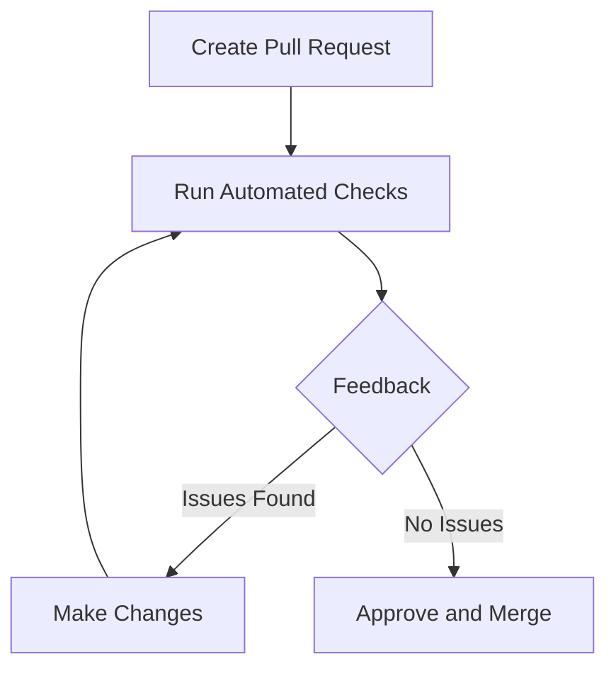
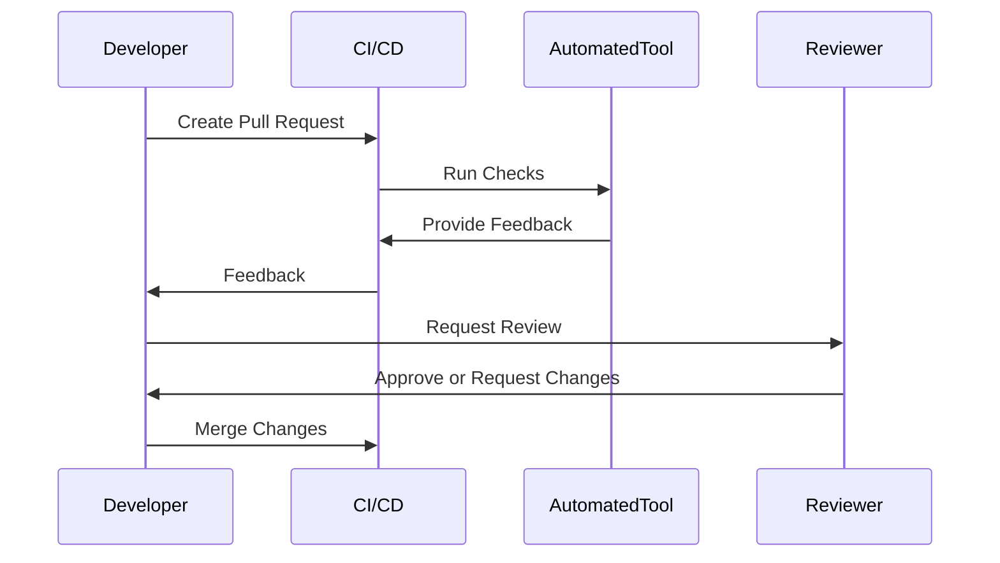

## 23.16 Automated Code Reviews and Pull Request Processes

In the fast-paced world of modern web development, maintaining code quality and consistency is paramount. Automated code reviews and pull request processes are essential tools for achieving these goals. They help enforce coding standards, catch potential issues early, and streamline the development workflow. In this section, we will explore the benefits of automated code reviews, introduce popular tools, and provide guidance on integrating these tools into your development process.

### Benefits of Automated Code Reviews

Automated code reviews offer several advantages that can significantly enhance the development process:

1. **Consistency**: Automated tools ensure that coding standards are consistently applied across the codebase, reducing the likelihood of style and formatting discrepancies.

2. **Efficiency**: By automating repetitive tasks, developers can focus on more complex issues, improving overall productivity.

3. **Early Detection**: Automated reviews can catch potential bugs, security vulnerabilities, and code smells early in the development cycle, reducing the cost and effort of fixing them later.

4. **Objective Feedback**: Automated tools provide unbiased feedback, ensuring that all code is evaluated against the same criteria.

5. **Scalability**: As teams grow, maintaining code quality becomes more challenging. Automation helps scale the review process without increasing the workload on individual developers.

### Introducing Automated Code Review Tools

Several tools can help automate the code review process. Let's explore some of the most popular ones:

#### [Danger](https://danger.systems/js/)

Danger is a tool that runs during your CI process and helps automate common code review chores. It allows you to create rules that can enforce standards and provide feedback on pull requests.

- **Features**: Customizable rules, integration with CI/CD pipelines, and support for multiple programming languages.
- **Use Cases**: Enforcing PR descriptions, checking for missing tests, and ensuring changelog updates.

#### [SonarQube](https://www.sonarqube.org/)

SonarQube is a comprehensive tool for continuous inspection of code quality. It provides detailed analysis of code for bugs, vulnerabilities, and code smells.

- **Features**: Static code analysis, support for multiple languages, and integration with CI/CD tools.
- **Use Cases**: Identifying code smells, enforcing coding standards, and tracking technical debt.

#### [Codacy](https://www.codacy.com/)

Codacy is a cloud-based code quality platform that automates code reviews and monitors code quality over time.

- **Features**: Automated code reviews, support for over 40 programming languages, and integration with GitHub, GitLab, and Bitbucket.
- **Use Cases**: Monitoring code quality metrics, enforcing style guides, and identifying security vulnerabilities.

### Setting Up Automated Checks

To effectively implement automated code reviews, it's essential to set up checks for style, complexity, and security. Here's how you can do it:

#### Style Checks

Style checks ensure that code adheres to a consistent format, making it easier to read and maintain. Tools like ESLint can be configured to enforce style rules.

```javascript
// .eslintrc.js
module.exports = {
  extends: "eslint:recommended",
  rules: {
    indent: ["error", 2],
    quotes: ["error", "single"],
    semi: ["error", "always"],
  },
};
```

#### Complexity Checks

Complexity checks help identify overly complex code that may be difficult to understand or maintain. Tools like SonarQube can analyze code complexity and provide insights.

```javascript
// Example of a complex function
function calculate(a, b, c) {
  if (a > b) {
    if (b > c) {
      return a + b + c;
    } else {
      return a - b - c;
    }
  } else {
    return a * b * c;
  }
}
```

#### Security Checks

Security checks identify potential vulnerabilities in the code. Tools like Codacy can scan for common security issues and provide recommendations.

```javascript
// Example of a potential security issue
const userInput = "<script>alert('XSS');</script>";
document.getElementById("output").innerHTML = userInput; // Vulnerable to XSS
```

### Integrating Automated Reviews into Pull Request Workflows

Integrating automated code reviews into pull request workflows ensures that code quality checks are performed before merging changes into the main branch. Here's a typical workflow:

1. **Create a Pull Request**: Developers create a pull request for their changes, triggering automated checks.

2. **Run Automated Checks**: Tools like Danger, SonarQube, and Codacy run their checks and provide feedback on the pull request.

3. **Review Feedback**: Developers review the feedback and make necessary changes to address any issues.

4. **Approve and Merge**: Once all checks pass and the code is reviewed by peers, the pull request is approved and merged.



### Best Practices for Balancing Automation with Human Oversight

While automation is powerful, it's essential to balance it with human oversight to ensure high-quality code:

- **Customize Rules**: Tailor automated checks to fit your team's coding standards and conventions.

- **Encourage Collaboration**: Use automated feedback as a starting point for discussions during code reviews.

- **Prioritize Issues**: Focus on critical issues first, and use automation to handle less significant concerns.

- **Continuous Improvement**: Regularly review and update automated rules to adapt to evolving project needs.

### Customizing Rules and Adapting to Team Conventions

Customization is key to effective automated code reviews. Here are some tips for customizing rules:

- **Define Coding Standards**: Establish clear coding standards and configure tools to enforce them.

- **Use Configuration Files**: Use configuration files (e.g., `.eslintrc.js`, `sonar-project.properties`) to specify rules and settings.

- **Leverage Plugins**: Use plugins to extend the functionality of automated tools and address specific needs.

- **Regularly Review Rules**: Periodically review and update rules to ensure they remain relevant and effective.

### Try It Yourself

To get hands-on experience, try setting up automated code reviews in your project. Experiment with different tools and configurations to find what works best for your team. Consider the following exercises:

- **Exercise 1**: Set up ESLint in your project and configure it to enforce your team's coding style.
- **Exercise 2**: Integrate SonarQube into your CI/CD pipeline and analyze your code for complexity and security issues.
- **Exercise 3**: Use Danger to automate common code review tasks, such as checking for missing tests or changelog updates.

### Visualizing the Automated Code Review Process

To better understand the automated code review process, let's visualize it using a sequence diagram:



This diagram illustrates the interaction between the developer, CI/CD system, automated tools, and reviewer during the code review process.

### References and Links

For further reading and resources, consider the following links:

- [ESLint Documentation](https://eslint.org/docs/user-guide/getting-started)
- [SonarQube Documentation](https://docs.sonarqube.org/latest/)
- [Codacy Documentation](https://docs.codacy.com/)
- [Danger JS Documentation](https://danger.systems/js/)

### Knowledge Check

To reinforce your understanding, consider the following questions:

1. What are the primary benefits of automated code reviews?
2. How can tools like ESLint and SonarQube be used to enforce coding standards?
3. What is the role of automated tools in the pull request workflow?
4. How can you customize automated code review rules to fit your team's conventions?
5. Why is it important to balance automation with human oversight in code reviews?

### Embrace the Journey

Remember, mastering automated code reviews and pull request processes is a journey. As you progress, you'll find new ways to enhance your workflow and improve code quality. Keep experimenting, stay curious, and enjoy the journey!

## Quiz: Mastering Automated Code Reviews and Pull Request Processes



### What is one of the main benefits of automated code reviews?

- [x] Consistency in applying coding standards
- [ ] Reducing the number of developers needed
- [ ] Eliminating the need for human oversight
- [ ] Increasing the complexity of code

> **Explanation:** Automated code reviews ensure that coding standards are consistently applied across the codebase.

### Which tool is known for running during the CI process to automate code review chores?

- [x] Danger
- [ ] ESLint
- [ ] Babel
- [ ] Webpack

> **Explanation:** Danger is a tool that runs during the CI process to automate common code review tasks.

### What type of issues can SonarQube help identify?

- [x] Code smells and vulnerabilities
- [ ] Network latency issues
- [ ] UI design flaws
- [ ] Database schema errors

> **Explanation:** SonarQube provides detailed analysis of code for bugs, vulnerabilities, and code smells.

### How can ESLint be used in a project?

- [x] To enforce coding style rules
- [ ] To manage project dependencies
- [ ] To compile JavaScript code
- [ ] To optimize network requests

> **Explanation:** ESLint is used to enforce coding style rules and ensure code consistency.

### What is a best practice when using automated code review tools?

- [x] Customize rules to fit team conventions
- [ ] Use default settings for all projects
- [ ] Rely solely on automation without human review
- [ ] Ignore feedback from automated tools

> **Explanation:** Customizing rules to fit team conventions ensures that automated tools align with project needs.

### What is the role of a pull request in the automated code review process?

- [x] It triggers automated checks and facilitates code review
- [ ] It compiles the code for production
- [ ] It manages project dependencies
- [ ] It optimizes code performance

> **Explanation:** A pull request triggers automated checks and facilitates the code review process.

### Why is it important to balance automation with human oversight?

- [x] To ensure high-quality code and encourage collaboration
- [ ] To reduce the number of developers needed
- [ ] To eliminate the need for coding standards
- [ ] To increase the complexity of code

> **Explanation:** Balancing automation with human oversight ensures high-quality code and encourages collaboration.

### What is a common use case for the Danger tool?

- [x] Enforcing PR descriptions and checking for missing tests
- [ ] Compiling JavaScript code
- [ ] Managing project dependencies
- [ ] Optimizing network requests

> **Explanation:** Danger is commonly used to enforce PR descriptions and check for missing tests.

### How can automated code reviews help with scalability?

- [x] By scaling the review process without increasing workload
- [ ] By reducing the number of developers needed
- [ ] By eliminating the need for human oversight
- [ ] By increasing the complexity of code

> **Explanation:** Automated code reviews help scale the review process without increasing the workload on individual developers.

### True or False: Automated code reviews can completely replace human code reviews.

- [ ] True
- [x] False

> **Explanation:** While automated code reviews are powerful, they cannot completely replace human oversight, which is essential for high-quality code.




