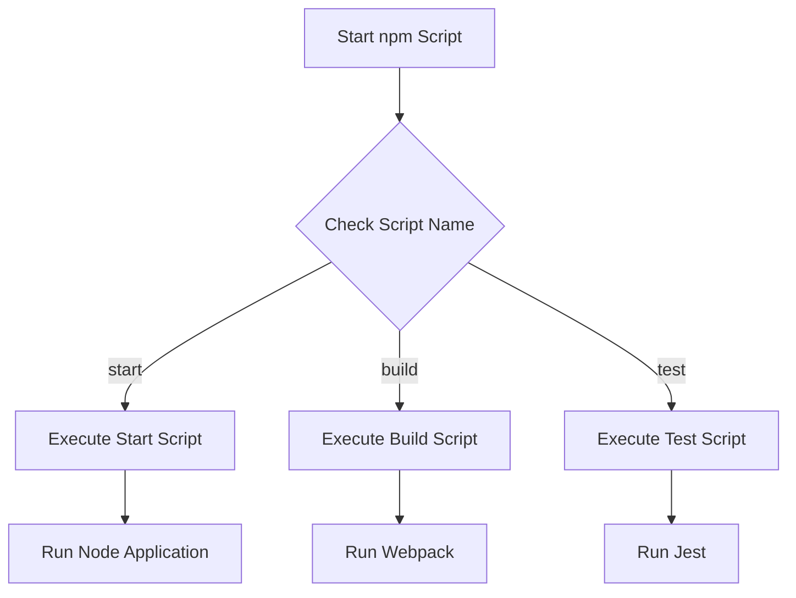

## 23.2 Build Automation with npm Scripts

In modern web development, automation is key to maintaining efficient workflows and ensuring consistent project builds. npm scripts offer a powerful yet straightforward way to automate tasks directly from your `package.json` file, eliminating the need for additional build tools. In this section, we'll explore how to define and use npm scripts, provide examples of common scripts, and discuss best practices for organizing and naming your scripts.

### Understanding npm Scripts

npm (Node Package Manager) is not just a package manager; it also provides a built-in way to automate tasks through npm scripts. These scripts are defined in the `scripts` section of your `package.json` file and can be used to run commands that automate various tasks such as building, testing, and starting your application.

#### Defining Scripts in `package.json`

To define an npm script, you add it to the `scripts` section of your `package.json` file. Each script is a key-value pair, where the key is the name of the script, and the value is the command to be executed.

```json
{
  "name": "my-project",
  "version": "1.0.0",
  "scripts": {
    "start": "node app.js",
    "build": "webpack --config webpack.config.js",
    "test": "jest"
  }
}
```

In this example, we have defined three scripts: `start`, `build`, and `test`. Each script can be executed using the `npm run` command followed by the script name, such as `npm run build`.

### Common npm Scripts

Let's explore some common npm scripts that are frequently used in JavaScript projects.

#### Start Script

The `start` script is typically used to start your application. By convention, if you define a `start` script, you can run it using `npm start` without the `run` keyword.

```json
{
  "scripts": {
    "start": "node app.js"
  }
}
```

#### Build Script

The `build` script is used to compile your code, often using tools like Webpack or Babel. This script is essential for preparing your application for production.

```json
{
  "scripts": {
    "build": "webpack --config webpack.config.js"
  }
}
```

#### Test Script

The `test` script is used to run your test suite. Tools like Jest or Mocha are commonly used in conjunction with this script.

```json
{
  "scripts": {
    "test": "jest"
  }
}
```

### Chaining Commands and Using Shell Commands

npm scripts allow you to chain multiple commands together using `&&` or `;`. You can also leverage shell commands directly within your scripts.

#### Chaining Commands

You can chain commands to execute them sequentially. For example, you might want to clean your build directory before building your project:

```json
{
  "scripts": {
    "clean": "rm -rf dist",
    "build": "npm run clean && webpack --config webpack.config.js"
  }
}
```

#### Using Shell Commands

npm scripts can execute shell commands, allowing you to perform tasks like copying files or setting environment variables.

```json
{
  "scripts": {
    "copy-assets": "cp -r src/assets dist/assets",
    "set-env": "export NODE_ENV=production"
  }
}
```

### Benefits of Using npm Scripts

Using npm scripts offers several advantages:

- **Reduced Dependencies**: By using npm scripts, you can avoid additional build tools, reducing the complexity of your project.
- **Ease of Use**: npm scripts are easy to define and run, making them accessible to developers of all skill levels.
- **Integration with Other Tools**: npm scripts can interact with other tools like Webpack, Babel, and ESLint, providing a cohesive build process.

### Interacting with Other Tools

npm scripts can be used to orchestrate complex build processes by interacting with other tools. For example, you can use npm scripts to run Webpack for bundling, Babel for transpiling, and ESLint for linting.

```json
{
  "scripts": {
    "lint": "eslint src/**/*.js",
    "build": "babel src -d lib && webpack --config webpack.config.js"
  }
}
```

### Best Practices for npm Scripts

To make the most of npm scripts, consider the following best practices:

- **Naming Conventions**: Use clear and descriptive names for your scripts. Common names include `start`, `build`, `test`, `lint`, and `deploy`.
- **Script Organization**: Organize your scripts logically, grouping related tasks together. This makes it easier to manage and understand your build process.
- **Environment Variables**: Use environment variables to configure your scripts for different environments (e.g., development, production).
- **Documentation**: Document your scripts in your project's README file to help other developers understand how to use them.

### Try It Yourself

To get hands-on experience with npm scripts, try modifying the examples provided. For instance, add a new script to minify your JavaScript files using a tool like UglifyJS. Experiment with chaining commands and using shell commands to automate additional tasks.

### Visualizing npm Script Execution

To better understand how npm scripts work, let's visualize the execution flow of a typical npm script using Mermaid.js.



This diagram illustrates how npm determines which script to execute based on the script name provided.

### Knowledge Check

Before we conclude, let's reinforce what we've learned with a few questions:

- What is the primary purpose of npm scripts?
- How can you chain multiple commands in an npm script?
- What are some common tasks automated by npm scripts?

### Summary

npm scripts provide a powerful and flexible way to automate build tasks in JavaScript projects. By defining scripts in your `package.json` file, you can streamline your build process, reduce dependencies, and integrate with other tools. Remember to follow best practices for naming and organizing your scripts to maintain a clean and efficient workflow.

### Embrace the Journey

As you continue to explore npm scripts, remember that this is just the beginning. The more you experiment and refine your scripts, the more efficient your development process will become. Stay curious, keep learning, and enjoy the journey!

## Mastering npm Scripts for JavaScript Build Automation



### What is the primary purpose of npm scripts?

- [x] To automate build tasks in JavaScript projects
- [ ] To manage package dependencies
- [ ] To create new npm packages
- [ ] To update npm itself

> **Explanation:** npm scripts are used to automate build tasks, such as starting the application, building the project, and running tests.

### How can you chain multiple commands in an npm script?

- [x] Using `&&` to execute commands sequentially
- [ ] Using `||` to execute commands in parallel
- [ ] Using `;` to execute commands conditionally
- [ ] Using `:` to execute commands in a loop

> **Explanation:** The `&&` operator is used to chain commands in npm scripts, ensuring they run sequentially.

### What is a common use for the `start` script in npm?

- [x] To start the application
- [ ] To build the application
- [ ] To test the application
- [ ] To deploy the application

> **Explanation:** The `start` script is typically used to start the application, often by running a command like `node app.js`.

### Which tool is often used in conjunction with the `build` script?

- [x] Webpack
- [ ] ESLint
- [ ] Mocha
- [ ] Prettier

> **Explanation:** Webpack is commonly used with the `build` script to bundle and compile code for production.

### What is a benefit of using npm scripts?

- [x] Reduced dependencies
- [ ] Increased complexity
- [ ] Slower build times
- [ ] Less flexibility

> **Explanation:** npm scripts reduce the need for additional build tools, simplifying project configuration and reducing dependencies.

### How can npm scripts interact with other tools?

- [x] By running commands for tools like Webpack and Babel
- [ ] By directly modifying tool configurations
- [ ] By replacing other tools entirely
- [ ] By automatically installing other tools

> **Explanation:** npm scripts can run commands for tools like Webpack and Babel, integrating them into the build process.

### What is a best practice for naming npm scripts?

- [x] Use clear and descriptive names
- [ ] Use random names
- [ ] Use single-letter names
- [ ] Use names with special characters

> **Explanation:** Clear and descriptive names help developers understand the purpose of each script.

### What should you document in your project's README file regarding npm scripts?

- [x] How to use the scripts
- [ ] The history of npm
- [ ] The version of Node.js used
- [ ] The number of scripts in the project

> **Explanation:** Documenting how to use npm scripts helps other developers understand and utilize them effectively.

### What is a common task automated by npm scripts?

- [x] Running tests
- [ ] Writing documentation
- [ ] Designing UI components
- [ ] Creating database schemas

> **Explanation:** Running tests is a common task automated by npm scripts, often using tools like Jest or Mocha.

### True or False: npm scripts can only run Node.js commands.

- [ ] True
- [x] False

> **Explanation:** npm scripts can run any shell command, not just Node.js commands, allowing for a wide range of automation tasks.


