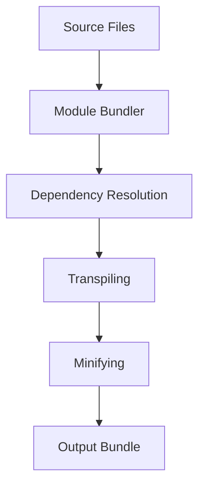

## 23.3 Module Bundlers: Webpack, Rollup, Parcel

In the modern web development landscape, module bundlers play a crucial role in managing dependencies and optimizing code for production. They allow developers to write modular code while ensuring that it runs efficiently in the browser. In this section, we will explore three popular module bundlers: Webpack, Rollup, and Parcel. We will compare their features, strengths, and weaknesses, and provide examples of configuration files and key plugins. By the end of this section, you will be equipped to choose the right tool for your project.

### Understanding Module Bundlers

Module bundlers are tools that take your JavaScript code and its dependencies and bundle them into a single file (or a few files) that can be served to the browser. This process involves:

- **Resolving Dependencies**: Identifying and including all the modules your application needs.
- **Transpiling Code**: Converting modern JavaScript (ES6+) into a version compatible with older browsers.
- **Minifying Code**: Reducing file size by removing whitespace and comments.
- **Code Splitting**: Breaking up code into smaller chunks that can be loaded on demand.

Let's dive into the specifics of Webpack, Rollup, and Parcel.

### Webpack

[Webpack](https://webpack.js.org/) is one of the most widely used module bundlers in the JavaScript ecosystem. It is known for its flexibility and extensive plugin system.

#### Key Features

- **Code Splitting**: Webpack allows you to split your code into smaller chunks that can be loaded on demand, improving load times.
- **Loaders**: These are transformations that are applied to the source code of a module. They allow you to preprocess files as you `require()` or "load" them.
- **Plugins**: Webpack has a rich plugin system that allows you to customize the build process.
- **Hot Module Replacement (HMR)**: This feature allows you to update modules in the browser without a full reload, improving development speed.

#### Configuration Example

Here is a basic Webpack configuration file:

```javascript
// webpack.config.js
const path = require('path');

module.exports = {
  entry: './src/index.js',
  output: {
    filename: 'bundle.js',
    path: path.resolve(__dirname, 'dist'),
  },
  module: {
    rules: [
      {
        test: /\.js$/,
        exclude: /node_modules/,
        use: {
          loader: 'babel-loader',
          options: {
            presets: ['@babel/preset-env'],
          },
        },
      },
    ],
  },
  plugins: [
    // Add plugins here
  ],
};
```

#### Strengths and Weaknesses

- **Strengths**:
  - Highly configurable and flexible.
  - Extensive ecosystem with many plugins and loaders.
  - Excellent for large, complex applications.

- **Weaknesses**:
  - Can be complex to configure for beginners.
  - Configuration files can become large and unwieldy.

#### Use Cases

Webpack is ideal for large, complex applications where you need fine-grained control over the build process. It is also well-suited for projects that require advanced features like code splitting and HMR.

### Rollup

[Rollup](https://rollupjs.org/guide/en/) is a module bundler designed with a focus on JavaScript libraries. It is known for its ability to produce smaller, more efficient bundles.

#### Key Features

- **Tree Shaking**: Rollup excels at eliminating dead code, resulting in smaller bundles.
- **ES Module Support**: Rollup was one of the first bundlers to fully support ES modules, which allows for more efficient bundling.
- **Plugins**: Rollup has a plugin system that allows you to extend its functionality.

#### Configuration Example

Here is a basic Rollup configuration file:

```javascript
// rollup.config.js
import babel from 'rollup-plugin-babel';

export default {
  input: 'src/index.js',
  output: {
    file: 'dist/bundle.js',
    format: 'cjs',
  },
  plugins: [
    babel({
      exclude: 'node_modules/**',
    }),
  ],
};
```

#### Strengths and Weaknesses

- **Strengths**:
  - Produces smaller bundles due to effective tree shaking.
  - Simpler configuration compared to Webpack.
  - Ideal for library development.

- **Weaknesses**:
  - Less suitable for complex applications with many dependencies.
  - Limited support for non-JS assets (e.g., CSS, images).

#### Use Cases

Rollup is best suited for library development where bundle size is a critical factor. It is also a good choice for projects that primarily use ES modules.

### Parcel

[Parcel](https://parceljs.org/) is a relatively new module bundler that aims to provide a zero-configuration experience. It is designed to be fast and easy to use.

#### Key Features

- **Zero Configuration**: Parcel works out of the box without the need for a configuration file.
- **Fast Bundling**: Parcel uses worker processes to enable multicore compilation, resulting in faster builds.
- **Built-in Support for Many Asset Types**: Parcel can handle JavaScript, CSS, HTML, images, and more without additional configuration.

#### Configuration Example

Parcel does not require a configuration file for basic use. However, you can customize its behavior with a `.parcelrc` file if needed.

#### Strengths and Weaknesses

- **Strengths**:
  - Extremely easy to set up and use.
  - Fast build times due to parallel processing.
  - Supports a wide range of asset types out of the box.

- **Weaknesses**:
  - Less control over the build process compared to Webpack.
  - Smaller ecosystem of plugins and integrations.

#### Use Cases

Parcel is ideal for small to medium-sized projects where ease of use and speed are more important than fine-grained control over the build process.

### Performance Optimizations and Advanced Features

Each of these bundlers offers performance optimizations and advanced features that can be leveraged to improve your build process.

#### Code Splitting

- **Webpack**: Offers multiple ways to split code, including dynamic imports and the `SplitChunksPlugin`.
- **Rollup**: Supports code splitting through dynamic imports, but is less flexible than Webpack.
- **Parcel**: Automatically splits code when using dynamic imports.

#### Tree Shaking

- **Webpack**: Supports tree shaking for ES modules, but requires careful configuration to avoid including unused code.
- **Rollup**: Excels at tree shaking, making it a great choice for library development.
- **Parcel**: Automatically performs tree shaking for ES modules.

#### Hot Module Replacement

- **Webpack**: Provides robust HMR support, making it ideal for development environments.
- **Rollup**: Limited HMR support, primarily through plugins.
- **Parcel**: Built-in HMR support with no configuration required.

### Choosing the Right Bundler

When choosing a module bundler, consider the following factors:

- **Project Complexity**: For large, complex applications, Webpack is often the best choice due to its flexibility and extensive ecosystem.
- **Bundle Size**: If minimizing bundle size is a priority, Rollup's tree shaking capabilities make it an excellent choice.
- **Ease of Use**: For small to medium-sized projects where ease of use is important, Parcel's zero-configuration approach is ideal.

### Try It Yourself

To get hands-on experience with these bundlers, try setting up a simple project with each one. Experiment with different configurations and features to see how they affect the build process.

- **Webpack**: Try adding a plugin or loader to see how it changes the build.
- **Rollup**: Experiment with different output formats (e.g., `cjs`, `esm`) to see how they affect the bundle.
- **Parcel**: Test how Parcel handles different asset types by adding CSS or images to your project.

### Visualizing the Bundling Process

To better understand how these bundlers work, let's visualize the bundling process using a flowchart.



**Figure 1**: The bundling process involves resolving dependencies, transpiling code, minifying, and producing an output bundle.

### Knowledge Check

Before we wrap up, let's reinforce what we've learned with a few questions.

1. What are the key differences between Webpack, Rollup, and Parcel?
2. How does code splitting improve performance?
3. Why is tree shaking important for bundle size?
4. What are some use cases for each bundler?

### Summary

In this section, we've explored the role of module bundlers in modern web development and compared three popular tools: Webpack, Rollup, and Parcel. Each bundler has its strengths and weaknesses, making them suitable for different types of projects. By understanding their features and use cases, you can choose the right tool for your needs.

Remember, this is just the beginning. As you progress, you'll build more complex and interactive web applications. Keep experimenting, stay curious, and enjoy the journey!

## Test Your Knowledge on JavaScript Module Bundlers



### What is the primary role of a module bundler in JavaScript development?

- [x] To manage dependencies and optimize code for production
- [ ] To write JavaScript code
- [ ] To design user interfaces
- [ ] To create databases

> **Explanation:** Module bundlers manage dependencies and optimize code for production by bundling it into a single file or a few files.

### Which module bundler is known for its zero-configuration approach?

- [ ] Webpack
- [ ] Rollup
- [x] Parcel
- [ ] Babel

> **Explanation:** Parcel is known for its zero-configuration approach, making it easy to use out of the box.

### What feature of Webpack allows updating modules in the browser without a full reload?

- [ ] Tree Shaking
- [x] Hot Module Replacement (HMR)
- [ ] Code Splitting
- [ ] Minification

> **Explanation:** Hot Module Replacement (HMR) in Webpack allows updating modules in the browser without a full reload.

### Which bundler is particularly well-suited for library development due to its tree shaking capabilities?

- [ ] Webpack
- [x] Rollup
- [ ] Parcel
- [ ] Gulp

> **Explanation:** Rollup is well-suited for library development because of its effective tree shaking capabilities.

### What is a common use case for Webpack?

- [x] Large, complex applications
- [ ] Small scripts
- [ ] Static HTML pages
- [ ] Database management

> **Explanation:** Webpack is ideal for large, complex applications where fine-grained control over the build process is needed.

### Which module bundler automatically performs tree shaking for ES modules?

- [ ] Webpack
- [ ] Rollup
- [x] Parcel
- [ ] Grunt

> **Explanation:** Parcel automatically performs tree shaking for ES modules, simplifying the optimization process.

### What is a key advantage of using Rollup for bundling?

- [ ] Extensive plugin ecosystem
- [x] Smaller bundle size due to effective tree shaking
- [ ] Zero configuration
- [ ] Fast build times

> **Explanation:** Rollup's effective tree shaking results in smaller bundle sizes, making it advantageous for library development.

### Which feature of Webpack allows for breaking up code into smaller chunks?

- [x] Code Splitting
- [ ] Tree Shaking
- [ ] Minification
- [ ] Transpiling

> **Explanation:** Code Splitting in Webpack allows for breaking up code into smaller chunks that can be loaded on demand.

### What is a disadvantage of using Parcel compared to Webpack?

- [ ] Requires complex configuration
- [x] Less control over the build process
- [ ] Slow build times
- [ ] Limited asset support

> **Explanation:** Parcel offers less control over the build process compared to Webpack, which can be a disadvantage for complex projects.

### True or False: Webpack is the best choice for all types of JavaScript projects.

- [ ] True
- [x] False

> **Explanation:** Webpack is not the best choice for all projects; the choice depends on project complexity, bundle size requirements, and ease of use.


